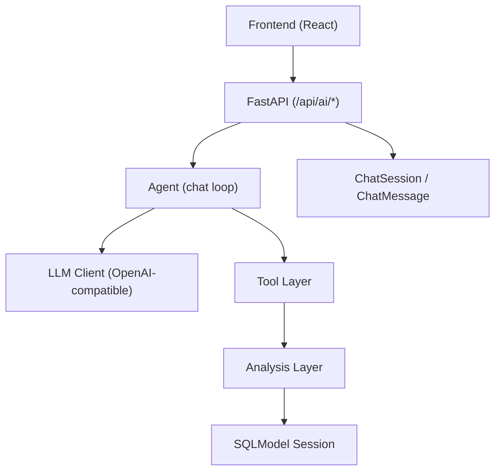
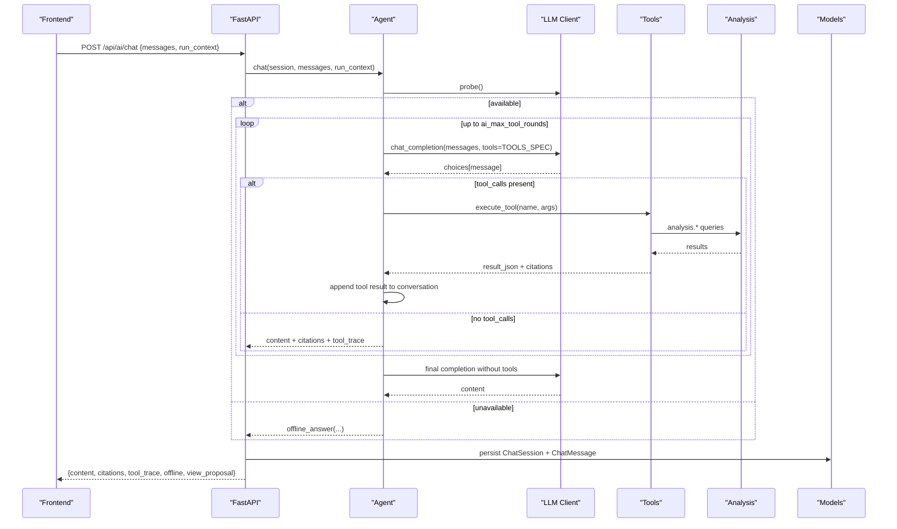
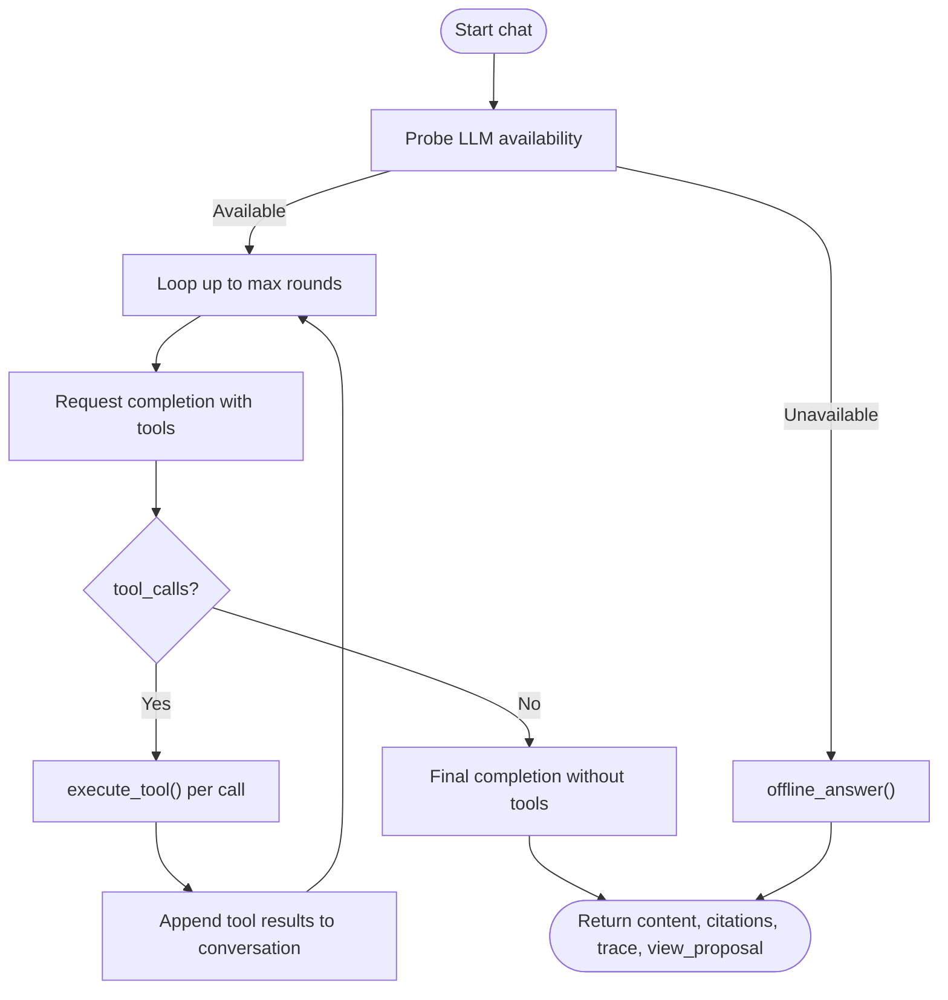
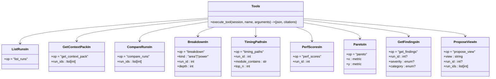
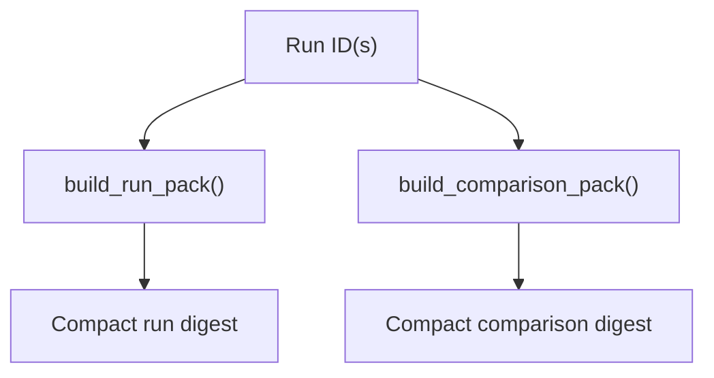
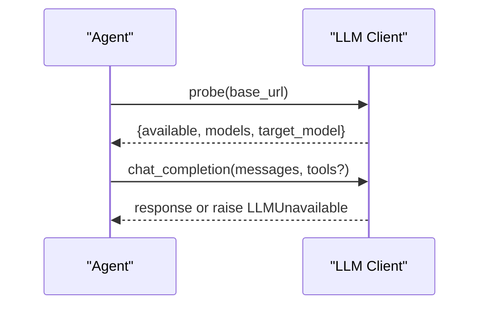
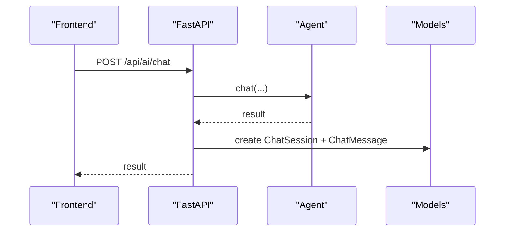
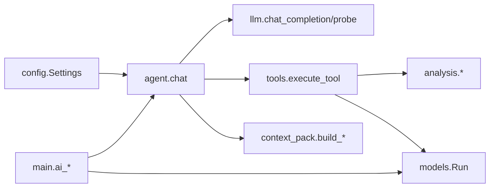

# AI Agent Integration

<cite>
**Referenced Files in This Document**
- [agent.py](file://backend/ppa/ai/agent.py)
- [tools.py](file://backend/ppa/ai/tools.py)
- [context_pack.py](file://backend/ppa/ai/context_pack.py)
- [llm.py](file://backend/ppa/ai/llm.py)
- [main.py](file://backend/ppa/main.py)
- [config.py](file://backend/ppa/config.py)
- [analysis.py](file://backend/ppa/analysis.py)
- [models.py](file://backend/ppa/models.py)
- [api.ts](file://frontend/src/api.ts)
- [types.ts](file://frontend/src/types.ts)
- [store.ts](file://frontend/src/store.ts)
</cite>

## Table of Contents
1. Introduction
2. Project Structure
3. Core Components
4. Architecture Overview
5. Detailed Component Analysis
6. Dependency Analysis
7. Performance Considerations
8. Troubleshooting Guide
9. Conclusion
10. Appendices

## Introduction
This document explains PPA-Profiler’s AI integration that enables natural language interaction with the analysis system using an OpenAI-compatible API. The agent orchestrates a tool-calling loop over typed, read-only analysis functions, builds compact context packs for efficient LLM reasoning, and persists conversation sessions for auditability. It supports local or on-prem models (e.g., Ollama, vLLM) and provides deterministic offline fallbacks when no model is reachable.

## Project Structure
The AI subsystem lives under backend/ppa/ai and integrates with:
- FastAPI endpoints in main.py exposing /api/ai/status and /api/ai/chat
- Configuration in config.py for endpoint URLs, model names, timeouts, and round limits
- Deterministic analysis layer in analysis.py used by tools and context packs
- Persistence models in models.py for chat sessions and messages
- Frontend API client in frontend/src/api.ts and types in frontend/src/types.ts

**Diagram sources**
- [main.py:167-194](file://backend/ppa/main.py#L167-L194)
- [agent.py:51-115](file://backend/ppa/ai/agent.py#L51-L115)
- [tools.py:171-264](file://backend/ppa/ai/tools.py#L171-L264)
- [analysis.py:46-200](file://backend/ppa/analysis.py#L46-L200)
- [models.py:192-207](file://backend/ppa/models.py#L192-L207)

**Section sources**
- [main.py:167-194](file://backend/ppa/main.py#L167-L194)
- [config.py:12-27](file://backend/ppa/config.py#L12-L27)

## Core Components
- Agent: Manages conversation state, enforces trust rules, runs the tool-calling loop, and falls back to deterministic offline answers.
- Tool Layer: Typed, Pydantic-validated functions that query the analysis layer and return clipped JSON results with citations.
- Context Packs: Compact, precomputed digests of run data and comparisons to reduce token usage and improve answer quality.
- LLM Client: Thin HTTP wrapper around OpenAI-compatible endpoints; probes availability and raises a clear exception on failure.
- API Endpoints: Expose status and chat, persisting session metadata and messages for traceability.

**Section sources**
- [agent.py:1-115](file://backend/ppa/ai/agent.py#L1-L115)
- [tools.py:1-163](file://backend/ppa/ai/tools.py#L1-L163)
- [context_pack.py:1-82](file://backend/ppa/ai/context_pack.py#L1-L82)
- [llm.py:1-60](file://backend/ppa/ai/llm.py#L1-L60)
- [main.py:167-194](file://backend/ppa/main.py#L167-L194)

## Architecture Overview
The AI agent follows a strict plan:
- Build a conversation including a system prompt and optional UI context.
- Call the LLM with a fixed tool schema; execute any requested tools deterministically.
- Accumulate citations and tool traces; propose UI navigation via view proposals.
- If the LLM is unavailable or errors occur, fall back to a deterministic offline analyst that uses context packs.

**Diagram sources**
- [main.py:167-194](file://backend/ppa/main.py#L167-L194)
- [agent.py:51-115](file://backend/ppa/ai/agent.py#L51-L115)
- [tools.py:171-264](file://backend/ppa/ai/tools.py#L171-L264)
- [llm.py:15-59](file://backend/ppa/ai/llm.py#L15-L59)
- [models.py:192-207](file://backend/ppa/models.py#L192-L207)

## Detailed Component Analysis

### Agent: Conversation Orchestration and Offline Fallback
- Builds a conversation with a system prompt and optional UI context.
- Enforces trust contract: numbers only from tool results; prefer refusal if data missing.
- Runs a bounded tool-calling loop; after exhaustion, forces a final answer.
- Captures view proposals to enable one-click UI navigation.
- Falls back to deterministic offline answers using context packs when the LLM is unreachable.

**Diagram sources**
- [agent.py:51-115](file://backend/ppa/ai/agent.py#L51-L115)
- [agent.py:120-231](file://backend/ppa/ai/agent.py#L120-L231)

**Section sources**
- [agent.py:1-115](file://backend/ppa/ai/agent.py#L1-L115)
- [agent.py:120-231](file://backend/ppa/ai/agent.py#L120-L231)

### Tool Layer: Typed, Read-Only Analysis Functions
- Declares input schemas with Pydantic for safety and validation.
- Provides tools for listing runs, retrieving context packs, comparing runs, area/power breakdowns, timing paths, performance scores, Pareto frontiers, findings, and UI navigation proposals.
- Clips large results to control payload size and attaches citations linking back to runs/sources.

**Diagram sources**
- [tools.py:17-89](file://backend/ppa/ai/tools.py#L17-L89)
- [tools.py:171-264](file://backend/ppa/ai/tools.py#L171-L264)

**Section sources**
- [tools.py:1-163](file://backend/ppa/ai/tools.py#L1-L163)
- [tools.py:171-264](file://backend/ppa/ai/tools.py#L171-L264)

### Context Packs: Compact, LLM-Friendly Digests
- build_run_pack aggregates figures of merit, domain summaries, top modules, worst timing paths, per-benchmark scores, and open findings for a single run.
- build_comparison_pack composes comparison data, key deltas, and top waterfalls across two runs.
- Ensures all arithmetic is performed in Python, never by the model.

**Diagram sources**
- [context_pack.py:11-82](file://backend/ppa/ai/context_pack.py#L11-L82)

**Section sources**
- [context_pack.py:1-82](file://backend/ppa/ai/context_pack.py#L1-L82)

### LLM Client: OpenAI-Compatible Wrapper
- chat_completion posts to /chat/completions with model, messages, temperature, and optional tools/tool_choice.
- probe checks /models to verify availability and target model presence.
- Raises a clear exception on connection or HTTP errors to trigger offline fallback.

**Diagram sources**
- [llm.py:15-59](file://backend/ppa/ai/llm.py#L15-L59)

**Section sources**
- [llm.py:1-60](file://backend/ppa/ai/llm.py#L1-L60)

### API Endpoints and Session Persistence
- GET /api/ai/status returns LLM probe results.
- POST /api/ai/chat accepts messages and optional run_context, calls the agent, and persists a lightweight session log including tool traces and citations.

**Diagram sources**
- [main.py:167-194](file://backend/ppa/main.py#L167-L194)
- [models.py:192-207](file://backend/ppa/models.py#L192-L207)

**Section sources**
- [main.py:167-194](file://backend/ppa/main.py#L167-L194)
- [models.py:192-207](file://backend/ppa/models.py#L192-L207)

### Frontend Integration
- api.ts exposes aiStatus and aiChat methods to interact with the backend.
- types.ts defines ChatResult including content, citations, tool_trace, offline flag, and view_proposal.
- store.ts provides aiContext() to pass current UI state (view, run IDs, compare IDs) into the assistant for grounded responses.

**Section sources**
- [api.ts:41-43](file://frontend/src/api.ts#L41-L43)
- [types.ts:125-131](file://frontend/src/types.ts#L125-L131)
- [store.ts:70-79](file://frontend/src/store.ts#L70-L79)

## Dependency Analysis
- Agent depends on llm, tools, and context_pack; it also reads settings for bounds and endpoints.
- Tools depend on analysis functions and models for citation mapping.
- Context packs depend on analysis to assemble digests.
- API endpoints depend on agent and models for persistence.

**Diagram sources**
- [config.py:12-27](file://backend/ppa/config.py#L12-L27)
- [agent.py:51-115](file://backend/ppa/ai/agent.py#L51-L115)
- [tools.py:171-264](file://backend/ppa/ai/tools.py#L171-L264)
- [context_pack.py:11-82](file://backend/ppa/ai/context_pack.py#L11-L82)
- [main.py:167-194](file://backend/ppa/main.py#L167-L194)

**Section sources**
- [config.py:12-27](file://backend/ppa/config.py#L12-L27)
- [agent.py:51-115](file://backend/ppa/ai/agent.py#L51-L115)
- [tools.py:171-264](file://backend/ppa/ai/tools.py#L171-L264)
- [context_pack.py:11-82](file://backend/ppa/ai/context_pack.py#L11-L82)
- [main.py:167-194](file://backend/ppa/main.py#L167-L194)

## Performance Considerations
- Temperature: Set low (e.g., 0.2) for deterministic outputs.
- Tool rounds: Bound by ai_max_tool_rounds to limit LLM calls and cost.
- Result clipping: Tools clip payloads to ~24KB to reduce token usage.
- Timeout: Configure ai_timeout_s to balance responsiveness and reliability.
- Caching: Consider caching frequent context packs at the application level if needed.
- Model selection: Use smaller models for quick drafts and larger models for complex comparisons.

[No sources needed since this section provides general guidance]

## Troubleshooting Guide
- LLM unavailable: The agent detects connectivity issues and switches to offline mode automatically. Check ai_base_url, ai_model, and network reachability.
- No runs ingested: Offline answers will instruct to ingest data first.
- Unknown tool: Tools return a structured error for unknown names; ensure correct tool invocation.
- Rate limiting: Adjust ai_timeout_s and consider retry/backoff at the client side if providers enforce quotas.
- Cost optimization: Reduce ai_max_tool_rounds, use smaller models, and rely on context packs to minimize tokens.

**Section sources**
- [agent.py:51-115](file://backend/ppa/ai/agent.py#L51-L115)
- [agent.py:120-231](file://backend/ppa/ai/agent.py#L120-L231)
- [tools.py:258-264](file://backend/ppa/ai/tools.py#L258-L264)
- [llm.py:15-59](file://backend/ppa/ai/llm.py#L15-L59)
- [config.py:17-22](file://backend/ppa/config.py#L17-L22)

## Conclusion
PPA-Profiler’s AI integration provides a robust, auditable, and resilient assistant for PPA analysis. By constraining the LLM to tool selection and delegating all computation to deterministic Python functions, it ensures trustworthy, verifiable answers. The system gracefully degrades to offline mode when models are unavailable and offers actionable UI navigation through view proposals.

[No sources needed since this section summarizes without analyzing specific files]

## Appendices

### Available Tools Summary
- list_runs: Lists ingested runs with headline metrics and open findings.
- get_context_pack: Retrieves a compact run or comparison digest.
- compare_runs: Deterministic comparison with config diffs, FOM deltas, and decompositions.
- breakdown: Hierarchical area or power breakdown by module.
- timing_paths: Worst timing paths with module and logic depth.
- perf_scores: Per-benchmark IPC and ratios with baseline deltas.
- pareto: Pareto frontier across runs for two chosen metrics.
- get_findings: Rule-engine findings filtered by severity/category/run.
- propose_view: Suggests UI navigation with run context.

**Section sources**
- [tools.py:17-163](file://backend/ppa/ai/tools.py#L17-L163)

### Configuration Options
- ai_base_url: OpenAI-compatible endpoint base URL (e.g., Ollama or vLLM).
- ai_model: Target model identifier.
- ai_api_key: Placeholder or provider-specific key.
- ai_timeout_s: Request timeout in seconds.
- ai_max_tool_rounds: Maximum number of tool-calling rounds per turn.

**Section sources**
- [config.py:17-22](file://backend/ppa/config.py#L17-L22)

### Prompt Engineering Techniques
- System prompt enforces strict rules: no invented numbers, cite sources, prefer refusal when data is missing, and always use tools before answering.
- Include UI context (current view, selected runs) to ground responses.
- Encourage concise, engineer-to-engineer style with short tables and concrete next steps.

**Section sources**
- [agent.py:22-48](file://backend/ppa/ai/agent.py#L22-L48)

### Custom Tool Development
- Define a new Pydantic input model describing parameters and constraints.
- Add a function branch in execute_tool that validates inputs, calls analysis functions, clips output, and attaches citations.
- Register the tool in TOOLS_SPEC with name, description, and parameter schema.

**Section sources**
- [tools.py:17-89](file://backend/ppa/ai/tools.py#L17-L89)
- [tools.py:171-264](file://backend/ppa/ai/tools.py#L171-L264)

### Offline Operation and Fallback Strategy
- When the LLM is unreachable, the agent uses offline_answer to provide deterministic insights from context packs and rule engine findings.
- Offline mode includes notes indicating the absence of a local model and suggests starting the local service.

**Section sources**
- [agent.py:120-231](file://backend/ppa/ai/agent.py#L120-L231)