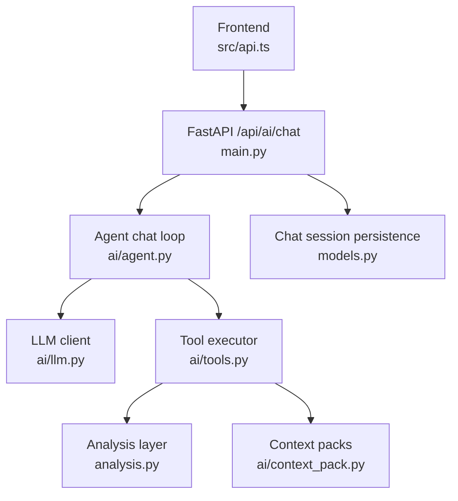
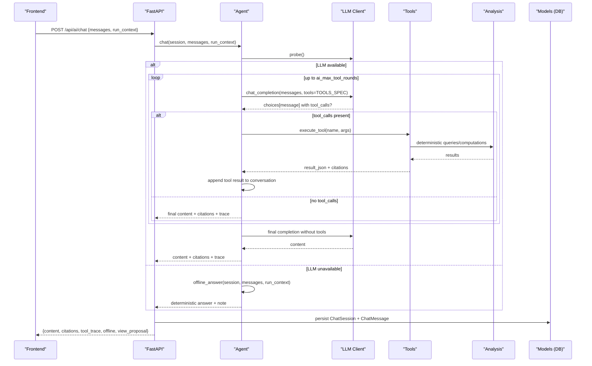
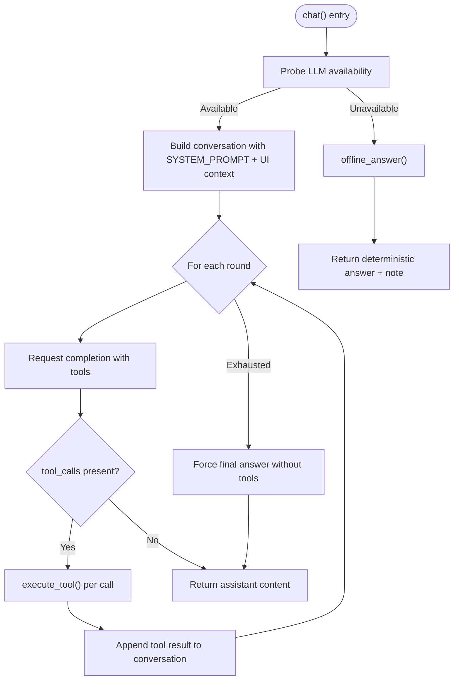
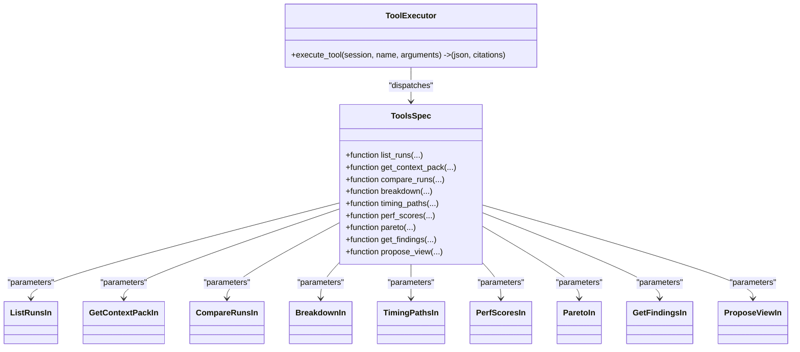
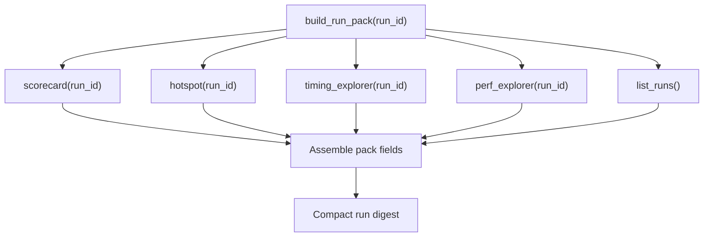
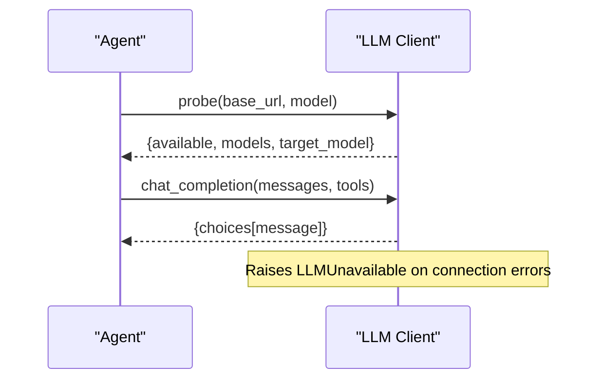
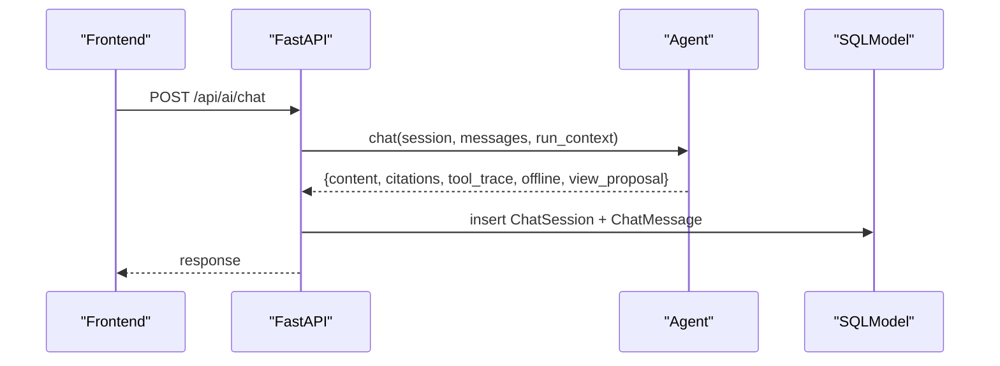
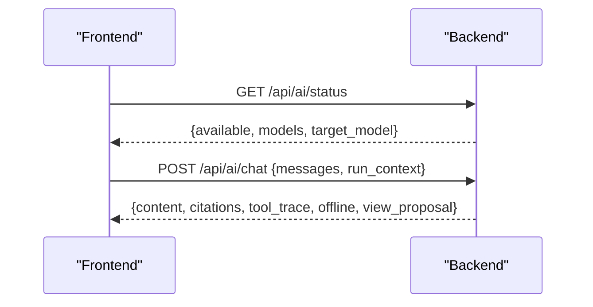
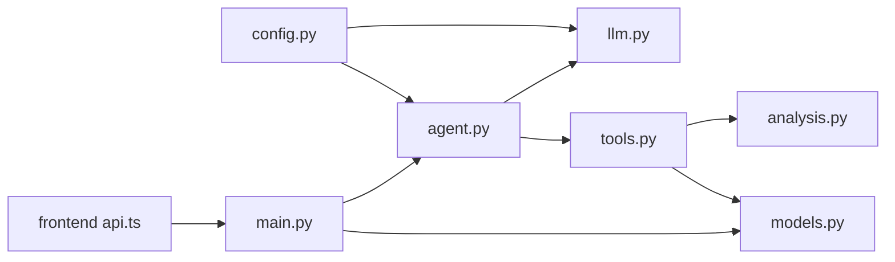

# Agent Architecture

<cite>
**Referenced Files in This Document**
- [agent.py](file://backend/ppa/ai/agent.py)
- [tools.py](file://backend/ppa/ai/tools.py)
- [context_pack.py](file://backend/ppa/ai/context_pack.py)
- [llm.py](file://backend/ppa/ai/llm.py)
- [config.py](file://backend/ppa/config.py)
- [analysis.py](file://backend/ppa/analysis.py)
- [main.py](file://backend/ppa/main.py)
- [models.py](file://backend/ppa/models.py)
- [api.ts](file://frontend/src/api.ts)
- [types.ts](file://frontend/src/types.ts)
</cite>

## Table of Contents
1. [Introduction](#introduction)
2. [Project Structure](#project-structure)
3. [Core Components](#core-components)
4. [Architecture Overview](#architecture-overview)
5. [Detailed Component Analysis](#detailed-component-analysis)
6. [Dependency Analysis](#dependency-analysis)
7. [Performance Considerations](#performance-considerations)
8. [Troubleshooting Guide](#troubleshooting-guide)
9. [Conclusion](#conclusion)

## Introduction
This document explains the AI agent architecture that powers intelligent analysis conversations for RISC-V processor power, performance, and area (PPA) analysis within PPA-Profiler. It focuses on:
- The tool-calling loop that lets the LLM select and execute deterministic analysis functions
- The trust contract that prevents hallucination by enforcing verifiable, data-backed answers
- The offline fallback system that provides useful responses without a local LLM
- The SYSTEM_PROMPT configuration that establishes domain expertise
- Conversation management and context maintenance across turns
- Examples of agent behavior patterns, error handling strategies, and integration with the broader PPA-Profiler system
- The balance between AI capabilities and reliability guarantees

## Project Structure
The AI subsystem is implemented as a thin orchestration layer over deterministic analysis tools and precomputed context packs. The FastAPI backend exposes endpoints that route user requests to the agent, which coordinates with an on-prem LLM client and the analysis layer.

**Diagram sources**
- [main.py:177-194](file://backend/ppa/main.py#L177-L194)
- [agent.py:51-115](file://backend/ppa/ai/agent.py#L51-L115)
- [llm.py:15-43](file://backend/ppa/ai/llm.py#L15-L43)
- [tools.py:171-264](file://backend/ppa/ai/tools.py#L171-L264)
- [context_pack.py:11-81](file://backend/ppa/ai/context_pack.py#L11-L81)
- [analysis.py:46-167](file://backend/ppa/analysis.py#L46-L167)
- [models.py:192-207](file://backend/ppa/models.py#L192-L207)

**Section sources**
- [main.py:177-194](file://backend/ppa/main.py#L177-L194)
- [agent.py:51-115](file://backend/ppa/ai/agent.py#L51-L115)
- [llm.py:15-43](file://backend/ppa/ai/llm.py#L15-L43)
- [tools.py:171-264](file://backend/ppa/ai/tools.py#L171-L264)
- [context_pack.py:11-81](file://backend/ppa/ai/context_pack.py#L11-L81)
- [analysis.py:46-167](file://backend/ppa/analysis.py#L46-L167)
- [models.py:192-207](file://backend/ppa/models.py#L192-L207)

## Core Components
- Agent: Orchestrates conversation rounds, enforces the trust contract, and manages tool calls and offline fallback.
- Tools: A typed, read-only interface to the analysis layer; all arithmetic and queries are executed in Python, never by the model.
- Context Packs: Compact, deterministic digests built from analysis results to keep prompts concise and factual.
- LLM Client: Thin OpenAI-compatible HTTP wrapper for on-prem models (e.g., Ollama), with availability probing and timeouts.
- Analysis Layer: Deterministic query and computation functions used by tools and context packs.
- Persistence: Lightweight chat sessions and messages stored for auditability and continuity.

Key responsibilities:
- Enforce that numbers come only from tool results or context packs
- Provide deterministic offline answers when the LLM is unavailable
- Maintain citations and tool traces for every response
- Offer UI navigation proposals based on tool outputs

**Section sources**
- [agent.py:1-48](file://backend/ppa/ai/agent.py#L1-L48)
- [tools.py:1-163](file://backend/ppa/ai/tools.py#L1-L163)
- [context_pack.py:1-81](file://backend/ppa/ai/context_pack.py#L1-L81)
- [llm.py:1-60](file://backend/ppa/ai/llm.py#L1-L60)
- [analysis.py:46-167](file://backend/ppa/analysis.py#L46-L167)
- [models.py:192-207](file://backend/ppa/models.py#L192-L207)

## Architecture Overview
The agent follows a strict tool-calling loop:
- Build a conversation with the SYSTEM_PROMPT and optional UI context
- Ask the LLM to respond using provided tools
- Execute selected tools deterministically via the tool executor
- Append tool results back into the conversation
- Repeat until the LLM returns text or rounds are exhausted
- Persist the exchange with citations and tool traces

**Diagram sources**
- [main.py:177-194](file://backend/ppa/main.py#L177-L194)
- [agent.py:51-115](file://backend/ppa/ai/agent.py#L51-L115)
- [llm.py:15-43](file://backend/ppa/ai/llm.py#L15-L43)
- [tools.py:171-264](file://backend/ppa/ai/tools.py#L171-L264)
- [analysis.py:46-167](file://backend/ppa/analysis.py#L46-L167)
- [models.py:192-207](file://backend/ppa/models.py#L192-L207)

## Detailed Component Analysis

### Agent: Tool-Calling Loop and Trust Contract
- SYSTEM_PROMPT defines domain expertise (RISC-V PPA analysis) and strict rules:
  - Never compute or invent numbers; copy digits exactly from tool results
  - If data is missing, state “I don’t have that data” and suggest where to find it
  - Always cite the run label for facts
  - Use tools before answering; propose UI navigation when appropriate
- Conversation management:
  - Prepends system message and optional UI context
  - Filters previous messages to maintain context while excluding prior offline responses
  - Enforces a maximum number of tool rounds to prevent loops
- Offline fallback:
  - Detects LLM unavailability early and switches to deterministic offline analyst
  - Provides structured answers for comparisons, findings, and run overviews
  - Emits a note explaining offline mode and how to enable full conversational analysis

**Diagram sources**
- [agent.py:51-115](file://backend/ppa/ai/agent.py#L51-L115)
- [agent.py:120-231](file://backend/ppa/ai/agent.py#L120-L231)

**Section sources**
- [agent.py:22-48](file://backend/ppa/ai/agent.py#L22-L48)
- [agent.py:51-115](file://backend/ppa/ai/agent.py#L51-L115)
- [agent.py:120-231](file://backend/ppa/ai/agent.py#L120-L231)

### Tools: Typed, Read-Only Interface to Deterministic Analysis
- Tools are Pydantic-validated function signatures describing allowed operations:
  - list_runs, get_context_pack, compare_runs, breakdown, timing_paths, perf_scores, pareto, get_findings, propose_view
- Execution path:
  - Validate arguments via Pydantic models
  - Delegate to analysis functions for deterministic queries and computations
  - Clip large JSON payloads to avoid overwhelming the LLM
  - Attach citations referencing runs and sources
- View proposals:
  - Tools can return a view_proposal dict to guide UI navigation

**Diagram sources**
- [tools.py:17-89](file://backend/ppa/ai/tools.py#L17-L89)
- [tools.py:91-163](file://backend/ppa/ai/tools.py#L91-L163)
- [tools.py:171-264](file://backend/ppa/ai/tools.py#L171-L264)

**Section sources**
- [tools.py:17-89](file://backend/ppa/ai/tools.py#L17-L89)
- [tools.py:91-163](file://backend/ppa/ai/tools.py#L91-L163)
- [tools.py:171-264](file://backend/ppa/ai/tools.py#L171-L264)

### Context Packs: Compact, Deterministic Digests
- build_run_pack aggregates scorecard, hotspots, timing paths, performance scores, and open findings into a compact structure
- build_comparison_pack composes comparison data with config diffs, FOM deltas, decompositions, and top waterfalls
- These packs ensure the LLM reads facts rather than generating SQL or performing arithmetic

**Diagram sources**
- [context_pack.py:11-53](file://backend/ppa/ai/context_pack.py#L11-L53)

**Section sources**
- [context_pack.py:11-53](file://backend/ppa/ai/context_pack.py#L11-L53)
- [context_pack.py:56-81](file://backend/ppa/ai/context_pack.py#L56-L81)

### LLM Client: On-Prem Integration and Availability Probing
- chat_completion sends non-streaming completions with optional tools and tool_choice
- probe checks endpoint reachability and lists available models, tolerating partial matches
- Errors raise LLMUnavailable to trigger offline fallback

**Diagram sources**
- [llm.py:15-43](file://backend/ppa/ai/llm.py#L15-L43)
- [llm.py:46-60](file://backend/ppa/ai/llm.py#L46-L60)

**Section sources**
- [llm.py:15-43](file://backend/ppa/ai/llm.py#L15-L43)
- [llm.py:46-60](file://backend/ppa/ai/llm.py#L46-L60)

### Backend API and Session Persistence
- /api/ai/chat accepts messages and optional run_context, delegates to agent.chat, and persists lightweight session logs
- ChatSession stores title and context; ChatMessage stores role, content, tool_trace, citations, and offline flag

**Diagram sources**
- [main.py:177-194](file://backend/ppa/main.py#L177-L194)
- [models.py:192-207](file://backend/ppa/models.py#L192-L207)

**Section sources**
- [main.py:177-194](file://backend/ppa/main.py#L177-L194)
- [models.py:192-207](file://backend/ppa/models.py#L192-L207)

### Frontend Integration
- Frontend calls /ai/status to check LLM availability and /ai/chat to send messages with optional run context
- ChatResult type includes content, citations, tool_trace, offline, and view_proposal for UI actions

**Diagram sources**
- [api.ts:40-43](file://frontend/src/api.ts#L40-L43)
- [types.ts:125-131](file://frontend/src/types.ts#L125-L131)

**Section sources**
- [api.ts:40-43](file://frontend/src/api.ts#L40-L43)
- [types.ts:125-131](file://frontend/src/types.ts#L125-L131)

## Dependency Analysis
- Agent depends on:
  - LLM client for model interactions
  - Tools for deterministic execution
  - Context packs for compact facts
  - Configuration for timeouts, model names, and max rounds
- Tools depend on:
  - Analysis layer for queries and computations
  - Models for database access
- Backend API depends on:
  - Agent for conversation orchestration
  - Models for persistence
- Frontend depends on:
  - API endpoints for status and chat
  - Types for response shapes

**Diagram sources**
- [config.py:12-30](file://backend/ppa/config.py#L12-L30)
- [agent.py:51-115](file://backend/ppa/ai/agent.py#L51-L115)
- [tools.py:171-264](file://backend/ppa/ai/tools.py#L171-L264)
- [analysis.py:46-167](file://backend/ppa/analysis.py#L46-L167)
- [main.py:177-194](file://backend/ppa/main.py#L177-L194)
- [api.ts:40-43](file://frontend/src/api.ts#L40-L43)

**Section sources**
- [config.py:12-30](file://backend/ppa/config.py#L12-L30)
- [agent.py:51-115](file://backend/ppa/ai/agent.py#L51-L115)
- [tools.py:171-264](file://backend/ppa/ai/tools.py#L171-L264)
- [analysis.py:46-167](file://backend/ppa/analysis.py#L46-L167)
- [main.py:177-194](file://backend/ppa/main.py#L177-L194)
- [api.ts:40-43](file://frontend/src/api.ts#L40-L43)

## Performance Considerations
- Tool output clipping reduces payload size to avoid exceeding token limits and improves responsiveness
- Context packs compress multiple analysis results into concise structures for faster LLM consumption
- Maximum tool rounds limit prevents excessive looping and ensures timely responses
- LLM timeout and availability probing reduce latency and gracefully fall back to offline mode
- Deterministic analysis functions minimize computational overhead and ensure reproducibility

[No sources needed since this section provides general guidance]

## Troubleshooting Guide
Common issues and strategies:
- LLM endpoint unreachable:
  - Check /api/ai/status for availability and model listing
  - Ensure base URL and model name match configured settings
  - Agent will automatically switch to offline_answer when LLM is unavailable
- No runs ingested:
  - Offline analyst reports “No runs ingested yet” and suggests ingestion steps
  - Verify ingestion status via /api/ingest-status
- Unknown tool invocation:
  - Tool executor returns an error JSON for unknown tool names
  - Validate tool parameters via Pydantic models to catch misconfiguration early
- Missing data:
  - Agent adheres to “I don’t have that data” policy and suggests relevant views or runs
  - Use propose_view to navigate users to the correct view for deeper inspection

**Section sources**
- [llm.py:46-60](file://backend/ppa/ai/llm.py#L46-L60)
- [agent.py:120-144](file://backend/ppa/ai/agent.py#L120-L144)
- [tools.py:258-264](file://backend/ppa/ai/tools.py#L258-L264)

## Conclusion
The PPA-Profiler AI agent balances powerful conversational capabilities with strong reliability guarantees:
- The tool-calling loop confines the LLM to selecting deterministic functions, ensuring verifiable outputs
- The trust contract enforces strict rules against fabrication and mandates citations
- The offline fallback provides immediate value even without a local LLM
- Context packs and analysis layers deliver precise, domain-specific insights for RISC-V PPA analysis
- Integration points with the frontend and backend enable seamless user experiences and auditability

This architecture supports iterative exploration, robust diagnostics, and actionable recommendations grounded in real data.

[No sources needed since this section summarizes without analyzing specific files]