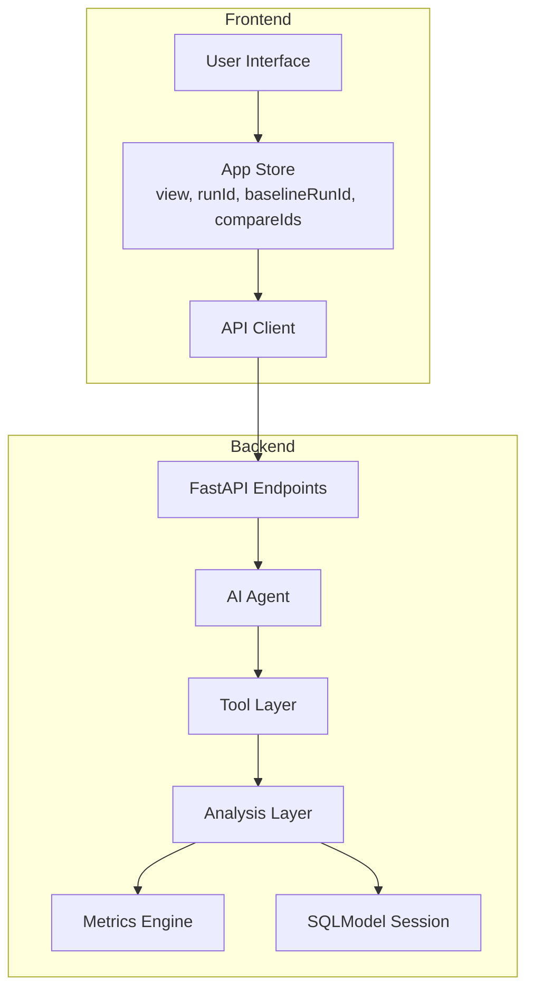
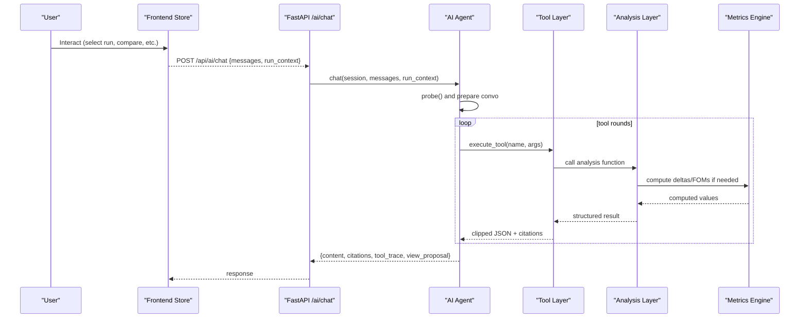
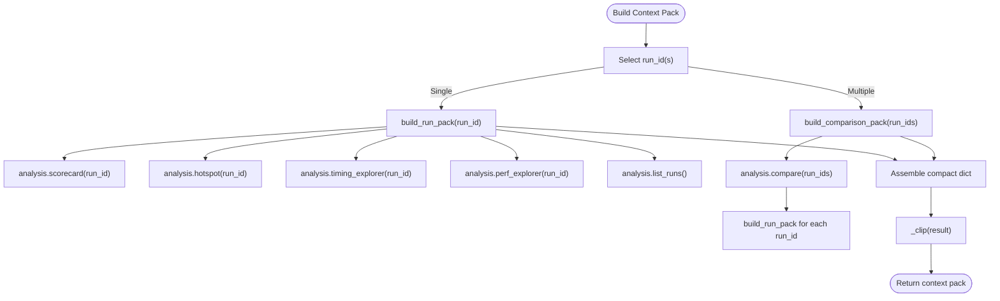
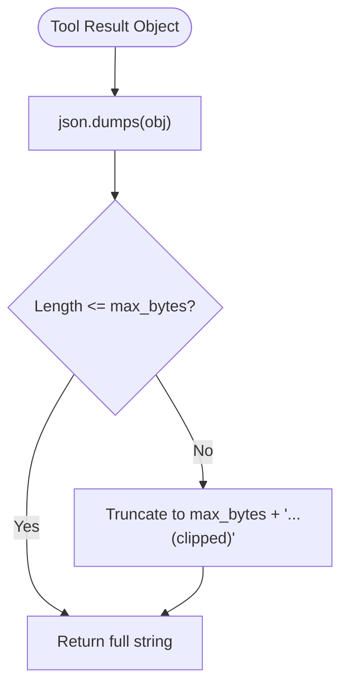
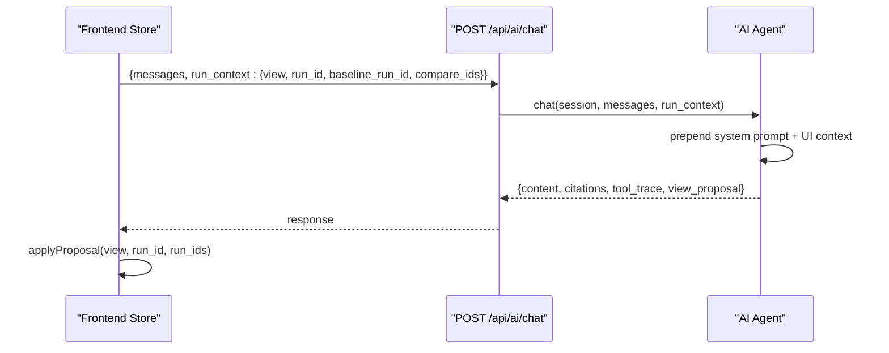
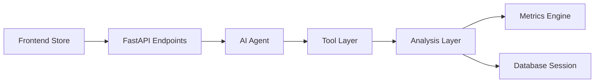

# Context Management

<cite>
**Referenced Files in This Document**
- [context_pack.py](file://backend/ppa/ai/context_pack.py)
- [agent.py](file://backend/ppa/ai/agent.py)
- [tools.py](file://backend/ppa/ai/tools.py)
- [llm.py](file://backend/ppa/ai/llm.py)
- [analysis.py](file://backend/ppa/analysis.py)
- [metrics.py](file://backend/ppa/metrics.py)
- [config.py](file://backend/ppa/config.py)
- [main.py](file://backend/ppa/main.py)
- [store.ts](file://frontend/src/store.ts)
- [api.ts](file://frontend/src/api.ts)
</cite>

## Table of Contents
1. Introduction
2. Project Structure
3. Core Components
4. Architecture Overview
5. Detailed Component Analysis
6. Dependency Analysis
7. Performance Considerations
8. Troubleshooting Guide
9. Conclusion
10. Appendices

## Introduction
This document explains how PPA-Profiler manages conversation context to maintain state across user interactions and provide the LLM with relevant, structured analysis data. It covers:
- How context packs are built from run metadata, metrics, and analysis results
- How context is filtered and optimized to fit token limits while preserving essential information
- The relationship between UI context (what the user is viewing) and AI context (what the assistant uses to answer)
- Examples of context pack structures, customization options, and performance considerations for large datasets
- Context versioning and compatibility considerations across PPA-Profiler versions

## Project Structure
The context management system spans backend modules that build deterministic, compact context packs and a frontend store that captures UI state and passes it into AI requests.

**Diagram sources**
- [store.ts:7-83](file://frontend/src/store.ts#L7-L83)
- [api.ts:23-43](file://frontend/src/api.ts#L23-L43)
- [main.py:167-194](file://backend/ppa/main.py#L167-L194)
- [agent.py:51-123](file://backend/ppa/ai/agent.py#L51-L123)
- [tools.py:171-264](file://backend/ppa/ai/tools.py#L171-L264)
- [analysis.py:46-439](file://backend/ppa/analysis.py#L46-L439)
- [metrics.py:90-187](file://backend/ppa/metrics.py#L90-L187)

**Section sources**
- [store.ts:7-83](file://frontend/src/store.ts#L7-L83)
- [api.ts:23-43](file://frontend/src/api.ts#L23-L43)
- [main.py:167-194](file://backend/ppa/main.py#L167-L194)

## Core Components
- Context Pack Builder: Assembles a compact, deterministic digest of one or two runs including FOMs, domain summaries, top modules, timing paths, per-benchmark scores, and open findings.
- Tool Layer: Exposes typed, read-only functions that return clipped JSON payloads with citations to ensure verifiability and token budget control.
- AI Agent: Orchestrates tool calls, maintains conversation history, injects UI context, and enforces a trust contract that numbers come only from tools.
- LLM Client: Thin HTTP wrapper around an OpenAI-compatible endpoint with model probing and fallback behavior.
- Frontend Store: Captures current view, selected run(s), baseline, and comparison tray; exposes aiContext() to pass into AI requests.

**Section sources**
- [context_pack.py:11-81](file://backend/ppa/ai/context_pack.py#L11-L81)
- [tools.py:17-163](file://backend/ppa/ai/tools.py#L17-L163)
- [agent.py:22-123](file://backend/ppa/ai/agent.py#L22-L123)
- [llm.py:15-67](file://backend/ppa/ai/llm.py#L15-L67)
- [store.ts:7-83](file://frontend/src/store.ts#L7-L83)

## Architecture Overview
The AI agent builds a conversation by prepending a system prompt and optional UI context, then iteratively calls tools to gather facts before answering. Context packs are the primary source of factual data.

**Diagram sources**
- [main.py:167-194](file://backend/ppa/main.py#L167-L194)
- [agent.py:51-123](file://backend/ppa/ai/agent.py#L51-L123)
- [tools.py:171-264](file://backend/ppa/ai/tools.py#L171-L264)
- [analysis.py:46-439](file://backend/ppa/analysis.py#L46-L439)
- [metrics.py:90-187](file://backend/ppa/metrics.py#L90-L187)

## Detailed Component Analysis

### Context Pack Building Process
- Single-run pack: Aggregates run metadata, figures of merit, deltas vs baseline, domain summaries, budgets, top modules by area/power/criticality, worst timing paths, per-benchmark IPC deltas, and top open findings.
- Comparison pack: Adds config diff, key FOM deltas, decomposition, and top area/power waterfalls, plus individual run packs for each compared run.

Key behaviors:
- Deterministic Python computation only; no SQL or arithmetic in prompts.
- Rounding and truncation applied to keep outputs compact.
- Citations attached per tool call to trace data provenance.

**Diagram sources**
- [context_pack.py:11-81](file://backend/ppa/ai/context_pack.py#L11-L81)
- [analysis.py:69-167](file://backend/ppa/analysis.py#L69-L167)
- [tools.py:166-195](file://backend/ppa/ai/tools.py#L166-L195)

**Section sources**
- [context_pack.py:11-81](file://backend/ppa/ai/context_pack.py#L11-L81)
- [analysis.py:69-167](file://backend/ppa/analysis.py#L69-L167)

### Filtering and Optimization to Fit Token Limits
- Tool outputs are serialized to JSON and clipped to a maximum byte size to prevent oversized payloads.
- Top-N limits are enforced in context packs (e.g., top modules, worst paths, findings).
- Only essential fields are included; derived metrics are rounded to reduce verbosity.
- Offline analyst mode also uses compact text responses when no local LLM is available.

**Diagram sources**
- [tools.py:166-168](file://backend/ppa/ai/tools.py#L166-L168)

**Section sources**
- [tools.py:166-195](file://backend/ppa/ai/tools.py#L166-L195)

### Relationship Between UI Context and AI Context
- UI context includes current view, selected run, baseline run, and comparison tray IDs.
- The frontend serializes this into aiContext() and sends it with every chat request.
- The backend injects UI context into the conversation so the assistant can infer which run or comparison the user is examining without restating details.
- The assistant may propose navigating to specific views via propose_view, which the UI can apply to update its state.

**Diagram sources**
- [store.ts:74-83](file://frontend/src/store.ts#L74-L83)
- [api.ts:42-43](file://frontend/src/api.ts#L42-L43)
- [main.py:172-194](file://backend/ppa/main.py#L172-L194)
- [agent.py:51-65](file://backend/ppa/ai/agent.py#L51-L65)

**Section sources**
- [store.ts:7-83](file://frontend/src/store.ts#L7-L83)
- [api.ts:42-43](file://frontend/src/api.ts#L42-L43)
- [main.py:172-194](file://backend/ppa/main.py#L172-L194)
- [agent.py:51-65](file://backend/ppa/ai/agent.py#L51-L65)

### Examples of Context Pack Structures
- Single-run context pack includes:
  - Run identity and configuration
  - Figures of merit and deltas vs baseline
  - Domain summaries (timing, area, power, performance)
  - Budgets and top open findings
  - Top modules by area/power/criticality
  - Worst timing paths
  - Per-benchmark IPC deltas
- Comparison context pack includes:
  - Config differences
  - Key FOM deltas (selected keys)
  - Decomposition (IPC vs frequency)
  - Top area/power waterfall contributions
  - Individual run packs for each compared run

These structures are produced deterministically by the analysis layer and clipped for transport.

**Section sources**
- [context_pack.py:11-81](file://backend/ppa/ai/context_pack.py#L11-L81)
- [tools.py:186-195](file://backend/ppa/ai/tools.py#L186-L195)

### Customization Options
- Tool parameters allow controlling depth and top-N counts for breakdowns and timing paths.
- Pareto queries let you choose x/y metrics to explore design space trade-offs.
- Findings can be filtered by severity and category.
- AI agent respects configured maximum tool rounds and timeouts.

**Section sources**
- [tools.py:37-89](file://backend/ppa/ai/tools.py#L37-L89)
- [config.py:17-22](file://backend/ppa/config.py#L17-L22)

### Performance Considerations for Large Datasets
- Use top-N limits in context packs and tools to avoid overwhelming payloads.
- Prefer focused tools (e.g., breakdown at a specific depth) rather than fetching entire hierarchies.
- Leverage pareto and comparisons to summarize multi-run insights efficiently.
- Monitor tool round limits and offline fallback behavior to keep responses responsive.

[No sources needed since this section provides general guidance]

### Context Versioning and Compatibility
- The application declares a version on the FastAPI app object.
- Context packs are built from stable analysis functions; changes to these functions should preserve backward compatibility for consumers relying on pack structure.
- Tool schemas are defined with Pydantic models, enabling strict validation and clear contracts for arguments.
- When evolving context pack fields, consider deprecating old fields gradually and documenting breaking changes.

**Section sources**
- [main.py:19-20](file://backend/ppa/main.py#L19-L20)
- [tools.py:17-89](file://backend/ppa/ai/tools.py#L17-L89)

## Dependency Analysis
The context system has clear layers:
- Frontend store defines UI context and exposes aiContext().
- Backend endpoints accept chat requests and persist sessions/messages.
- Agent orchestrates tool calls and composes final answers.
- Tools wrap analysis functions and enforce clipping and citations.
- Analysis reads metrics and computes derived values using the metrics engine.

**Diagram sources**
- [store.ts:7-83](file://frontend/src/store.ts#L7-L83)
- [main.py:167-194](file://backend/ppa/main.py#L167-L194)
- [agent.py:51-123](file://backend/ppa/ai/agent.py#L51-L123)
- [tools.py:171-264](file://backend/ppa/ai/tools.py#L171-L264)
- [analysis.py:46-439](file://backend/ppa/analysis.py#L46-L439)
- [metrics.py:90-187](file://backend/ppa/metrics.py#L90-L187)

**Section sources**
- [tools.py:171-264](file://backend/ppa/ai/tools.py#L171-L264)
- [analysis.py:46-439](file://backend/ppa/analysis.py#L46-L439)

## Performance Considerations
- Keep tool payloads small by using top-N and depth parameters.
- Avoid unnecessary tool calls; the agent loops up to a configured maximum number of rounds.
- Prefer comparison packs for multi-run insights instead of multiple single-run packs.
- Use offline analyst mode for quick, deterministic answers when the LLM is unavailable.

[No sources needed since this section provides general guidance]

## Troubleshooting Guide
- If the LLM is unreachable, the agent falls back to offline mode and returns deterministic answers based on context packs.
- Tool errors are captured and returned as JSON with error messages; check tool_trace for diagnostics.
- If context packs seem incomplete, verify that the run exists and that analysis functions return expected data.
- For UI navigation issues, inspect view_proposal in the response and ensure the frontend applies proposals correctly.

**Section sources**
- [agent.py:51-123](file://backend/ppa/ai/agent.py#L51-L123)
- [tools.py:171-264](file://backend/ppa/ai/tools.py#L171-L264)
- [main.py:167-194](file://backend/ppa/main.py#L167-L194)

## Conclusion
PPA-Profiler’s context management ensures that the LLM receives concise, deterministic, and citable analysis data aligned with the user’s current UI context. Context packs assemble essential metrics and findings, while tools and clipping keep payloads within token limits. The separation of concerns—frontend store, backend endpoints, agent, tools, analysis, and metrics—provides a robust foundation for scalable, versioned, and performant AI-assisted analysis.

[No sources needed since this section summarizes without analyzing specific files]

## Appendices

### Appendix A: Key Functions and Their Roles
- build_run_pack: Produces a compact single-run digest.
- build_comparison_pack: Produces a compact multi-run comparison digest.
- execute_tool: Validates inputs, calls analysis, clips output, and attaches citations.
- chat: Manages conversation, tool calls, and final answer generation.
- aiContext: Serializes UI state for AI consumption.

**Section sources**
- [context_pack.py:11-81](file://backend/ppa/ai/context_pack.py#L11-L81)
- [tools.py:171-264](file://backend/ppa/ai/tools.py#L171-L264)
- [agent.py:51-123](file://backend/ppa/ai/agent.py#L51-L123)
- [store.ts:74-83](file://frontend/src/store.ts#L74-L83)