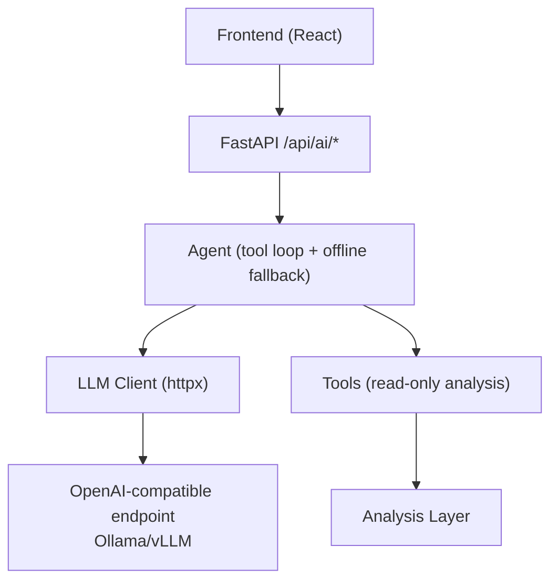
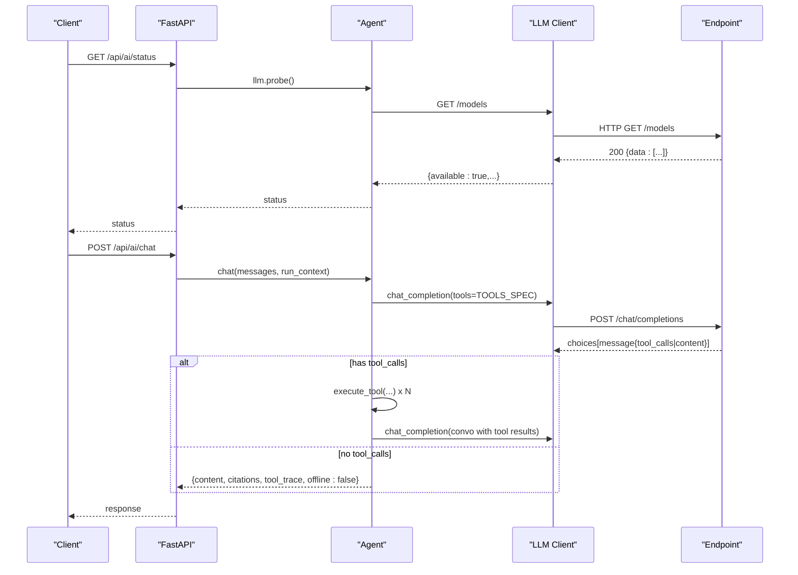
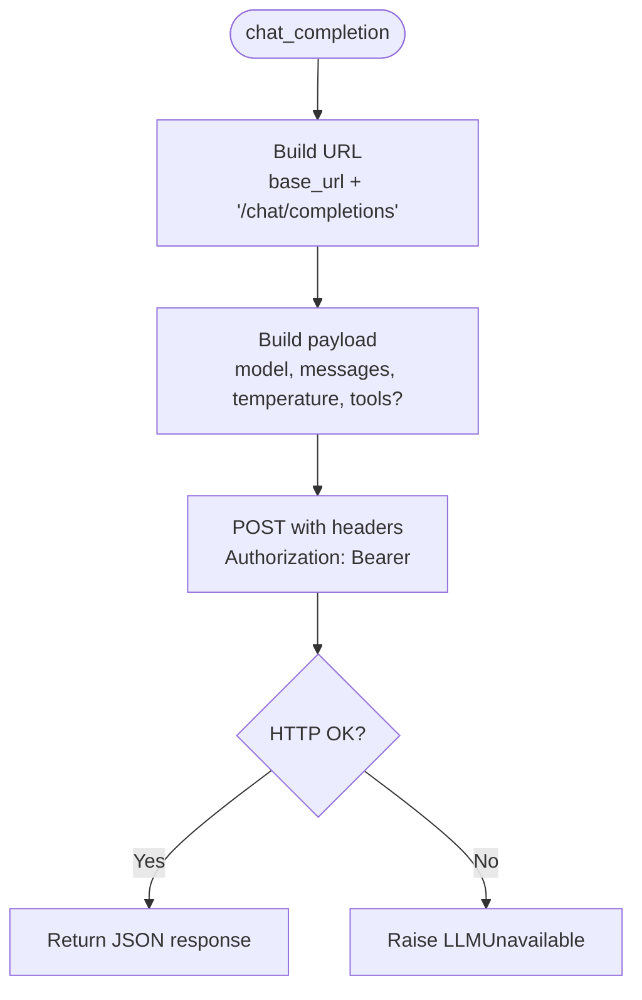
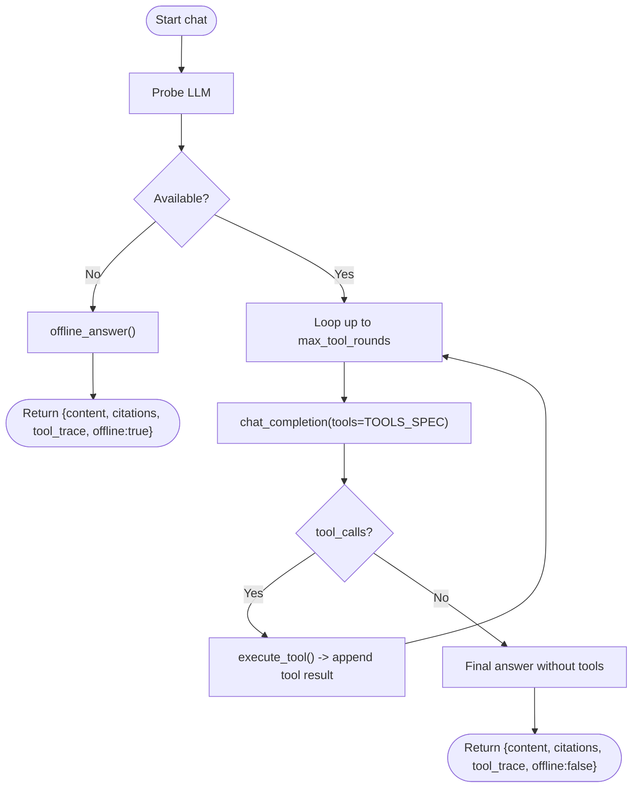
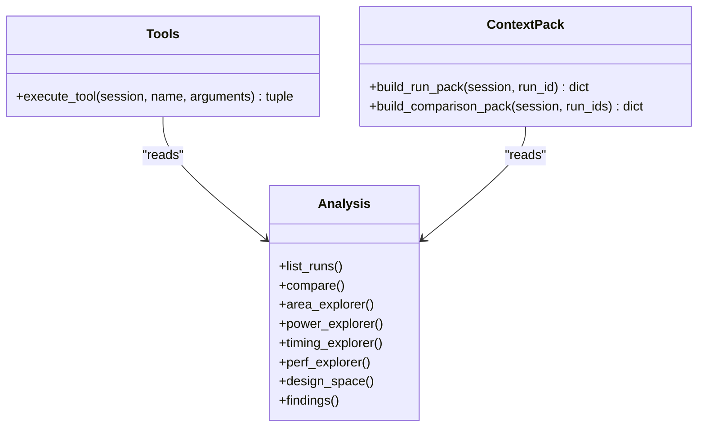
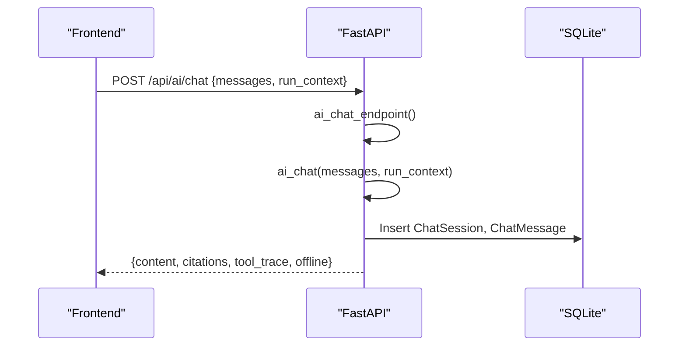
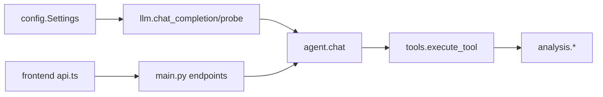

# LLM Integration

<cite>
**Referenced Files in This Document**
- [llm.py](file://backend/ppa/ai/llm.py)
- [agent.py](file://backend/ppa/ai/agent.py)
- [tools.py](file://backend/ppa/ai/tools.py)
- [context_pack.py](file://backend/ppa/ai/context_pack.py)
- [config.py](file://backend/ppa/config.py)
- [main.py](file://backend/ppa/main.py)
- [models.py](file://backend/ppa/models.py)
- [api.ts](file://frontend/src/api.ts)
</cite>

## Table of Contents
1. [Introduction](#introduction)
2. [Project Structure](#project-structure)
3. [Core Components](#core-components)
4. [Architecture Overview](#architecture-overview)
5. [Detailed Component Analysis](#detailed-component-analysis)
6. [Dependency Analysis](#dependency-analysis)
7. [Performance Considerations](#performance-considerations)
8. [Troubleshooting Guide](#troubleshooting-guide)
9. [Conclusion](#conclusion)
10. [Appendices](#appendices)

## Introduction
This document explains the LLM integration for OpenAI-compatible endpoints (e.g., Ollama, vLLM) used by the application’s AI assistant. It covers connection management, request/response handling, error recovery and offline mode, configuration options, rate limiting strategies, cost optimization techniques, probe-based availability detection, provider setup examples, troubleshooting, monitoring, and security considerations for API keys and network configuration.

## Project Structure
The LLM integration spans a small set of focused modules:
- A thin HTTP client to call OpenAI-compatible chat completions and model listing endpoints
- An agent that orchestrates tool-calling loops with deterministic fallbacks when the LLM is unavailable
- A typed tool layer that safely queries analysis data and returns structured results
- Configuration via environment variables with sensible defaults
- FastAPI endpoints exposing status and chat functionality
- Frontend helpers to call the AI endpoints

**Diagram sources**
- [main.py:167-194](file://backend/ppa/main.py#L167-L194)
- [agent.py:51-115](file://backend/ppa/ai/agent.py#L51-L115)
- [llm.py:15-59](file://backend/ppa/ai/llm.py#L15-L59)
- [tools.py:171-265](file://backend/ppa/ai/tools.py#L171-L265)

**Section sources**
- [main.py:167-194](file://backend/ppa/main.py#L167-L194)
- [config.py:12-30](file://backend/ppa/config.py#L12-L30)

## Core Components
- LLM client: Sends non-streaming chat completion requests to an OpenAI-compatible endpoint and probes model availability via a models listing endpoint. Raises a specific exception on connectivity or HTTP errors.
- Agent: Orchestrates conversation turns, invokes tools based on model responses, enforces a maximum number of tool rounds, and falls back to a deterministic offline analyst when the LLM is unreachable.
- Tools: Typed, read-only functions over the analysis layer that return clipped JSON payloads with citations for traceability.
- Configuration: Centralized settings loaded from environment variables prefixed with PPA_. Defaults target a local Ollama instance.
- API endpoints: Expose AI status and chat; persist lightweight session logs for auditability.

**Section sources**
- [llm.py:11-59](file://backend/ppa/ai/llm.py#L11-L59)
- [agent.py:22-115](file://backend/ppa/ai/agent.py#L22-L115)
- [tools.py:17-163](file://backend/ppa/ai/tools.py#L17-L163)
- [config.py:12-30](file://backend/ppa/config.py#L12-L30)
- [main.py:167-194](file://backend/ppa/main.py#L167-L194)

## Architecture Overview
The system uses a robust, layered design:
- The FastAPI app exposes /api/ai/status and /api/ai/chat.
- The agent performs a probe to detect LLM availability; if unavailable, it switches to offline mode.
- When available, the agent runs a bounded tool-calling loop using the LLM’s function-calling capability. Tool results are deterministic and cited.
- The LLM client abstracts HTTP calls and normalizes errors into a single exception type for consistent handling.

**Diagram sources**
- [main.py:167-194](file://backend/ppa/main.py#L167-L194)
- [agent.py:51-115](file://backend/ppa/ai/agent.py#L51-L115)
- [llm.py:15-59](file://backend/ppa/ai/llm.py#L15-L59)
- [tools.py:171-265](file://backend/ppa/ai/tools.py#L171-L265)

## Detailed Component Analysis

### LLM Client
- Purpose: Provide a minimal, reliable interface to OpenAI-compatible endpoints for chat completions and model discovery.
- Key behaviors:
  - Builds the URL by appending /chat/completions to the configured base URL.
  - Sends Authorization header with a bearer token derived from configuration.
  - Uses a configurable timeout for requests.
  - Normalizes connection and HTTP errors into a custom exception to simplify upstream handling.
  - Probes availability by fetching /models and checking whether the target model string matches any listed model (tolerant partial match).

**Diagram sources**
- [llm.py:15-43](file://backend/ppa/ai/llm.py#L15-L43)

**Section sources**
- [llm.py:11-59](file://backend/ppa/ai/llm.py#L11-L59)

### Agent and Offline Mode
- Purpose: Orchestrate multi-turn conversations with tool use and provide a deterministic offline fallback.
- Key behaviors:
  - Probes LLM availability at the start of each turn; if unavailable, immediately returns an offline answer.
  - Prepends a system prompt defining strict rules and domain knowledge.
  - Runs up to a configured maximum number of tool rounds; collects citations and traces.
  - If the model responds with tool calls, executes them deterministically and feeds results back until a final text answer is produced.
  - On any LLM unavailability during the loop, switches to offline mode.
  - Offline mode answers common question patterns using precomputed context packs and provides view proposals to navigate the UI.

**Diagram sources**
- [agent.py:51-115](file://backend/ppa/ai/agent.py#L51-L115)
- [agent.py:120-231](file://backend/ppa/ai/agent.py#L120-L231)

**Section sources**
- [agent.py:22-115](file://backend/ppa/ai/agent.py#L22-L115)
- [agent.py:120-231](file://backend/ppa/ai/agent.py#L120-L231)

### Tools and Context Packs
- Purpose: Provide a safe, typed, read-only interface to analysis data for the LLM to use.
- Key behaviors:
  - Each tool is validated with Pydantic schemas and returns clipped JSON to control payload size.
  - Citations are attached to every tool result, referencing the source run or dataset.
  - Context packs build compact, deterministic summaries of runs and comparisons, including figures of merit, top modules, timing paths, per-benchmark scores, and findings.

**Diagram sources**
- [tools.py:171-265](file://backend/ppa/ai/tools.py#L171-L265)
- [context_pack.py:11-82](file://backend/ppa/ai/context_pack.py#L11-L82)

**Section sources**
- [tools.py:17-163](file://backend/ppa/ai/tools.py#L17-L163)
- [tools.py:171-265](file://backend/ppa/ai/tools.py#L171-L265)
- [context_pack.py:11-82](file://backend/ppa/ai/context_pack.py#L11-L82)

### API Endpoints and Persistence
- Purpose: Expose AI capabilities and persist lightweight session logs for auditability.
- Key behaviors:
  - /api/ai/status returns probe results indicating availability and discovered models.
  - /api/ai/chat accepts user messages and optional run context, delegates to the agent, and persists session metadata and messages.
  - Responses include content, citations, tool_trace, and an offline flag.

**Diagram sources**
- [main.py:167-194](file://backend/ppa/main.py#L167-L194)
- [models.py:192-207](file://backend/ppa/models.py#L192-L207)

**Section sources**
- [main.py:167-194](file://backend/ppa/main.py#L167-L194)
- [models.py:192-207](file://backend/ppa/models.py#L192-L207)

## Dependency Analysis
- The agent depends on the LLM client for connectivity and on tools for deterministic data access.
- Tools depend on the analysis layer but never compute numbers themselves; they return structured, clipped JSON with citations.
- Configuration centralizes all LLM-related settings, enabling easy switching between providers.
- The frontend calls the AI endpoints through a simple helper module.

**Diagram sources**
- [config.py:12-30](file://backend/ppa/config.py#L12-L30)
- [llm.py:15-59](file://backend/ppa/ai/llm.py#L15-L59)
- [agent.py:51-115](file://backend/ppa/ai/agent.py#L51-L115)
- [tools.py:171-265](file://backend/ppa/ai/tools.py#L171-L265)
- [main.py:167-194](file://backend/ppa/main.py#L167-L194)
- [api.ts:40-43](file://frontend/src/api.ts#L40-L43)

**Section sources**
- [config.py:12-30](file://backend/ppa/config.py#L12-L30)
- [llm.py:15-59](file://backend/ppa/ai/llm.py#L15-L59)
- [agent.py:51-115](file://backend/ppa/ai/agent.py#L51-L115)
- [tools.py:171-265](file://backend/ppa/ai/tools.py#L171-L265)
- [main.py:167-194](file://backend/ppa/main.py#L167-L194)
- [api.ts:40-43](file://frontend/src/api.ts#L40-L43)

## Performance Considerations
- Timeouts: Requests use a configurable timeout to avoid hanging on slow or unresponsive endpoints. Tune this value based on your provider’s latency characteristics.
- Tool round limit: The agent caps the number of tool-calling rounds to prevent runaway loops and excessive costs. Adjust the maximum rounds to balance depth vs. cost.
- Payload clipping: Tool outputs are clipped to a fixed byte size to reduce token usage and keep responses manageable.
- Non-streaming responses: Current implementation uses non-streaming completions. For high-latency providers, consider streaming on the client side if you extend the client.
- Deterministic fallback: Offline mode avoids unnecessary LLM calls when the endpoint is down, saving time and cost.

[No sources needed since this section provides general guidance]

## Troubleshooting Guide
Common issues and resolutions:
- Endpoint unreachable:
  - Symptom: /api/ai/status reports not available; chat falls back to offline mode.
  - Check: Ensure the LLM service is running and reachable at the configured base URL. Verify firewall and proxy settings.
  - Action: Confirm the base URL and model name; adjust timeouts if necessary.
- Model mismatch:
  - Symptom: Probe indicates available but target model not found.
  - Check: The probe tolerates partial matches; ensure the configured model string appears in the endpoint’s model list.
  - Action: Update the model setting to match an available model.
- Authentication failures:
  - Symptom: HTTP errors returned by the endpoint.
  - Check: Verify the Authorization header is set correctly using the configured key. Some providers ignore the key (e.g., local Ollama), while others require a valid token.
  - Action: Set the correct API key or remove it if the provider does not require authentication.
- Long-running tool chains:
  - Symptom: Chat takes long or stops responding.
  - Check: Review tool_trace to see how many tool rounds were executed.
  - Action: Reduce the maximum tool rounds or refine prompts to minimize iterations.

**Section sources**
- [llm.py:15-59](file://backend/ppa/ai/llm.py#L15-L59)
- [agent.py:51-115](file://backend/ppa/ai/agent.py#L51-L115)
- [main.py:167-194](file://backend/ppa/main.py#L167-L194)

## Conclusion
The LLM integration provides a resilient, configurable bridge to OpenAI-compatible endpoints with strong safeguards: deterministic tool use, citation-backed answers, bounded tool loops, and a robust offline fallback. Configuration is centralized and environment-driven, making it straightforward to switch providers and tune performance and cost. Use the provided endpoints to monitor availability and integrate the assistant into your workflow.

[No sources needed since this section summarizes without analyzing specific files]

## Appendices

### Configuration Options
- Environment variables (prefix PPA_):
  - PPA_AI_BASE_URL: Base URL of the OpenAI-compatible endpoint (default points to a local Ollama instance).
  - PPA_AI_MODEL: Model identifier used for completions and matched against the endpoint’s model list.
  - PPA_AI_API_KEY: Bearer token sent in the Authorization header; some providers may ignore it.
  - PPA_AI_TIMEOUT_S: Request timeout in seconds.
  - PPA_AI_MAX_TOOL_ROUNDS: Maximum number of tool-calling rounds per chat turn.

Examples:
- Local Ollama:
  - PPA_AI_BASE_URL=http://localhost:11434/v1
  - PPA_AI_MODEL=qwen2.5:32b-instruct
  - PPA_AI_API_KEY=ollama (ignored by Ollama)
- Remote vLLM or other provider:
  - PPA_AI_BASE_URL=https://your-endpoint/v1
  - PPA_AI_MODEL=model-name
  - PPA_AI_API_KEY=your-token
  - PPA_AI_TIMEOUT_S=120
  - PPA_AI_MAX_TOOL_ROUNDS=6

**Section sources**
- [config.py:12-30](file://backend/ppa/config.py#L12-L30)
- [llm.py:15-59](file://backend/ppa/ai/llm.py#L15-L59)

### Rate Limiting Strategies
- Client-side throttling:
  - Increase PPA_AI_TIMEOUT_S to tolerate bursts.
  - Reduce PPA_AI_MAX_TOOL_ROUNDS to limit expensive iterations.
- Provider-side limits:
  - Respect provider quotas and implement exponential backoff at the application level if you extend the client.
- Observability:
  - Monitor /api/ai/status and chat responses’ tool_trace to infer load and adjust limits accordingly.

[No sources needed since this section provides general guidance]

### Cost Optimization Techniques
- Prefer smaller models for routine tasks; reserve larger models for complex reasoning.
- Keep tool payloads clipped and concise to reduce tokens.
- Minimize tool rounds by refining prompts and leveraging context packs.
- Cache repeated queries at the application layer if appropriate.
- Use offline mode when possible to avoid LLM costs entirely.

[No sources needed since this section provides general guidance]

### Monitoring API Usage
- Status endpoint:
  - GET /api/ai/status returns availability, discovered models, and target model.
- Chat persistence:
  - Each chat creates a session and records messages, tool traces, citations, and offline flags for auditing.
- Frontend integration:
  - The frontend calls /api/ai/status and /api/ai/chat via helper functions.

**Section sources**
- [main.py:167-194](file://backend/ppa/main.py#L167-L194)
- [models.py:192-207](file://backend/ppa/models.py#L192-L207)
- [api.ts:40-43](file://frontend/src/api.ts#L40-L43)

### Security Considerations
- API key management:
  - Store secrets in environment variables or a secure secret manager; do not hardcode keys.
  - Validate that only trusted services can access the backend.
- Network configuration:
  - Restrict inbound traffic to the backend to authorized networks.
  - Use TLS termination at the reverse proxy if exposing externally.
- Input validation:
  - Tool inputs are validated with Pydantic schemas to prevent injection and enforce bounds.
- Least privilege:
  - Tools are read-only and operate within defined scopes; avoid granting write access to sensitive resources.

[No sources needed since this section provides general guidance]