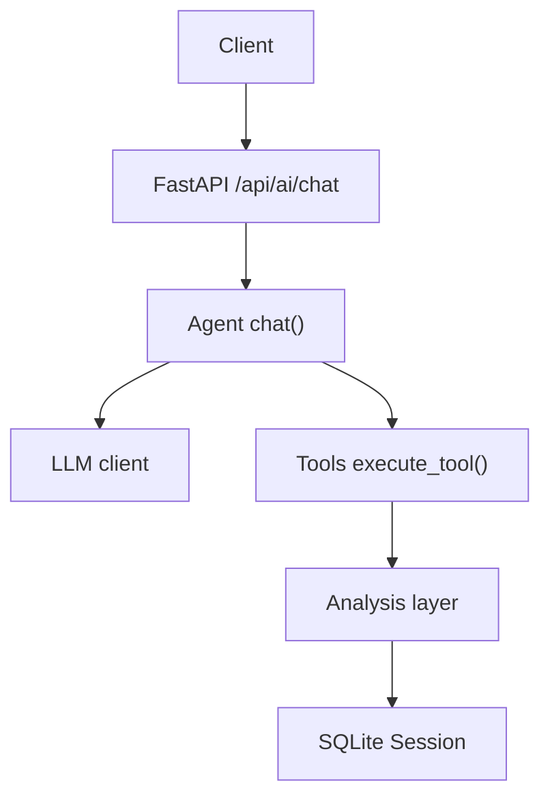
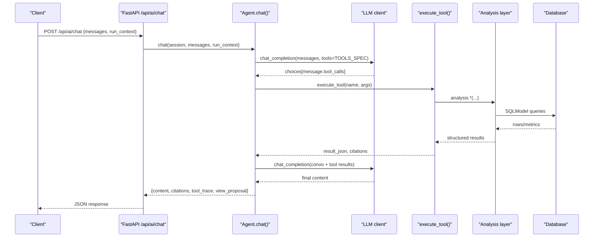
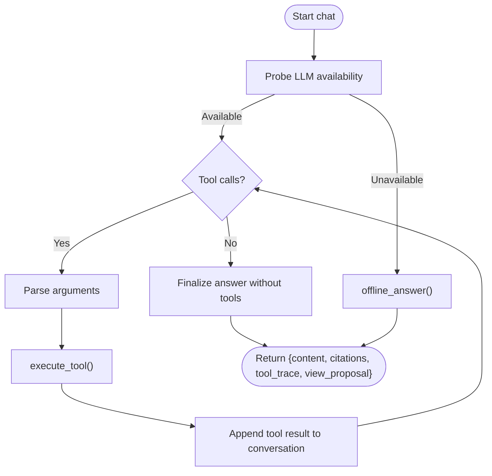
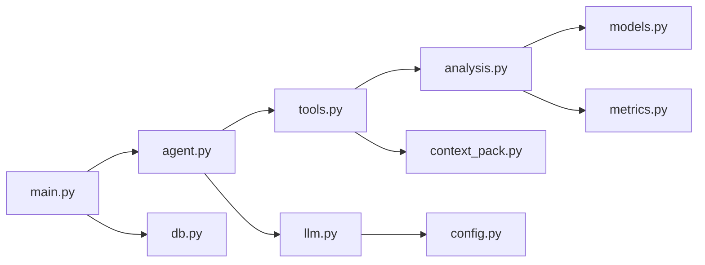

# Tool System

<cite>
**Referenced Files in This Document**
- [tools.py](file://backend/ppa/ai/tools.py)
- [agent.py](file://backend/ppa/ai/agent.py)
- [context_pack.py](file://backend/ppa/ai/context_pack.py)
- [analysis.py](file://backend/ppa/analysis.py)
- [llm.py](file://backend/ppa/ai/llm.py)
- [config.py](file://backend/ppa/config.py)
- [main.py](file://backend/ppa/main.py)
- [db.py](file://backend/ppa/db.py)
</cite>

## Table of Contents
1. [Introduction](#introduction)
2. [Project Structure](#project-structure)
3. [Core Components](#core-components)
4. [Architecture Overview](#architecture-overview)
5. [Detailed Component Analysis](#detailed-component-analysis)
6. [Dependency Analysis](#dependency-analysis)
7. [Performance Considerations](#performance-considerations)
8. [Troubleshooting Guide](#troubleshooting-guide)
9. [Conclusion](#conclusion)
10. [Appendices](#appendices)

## Introduction
This document explains the AI tool system that enables the agent to execute analysis functions programmatically. It covers:
- The tool specification format and how tools are discovered and registered
- Parameter validation using typed request models
- Result serialization and size control
- All available tools for database queries, analysis, and comparisons
- The agent’s tool-calling loop and offline fallback behavior
- How to create custom tools, handle errors, and optimize performance
- Security considerations for access control and input sanitization
- Guidance for extending the tool ecosystem

The system enforces a trust contract: the model selects tools but never computes; all computations are deterministic Python executed by the backend.

## Project Structure
The tool system is implemented in the backend under the PPA module with clear separation of concerns:
- Tools API and execution: tools.py
- Agent orchestration and tool loop: agent.py
- Precomputed context packs for LLM-friendly summaries: context_pack.py
- Deterministic analysis layer (queries and computations): analysis.py
- LLM client wrapper: llm.py
- Application settings: config.py
- FastAPI endpoints exposing the chat interface: main.py
- Database engine/session management: db.py

**Diagram sources**
- [main.py:167-194](file://backend/ppa/main.py#L167-L194)
- [agent.py:51-115](file://backend/ppa/ai/agent.py#L51-L115)
- [tools.py:171-264](file://backend/ppa/ai/tools.py#L171-L264)
- [analysis.py:46-439](file://backend/ppa/analysis.py#L46-L439)
- [db.py:13-50](file://backend/ppa/db.py#L13-L50)

**Section sources**
- [main.py:1-206](file://backend/ppa/main.py#L1-L206)
- [agent.py:1-231](file://backend/ppa/ai/agent.py#L1-L231)
- [tools.py:1-265](file://backend/ppa/ai/tools.py#L1-L265)
- [context_pack.py:1-82](file://backend/ppa/ai/context_pack.py#L1-L82)
- [analysis.py:1-439](file://backend/ppa/analysis.py#L1-L439)
- [llm.py:1-60](file://backend/ppa/ai/llm.py#L1-L60)
- [config.py:1-31](file://backend/ppa/config.py#L1-L31)
- [db.py:1-50](file://backend/ppa/db.py#L1-L50)

## Core Components
- Tool specification and registry: A list of function tool specs with names, descriptions, and JSON schemas derived from Pydantic models.
- Typed parameter validation: Each tool has an input model ensuring type safety and constraints before execution.
- Execution dispatcher: A single function routes tool calls to the appropriate analysis function and returns serialized results with citations.
- Context packs: Compact, deterministic summaries built from analysis functions for efficient LLM consumption.
- Agent loop: Orchestrates conversation rounds, parses tool calls from the LLM response, executes tools, and accumulates citations and traces.
- LLM integration: Thin HTTP client to an OpenAI-compatible endpoint with availability probing and timeout handling.

Key responsibilities:
- tools.py: Define TOOLS_SPEC, input models, and execute_tool().
- agent.py: Manage conversation state, call LLM, parse tool_calls, run execute_tool(), collect citations, and propose UI navigation.
- context_pack.py: Build run and comparison packs used by tools and offline answers.
- analysis.py: Provide deterministic data accessors and computations for area, power, timing, performance, design space, findings, etc.
- llm.py: Handle chat completion requests and model availability checks.
- config.py: Centralized configuration for DB path, AI endpoint, timeouts, and max tool rounds.
- main.py: Expose /api/ai/chat and persist chat sessions with tool traces and citations.
- db.py: Create SQLite engine with WAL and provide session context.

**Section sources**
- [tools.py:17-163](file://backend/ppa/ai/tools.py#L17-L163)
- [tools.py:166-264](file://backend/ppa/ai/tools.py#L166-L264)
- [agent.py:51-115](file://backend/ppa/ai/agent.py#L51-L115)
- [context_pack.py:11-82](file://backend/ppa/ai/context_pack.py#L11-L82)
- [analysis.py:46-439](file://backend/ppa/analysis.py#L46-L439)
- [llm.py:15-60](file://backend/ppa/ai/llm.py#L15-L60)
- [config.py:12-31](file://backend/ppa/config.py#L12-L31)
- [main.py:167-194](file://backend/ppa/main.py#L167-L194)
- [db.py:13-50](file://backend/ppa/db.py#L13-L50)

## Architecture Overview
The agent uses a tool-calling loop to ask the LLM to select tools based on user questions. The LLM responds with tool_calls containing function names and arguments. The agent validates arguments via Pydantic models, executes the corresponding analysis through tools.execute_tool(), and feeds results back into the conversation. Citations travel with each result to ensure verifiability. If the LLM is unavailable or times out, the agent falls back to a deterministic offline answer builder.

**Diagram sources**
- [main.py:167-194](file://backend/ppa/main.py#L167-L194)
- [agent.py:51-115](file://backend/ppa/ai/agent.py#L51-L115)
- [tools.py:171-264](file://backend/ppa/ai/tools.py#L171-L264)
- [analysis.py:46-439](file://backend/ppa/analysis.py#L46-L439)
- [db.py:13-50](file://backend/ppa/db.py#L13-L50)

## Detailed Component Analysis

### Tool Specification Format
- Tools are declared as a list of function tool specs with:
  - type: "function"
  - function.name: unique identifier
  - function.description: human-readable purpose
  - function.parameters: JSON schema generated from Pydantic models
- Input models define strict types and constraints (e.g., Literal enums, min/max lengths).
- The spec list is passed to the LLM so it can propose tool calls with validated parameters.

Examples of input models include:
- ListRunsIn
- GetContextPackIn
- CompareRunsIn
- BreakdownIn
- TimingPathsIn
- PerfScoresIn
- ParetoIn
- GetFindingsIn
- ProposeViewIn

**Section sources**
- [tools.py:17-163](file://backend/ppa/ai/tools.py#L17-L163)

### Parameter Validation
- Each tool parses arguments via its corresponding Pydantic model, enforcing:
  - Type correctness
  - Enum values
  - Length constraints
  - Field descriptions
- Invalid inputs raise validation errors before reaching analysis functions, preventing malformed queries.

**Section sources**
- [tools.py:186-256](file://backend/ppa/ai/tools.py#L186-L256)

### Result Serialization
- Results are serialized to JSON strings with a clipping mechanism to cap payload size for LLM consumption.
- Citations are attached per tool call, referencing run IDs and source labels for traceability.
- View proposals are embedded in specific tool responses to enable one-click UI navigation.

**Section sources**
- [tools.py:166-169](file://backend/ppa/ai/tools.py#L166-L169)
- [tools.py:171-264](file://backend/ppa/ai/tools.py#L171-L264)

### Available Tools
- list_runs: Lists ingested runs with headline figures of merit and open findings count.
- get_context_pack: Returns a compact digest for one run or a two-run comparison digest.
- compare_runs: Deterministic comparison including config diff, FOM deltas, IPC/frequency decomposition, and waterfalls.
- breakdown: Hierarchical area or power breakdown at a specified depth with shares and ratios.
- timing_paths: Worst setup timing paths filtered by module substring with top-N limit.
- perf_scores: Per-benchmark SPECint IPC and ratio with baseline deltas.
- pareto: Pareto frontier across runs for two chosen metrics.
- get_findings: Rule-engine findings with optional filters by severity and category.
- propose_view: Suggests navigating the UI to a specific view with run context.

Each tool maps to a deterministic analysis function and returns clipped JSON with citations.

**Section sources**
- [tools.py:91-163](file://backend/ppa/ai/tools.py#L91-L163)
- [tools.py:181-264](file://backend/ppa/ai/tools.py#L181-L264)
- [analysis.py:46-439](file://backend/ppa/analysis.py#L46-L439)

### Agent Tool-Calling Loop
- The agent builds a conversation with a system prompt enforcing strict rules (no guessing, cite sources, use tools first).
- It calls the LLM with TOOLS_SPEC; if tool_calls are present, it parses arguments, executes tools, appends results to the conversation, and repeats up to a configured maximum number of rounds.
- After exhausting rounds or when no tool calls are requested, it asks the LLM to finalize the answer using only tool results.
- Citations and tool traces are accumulated and returned to the client; view proposals are captured for UI actions.

**Diagram sources**
- [agent.py:51-115](file://backend/ppa/ai/agent.py#L51-L115)
- [agent.py:120-231](file://backend/ppa/ai/agent.py#L120-L231)

**Section sources**
- [agent.py:22-48](file://backend/ppa/ai/agent.py#L22-L48)
- [agent.py:51-115](file://backend/ppa/ai/agent.py#L51-L115)
- [agent.py:120-231](file://backend/ppa/ai/agent.py#L120-L231)

### Context Packs
- build_run_pack constructs a compact summary including figures of merit, domain summaries, budgets, top modules, worst timing paths, per-benchmark scores, and open findings.
- build_comparison_pack aggregates comparison data, key deltas, and top waterfall contributions for two runs.
- These packs are used by tools and offline answers to provide deterministic, LLM-friendly facts.

**Section sources**
- [context_pack.py:11-82](file://backend/ppa/ai/context_pack.py#L11-L82)

### LLM Integration
- chat_completion sends messages and optional tools to an OpenAI-compatible endpoint with authorization headers and timeouts.
- probe checks endpoint reachability and lists available models, tolerating partial matches for local setups like Ollama.
- Errors raise LLMUnavailable, triggering the agent’s offline fallback.

**Section sources**
- [llm.py:15-60](file://backend/ppa/ai/llm.py#L15-L60)

### Configuration
- Settings include DB path, sample directory, AI base URL, model name, API key placeholder, timeout, and max tool rounds.
- Environment variables prefixed with PPA_ override defaults.

**Section sources**
- [config.py:12-31](file://backend/ppa/config.py#L12-L31)

### Database Access
- Engine creation enables WAL mode and foreign keys for concurrency and integrity.
- Session context manager provides thread-safe sessions for analysis queries.

**Section sources**
- [db.py:13-50](file://backend/ppa/db.py#L13-L50)

## Dependency Analysis
The tool system exhibits clear layering and low coupling:
- agent.py depends on tools.py and llm.py; it orchestrates the loop and does not perform computations.
- tools.py depends on analysis.py and context_pack.py; it validates inputs and dispatches to deterministic functions.
- analysis.py depends on models and metrics; it performs queries and calculations.
- llm.py depends on config.py for endpoint and model settings.
- main.py exposes endpoints and persists chat sessions with tool traces and citations.

**Diagram sources**
- [agent.py:17-21](file://backend/ppa/ai/agent.py#L17-L21)
- [tools.py:12-14](file://backend/ppa/ai/tools.py#L12-L14)
- [analysis.py:6-13](file://backend/ppa/analysis.py#L6-L13)
- [llm.py:6-8](file://backend/ppa/ai/llm.py#L6-L8)
- [main.py:12-16](file://backend/ppa/main.py#L12-L16)

**Section sources**
- [agent.py:17-21](file://backend/ppa/ai/agent.py#L17-L21)
- [tools.py:12-14](file://backend/ppa/ai/tools.py#L12-L14)
- [analysis.py:6-13](file://backend/ppa/analysis.py#L6-L13)
- [llm.py:6-8](file://backend/ppa/ai/llm.py#L6-L8)
- [main.py:12-16](file://backend/ppa/main.py#L12-L16)

## Performance Considerations
- Clipping results: Results are truncated to a safe byte size to avoid overwhelming the LLM context window.
- Depth limits: Tools like breakdown and timing_paths enforce maximum depths and top-N limits to bound output size.
- Round limits: ai_max_tool_rounds caps the number of tool-calling iterations to prevent excessive latency.
- Query efficiency: Analysis functions filter and aggregate at appropriate granularity (e.g., level-2 modules) to reduce overhead.
- Offline fallback: When the LLM is unavailable, deterministic answers minimize latency while still providing useful insights.

Recommendations:
- Tune ai_max_tool_rounds and timeout based on deployment environment.
- Use context packs for large datasets to reduce payload sizes.
- Prefer filtering parameters (module_contains, severity, category) to narrow results.

[No sources needed since this section provides general guidance]

## Troubleshooting Guide
Common issues and resolutions:
- LLM unavailable: Ensure the endpoint is reachable and the model is pulled; the agent will fall back to offline answers.
- Unknown tool name: Verify the tool exists in TOOLS_SPEC; unknown names return an error response.
- Validation errors: Check input models for required fields and constraints; invalid arguments cause early failures.
- Empty results: Confirm runs exist and are ingested; some tools require valid run_ids.
- Large payloads: Adjust clipping thresholds or use more restrictive filters to reduce output size.

Operational tips:
- Use /api/ai/status to check LLM availability and listed models.
- Inspect tool_trace and citations in chat responses to diagnose tool usage and data sources.
- Validate run contexts passed to the chat endpoint to improve relevance of offline answers.

**Section sources**
- [llm.py:46-60](file://backend/ppa/ai/llm.py#L46-L60)
- [tools.py:264-265](file://backend/ppa/ai/tools.py#L264-L265)
- [agent.py:51-115](file://backend/ppa/ai/agent.py#L51-L115)
- [main.py:167-194](file://backend/ppa/main.py#L167-L194)

## Conclusion
The tool system provides a robust, secure, and extensible framework for programmatic analysis within the PPA-Profiler agent. By separating tool specification, validation, execution, and orchestration, it ensures deterministic outputs, verifiable citations, and resilient operation even without an active LLM. Extending the ecosystem involves adding new input models, tool specs, and analysis functions while adhering to the established patterns for validation, serialization, and citation tracking.

[No sources needed since this section summarizes without analyzing specific files]

## Appendices

### Creating Custom Tools
Steps to add a new tool:
1. Define a Pydantic input model with fields, types, and constraints.
2. Add a function tool spec entry to TOOLS_SPEC with name, description, and parameters schema.
3. Implement logic in execute_tool():
   - Parse arguments with the input model
   - Call the appropriate analysis function
   - Clip and serialize the result
   - Attach citations referencing run IDs and sources
4. Optionally embed a view_proposal to navigate the UI.

Best practices:
- Keep results small and focused; use depth and top-N limits.
- Always attach citations for traceability.
- Validate inputs strictly to prevent invalid queries.

**Section sources**
- [tools.py:17-163](file://backend/ppa/ai/tools.py#L17-L163)
- [tools.py:171-264](file://backend/ppa/ai/tools.py#L171-L264)

### Handling Tool Errors
- Unknown tool names return a JSON error message.
- Validation errors occur during argument parsing; ensure correct field names and types.
- LLM errors trigger offline fallback; log tool_trace for debugging.

Mitigations:
- Wrap tool execution in try/except where necessary to catch unexpected exceptions.
- Log tool names, arguments, and result sizes in tool_trace for diagnostics.

**Section sources**
- [tools.py:264-265](file://backend/ppa/ai/tools.py#L264-L265)
- [agent.py:84-104](file://backend/ppa/ai/agent.py#L84-L104)

### Optimizing Tool Performance
- Use context packs for large summaries to reduce payload sizes.
- Apply filters (module_contains, severity, category) to limit query scope.
- Cap top_n and depth parameters to control output volume.
- Configure ai_max_tool_rounds and timeouts appropriately for your environment.

[No sources needed since this section provides general guidance]

### Security Considerations
- Read-only tools: Tools expose read-only analysis functions; no write operations are performed via tools.
- Input sanitization: Pydantic models enforce strict types and constraints, preventing injection-like misuse.
- Access control: Currently, endpoints do not implement authentication; consider adding middleware to restrict access in production.
- Secrets management: AI API keys are loaded from settings; ensure environment variables are secured.

Recommendations:
- Add authentication and authorization layers to protect endpoints.
- Audit tool usage via persisted tool_trace and citations.
- Restrict allowed tools and parameters based on user roles.

**Section sources**
- [tools.py:171-264](file://backend/ppa/ai/tools.py#L171-L264)
- [main.py:167-194](file://backend/ppa/main.py#L167-L194)
- [config.py:17-22](file://backend/ppa/config.py#L17-L22)

### Extending the Tool Ecosystem
To add new analysis capabilities:
1. Implement a new analysis function in analysis.py that returns structured data.
2. Define a Pydantic input model for tool parameters.
3. Add a tool spec entry to TOOLS_SPEC.
4. Wire the tool in execute_tool() to call the analysis function and return clipped results with citations.
5. Update context packs if the new capability should be surfaced in summaries.
6. Test end-to-end via /api/ai/chat and verify tool_trace and citations.

Guidance:
- Follow existing naming conventions and structure.
- Keep outputs concise and bounded.
- Ensure deterministic behavior and accurate citations.

**Section sources**
- [analysis.py:46-439](file://backend/ppa/analysis.py#L46-L439)
- [tools.py:91-163](file://backend/ppa/ai/tools.py#L91-L163)
- [tools.py:171-264](file://backend/ppa/ai/tools.py#L171-L264)
- [context_pack.py:11-82](file://backend/ppa/ai/context_pack.py#L11-L82)