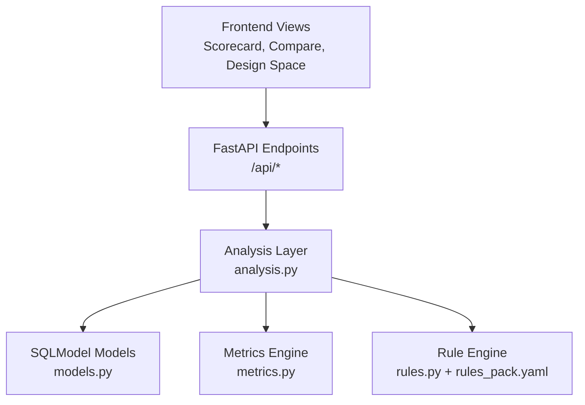
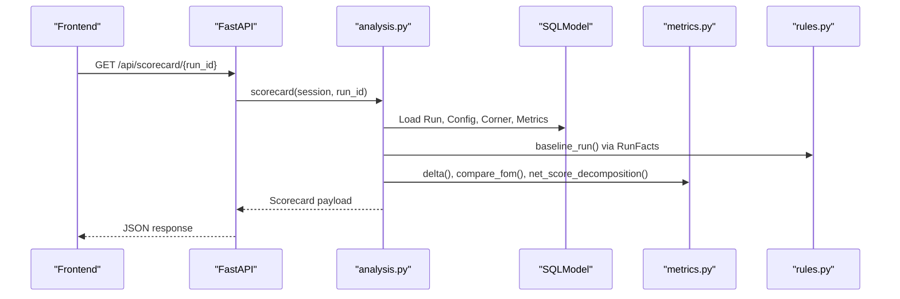
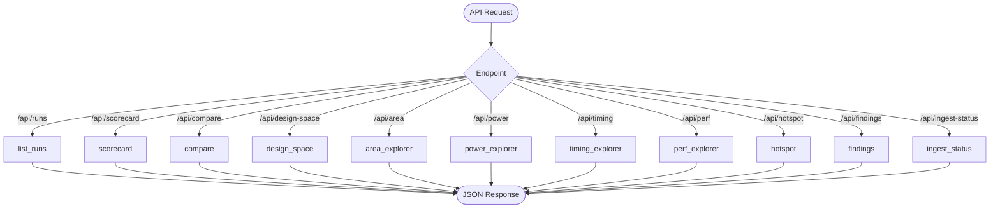
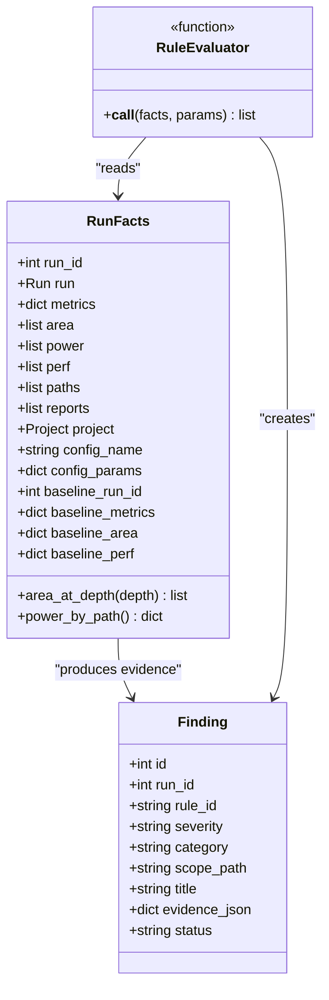
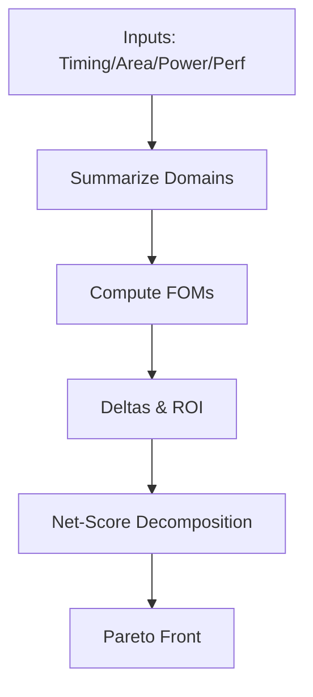
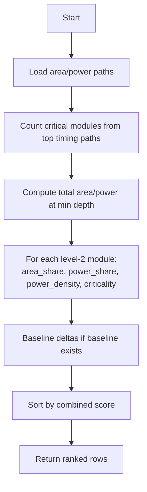
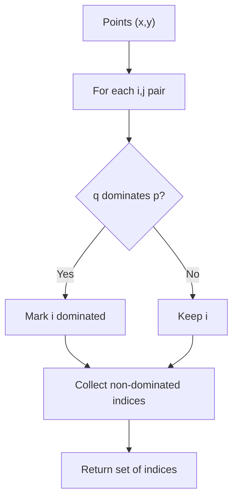
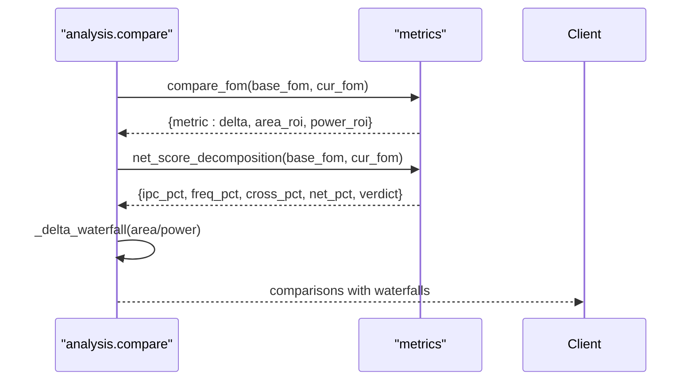
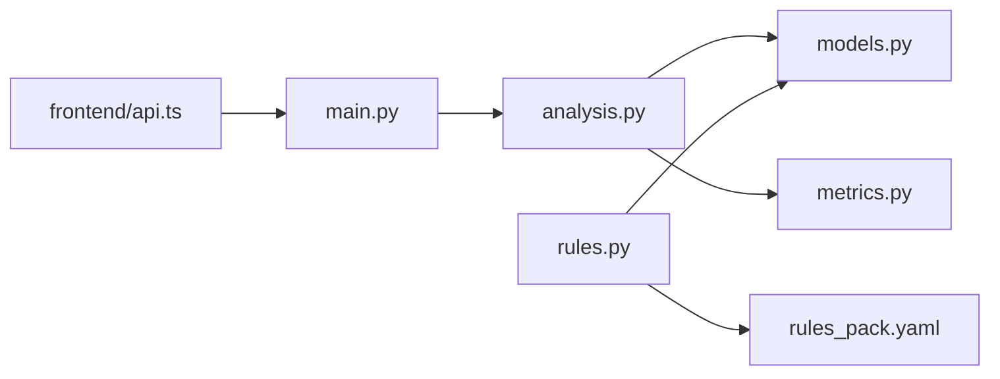

# Analysis Engine

<cite>
**Referenced Files in This Document**
- [analysis.py](file://backend/ppa/analysis.py)
- [rules.py](file://backend/ppa/rules.py)
- [metrics.py](file://backend/ppa/metrics.py)
- [models.py](file://backend/ppa/models.py)
- [main.py](file://backend/ppa/main.py)
- [config.py](file://backend/ppa/config.py)
- [rules_pack.yaml](file://backend/ppa/rules_pack.yaml)
- [Scorecard.tsx](file://frontend/src/views/Scorecard.tsx)
- [Compare.tsx](file://frontend/src/views/Compare.tsx)
- [api.ts](file://frontend/src/api.ts)
</cite>

## Table of Contents
1. [Introduction](#introduction)
2. [Project Structure](#project-structure)
3. [Core Components](#core-components)
4. [Architecture Overview](#architecture-overview)
5. [Detailed Component Analysis](#detailed-component-analysis)
6. [Dependency Analysis](#dependency-analysis)
7. [Performance Considerations](#performance-considerations)
8. [Troubleshooting Guide](#troubleshooting-guide)
9. [Conclusion](#conclusion)
10. [Appendices](#appendices)

## Introduction
This document explains PPA-Profiler’s analysis engine: the query layer that serves each frontend view, the rule-based diagnostic engine that detects issues across area, power, timing, and performance domains, and the metrics system that computes figures of merit, deltas, and Pareto fronts for design space exploration. It also covers hotspot analysis algorithms, baseline comparisons, performance considerations, and extensibility points for adding new capabilities.

## Project Structure
The backend exposes a FastAPI application with one endpoint per view (V1–V11). Each endpoint delegates to a dedicated function in the analysis layer. The analysis layer reads from SQLModel models and uses a pure-Python metrics module for all derived calculations. A YAML-driven rule pack defines thresholds and titles; evaluators in rules.py implement deterministic checks and produce findings.

**Diagram sources**
- [main.py:38-105](file://backend/ppa/main.py#L38-L105)
- [analysis.py:1-439](file://backend/ppa/analysis.py#L1-L439)
- [metrics.py:1-258](file://backend/ppa/metrics.py#L1-L258)
- [rules.py:1-361](file://backend/ppa/rules.py#L1-L361)
- [models.py:1-217](file://backend/ppa/models.py#L1-L217)

**Section sources**
- [main.py:1-206](file://backend/ppa/main.py#L1-L206)
- [analysis.py:1-439](file://backend/ppa/analysis.py#L1-L439)
- [metrics.py:1-258](file://backend/ppa/metrics.py#L1-L258)
- [rules.py:1-361](file://backend/ppa/rules.py#L1-L361)
- [models.py:1-217](file://backend/ppa/models.py#L1-L217)

## Core Components
- Query/analysis layer: One function per view (list_runs, scorecard, compare, design_space, area_explorer, power_explorer, timing_explorer, perf_explorer, hotspot, findings, ingest_status). These functions assemble data for frontend visualization and are the deterministic data source for AI tools.
- Rule-based diagnostic engine: Loads rules from YAML, evaluates them against precomputed facts per run, and persists findings with severity, category, scope, and evidence.
- Metrics engine: Computes domain summaries, figures of merit, deltas, ROI, net-score decomposition, and Pareto fronts. All arithmetic is centralized here.
- Data models: Typed tables for runs, configs, corners, metrics, area/power/perf rows, timing paths, baselines, findings, and annotations.

**Section sources**
- [analysis.py:16-439](file://backend/ppa/analysis.py#L16-L439)
- [rules.py:24-361](file://backend/ppa/rules.py#L24-L361)
- [metrics.py:13-258](file://backend/ppa/metrics.py#L13-L258)
- [models.py:17-217](file://backend/ppa/models.py#L17-L217)

## Architecture Overview
The API endpoints map directly to analysis functions. Each analysis function queries typed rows and metrics, optionally compares against a baseline, and returns structured payloads consumed by the frontend views.

**Diagram sources**
- [main.py:45-50](file://backend/ppa/main.py#L45-L50)
- [analysis.py:69-125](file://backend/ppa/analysis.py#L69-L125)
- [metrics.py:142-187](file://backend/ppa/metrics.py#L142-L187)
- [rules.py:34-72](file://backend/ppa/rules.py#L34-L72)

## Detailed Component Analysis

### Query Layer: View Functions
Each view has a dedicated function returning a normalized payload:
- list_runs: Lists runs with FOMs, timing summary, and open finding counts.
- scorecard: Aggregates FOMs, budgets, domain summaries, deltas vs baseline, and top findings.
- compare: Compares multiple runs, computing FOM deltas, config diffs, area/power waterfalls, and net-score decomposition.
- design_space: Collects points (x,y) and marks Pareto-optimal indices.
- area_explorer/power_explorer/timing_explorer/perf_explorer/hotspot: Provide hierarchical breakdowns, histograms, leaderboards, and multi-metric rankings.
- findings: Filters and sorts findings by severity/category/status.
- ingest_status: Reports raw report parsing status.

**Diagram sources**
- [main.py:38-105](file://backend/ppa/main.py#L38-L105)
- [analysis.py:46-439](file://backend/ppa/analysis.py#L46-L439)

**Section sources**
- [analysis.py:46-439](file://backend/ppa/analysis.py#L46-L439)
- [main.py:38-105](file://backend/ppa/main.py#L38-L105)

### Rule-Based Diagnostic Engine
- Rules are defined in YAML with id, category, severity, title template, and params.
- Evaluators read from RunFacts (precomputed per run): metrics, area/power/perf rows, timing paths, reports, project, config, and baseline context.
- Evaluator outputs are tuples of (severity_override, scope, evidence), which are rendered into Finding records with category and evidence JSON.
- run_rule_engine clears old findings for affected runs, re-evaluates all rules, and persists new findings.

**Diagram sources**
- [rules.py:24-79](file://backend/ppa/rules.py#L24-L79)
- [rules.py:84-310](file://backend/ppa/rules.py#L84-L310)
- [models.py:168-180](file://backend/ppa/models.py#L168-L180)

**Section sources**
- [rules.py:19-361](file://backend/ppa/rules.py#L19-L361)
- [rules_pack.yaml:1-119](file://backend/ppa/rules_pack.yaml#L1-L119)
- [models.py:168-180](file://backend/ppa/models.py#L168-L180)

### Metrics Calculation System
- Domain summaries: AreaSummary, PowerSummary, TimingSummary, PerfSummary provide computed properties (e.g., fmax_mhz, leakage_share, geomean_ratio_1ghz).
- Figures of merit: Combine timing-derived or fixed frequency with performance to compute specint_score, efficiencies, energy metrics (EPI, EDP, ED2P).
- Comparison utilities: delta, roi, compare_fom, net_score_decomposition enable baseline comparisons and attribution of score changes to IPC vs frequency.
- Pareto front: Identifies non-dominated points for design space exploration with configurable objective directions.

**Diagram sources**
- [metrics.py:13-137](file://backend/ppa/metrics.py#L13-L137)
- [metrics.py:142-187](file://backend/ppa/metrics.py#L142-L187)
- [metrics.py:239-258](file://backend/ppa/metrics.py#L239-L258)

**Section sources**
- [metrics.py:13-258](file://backend/ppa/metrics.py#L13-L258)

### Hotspot Analysis Algorithm
Hotspot ranks modules by combining area share, power share, and criticality (from timing path density). It also computes deltas vs baseline when available.

**Diagram sources**
- [analysis.py:361-398](file://backend/ppa/analysis.py#L361-L398)

**Section sources**
- [analysis.py:361-398](file://backend/ppa/analysis.py#L361-L398)

### Pareto Front Identification
The Pareto algorithm identifies non-dominated points given objective directions (minimize x, maximize y by default). Used by design_space to mark optimal trade-offs.

**Diagram sources**
- [metrics.py:239-258](file://backend/ppa/metrics.py#L239-L258)

**Section sources**
- [metrics.py:239-258](file://backend/ppa/metrics.py#L239-L258)

### Delta Calculations and Baseline Comparisons
- Per-FOM deltas include absolute and percentage differences.
- ROI measures score gain per cost gain (area or power).
- Net-score decomposition attributes score change to IPC and frequency components plus cross term.
- Waterfalls show module-level deltas for area and power between baseline and current runs.

**Diagram sources**
- [analysis.py:139-199](file://backend/ppa/analysis.py#L139-L199)
- [metrics.py:142-187](file://backend/ppa/metrics.py#L142-L187)

**Section sources**
- [analysis.py:139-199](file://backend/ppa/analysis.py#L139-L199)
- [metrics.py:142-187](file://backend/ppa/metrics.py#L142-L187)

### Examples of Rule Definitions and Custom Rules
- Rule definitions live in rules_pack.yaml with id, category, severity, title template, and params.
- To add a new rule:
  - Add an entry in rules_pack.yaml.
  - Implement a matching evaluator in rules.py and register it in EVALUATORS.
  - The evaluator reads from RunFacts and returns hits with severity override, scope, and evidence.

Examples present in the repository include timing (WNS negative, NVE high, module dominance, deep logic), area (budget exceed, sequential ratio, growth), power (leakage share, clock share, gating efficiency, density, budget), performance (bench regressions, isolated outlier), cross-domain (net score down, ROI low), and data quality (missing reports, parse warnings).

**Section sources**
- [rules_pack.yaml:1-119](file://backend/ppa/rules_pack.yaml#L1-L119)
- [rules.py:290-310](file://backend/ppa/rules.py#L290-L310)

### Finding Classification by Severity and Category
- Severity levels: critical, high, medium, low, info.
- Categories: timing, area, power, performance, cross_domain, data_quality.
- Findings can be filtered by run_id, severity, category, and status. Sorting prioritizes severity then category.

**Section sources**
- [models.py:168-180](file://backend/ppa/models.py#L168-L180)
- [analysis.py:403-423](file://backend/ppa/analysis.py#L403-L423)

### Frontend Integration
- Frontend views call backend APIs using typed helpers and render KPIs, deltas, charts, and tables.
- Scorecard displays FOMs, budgets, domain summaries, and top findings.
- Compare shows deltas, ROI, net-score decomposition, and waterfalls.

**Section sources**
- [Scorecard.tsx:1-124](file://frontend/src/views/Scorecard.tsx#L1-L124)
- [Compare.tsx:1-148](file://frontend/src/views/Compare.tsx#L1-L148)
- [api.ts:1-49](file://frontend/src/api.ts#L1-L49)

## Dependency Analysis
- main.py mounts FastAPI endpoints that delegate to analysis.py functions.
- analysis.py depends on models.py for typed data access and metrics.py for computations.
- rules.py depends on models.py and loads rules_pack.yaml; it produces findings persisted via models.
- Frontend api.ts calls backend endpoints and consumes typed responses.

**Diagram sources**
- [main.py:12-17](file://backend/ppa/main.py#L12-L17)
- [analysis.py:8-13](file://backend/ppa/analysis.py#L8-L13)
- [rules.py:11-16](file://backend/ppa/rules.py#L11-L16)
- [api.ts:23-48](file://frontend/src/api.ts#L23-L48)

**Section sources**
- [main.py:12-17](file://backend/ppa/main.py#L12-L17)
- [analysis.py:8-13](file://backend/ppa/analysis.py#L8-L13)
- [rules.py:11-16](file://backend/ppa/rules.py#L11-L16)
- [api.ts:23-48](file://frontend/src/api.ts#L23-L48)

## Performance Considerations
- Deterministic computation boundary: All derived metrics and comparisons are performed in Python within metrics.py, ensuring reproducibility and avoiding ad-hoc calculations elsewhere.
- Baseline caching: RunFacts preloads baseline metrics, area, and perf once per run evaluation to avoid repeated queries.
- Query patterns: Analysis functions fetch only necessary rows and build dictionaries keyed by scope_path/benchmark for O(1) lookups during comparisons and waterfall computations.
- Pareto complexity: The Pareto front algorithm is O(n^2); for large design spaces, consider sampling or incremental updates.
- Extensibility without breaking ingestion: Rule evaluators are wrapped in try/except so a broken rule does not halt ingestion.

[No sources needed since this section provides general guidance]

## Troubleshooting Guide
- Missing baseline: If no baseline is configured for a project, baseline-related fields will be empty; ensure a Baseline row links a project to a reference run.
- Empty results: Ensure runs have associated metrics and rows; check ingest status to confirm parsers succeeded.
- Rule errors: Broken evaluators are caught; verify rule IDs match registered evaluators and parameters exist in YAML.
- Findings not updating: Re-run the rule engine after data changes; old findings for affected runs are cleared before recomputation.

**Section sources**
- [rules.py:313-352](file://backend/ppa/rules.py#L313-L352)
- [analysis.py:428-439](file://backend/ppa/analysis.py#L428-L439)

## Conclusion
PPA-Profiler’s analysis engine centralizes data retrieval, metric computation, and diagnostics behind a clean API surface. The rule-based engine enables maintainable, parameterized diagnosis across domains, while the metrics engine provides robust comparisons, ROI, and design space insights. The architecture supports extensibility through YAML-driven rules and modular evaluators, and integrates seamlessly with the frontend for interactive exploration.

[No sources needed since this section summarizes without analyzing specific files]

## Appendices

### API Surface Summary
- Runs: GET /api/runs
- Scorecard: GET /api/scorecard/{run_id}
- Compare: GET /api/compare?run_ids=...
- Design Space: GET /api/design-space?x=&y=
- Area/Power/Timing/Perf/Hotspot: GET /api/{view}/{run_id}
- Findings: GET /api/findings?run_id=&severity=&category=&status=
- Ingest Status: GET /api/ingest-status
- Rules: GET /api/rules

**Section sources**
- [main.py:38-162](file://backend/ppa/main.py#L38-L162)

### Configuration
- Database path, sample directory, AI settings, and frontend dist are configurable via environment variables prefixed with PPA_.

**Section sources**
- [config.py:12-30](file://backend/ppa/config.py#L12-L30)