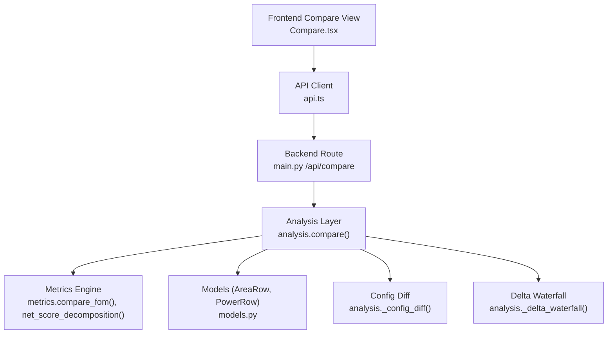
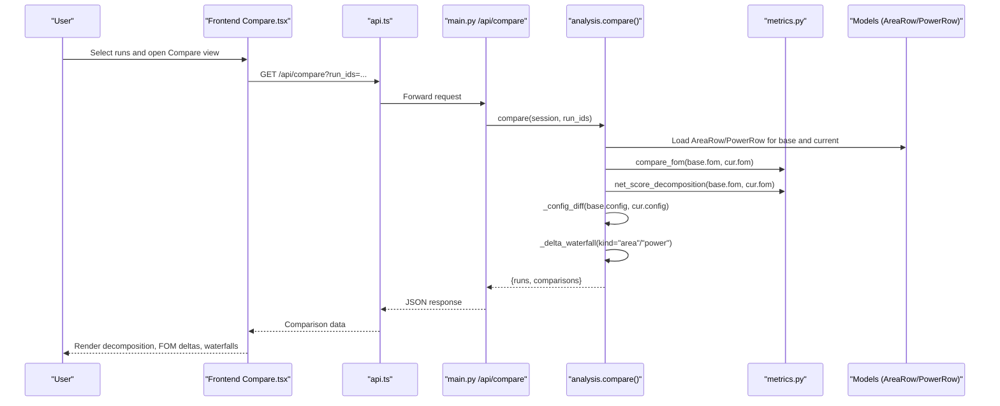
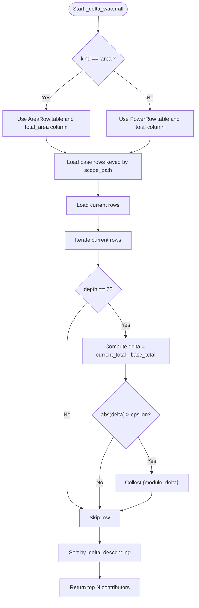
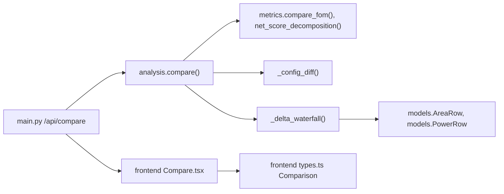

# Baseline Comparison & Delta Analysis

<cite>
**Referenced Files in This Document**
- [analysis.py](file://backend/ppa/analysis.py)
- [metrics.py](file://backend/ppa/metrics.py)
- [models.py](file://backend/ppa/models.py)
- [main.py](file://backend/ppa/main.py)
- [api.ts](file://frontend/src/api.ts)
- [Compare.tsx](file://frontend/src/views/Compare.tsx)
- [types.ts](file://frontend/src/types.ts)
</cite>

## Table of Contents
1. [Introduction](#introduction)
2. [Project Structure](#project-structure)
3. [Core Components](#core-components)
4. [Architecture Overview](#architecture-overview)
5. [Detailed Component Analysis](#detailed-component-analysis)
6. [Dependency Analysis](#dependency-analysis)
7. [Performance Considerations](#performance-considerations)
8. [Troubleshooting Guide](#troubleshooting-guide)
9. [Conclusion](#conclusion)
10. [Appendices](#appendices)

## Introduction
This document explains the baseline comparison and delta analysis capabilities that enable multi-run comparisons with waterfall charts showing module-level contributions to changes in area and power. It details how the compare function orchestrates comparisons, how the delta_waterfall algorithm computes per-module deltas, how configuration diffs are detected between runs, and how results are interpreted for optimization decisions. It also addresses statistical significance testing and noise reduction techniques to ensure reliable comparisons.

## Project Structure
The comparison feature spans a small but cohesive set of backend and frontend components:
- Backend API endpoint exposes /api/compare to accept multiple run IDs and return structured comparison data.
- Backend analysis logic computes FOM deltas, net score decomposition, configuration diffs, and module-level waterfalls for area and power.
- Frontend Compare view requests comparison data and renders waterfall charts and decomposition summaries.
- Data models define hierarchical area/power rows used by the delta computation.

**Diagram sources**
- [main.py:53-60](file://backend/ppa/main.py#L53-L60)
- [analysis.py:139-167](file://backend/ppa/analysis.py#L139-L167)
- [metrics.py:158-187](file://backend/ppa/metrics.py#L158-L187)
- [models.py:93-118](file://backend/ppa/models.py#L93-L118)
- [api.ts:23-27](file://frontend/src/api.ts#L23-L27)
- [Compare.tsx:27-39](file://frontend/src/views/Compare.tsx#L27-L39)

**Section sources**
- [main.py:53-60](file://backend/ppa/main.py#L53-L60)
- [analysis.py:139-167](file://backend/ppa/analysis.py#L139-L167)
- [metrics.py:158-187](file://backend/ppa/metrics.py#L158-L187)
- [models.py:93-118](file://backend/ppa/models.py#L93-L118)
- [api.ts:23-27](file://frontend/src/api.ts#L23-L27)
- [Compare.tsx:27-39](file://frontend/src/views/Compare.tsx#L27-L39)

## Core Components
- Multi-run compare orchestration: The compare function loads runs, metrics, and configs, then builds comparisons against a base run. It returns FOM deltas, decomposition, config diffs, and top module-level deltas for area and power.
- Metrics engine: Provides delta calculations, ROI computations, and net score decomposition into IPC and frequency contributions.
- Models: Provide hierarchical area and power rows keyed by scope_path and depth, enabling module-level attribution at level-2 granularity.
- Frontend visualization: Renders waterfall bar charts for area and power deltas, plus decomposition and FOM delta tables.

Key responsibilities:
- Orchestrate comparison across runs and compute deltas.
- Attribute overall changes to modules via delta_waterfall.
- Detect parameter changes via configuration diff.
- Visualize results for interpretation and decision-making.

**Section sources**
- [analysis.py:139-200](file://backend/ppa/analysis.py#L139-L200)
- [metrics.py:142-187](file://backend/ppa/metrics.py#L142-L187)
- [models.py:93-118](file://backend/ppa/models.py#L93-L118)
- [Compare.tsx:7-25](file://frontend/src/views/Compare.tsx#L7-L25)

## Architecture Overview
The compare workflow proceeds as follows:
- User selects two or more runs in the UI.
- Frontend calls /api/compare with run IDs.
- Backend route validates inputs and delegates to analysis.compare().
- analysis.compare() gathers metrics and configs, computes FOM deltas and decomposition, detects config diffs, and computes area/power waterfalls.
- Frontend renders decomposition, FOM deltas, and waterfall charts.

**Diagram sources**
- [main.py:53-60](file://backend/ppa/main.py#L53-L60)
- [analysis.py:139-200](file://backend/ppa/analysis.py#L139-L200)
- [metrics.py:158-187](file://backend/ppa/metrics.py#L158-L187)
- [models.py:93-118](file://backend/ppa/models.py#L93-L118)
- [api.ts:23-27](file://frontend/src/api.ts#L23-L27)
- [Compare.tsx:27-39](file://frontend/src/views/Compare.tsx#L27-L39)

## Detailed Component Analysis

### Compare Function and Multi-Run Comparisons
- Loads each selected run’s metrics and configuration.
- Treats the first run as the baseline; compares subsequent runs against it.
- Produces per-comparison objects containing:
  - FOM deltas (absolute and percentage).
  - Net score decomposition (IPC vs frequency contributions).
  - Configuration diff (parameter changes).
  - Top module-level deltas for area and power.

Interpretation tips:
- Use the net score decomposition to understand whether performance changes stem from microarchitectural improvements (IPC) or physical changes (frequency).
- Inspect configuration diffs to correlate parameter changes with observed deltas.
- Focus on top contributors in waterfalls to prioritize optimization efforts.

**Section sources**
- [analysis.py:139-167](file://backend/ppa/analysis.py#L139-L167)
- [metrics.py:158-187](file://backend/ppa/metrics.py#L158-L187)

### Delta Waterfall Algorithm (Module-Level Contributions)
The delta_waterfall algorithm attributes overall changes in area and power to specific modules:
- For area: uses AreaRow entries; for power: uses PowerRow entries.
- Filters to level-2 module granularity (depth == 2) to attribute at meaningful module boundaries.
- Computes per-module delta as current total minus baseline total.
- Sorts by absolute delta magnitude and returns top N contributors.

**Diagram sources**
- [analysis.py:179-200](file://backend/ppa/analysis.py#L179-L200)
- [models.py:93-118](file://backend/ppa/models.py#L93-L118)

**Section sources**
- [analysis.py:179-200](file://backend/ppa/analysis.py#L179-L200)
- [models.py:93-118](file://backend/ppa/models.py#L93-L118)

### Configuration Diff Detection
- Compares configuration dictionaries between base and current runs.
- Identifies parameters that differ and reports both base and current values.
- Helps users correlate metric changes with design or tooling parameter adjustments.

Usage guidance:
- If a parameter change is present, investigate its impact on relevant metrics (e.g., area, power, frequency).
- Combine with waterfall insights to isolate which modules were affected by the parameter change.

**Section sources**
- [analysis.py:170-176](file://backend/ppa/analysis.py#L170-L176)

### Frontend Visualization of Waterfalls and Decomposition
- Waterfall component renders bar charts for area and power deltas by module, color-coded for positive/negative changes.
- Decomposition chart shows IPC and frequency contributions to net score change.
- FOM delta table displays absolute and percentage changes, along with ROI metrics for area and power.

Interpretation guidance:
- Large negative area/power deltas indicate reductions; large positive deltas indicate increases.
- Positive IPC contribution with negative frequency contribution suggests a trade-off scenario.
- ROI helps assess whether score gains justify cost increases.

**Section sources**
- [Compare.tsx:7-25](file://frontend/src/views/Compare.tsx#L7-L25)
- [Compare.tsx:55-141](file://frontend/src/views/Compare.tsx#L55-L141)

## Dependency Analysis
The comparison pipeline depends on:
- API routing to accept run IDs and return comparison data.
- Analysis layer to orchestrate metrics, configuration diffs, and waterfalls.
- Metrics engine for delta and decomposition calculations.
- Models for hierarchical area/power data used in waterfalls.
- Frontend types defining the shape of comparison responses.

**Diagram sources**
- [main.py:53-60](file://backend/ppa/main.py#L53-L60)
- [analysis.py:139-200](file://backend/ppa/analysis.py#L139-L200)
- [metrics.py:158-187](file://backend/ppa/metrics.py#L158-L187)
- [models.py:93-118](file://backend/ppa/models.py#L93-L118)
- [types.ts:42-53](file://frontend/src/types.ts#L42-L53)

**Section sources**
- [main.py:53-60](file://backend/ppa/main.py#L53-L60)
- [analysis.py:139-200](file://backend/ppa/analysis.py#L139-L200)
- [metrics.py:158-187](file://backend/ppa/metrics.py#L158-L187)
- [models.py:93-118](file://backend/ppa/models.py#L93-L118)
- [types.ts:42-53](file://frontend/src/types.ts#L42-L53)

## Performance Considerations
- Waterfall computation filters to level-2 modules, reducing noise and focusing on meaningful attribution.
- Sorting by absolute delta ensures top contributors are surfaced quickly.
- ROI metrics help prioritize changes that deliver meaningful score gains relative to costs.
- Avoid comparing runs with vastly different configurations unless you explicitly want to analyze cross-parameter effects.

[No sources needed since this section provides general guidance]

## Troubleshooting Guide
Common issues and resolutions:
- Fewer than two runs selected: Ensure at least two runs are added to the comparison tray before opening Compare.
- Missing configuration diffs: If no differences appear, verify that configs were ingested and persisted correctly.
- Unexpected zero deltas: Check that both runs have corresponding level-2 module entries; missing hierarchy can lead to no attribution.
- Misleading ROI: ROI can be undefined if cost percentage is near zero; interpret cautiously and consider absolute changes.

**Section sources**
- [main.py:53-60](file://backend/ppa/main.py#L53-L60)
- [analysis.py:179-200](file://backend/ppa/analysis.py#L179-L200)

## Conclusion
The baseline comparison and delta analysis system provides a robust framework for understanding multi-run differences through FOM deltas, net score decomposition, configuration diffs, and module-level waterfalls. By focusing on top contributors and interpreting IPC vs frequency trade-offs, designers can identify high-impact optimization opportunities. For reliable comparisons, ensure consistent configurations and consider statistical validation when assessing significance.

[No sources needed since this section summarizes without analyzing specific files]

## Appendices

### Interpreting Comparison Results
- Net score decomposition:
  - IPC contribution reflects microarchitectural changes.
  - Frequency contribution reflects physical timing changes.
  - Cross term captures interaction between IPC and frequency.
- FOM deltas:
  - Absolute and percentage changes for key metrics like SPECint score, Fmax, area, and power.
  - ROI indicates efficiency of score gains relative to area or power costs.
- Waterfalls:
  - Module-level deltas highlight where changes originate.
  - Focus on top contributors to guide targeted optimizations.

**Section sources**
- [metrics.py:158-187](file://backend/ppa/metrics.py#L158-L187)
- [Compare.tsx:85-141](file://frontend/src/views/Compare.tsx#L85-L141)

### Statistical Significance Testing and Noise Reduction
Current implementation notes:
- The codebase does not include explicit statistical significance testing or variance modeling in the comparison pipeline.
- Noise reduction strategies implemented:
  - Filtering to level-2 module granularity reduces attribution noise.
  - Thresholding tiny deltas to avoid spurious contributions.
  - Using ROI to contextualize changes relative to costs.

Recommendations for future enhancements:
- Add repeated runs per configuration to estimate variance and compute confidence intervals.
- Implement t-tests or non-parametric tests to assess significance of observed deltas.
- Introduce smoothing or aggregation over multiple runs to reduce noise.
- Surface uncertainty bands in waterfalls and decomposition charts.

[No sources needed since this section provides general guidance]