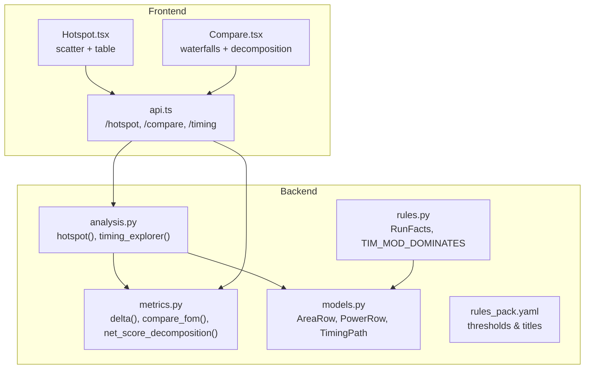
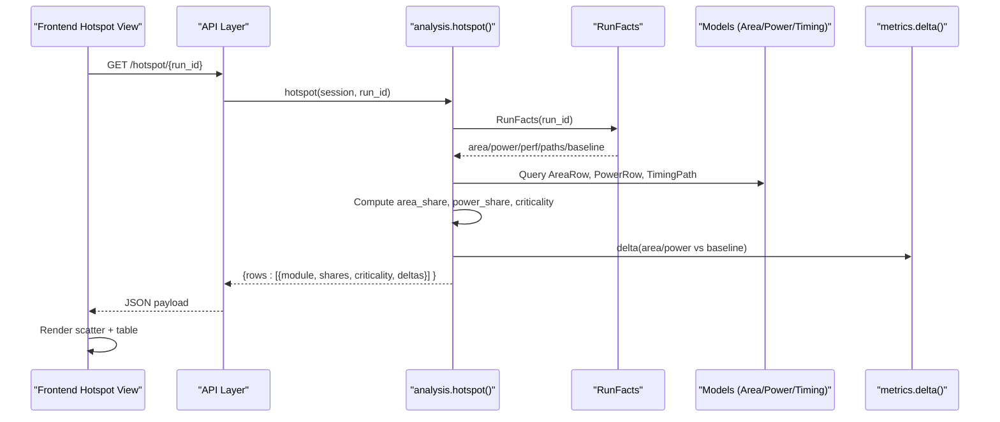
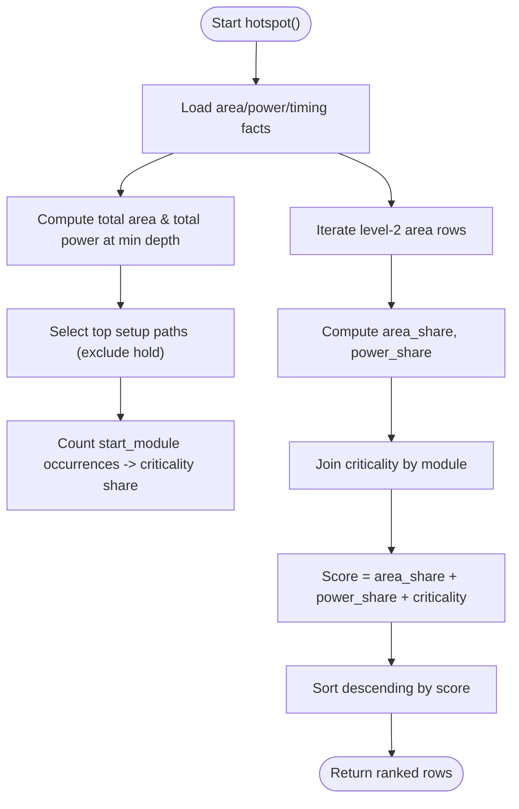
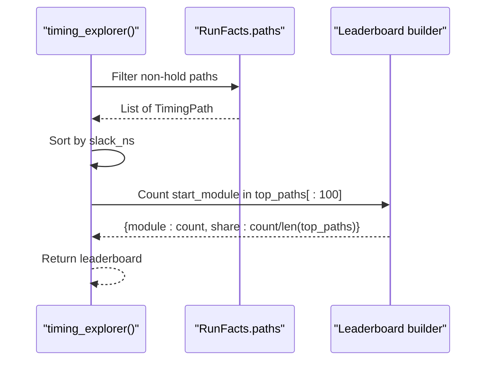
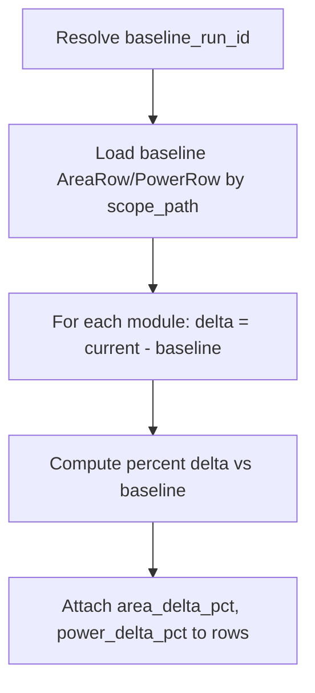
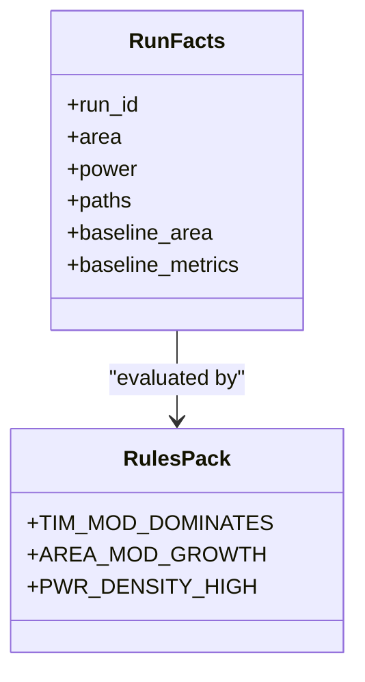
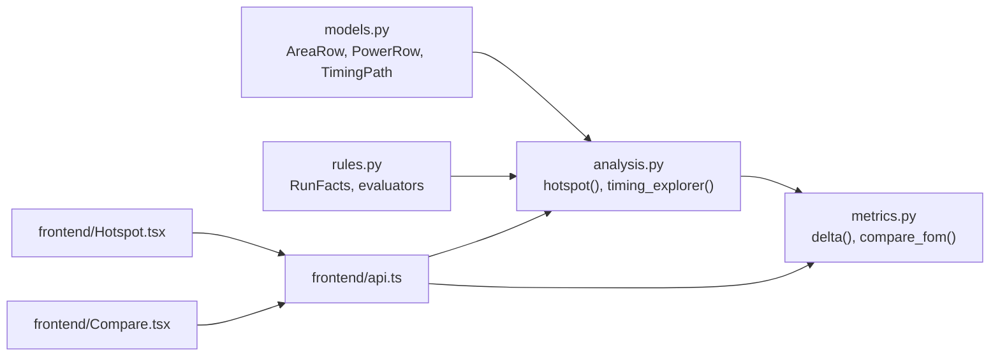

# Hotspot Detection & Prioritization

<cite>
**Referenced Files in This Document**
- [analysis.py](file://backend/ppa/analysis.py)
- [metrics.py](file://backend/ppa/metrics.py)
- [models.py](file://backend/ppa/models.py)
- [rules.py](file://backend/ppa/rules.py)
- [rules_pack.yaml](file://backend/ppa/rules_pack.yaml)
- [Hotspot.tsx](file://frontend/src/views/Hotspot.tsx)
- [Compare.tsx](file://frontend/src/views/Compare.tsx)
- [api.ts](file://frontend/src/api.ts)
</cite>

## Table of Contents
1. [Introduction](#introduction)
2. [Project Structure](#project-structure)
3. [Core Components](#core-components)
4. [Architecture Overview](#architecture-overview)
5. [Detailed Component Analysis](#detailed-component-analysis)
6. [Dependency Analysis](#dependency-analysis)
7. [Performance Considerations](#performance-considerations)
8. [Troubleshooting Guide](#troubleshooting-guide)
9. [Conclusion](#conclusion)
10. [Appendices](#appendices)

## Introduction
This document explains the hotspot analysis engine that identifies critical modules requiring optimization attention. It details the multi-dimensional scoring algorithm combining area share, power share, and timing-based criticality to prioritize modules. It also documents how timing path analysis contributes to criticality assessment by counting paths originating from each module, and how baseline comparison integration shows deltas for both area and power components. Finally, it provides guidance on interpreting hotspot rankings, understanding trade-offs between different optimization strategies, and tracking improvement progress across design iterations.

## Project Structure
The hotspot pipeline spans backend data ingestion, metrics computation, rule evaluation, and frontend visualization:
- Backend analysis functions compute per-module metrics and hotspots.
- Metrics utilities provide derived figures of merit and comparisons.
- Models define the database schema used to store area, power, timing paths, and performance rows.
- Rules evaluate domain-specific findings and can highlight modules dominating timing paths.
- Frontend views visualize hotspots, compare runs, and show deltas.

**Diagram sources**
- [analysis.py:361-398](file://backend/ppa/analysis.py#L361-L398)
- [analysis.py:279-326](file://backend/ppa/analysis.py#L279-L326)
- [metrics.py:142-187](file://backend/ppa/metrics.py#L142-L187)
- [models.py:93-149](file://backend/ppa/models.py#L93-L149)
- [rules.py:24-79](file://backend/ppa/rules.py#L24-L79)
- [rules_pack.yaml:19-29](file://backend/ppa/rules_pack.yaml#L19-L29)
- [Hotspot.tsx:7-89](file://frontend/src/views/Hotspot.tsx#L7-L89)
- [Compare.tsx:7-25](file://frontend/src/views/Compare.tsx#L7-L25)
- [api.ts:23-32](file://frontend/src/api.ts#L23-L32)

**Section sources**
- [analysis.py:361-398](file://backend/ppa/analysis.py#L361-L398)
- [analysis.py:279-326](file://backend/ppa/analysis.py#L279-L326)
- [metrics.py:142-187](file://backend/ppa/metrics.py#L142-L187)
- [models.py:93-149](file://backend/ppa/models.py#L93-L149)
- [rules.py:24-79](file://backend/ppa/rules.py#L24-L79)
- [rules_pack.yaml:19-29](file://backend/ppa/rules_pack.yaml#L19-L29)
- [Hotspot.tsx:7-89](file://frontend/src/views/Hotspot.tsx#L7-L89)
- [Compare.tsx:7-25](file://frontend/src/views/Compare.tsx#L7-L25)
- [api.ts:23-32](file://frontend/src/api.ts#L23-L32)

## Core Components
- Hotspot scoring: Computes per-module area share, power share, and criticality (from timing paths), then ranks modules by their combined score.
- Timing path analysis: Aggregates top setup paths to count how many originate from each module; this drives criticality.
- Baseline comparison: Computes per-module area and power deltas versus a baseline run, enabling change tracking.
- Rule engine: Identifies modules that dominate timing paths or exhibit abnormal growth/density, complementing the numeric hotspot ranking with diagnostic findings.
- Frontend visualization: Displays scatter plot (area vs power, bubble size = criticality, color = power density) and tables with deltas.

**Section sources**
- [analysis.py:361-398](file://backend/ppa/analysis.py#L361-L398)
- [analysis.py:279-326](file://backend/ppa/analysis.py#L279-L326)
- [rules.py:99-111](file://backend/ppa/rules.py#L99-L111)
- [Hotspot.tsx:24-89](file://frontend/src/views/Hotspot.tsx#L24-L89)

## Architecture Overview
The hotspot engine integrates multiple data sources at level-2 module granularity:
- Area and power hierarchies are loaded per run.
- Timing paths are filtered to setup paths and limited to the worst ones to compute criticality.
- Baseline context is resolved via project baseline mapping to enable deltas.
- The final ranking combines three normalized dimensions: area share, power share, and criticality share.

**Diagram sources**
- [analysis.py:361-398](file://backend/ppa/analysis.py#L361-L398)
- [rules.py:24-79](file://backend/ppa/rules.py#L24-L79)
- [metrics.py:142-148](file://backend/ppa/metrics.py#L142-L148)
- [Hotspot.tsx:7-89](file://frontend/src/views/Hotspot.tsx#L7-L89)

## Detailed Component Analysis

### Multi-Dimensional Scoring Algorithm
The hotspot function computes a composite score per module using:
- Area share: Module’s total area divided by the design’s total area at the target depth.
- Power share: Module’s total power divided by the design’s total power at the target depth.
- Criticality: Share of the top setup timing paths that originate from the module.

Ranking is performed by summing these three normalized values, prioritizing modules that are large, power-heavy, and timing-critical.

**Diagram sources**
- [analysis.py:361-398](file://backend/ppa/analysis.py#L361-L398)

**Section sources**
- [analysis.py:361-398](file://backend/ppa/analysis.py#L361-L398)

### Timing Path Analysis and Criticality Assessment
Criticality is derived from timing path analysis:
- Setup paths are selected by excluding hold violations.
- The top N paths (by slack severity) are considered to avoid noise.
- For each path, the owning module (start_module) is counted.
- Criticality for a module equals its count divided by the number of top paths considered.

This approach highlights modules that frequently appear on critical paths, even if they are not the largest or most power-intensive.

**Diagram sources**
- [analysis.py:279-326](file://backend/ppa/analysis.py#L279-L326)

**Section sources**
- [analysis.py:279-326](file://backend/ppa/analysis.py#L279-L326)

### Baseline Comparison Integration
Baseline integration enables tracking changes across iterations:
- The baseline run is resolved via project baseline mapping.
- Per-module area and power deltas are computed against the baseline.
- Percent deltas are included in the hotspot rows for quick visual feedback.
- The Compare view uses waterfall charts to show top contributors to area and power changes.

**Diagram sources**
- [analysis.py:34-41](file://backend/ppa/analysis.py#L34-L41)
- [analysis.py:179-199](file://backend/ppa/analysis.py#L179-L199)
- [analysis.py:361-398](file://backend/ppa/analysis.py#L361-L398)

**Section sources**
- [analysis.py:34-41](file://backend/ppa/analysis.py#L34-L41)
- [analysis.py:179-199](file://backend/ppa/analysis.py#L179-L199)
- [analysis.py:361-398](file://backend/ppa/analysis.py#L361-L398)

### Rule Engine Complement to Hotspots
The rule engine flags modules that dominate timing paths or exhibit anomalies:
- TIM_MOD_DOMINATES counts top paths per module and triggers when a module owns a significant share.
- AREA_MOD_GROWTH detects modules growing beyond thresholds relative to baseline.
- PWR_DENSITY_HIGH highlights modules with high power density.

These rules provide actionable diagnostics that complement the numeric hotspot ranking.

**Diagram sources**
- [rules.py:24-79](file://backend/ppa/rules.py#L24-L79)
- [rules_pack.yaml:19-77](file://backend/ppa/rules_pack.yaml#L19-L77)

**Section sources**
- [rules.py:99-111](file://backend/ppa/rules.py#L99-L111)
- [rules.py:141-153](file://backend/ppa/rules.py#L141-L153)
- [rules.py:177-189](file://backend/ppa/rules.py#L177-L189)
- [rules_pack.yaml:19-77](file://backend/ppa/rules_pack.yaml#L19-L77)

### Frontend Visualization and Interpretation
The Hotspot view renders:
- A scatter plot with axes representing area share and power share.
- Bubble size encodes criticality (share of top paths).
- Color encodes power density (mW/mm²).
- A table lists modules with area/power metrics, criticality, and deltas.

Interpretation guidance:
- Modules above the diagonal have higher power share than area share, suggesting gating or leakage opportunities.
- Top-right modules are expensive in area, power, and timing—prime candidates for optimization.
- Highlighted rows indicate modules owning more than 20% of critical paths.

**Section sources**
- [Hotspot.tsx:24-89](file://frontend/src/views/Hotspot.tsx#L24-L89)
- [Hotspot.tsx:91-114](file://frontend/src/views/Hotspot.tsx#L91-L114)

## Dependency Analysis
Key dependencies and relationships:
- analysis.hotspot depends on models (AreaRow, PowerRow, TimingPath) and metrics (delta).
- RunFacts aggregates all necessary data for rule evaluation and hotspot computation.
- Frontend api.ts calls backend endpoints for hotspot, compare, and timing data.
- Compare view uses metrics decomposition and waterfalls to explain deltas.

**Diagram sources**
- [models.py:93-149](file://backend/ppa/models.py#L93-L149)
- [analysis.py:361-398](file://backend/ppa/analysis.py#L361-L398)
- [metrics.py:142-187](file://backend/ppa/metrics.py#L142-L187)
- [rules.py:24-79](file://backend/ppa/rules.py#L24-L79)
- [api.ts:23-32](file://frontend/src/api.ts#L23-L32)
- [Hotspot.tsx:7-89](file://frontend/src/views/Hotspot.tsx#L7-L89)
- [Compare.tsx:7-25](file://frontend/src/views/Compare.tsx#L7-L25)

**Section sources**
- [models.py:93-149](file://backend/ppa/models.py#L93-L149)
- [analysis.py:361-398](file://backend/ppa/analysis.py#L361-L398)
- [metrics.py:142-187](file://backend/ppa/metrics.py#L142-L187)
- [rules.py:24-79](file://backend/ppa/rules.py#L24-L79)
- [api.ts:23-32](file://frontend/src/api.ts#L23-L32)
- [Hotspot.tsx:7-89](file://frontend/src/views/Hotspot.tsx#L7-L89)
- [Compare.tsx:7-25](file://frontend/src/views/Compare.tsx#L7-L25)

## Performance Considerations
- Timing path selection limits analysis to the worst setup paths to reduce noise and focus on critical issues.
- Level-2 module granularity balances detail with performance; deeper hierarchies may increase computation time.
- Baseline lookups are keyed by scope_path for efficient delta computation.
- Pareto front and decomposition utilities help identify efficient trade-offs without exhaustive search.

[No sources needed since this section provides general guidance]

## Troubleshooting Guide
Common issues and resolutions:
- Missing baseline: If no baseline run is configured, deltas will be null; ensure project baseline mapping exists.
- No timing paths: If no setup paths are found, criticality will be zero; verify timing report ingestion and filtering logic.
- Unexpected rankings: Check whether modules have accurate area/power totals and correct depth levels; confirm that level-2 rows exist.
- Rule false positives: Adjust thresholds in rules_pack.yaml for TIM_MOD_DOMINATES, AREA_MOD_GROWTH, and PWR_DENSITY_HIGH based on design characteristics.

**Section sources**
- [analysis.py:34-41](file://backend/ppa/analysis.py#L34-L41)
- [analysis.py:361-398](file://backend/ppa/analysis.py#L361-L398)
- [rules_pack.yaml:19-77](file://backend/ppa/rules_pack.yaml#L19-L77)

## Conclusion
The hotspot analysis engine provides a robust, multi-dimensional prioritization mechanism that combines area, power, and timing criticality to identify modules needing optimization. Timing path analysis ensures that critical modules are recognized even if they are not the largest or most power-intensive. Baseline integration enables clear tracking of improvements across iterations through per-module deltas. The rule engine complements numeric rankings with actionable diagnostics, while the frontend visualizations make interpretation straightforward for designers.

[No sources needed since this section summarizes without analyzing specific files]

## Appendices

### Interpreting Hotspot Rankings
- High area share + high power share + high criticality: Optimize first; likely yields significant gains.
- Low area share + high power share: Investigate clock gating, leakage, or VT choices.
- High area share + low power share: Consider area reduction techniques; check macro usage or sequential ratio.
- High criticality only: Focus on timing closure; consider pipelining, retiming, or logic restructuring.

**Section sources**
- [Hotspot.tsx:24-89](file://frontend/src/views/Hotspot.tsx#L24-L89)
- [analysis.py:361-398](file://backend/ppa/analysis.py#L361-L398)

### Understanding Trade-offs Across Iterations
- Use Compare view to see net score decomposition: IPC vs frequency contributions.
- Waterfall charts show which modules contributed most to area/power changes.
- ROI metrics indicate whether cost (area/power) justified score gains.

**Section sources**
- [Compare.tsx:85-135](file://frontend/src/views/Compare.tsx#L85-L135)
- [metrics.py:158-187](file://backend/ppa/metrics.py#L158-L187)

### Tracking Improvement Progress
- Monitor hotspot row deltas over iterations to confirm reductions in area/power and criticality.
- Validate that modules previously flagged by rules no longer trigger or show reduced severity.
- Use timing explorer leaderboards to confirm reductions in critical path ownership.

**Section sources**
- [analysis.py:279-326](file://backend/ppa/analysis.py#L279-L326)
- [analysis.py:361-398](file://backend/ppa/analysis.py#L361-L398)
- [rules.py:99-111](file://backend/ppa/rules.py#L99-L111)