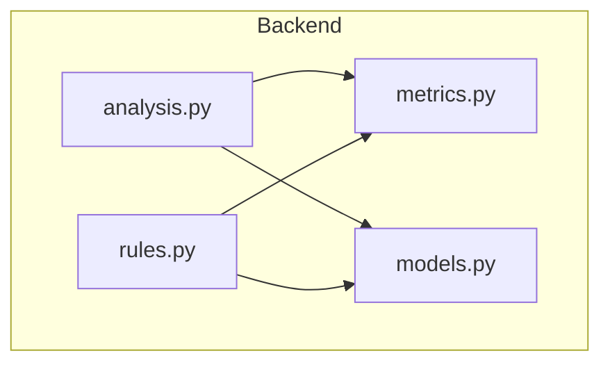
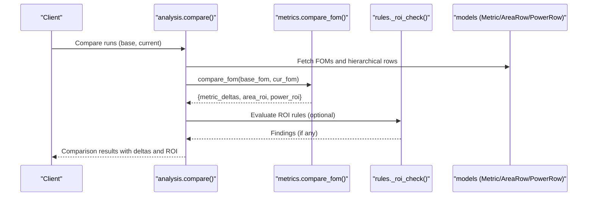
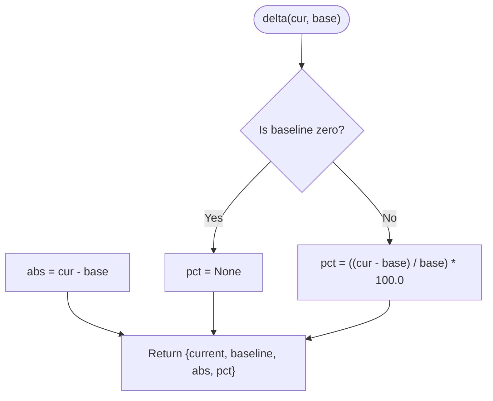
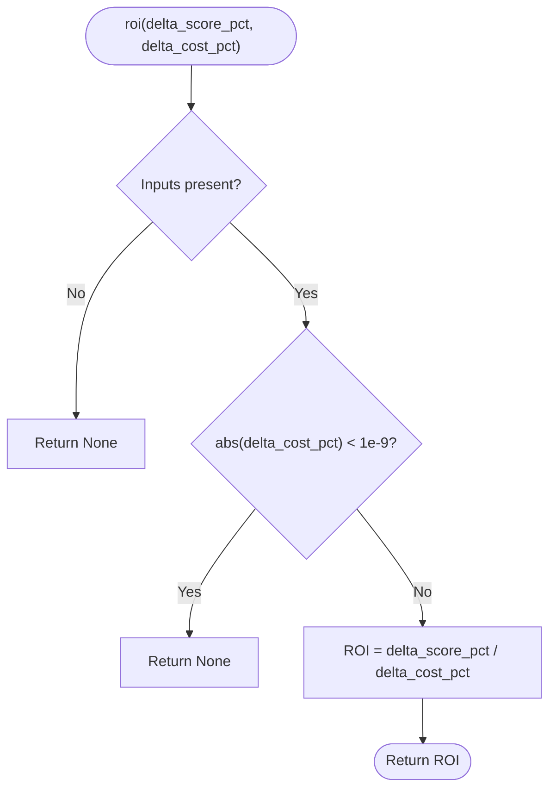
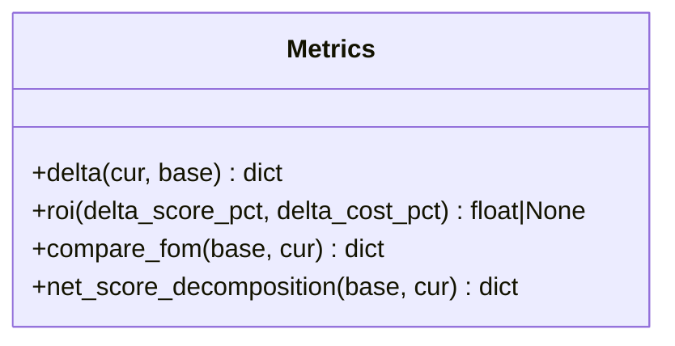
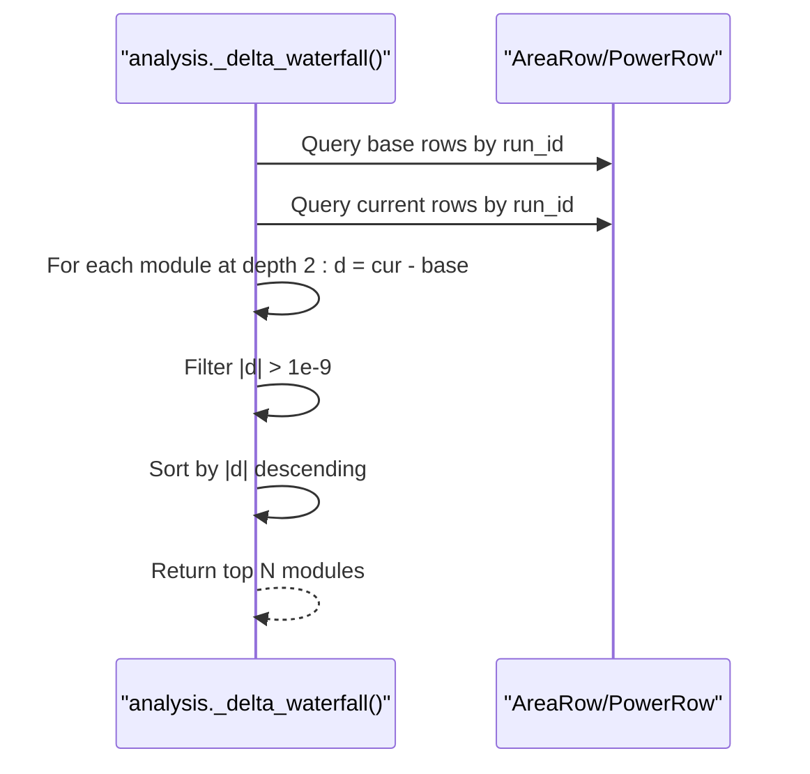
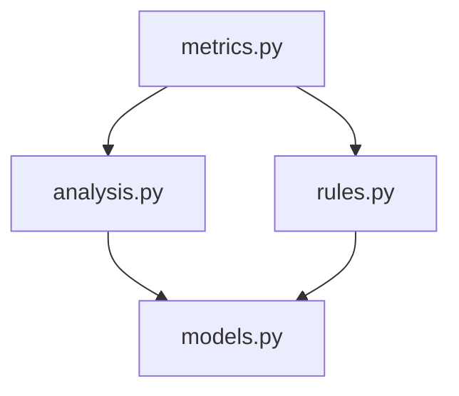

# Delta Calculations & Comparisons

<cite>
**Referenced Files in This Document**
- [metrics.py](file://backend/ppa/metrics.py)
- [analysis.py](file://backend/ppa/analysis.py)
- [rules.py](file://backend/ppa/rules.py)
- [models.py](file://backend/ppa/models.py)
</cite>

## Table of Contents
1. [Introduction](#introduction)
2. [Project Structure](#project-structure)
3. [Core Components](#core-components)
4. [Architecture Overview](#architecture-overview)
5. [Detailed Component Analysis](#detailed-component-analysis)
6. [Dependency Analysis](#dependency-analysis)
7. [Performance Considerations](#performance-considerations)
8. [Troubleshooting Guide](#troubleshooting-guide)
9. [Conclusion](#conclusion)

## Introduction
This document explains the delta calculation system used to compare metrics between design runs, focusing on:
- The delta() function that computes absolute and percentage differences between current and baseline values, including edge case handling for zero baselines.
- The ROI (Return on Investment) calculation that measures score gain per cost increase for area and power optimizations.
- Examples of comparing timing, area, and power metrics across design iterations.
- Numerical precision considerations and floating-point comparison strategies used throughout the delta calculations.

The goal is to help designers understand how changes between runs are quantified and evaluated, and how to interpret deltas and ROI in practice.

## Project Structure
The delta and ROI logic is implemented in the backend Python modules:
- metrics.py: Core functions for computing deltas, ROI, and figure-of-merit comparisons.
- analysis.py: Orchestrates comparisons between runs, applies deltas to FOMs, and builds waterfalls for area/power contributions.
- rules.py: Rule-based evaluation that uses ROI and deltas to flag low-ROI improvements or regressions.
- models.py: Data structures for storing run metrics, area/power rows, and baseline relationships.

**Diagram sources**
- [analysis.py:1-20](file://backend/ppa/analysis.py#L1-L20)
- [metrics.py:1-10](file://backend/ppa/metrics.py#L1-L10)
- [rules.py:1-20](file://backend/ppa/rules.py#L1-L20)
- [models.py:1-20](file://backend/ppa/models.py#L1-L20)

**Section sources**
- [analysis.py:1-40](file://backend/ppa/analysis.py#L1-L40)
- [metrics.py:1-20](file://backend/ppa/metrics.py#L1-L20)
- [rules.py:1-20](file://backend/ppa/rules.py#L1-L20)
- [models.py:1-20](file://backend/ppa/models.py#L1-L20)

## Core Components
- delta(cur, base): Computes absolute difference and percentage change; returns None for percentage when baseline is zero to avoid division by zero.
- roi(delta_score_pct, delta_cost_pct): Computes ROI as percent score gain divided by percent cost increase; returns None if cost change is negligible or missing.
- compare_fom(base, cur): Produces a table of metric deltas and computes area_roi and power_roi using specint_score deltas against area_mm2 and total_power_mw deltas.
- net_score_decomposition(base, cur): Decomposes score change into microarchitecture (per-GHz performance) and frequency contributions plus cross term.

These components are used by:
- analysis.compare(): Compares multiple runs and produces deltas and decompositions.
- rules._roi_check(): Flags low ROI scenarios for area and power based on configurable thresholds.

**Section sources**
- [metrics.py:142-187](file://backend/ppa/metrics.py#L142-L187)
- [analysis.py:139-167](file://backend/ppa/analysis.py#L139-L167)
- [rules.py:243-266](file://backend/ppa/rules.py#L243-L266)

## Architecture Overview
The delta and ROI system integrates with the broader analysis pipeline:
- ingestion stores raw metrics and derived figures of merit (FOMs).
- analysis compares runs by pulling FOMs and applying delta() and ROI functions.
- rules evaluate findings based on deltas and ROI thresholds.

**Diagram sources**
- [analysis.py:139-167](file://backend/ppa/analysis.py#L139-L167)
- [metrics.py:178-187](file://backend/ppa/metrics.py#L178-L187)
- [rules.py:243-266](file://backend/ppa/rules.py#L243-L266)
- [models.py:83-118](file://backend/ppa/models.py#L83-L118)

## Detailed Component Analysis

### delta() Function
- Purpose: Compute absolute and percentage differences between current and baseline values.
- Behavior:
  - abs = current - baseline
  - pct = ((current - baseline) / baseline) * 100.0 if baseline is non-zero; otherwise None
- Edge cases:
  - Zero baseline: percentage is None to avoid division by zero.
  - Negative baselines: percentage computed normally; users should interpret carefully.
- Usage:
  - Applied to all numeric FOM fields in compare_fom().
  - Used in scorecard to compute per-metric deltas vs baseline.

**Diagram sources**
- [metrics.py:142-148](file://backend/ppa/metrics.py#L142-L148)

**Section sources**
- [metrics.py:142-148](file://backend/ppa/metrics.py#L142-L148)
- [analysis.py:98-104](file://backend/ppa/analysis.py#L98-L104)

### ROI Calculation
- Purpose: Measure score gain per cost increase for area and power optimizations.
- Inputs:
  - delta_score_pct: Percent change in specint_score
  - delta_cost_pct: Percent change in area_mm2 or total_power_mw
- Behavior:
  - Returns None if either input is missing or cost change is negligible (absolute value < 1e-9).
  - ROI = delta_score_pct / delta_cost_pct
- Usage:
  - compare_fom() computes area_roi and power_roi automatically.
  - rules._roi_check() flags low ROI scenarios based on thresholds.

**Diagram sources**
- [metrics.py:151-155](file://backend/ppa/metrics.py#L151-L155)

**Section sources**
- [metrics.py:151-155](file://backend/ppa/metrics.py#L151-L155)
- [metrics.py:178-187](file://backend/ppa/metrics.py#L178-L187)
- [rules.py:243-266](file://backend/ppa/rules.py#L243-L266)

### compare_fom() and Score Decomposition
- compare_fom(base, cur):
  - Iterates numeric FOM keys and computes deltas via delta().
  - Computes area_roi and power_roi using specint_score delta and respective cost deltas.
- net_score_decomposition(base, cur):
  - Decomposes score change into IPC/per-GHz contribution, frequency contribution, and cross term.
  - Provides verdict: win/loss/flat based on net percentage change.

**Diagram sources**
- [metrics.py:142-187](file://backend/ppa/metrics.py#L142-L187)

**Section sources**
- [metrics.py:158-187](file://backend/ppa/metrics.py#L158-L187)

### Waterfall Deltas for Area and Power
- _delta_waterfall(session, base_id, cur_id, kind, top_n):
  - Retrieves hierarchical area/power rows for both runs.
  - Computes module-level deltas at depth 2 (module granularity).
  - Filters near-zero deltas using threshold 1e-9.
  - Sorts by absolute delta magnitude and returns top N contributors.

**Diagram sources**
- [analysis.py:179-199](file://backend/ppa/analysis.py#L179-L199)

**Section sources**
- [analysis.py:179-199](file://backend/ppa/analysis.py#L179-L199)

### Example Comparisons
- Timing:
  - Use timing_explorer() to get WNS/TNS/NVE/Fmax and path-level details.
  - Compare two runs via compare() to see deltas in timing metrics and waterfall contributions.
- Area:
  - Use area_explorer() to view hierarchical area breakdown and delta_vs_baseline_pct per module.
  - compare() provides area_roi to assess whether area increases yield proportional score gains.
- Power:
  - Use power_explorer() to view hierarchical power breakdown and delta_vs_baseline_pct per module.
  - compare() provides power_roi to assess whether power increases yield proportional score gains.

Note: These explorers rely on stored metrics and hierarchical rows from models.py.

**Section sources**
- [analysis.py:224-274](file://backend/ppa/analysis.py#L224-L274)
- [analysis.py:279-326](file://backend/ppa/analysis.py#L279-L326)
- [models.py:93-118](file://backend/ppa/models.py#L93-L118)

## Dependency Analysis
- metrics.py defines core delta and ROI functions used by analysis and rules.
- analysis.py consumes metrics.py to produce comparisons and waterfalls.
- rules.py uses ROI and deltas to generate findings based on thresholds.
- models.py provides data structures for metrics and hierarchical rows.

**Diagram sources**
- [metrics.py:1-20](file://backend/ppa/metrics.py#L1-L20)
- [analysis.py:1-20](file://backend/ppa/analysis.py#L1-L20)
- [rules.py:1-20](file://backend/ppa/rules.py#L1-L20)
- [models.py:1-20](file://backend/ppa/models.py#L1-L20)

**Section sources**
- [metrics.py:1-20](file://backend/ppa/metrics.py#L1-L20)
- [analysis.py:1-20](file://backend/ppa/analysis.py#L1-L20)
- [rules.py:1-20](file://backend/ppa/rules.py#L1-L20)
- [models.py:1-20](file://backend/ppa/models.py#L1-L20)

## Performance Considerations
- Delta computations are O(1) per metric; compare_fom() scales with number of numeric FOM fields.
- Waterfall computation iterates hierarchical rows; filtering near-zero deltas reduces noise and improves clarity.
- ROI calculation avoids division by small numbers using epsilon checks to prevent unstable ratios.

[No sources needed since this section provides general guidance]

## Troubleshooting Guide
- Zero baseline percentages:
  - delta() returns None for percentage when baseline is zero; ensure downstream UI handles None gracefully.
- Near-zero cost changes:
  - ROI returns None if cost change is below epsilon (1e-9); consider adjusting thresholds or interpreting as negligible.
- Floating-point equality:
  - Pareto front uses epsilon comparisons (1e-12) to treat near-equal values as equal; similar strategies apply elsewhere.
- Missing baseline context:
  - If no baseline_run is configured, some comparisons will be empty; verify project baseline configuration.

**Section sources**
- [metrics.py:142-155](file://backend/ppa/metrics.py#L142-L155)
- [metrics.py:250-251](file://backend/ppa/metrics.py#L250-L251)
- [analysis.py:34-41](file://backend/ppa/analysis.py#L34-L41)

## Conclusion
The delta and ROI system provides robust, numerically stable comparisons across design runs:
- delta() offers clear absolute and percentage differences with safe handling of zero baselines.
- ROI quantifies efficiency of area and power changes relative to score improvements.
- Waterfalls highlight module-level contributors to metric changes.
- Epsilon-based comparisons ensure stability in floating-point arithmetic.

Designers can use these tools to make informed decisions about trade-offs between performance, area, and power across iterations.

[No sources needed since this section summarizes without analyzing specific files]