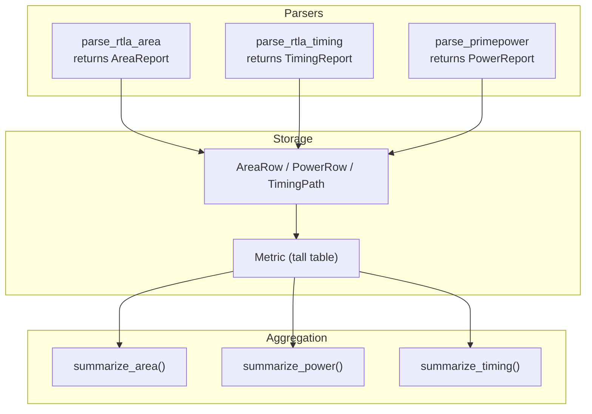
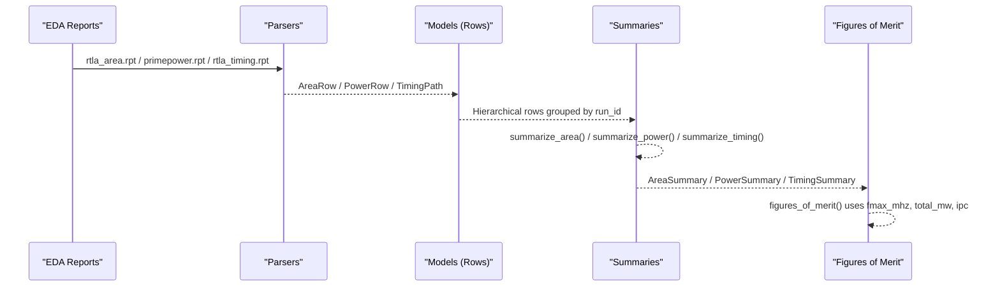
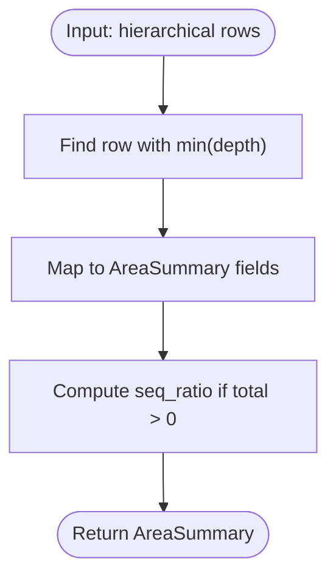
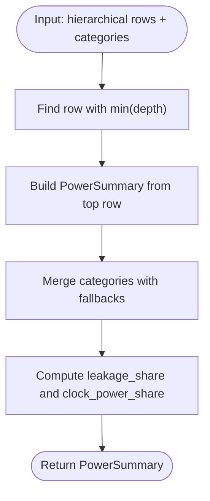
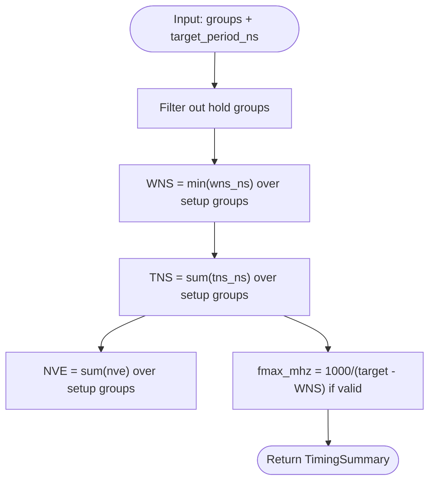
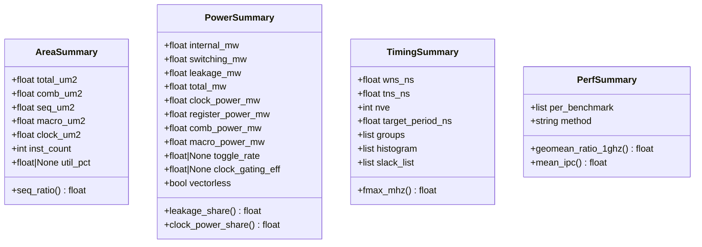
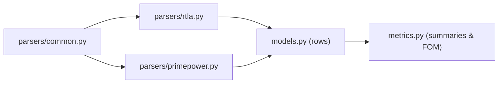

# Domain Summary Aggregation

<cite>
**Referenced Files in This Document**
- [metrics.py](file://backend/ppa/metrics.py)
- [models.py](file://backend/ppa/models.py)
- [base.py](file://backend/ppa/parsers/base.py)
- [rtla.py](file://backend/ppa/parsers/rtla.py)
- [primepower.py](file://backend/ppa/parsers/primepower.py)
- [analysis.py](file://backend/ppa/analysis.py)
- [rtla_area.rpt](file://sample_runs/baseline/rtla_area.rpt)
- [primepower.rpt](file://sample_runs/baseline/primepower.rpt)
- [rtla_timing.rpt](file://sample_runs/baseline/rtla_timing.rpt)
</cite>

## Table of Contents
1. [Introduction](#introduction)
2. [Project Structure](#project-structure)
3. [Core Components](#core-components)
4. [Architecture Overview](#architecture-overview)
5. [Detailed Component Analysis](#detailed-component-analysis)
6. [Dependency Analysis](#dependency-analysis)
7. [Performance Considerations](#performance-considerations)
8. [Troubleshooting Guide](#troubleshooting-guide)
9. [Conclusion](#conclusion)

## Introduction
This document explains how raw EDA tool outputs are aggregated into structured domain summaries for area, power, and timing. It focuses on the summarize_area(), summarize_power(), and summarize_timing() functions that extract top-level metrics while avoiding double-counting in hierarchical designs. It also documents the data structures AreaSummary, PowerSummary, and TimingSummary, including computed properties such as Fmax, leakage share, and geometric mean IPC. Examples use sample reports to illustrate processing hierarchical design data and extracting meaningful aggregate metrics. Finally, it addresses common pitfalls and best practices when handling incomplete or inconsistent input from different EDA tools.

## Project Structure
The aggregation pipeline spans parsers, models, and a metrics engine:
- Parsers convert raw text reports into typed report objects with hierarchical rows.
- Models persist parsed results as tall tables (AreaRow, PowerRow, TimingPath) plus per-run metrics.
- The metrics engine computes domain summaries and higher-level figures of merit.

**Diagram sources**
- [rtla.py:25-71](file://backend/ppa/parsers/rtla.py#L25-L71)
- [rtla.py:81-135](file://backend/ppa/parsers/rtla.py#L81-L135)
- [primepower.py:19-85](file://backend/ppa/parsers/primepower.py#L19-L85)
- [models.py:93-149](file://backend/ppa/models.py#L93-L149)
- [metrics.py:192-234](file://backend/ppa/metrics.py#L192-L234)

**Section sources**
- [rtla.py:25-71](file://backend/ppa/parsers/rtla.py#L25-L71)
- [rtla.py:81-135](file://backend/ppa/parsers/rtla.py#L81-L135)
- [primepower.py:19-85](file://backend/ppa/parsers/primepower.py#L19-L85)
- [models.py:93-149](file://backend/ppa/models.py#L93-L149)
- [metrics.py:192-234](file://backend/ppa/metrics.py#L192-L234)

## Core Components
- AreaSummary: aggregates top-level area components and derived ratios.
- PowerSummary: aggregates top-level power components and derived shares.
- TimingSummary: aggregates setup timing groups and derives Fmax.
- PerfSummary: aggregates per-benchmark performance and computes geometric mean ratio at 1 GHz and mean IPC.

Key responsibilities:
- Avoid double-counting by reading only the top-level row (minimum depth).
- Compute derived metrics safely even when totals are zero or missing.
- Preserve group-level details for downstream analysis.

**Section sources**
- [metrics.py:13-86](file://backend/ppa/metrics.py#L13-L86)
- [metrics.py:192-234](file://backend/ppa/metrics.py#L192-L234)

## Architecture Overview
End-to-end flow from raw reports to domain summaries:

**Diagram sources**
- [rtla.py:25-71](file://backend/ppa/parsers/rtla.py#L25-L71)
- [primepower.py:19-85](file://backend/ppa/parsers/primepower.py#L19-L85)
- [rtla.py:81-135](file://backend/ppa/parsers/rtla.py#L81-L135)
- [models.py:93-149](file://backend/ppa/models.py#L93-L149)
- [metrics.py:192-234](file://backend/ppa/metrics.py#L192-L234)
- [metrics.py:90-137](file://backend/ppa/metrics.py#L90-L137)

## Detailed Component Analysis

### Area Summary Aggregation
- Input: list of hierarchical dicts with fields like scope_path, depth, total_area, comb_area, seq_area, macro_area, clock_area, inst_count.
- Strategy: select the row with minimum depth (top-level), then map its fields into AreaSummary.
- Derived property: seq_ratio = seq_um2 / total_um2 (safe division).
- Pitfall avoided: summing all rows would double-count because parent nodes include children.

**Diagram sources**
- [metrics.py:192-203](file://backend/ppa/metrics.py#L192-L203)
- [metrics.py:33-45](file://backend/ppa/metrics.py#L33-L45)

**Section sources**
- [metrics.py:192-203](file://backend/ppa/metrics.py#L192-L203)
- [metrics.py:33-45](file://backend/ppa/metrics.py#L33-L45)
- [rtla_area.rpt:8-34](file://sample_runs/baseline/rtla_area.rpt#L8-L34)

### Power Summary Aggregation
- Input: list of hierarchical dicts with internal, switching, leakage, total; optional categories dict for clock/register/combinational/macro breakdowns; toggle_rate and clock_gating_eff flags.
- Strategy: select the top-level row (min depth) and populate PowerSummary; categories are merged via keys with fallbacks.
- Derived properties: leakage_share = leakage_mw / total_mw; clock_power_share = clock_power_mw / total_mw.
- Pitfall avoided: using categories prevents misattribution when tool names differ; still avoids summing hierarchy to prevent double-counting.

**Diagram sources**
- [metrics.py:206-221](file://backend/ppa/metrics.py#L206-L221)
- [metrics.py:47-68](file://backend/ppa/metrics.py#L47-L68)

**Section sources**
- [metrics.py:206-221](file://backend/ppa/metrics.py#L206-L221)
- [metrics.py:47-68](file://backend/ppa/metrics.py#L47-L68)
- [primepower.rpt:9-42](file://sample_runs/baseline/primepower.rpt#L9-L42)

### Timing Summary Aggregation
- Input: groups list (path-group summaries), target_period_ns, optional histogram and slack_list.
- Strategy: filter out hold groups, compute WNS as the minimum across setup groups, TNS as the sum of negative slacks, NVE as count of violations.
- Derived property: fmax_mhz = 1000 / (target_period_ns - wns_ns), with guard against non-positive period.
- Note: hold paths are excluded from setup summary to avoid mixing constraints.

**Diagram sources**
- [metrics.py:224-234](file://backend/ppa/metrics.py#L224-L234)
- [metrics.py:13-30](file://backend/ppa/metrics.py#L13-L30)

**Section sources**
- [metrics.py:224-234](file://backend/ppa/metrics.py#L224-L234)
- [metrics.py:13-30](file://backend/ppa/metrics.py#L13-L30)
- [rtla_timing.rpt:7-15](file://sample_runs/baseline/rtla_timing.rpt#L7-L15)

### Data Structures and Computed Properties
- AreaSummary:
  - Fields: total_um2, comb_um2, seq_um2, macro_um2, clock_um2, inst_count, util_pct.
  - Derived: seq_ratio.
- PowerSummary:
  - Fields: internal_mw, switching_mw, leakage_mw, total_mw, clock_power_mw, register_power_mw, comb_power_mw, macro_power_mw, toggle_rate, clock_gating_eff, vectorless.
  - Derived: leakage_share, clock_power_share.
- TimingSummary:
  - Fields: wns_ns, tns_ns, nve, target_period_ns, groups, histogram, slack_list.
  - Derived: fmax_mhz.
- PerfSummary:
  - Fields: per_benchmark list, method.
  - Derived: geomean_ratio_1ghz (geometric mean of ratio_1ghz), mean_ipc.

**Diagram sources**
- [metrics.py:13-86](file://backend/ppa/metrics.py#L13-L86)

**Section sources**
- [metrics.py:13-86](file://backend/ppa/metrics.py#L13-L86)

### Processing Examples from Sample Reports
- Area:
  - The top-level module core_top has total_area, comb_area, seq_area, macro_area, clock_area, and inst_count. summarize_area() reads this single row to form AreaSummary, ensuring no double-counting across nested modules.
  - Reference: [rtla_area.rpt:8-34](file://sample_runs/baseline/rtla_area.rpt#L8-L34)
- Power:
  - The top-level instance core_top provides internal, switching, leakage, and total power. Categories (combinational, register, clock, memory) are captured separately and merged into PowerSummary without double-counting.
  - Reference: [primepower.rpt:9-42](file://sample_runs/baseline/primepower.rpt#L9-L42)
- Timing:
  - Path groups include reg2reg, in2reg, reg2out, cg_hold. Setup groups exclude hold; WNS is the minimum across setup groups; TNS sums negative slacks; Fmax is derived from target period and WNS.
  - Reference: [rtla_timing.rpt:7-15](file://sample_runs/baseline/rtla_timing.rpt#L7-L15)

**Section sources**
- [rtla_area.rpt:8-34](file://sample_runs/baseline/rtla_area.rpt#L8-L34)
- [primepower.rpt:9-42](file://sample_runs/baseline/primepower.rpt#L9-L42)
- [rtla_timing.rpt:7-15](file://sample_runs/baseline/rtla_timing.rpt#L7-L15)

## Dependency Analysis
- Parsers depend on shared helpers to parse numbers and key-value lines.
- Summaries depend on consistent hierarchical structure (depth field) to identify top-level rows.
- Figures of merit depend on summaries and project settings (e.g., nand2_area_um2, fixed_freq_mhz).

**Diagram sources**
- [common.py:1-33](file://backend/ppa/parsers/common.py#L1-L33)
- [rtla.py:1-182](file://backend/ppa/parsers/rtla.py#L1-L182)
- [primepower.py:1-86](file://backend/ppa/parsers/primepower.py#L1-L86)
- [models.py:93-149](file://backend/ppa/models.py#L93-L149)
- [metrics.py:90-137](file://backend/ppa/metrics.py#L90-L137)

**Section sources**
- [common.py:1-33](file://backend/ppa/parsers/common.py#L1-L33)
- [rtla.py:1-182](file://backend/ppa/parsers/rtla.py#L1-L182)
- [primepower.py:1-86](file://backend/ppa/parsers/primepower.py#L1-L86)
- [models.py:93-149](file://backend/ppa/models.py#L93-L149)
- [metrics.py:90-137](file://backend/ppa/metrics.py#L90-L137)

## Performance Considerations
- Selecting top-level rows by minimum depth is O(n) over rows; acceptable for typical report sizes.
- Filtering hold groups and computing min/sum over groups is linear in number of path groups.
- Geometric mean computation uses logarithms; ensure positive values to avoid NaN.
- Avoid aggregating hierarchical totals; always rely on top-level rows to prevent double-counting.

[No sources needed since this section provides general guidance]

## Troubleshooting Guide
Common issues and mitigations:
- Missing or inconsistent hierarchy:
  - Ensure parsers detect at least one hierarchy row; otherwise raise a parse error.
  - Validate presence of depth and total fields before summarization.
- Zero or missing totals:
  - Derived shares default to 0.0 when denominator is zero to avoid division errors.
- Mixed hold/setup groups:
  - Explicitly filter out hold groups when computing setup WNS/TNS/NVE.
- Category naming differences:
  - Use flexible category mapping with fallbacks (e.g., combinational vs comb, memory vs macro).
- Incomplete reports:
  - If no rows exist, return empty summaries with safe defaults.

Operational checks:
- Verify parser warnings for unparsed lines.
- Confirm that top-level rows exist before calling summaries.
- Cross-check Fmax derivation with known target periods.

**Section sources**
- [rtla.py:25-71](file://backend/ppa/parsers/rtla.py#L25-L71)
- [rtla.py:81-135](file://backend/ppa/parsers/rtla.py#L81-L135)
- [primepower.py:19-85](file://backend/ppa/parsers/primepower.py#L19-L85)
- [metrics.py:23-30](file://backend/ppa/metrics.py#L23-L30)
- [metrics.py:61-68](file://backend/ppa/metrics.py#L61-L68)

## Conclusion
The summarize_area(), summarize_power(), and summarize_timing() functions provide robust, double-count-free aggregation of hierarchical EDA outputs into structured summaries. They leverage minimal-depth selection to capture top-level metrics, compute derived properties safely, and preserve detailed group information for deeper analysis. By following the outlined best practices—filtering hold groups, normalizing categories, guarding against zero denominators, and validating parser output—you can reliably process diverse tool outputs and produce consistent domain summaries for comparison and optimization workflows.