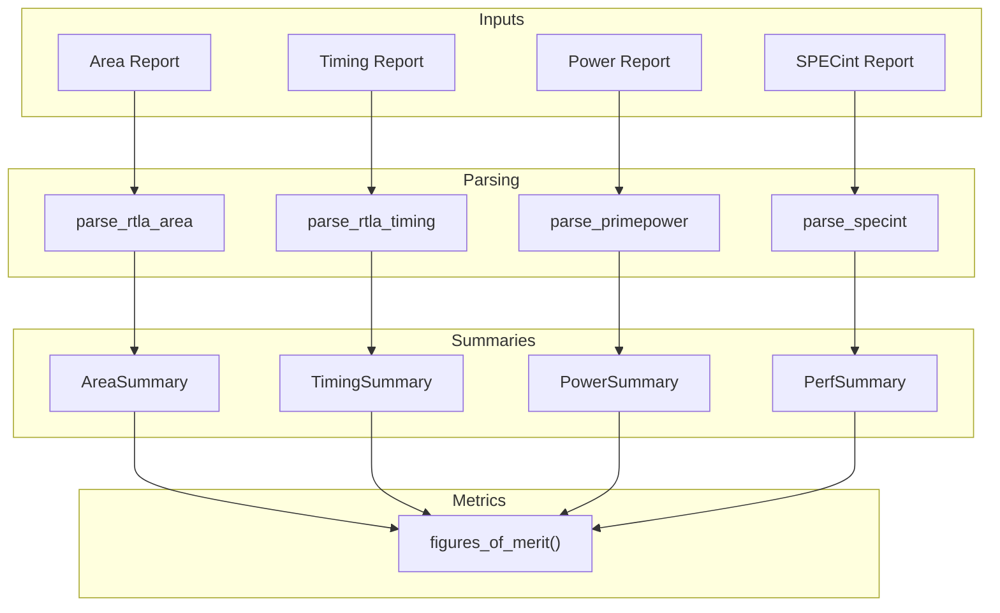
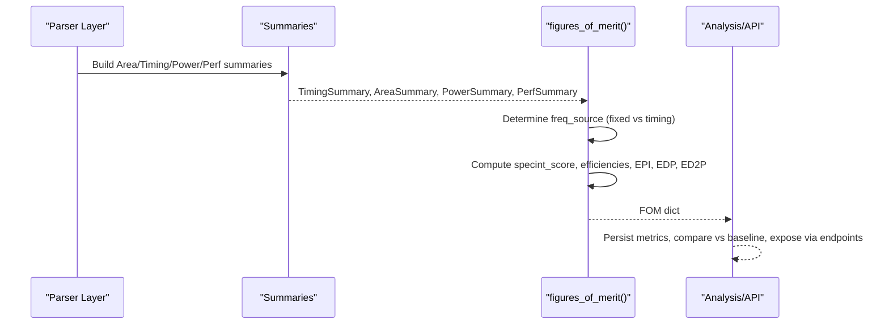
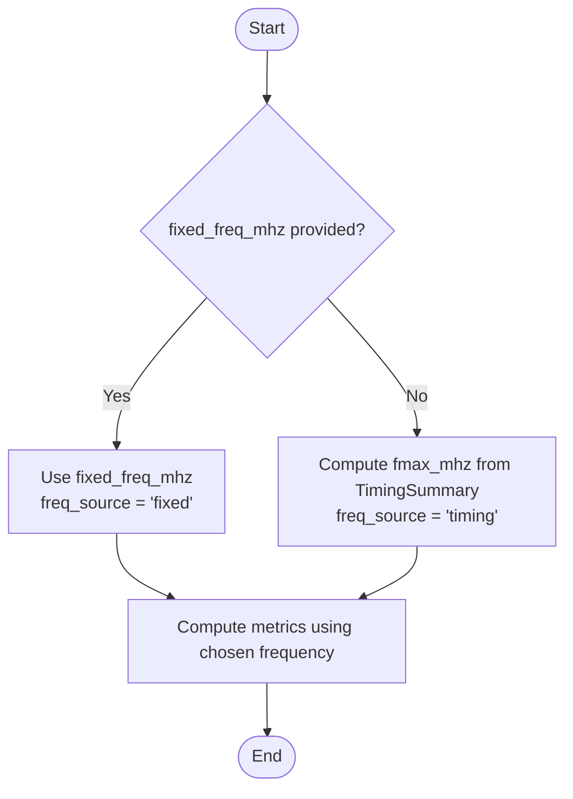
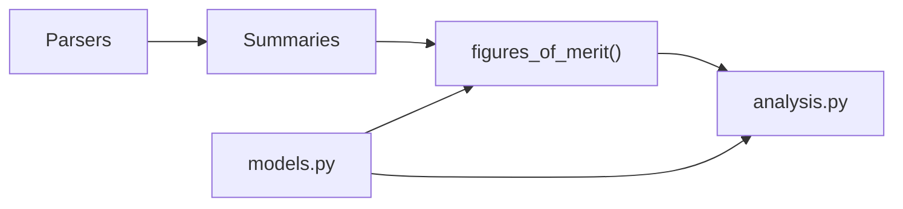
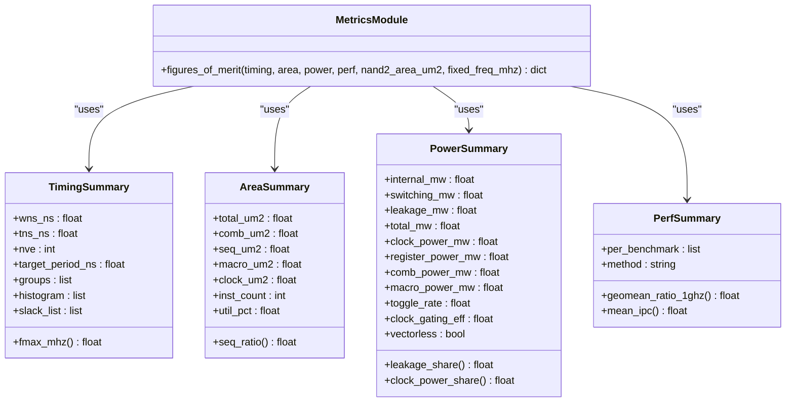

# Figures of Merit Calculation

<cite>
**Referenced Files in This Document**
- [metrics.py](file://backend/ppa/metrics.py)
- [analysis.py](file://backend/ppa/analysis.py)
- [models.py](file://backend/ppa/models.py)
- [specint.py](file://backend/ppa/parsers/specint.py)
- [primepower.py](file://backend/ppa/parsers/primepower.py)
- [rtla.py](file://backend/ppa/parsers/rtla.py)
- [sample_data.py](file://backend/ppa/sample_data.py)
- [test_backend.py](file://backend/tests/test_backend.py)
</cite>

## Table of Contents
1. [Introduction](#introduction)
2. [Project Structure](#project-structure)
3. [Core Components](#core-components)
4. [Architecture Overview](#architecture-overview)
5. [Detailed Component Analysis](#detailed-component-analysis)
6. [Dependency Analysis](#dependency-analysis)
7. [Performance Considerations](#performance-considerations)
8. [Troubleshooting Guide](#troubleshooting-guide)
9. [Conclusion](#conclusion)
10. [Appendices](#appendices)

## Introduction
This document explains the figures of merit (FOM) calculation system that synthesizes timing, area, power, and performance data into standardized metrics for design evaluation and optimization. The central function figures_of_merit() combines:
- Timing-derived or fixed frequency to compute a SPECint-like score
- Area normalization to derive area efficiency
- Power normalization to derive power efficiency
- Derived energy-based metrics such as Energy Per Instruction (EPI), Energy-Delay Product (EDP), and ED2P

It also documents how the frequency source is determined (fixed vs timing-derived Fmax) and how this choice affects all downstream metrics. Finally, it provides guidance on interpreting results to make informed design trade-offs.

## Project Structure
The FOM pipeline spans parsers, summaries, and metrics computation:
- Parsers extract structured data from tool reports (area, timing, power, performance).
- Summaries aggregate hierarchical data into compact objects used by the FOM engine.
- The metrics module computes normalized scores and derived ratios.
- The analysis layer persists and exposes these metrics via APIs and comparisons.

**Diagram sources**
- [rtla.py:25-71](file://backend/ppa/parsers/rtla.py#L25-L71)
- [rtla.py:81-135](file://backend/ppa/parsers/rtla.py#L81-L135)
- [primepower.py:19-85](file://backend/ppa/parsers/primepower.py#L19-L85)
- [specint.py:21-65](file://backend/ppa/parsers/specint.py#L21-L65)
- [metrics.py:13-86](file://backend/ppa/metrics.py#L13-L86)
- [metrics.py:90-137](file://backend/ppa/metrics.py#L90-L137)

**Section sources**
- [rtla.py:25-71](file://backend/ppa/parsers/rtla.py#L25-L71)
- [rtla.py:81-135](file://backend/ppa/parsers/rtla.py#L81-L135)
- [primepower.py:19-85](file://backend/ppa/parsers/primepower.py#L19-L85)
- [specint.py:21-65](file://backend/ppa/parsers/specint.py#L21-L65)
- [metrics.py:13-86](file://backend/ppa/metrics.py#L13-L86)
- [metrics.py:90-137](file://backend/ppa/metrics.py#L90-L137)

## Core Components
- TimingSummary: Captures worst-case negative slack (WNS), total negative slack (TNS), number of violating endpoints (NVE), target period, and per-group summaries including Fmax. It also provides fmax_mhz computed from target_period_ns and WNS.
- AreaSummary: Aggregates total, combinational, sequential, macro, clock areas, instruction count, and utilization percentage.
- PowerSummary: Aggregates internal, switching, leakage, total power; optional breakdowns for clock/register/combo/macro; toggle rate and clock gating efficiency flags.
- PerfSummary: Holds per-benchmark performance rows and aggregates geometric mean ratio at 1 GHz and mean IPC.
- figures_of_merit(): Computes normalized scores and derived metrics using the above summaries and an optional fixed frequency override.

Key responsibilities:
- Frequency determination: Use provided fixed_freq_mhz if present; otherwise derive from timing summary.
- Score computation: Multiply SPECint per-GHz performance by operating frequency in GHz.
- Efficiency metrics: Normalize score by area and power.
- Energy metrics: Compute EPI, EDP, and ED2P based on power and frequency.

**Section sources**
- [metrics.py:13-86](file://backend/ppa/metrics.py#L13-L86)
- [metrics.py:90-137](file://backend/ppa/metrics.py#L90-L137)

## Architecture Overview
The FOM pipeline ingests parsed reports, summarizes them, and computes normalized metrics. The analysis layer stores and compares FOMs across runs.

**Diagram sources**
- [analysis.py:69-125](file://backend/ppa/analysis.py#L69-L125)
- [analysis.py:139-167](file://backend/ppa/analysis.py#L139-L167)
- [metrics.py:90-137](file://backend/ppa/metrics.py#L90-L137)

## Detailed Component Analysis

### Frequency Source Determination and Impact
- If fixed_freq_mhz is provided, freq_source is set to "fixed" and all metrics use this frequency.
- Otherwise, freq_source is "timing" and fmax_mhz is derived from TimingSummary.fmax_mhz using target_period_ns and WNS.
- Impact:
  - specint_score scales linearly with frequency.
  - mw_per_mhz normalizes power by frequency.
  - EPI depends on IPC and frequency.
  - EDP and ED2P depend on delay (inverse of frequency).

**Diagram sources**
- [metrics.py:90-137](file://backend/ppa/metrics.py#L90-L137)
- [metrics.py:23-29](file://backend/ppa/metrics.py#L23-L29)

**Section sources**
- [metrics.py:23-29](file://backend/ppa/metrics.py#L23-L29)
- [metrics.py:90-137](file://backend/ppa/metrics.py#L90-L137)

### SPECint Score and Efficiencies
- specint_score = geomean_ratio_1ghz × freq_ghz
- area_eff_score_per_mm2 = specint_score / area_mm2
- power_eff_score_per_w = specint_score / power_w
- mw_per_mhz = total_power_mw / freq_mhz

These normalize performance against physical resources and consumption, enabling fair comparisons across designs.

**Section sources**
- [metrics.py:90-137](file://backend/ppa/metrics.py#L90-L137)

### Derived Energy Metrics: EPI, EDP, ED2P
- EPI (pJ/instruction): power_uW divided by instructions per microsecond, computed from IPC and frequency.
- EDP (energy × delay): energy per second basis multiplied by delay (1/frequency).
- ED2P (energy × delay²): energy per second basis multiplied by delay squared.

These metrics capture energy efficiency and time-energy trade-offs, useful for battery-powered or latency-sensitive designs.

**Section sources**
- [metrics.py:90-137](file://backend/ppa/metrics.py#L90-L137)

### Input Data Models and Summaries
- AreaSummary, PowerSummary, TimingSummary, PerfSummary encapsulate parsed report data into typed structures consumed by figures_of_merit().
- Summarization functions roll up hierarchical data correctly (e.g., top-level rows only) to avoid double-counting.

**Section sources**
- [metrics.py:13-86](file://backend/ppa/metrics.py#L13-L86)
- [metrics.py:192-234](file://backend/ppa/metrics.py#L192-L234)

### Parsing Inputs
- Area parser extracts hierarchical area breakdowns and totals.
- Timing parser extracts path groups, histograms, and per-path details; supports computing Fmax from WNS and target period.
- Power parser extracts hierarchical power and categories; includes toggle rate and clock gating efficiency metadata.
- SPECint parser extracts per-benchmark IPC and ratio@1GHz values needed for performance aggregation.

**Section sources**
- [rtla.py:25-71](file://backend/ppa/parsers/rtla.py#L25-L71)
- [rtla.py:81-135](file://backend/ppa/parsers/rtla.py#L81-L135)
- [primepower.py:19-85](file://backend/ppa/parsers/primepower.py#L19-L85)
- [specint.py:21-65](file://backend/ppa/parsers/specint.py#L21-L65)

### Example Scenarios and Interpretation Guidance
- High IPC but low Fmax:
  - specint_score may be moderate; area/power efficiency can reveal hidden costs.
  - EDP/ED2P help assess whether lower frequency dominates energy-time product.
- Low power but modest IPC:
  - power_eff_score_per_w may be high; EPI likely low.
  - Useful for energy-constrained targets where EDP/ED2P are primary drivers.
- Large area with high IPC:
  - area_eff_score_per_mm2 may drop; consider architectural changes to reduce critical path without sacrificing IPC.
- Fixed frequency override:
  - When comparing designs under a common operating point, use fixed_freq_mhz to isolate architectural effects from timing variations.

Guidance:
- Prefer comparing freq_source consistently across designs.
- Use efficiencies and energy metrics alongside raw scores to understand trade-offs.
- For budget-driven projects, combine specint_score with area_mm2 and total_power_mw to evaluate ROI.

[No sources needed since this section provides general guidance]

## Dependency Analysis
The FOM system depends on:
- Parsers to produce structured inputs.
- Summaries to consolidate hierarchical data.
- models.py for project configuration (e.g., nand2_area_um2, target_freq_mhz) and metric storage.
- analysis.py to persist and compare FOMs across runs.

**Diagram sources**
- [analysis.py:69-125](file://backend/ppa/analysis.py#L69-L125)
- [metrics.py:90-137](file://backend/ppa/metrics.py#L90-L137)
- [models.py:17-26](file://backend/ppa/models.py#L17-L26)

**Section sources**
- [analysis.py:69-125](file://backend/ppa/analysis.py#L69-L125)
- [metrics.py:90-137](file://backend/ppa/metrics.py#L90-L137)
- [models.py:17-26](file://backend/ppa/models.py#L17-L26)

## Performance Considerations
- Frequency selection significantly impacts specint_score and energy metrics; ensure consistent freq_source when comparing designs.
- EPI depends on IPC and frequency; improvements in IPC or frequency can both reduce EPI.
- EDP/ED2P penalize designs with high power and low frequency; optimizing critical paths can improve delay and thus reduce EDP/ED2P.
- Area normalization helps identify designs that achieve performance within reasonable silicon budgets.

[No sources needed since this section provides general guidance]

## Troubleshooting Guide
Common issues and checks:
- Missing or invalid frequency:
  - If no fixed_freq_mhz is provided and timing-derived Fmax cannot be computed (e.g., non-positive period), fmax_mhz will be zero; verify TimingSummary.target_period_ns and WNS.
- Zero or missing power:
  - EPI, EDP, ED2P will be zero; confirm PowerSummary.total_mw is populated.
- Inconsistent freq_source:
  - Ensure all compared designs use the same freq_source strategy; mixing fixed and timing frequencies can distort comparisons.
- Parser failures:
  - Verify input report formats match expected patterns; adjust parsers only if necessary.

Validation references:
- Test coverage confirms freq_source behavior and basic FOM computations.

**Section sources**
- [test_backend.py:68-79](file://backend/tests/test_backend.py#L68-L79)
- [metrics.py:23-29](file://backend/ppa/metrics.py#L23-L29)
- [metrics.py:90-137](file://backend/ppa/metrics.py#L90-L137)

## Conclusion
The figures_of_merit() system provides a robust, normalized view of design performance by combining timing, area, power, and performance data into meaningful metrics. By explicitly tracking frequency source and deriving energy-based metrics, it enables clear trade-off analysis and supports optimization decisions grounded in both speed and energy considerations. Consistent use of freq_source and attention to efficiencies and energy metrics will yield more reliable comparisons across design points.

[No sources needed since this section summarizes without analyzing specific files]

## Appendices

### Class Relationships in the Metrics Module

**Diagram sources**
- [metrics.py:13-86](file://backend/ppa/metrics.py#L13-L86)
- [metrics.py:90-137](file://backend/ppa/metrics.py#L90-L137)

### Sample Data Generation Context
Synthetic sample data generates realistic reports for a small out-of-order RISC-V core across multiple configurations, ensuring self-consistent relationships between IPC, area, timing, and power. This facilitates testing and demonstration of the FOM pipeline.

**Section sources**
- [sample_data.py:1-13](file://backend/ppa/sample_data.py#L1-L13)
- [sample_data.py:61-103](file://backend/ppa/sample_data.py#L61-L103)
- [sample_data.py:447-480](file://backend/ppa/sample_data.py#L447-L480)