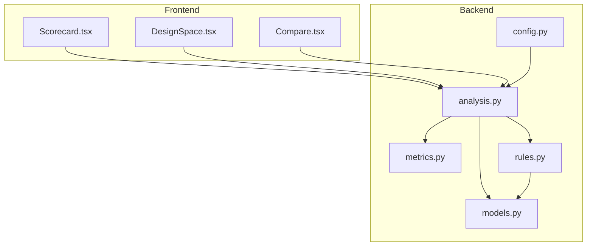
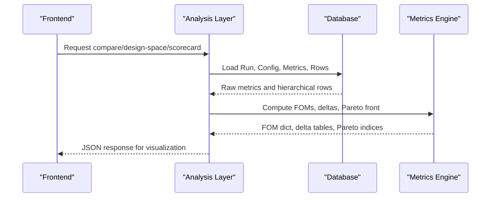
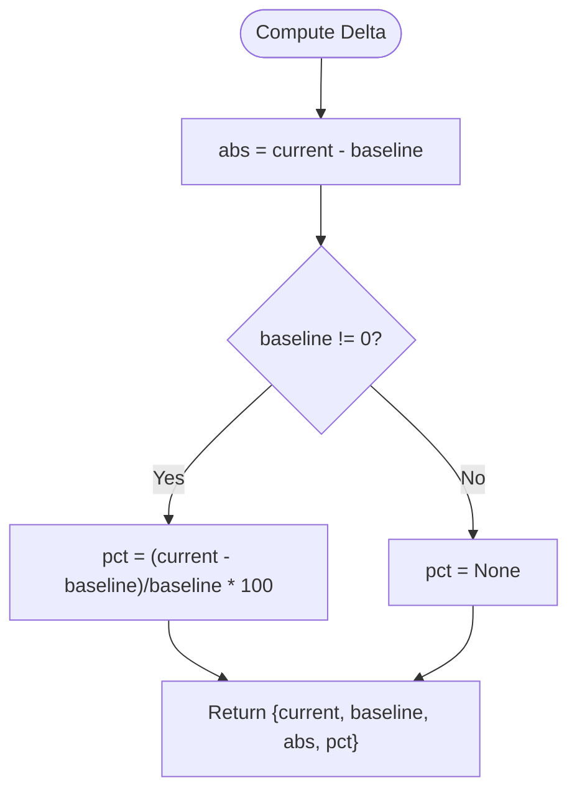
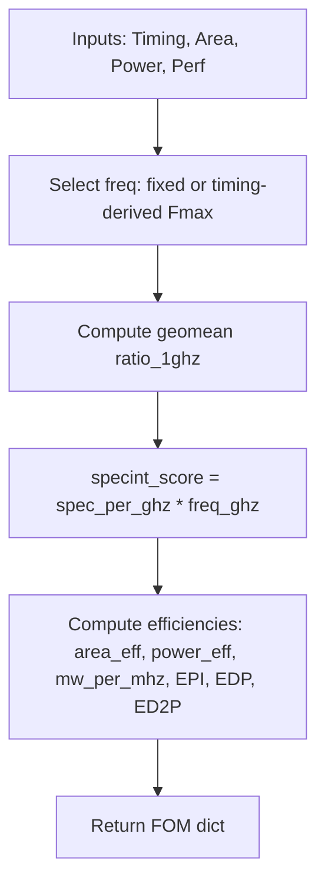
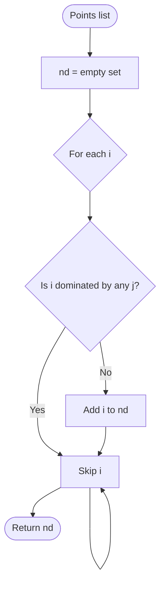
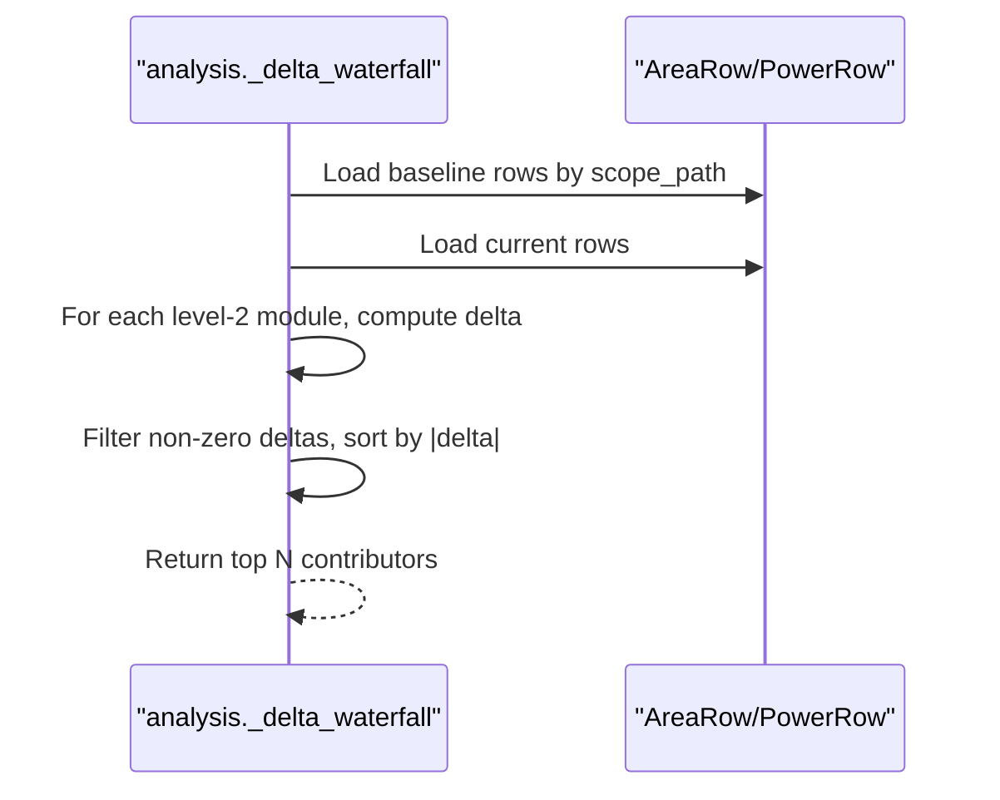
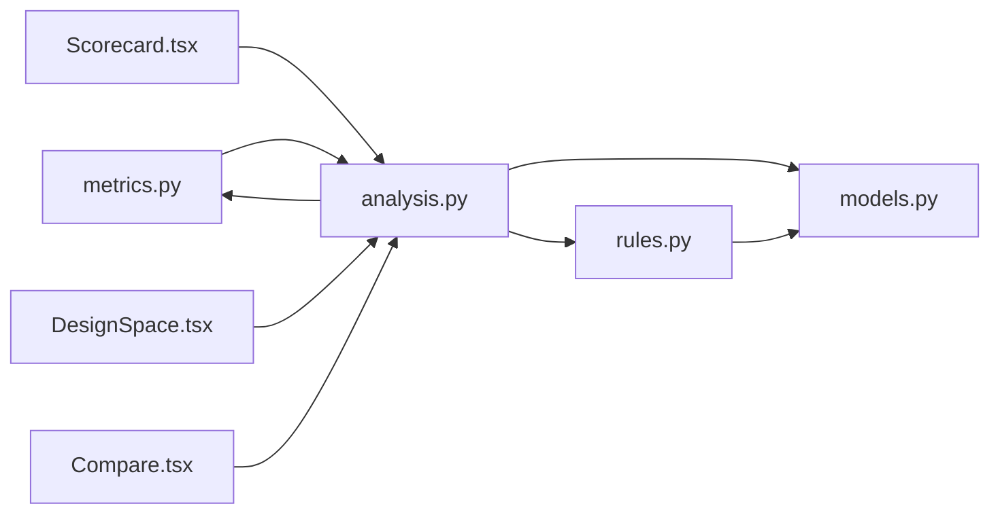

# Metrics Calculation & Scoring

<cite>
**Referenced Files in This Document**
- [metrics.py](file://backend/ppa/metrics.py)
- [analysis.py](file://backend/ppa/analysis.py)
- [models.py](file://backend/ppa/models.py)
- [rules.py](file://backend/ppa/rules.py)
- [rules_pack.yaml](file://backend/ppa/rules_pack.yaml)
- [config.py](file://backend/ppa/config.py)
- [Scorecard.tsx](file://frontend/src/views/Scorecard.tsx)
- [DesignSpace.tsx](file://frontend/src/views/DesignSpace.tsx)
- [Compare.tsx](file://frontend/src/views/Compare.tsx)
</cite>

## Table of Contents
1. [Introduction](#introduction)
2. [Project Structure](#project-structure)
3. [Core Components](#core-components)
4. [Architecture Overview](#architecture-overview)
5. [Detailed Component Analysis](#detailed-component-analysis)
6. [Dependency Analysis](#dependency-analysis)
7. [Performance Considerations](#performance-considerations)
8. [Troubleshooting Guide](#troubleshooting-guide)
9. [Conclusion](#conclusion)
10. [Appendices](#appendices)

## Introduction
This document explains the metrics calculation and scoring system that powers PPA (Power, Performance, Area) analysis. It covers:
- Delta calculations for comparing metrics between runs (absolute differences and percentage changes)
- Composite scoring algorithms that aggregate multiple metrics into Figures of Merit (FOM), including SPECint score per GHz and overall score
- Pareto front identification used in design space exploration to find optimal trade-offs
- Examples of custom metric derivations and normalization techniques
- Comparison methodologies across runs and domains
- Performance considerations for large datasets and caching strategies for expensive computations

## Project Structure
The metrics engine is implemented in the backend under ppa/metrics.py and consumed by the analysis layer in ppa/analysis.py. The data model lives in ppa/models.py, while rule-based diagnostics are defined in ppa/rules.py and configured via rules_pack.yaml. Configuration defaults are provided in ppa/config.py. Frontend views visualize FOMs, deltas, and Pareto-optimal points.

**Diagram sources**
- [metrics.py:90-187](file://backend/ppa/metrics.py#L90-L187)
- [analysis.py:139-219](file://backend/ppa/analysis.py#L139-L219)
- [rules.py:24-73](file://backend/ppa/rules.py#L24-L73)
- [models.py:83-149](file://backend/ppa/models.py#L83-L149)
- [config.py:12-30](file://backend/ppa/config.py#L12-L30)
- [Scorecard.tsx:17-59](file://frontend/src/views/Scorecard.tsx#L17-L59)
- [DesignSpace.tsx:17-96](file://frontend/src/views/DesignSpace.tsx#L17-L96)
- [Compare.tsx:27-141](file://frontend/src/views/Compare.tsx#L27-L141)

**Section sources**
- [metrics.py:1-258](file://backend/ppa/metrics.py#L1-L258)
- [analysis.py:1-439](file://backend/ppa/analysis.py#L1-L439)
- [models.py:1-217](file://backend/ppa/models.py#L1-L217)
- [rules.py:1-361](file://backend/ppa/rules.py#L1-L361)
- [rules_pack.yaml:1-119](file://backend/ppa/rules_pack.yaml#L1-L119)
- [config.py:1-31](file://backend/ppa/config.py#L1-L31)
- [Scorecard.tsx:1-124](file://frontend/src/views/Scorecard.tsx#L1-L124)
- [DesignSpace.tsx:1-119](file://frontend/src/views/DesignSpace.tsx#L1-L119)
- [Compare.tsx:1-148](file://frontend/src/views/Compare.tsx#L1-L148)

## Core Components
- Timing, Area, Power, and Performance summaries provide normalized inputs for FOM computation.
- FOM computation aggregates performance (SPECint/GHz geomean) with frequency to produce a composite score and efficiency metrics.
- Delta utilities compute absolute and percentage differences; ROI measures score gain per cost increase.
- Pareto front algorithm identifies non-dominated designs for multi-objective optimization.
- Analysis functions orchestrate comparisons, design space exploration, and domain explorers using these utilities.

Key responsibilities:
- metrics.py: Pure arithmetic for FOM, deltas, ROI, Pareto front, and summary constructors.
- analysis.py: Query/analysis layer that fetches metrics from the database and composes responses for UI views.
- models.py: Typed storage schema for metrics and hierarchical area/power/timing/performance rows.
- rules.py: Deterministic rule engine that uses precomputed facts and metrics to generate findings.
- config.py: Application settings including DB path and AI endpoints.

**Section sources**
- [metrics.py:13-87](file://backend/ppa/metrics.py#L13-L87)
- [metrics.py:90-187](file://backend/ppa/metrics.py#L90-L187)
- [metrics.py:192-258](file://backend/ppa/metrics.py#L192-L258)
- [analysis.py:29-125](file://backend/ppa/analysis.py#L29-L125)
- [analysis.py:139-219](file://backend/ppa/analysis.py#L139-L219)
- [models.py:83-149](file://backend/ppa/models.py#L83-L149)
- [rules.py:24-73](file://backend/ppa/rules.py#L24-L73)

## Architecture Overview
The architecture separates pure metric math from query logic and UI rendering:
- Data ingestion populates typed rows and a tall Metric table.
- Analysis queries run metrics and constructs FOMs and deltas.
- Frontend displays KPIs, deltas, Pareto fronts, and waterfall charts.

**Diagram sources**
- [analysis.py:139-219](file://backend/ppa/analysis.py#L139-L219)
- [metrics.py:90-187](file://backend/ppa/metrics.py#L90-L187)
- [metrics.py:239-258](file://backend/ppa/metrics.py#L239-L258)

## Detailed Component Analysis

### Delta Calculations and Comparisons
- Absolute difference and percentage change are computed consistently for any numeric pair.
- ROI quantifies score gain per unit cost increase (area or power).
- Net score decomposition attributes total score change to IPC (microarchitecture) and frequency (physical) contributions plus a cross term.

**Diagram sources**
- [metrics.py:142-148](file://backend/ppa/metrics.py#L142-L148)

**Section sources**
- [metrics.py:142-187](file://backend/ppa/metrics.py#L142-L187)
- [analysis.py:139-167](file://backend/ppa/analysis.py#L139-L167)

### FOM (Figure of Merit) Computation
- Frequency source is either fixed or derived from timing (Fmax).
- SPECint score per GHz is the geometric mean of per-benchmark ratios at 1 GHz.
- Overall score combines SPECint/GHz with frequency to reflect real-world throughput.
- Efficiency metrics include area efficiency (score per mm²), power efficiency (score per W), energy per instruction (EPI), and energy-delay products (EDP, ED2P).

**Diagram sources**
- [metrics.py:90-137](file://backend/ppa/metrics.py#L90-L137)

**Section sources**
- [metrics.py:90-137](file://backend/ppa/metrics.py#L90-L137)
- [analysis.py:69-125](file://backend/ppa/analysis.py#L69-L125)

### Pareto Front Identification
- Non-dominated points are identified based on objective directions (minimize x, maximize y by default).
- Used to highlight optimal trade-offs in design space exploration.

**Diagram sources**
- [metrics.py:239-258](file://backend/ppa/metrics.py#L239-L258)

**Section sources**
- [metrics.py:239-258](file://backend/ppa/metrics.py#L239-L258)
- [analysis.py:204-219](file://backend/ppa/analysis.py#L204-L219)

### Domain Summaries and Normalization Techniques
- AreaSummary extracts top-level area components and computes sequential ratio.
- PowerSummary aggregates internal, switching, leakage, and total power; derives shares and efficiency indicators.
- TimingSummary computes Fmax from target period and worst negative slack; aggregates groups and histograms.
- PerfSummary computes geometric mean of per-benchmark ratios and mean IPC.

Normalization examples:
- Shares: leakage_share, clock_power_share normalize component power against total.
- Efficiency: area_eff_score_per_mm2, power_eff_score_per_w normalize score by area or power.
- Energy metrics: EPI normalizes power by instruction rate; EDP/ED2P incorporate delay.

**Section sources**
- [metrics.py:13-87](file://backend/ppa/metrics.py#L13-L87)
- [metrics.py:192-234](file://backend/ppa/metrics.py#L192-L234)

### Custom Metric Calculations and Waterfalls
- Area and power waterfalls compute module-level deltas vs baseline to identify dominant contributors.
- Top-N modules are sorted by absolute delta to highlight significant changes.

**Diagram sources**
- [analysis.py:179-199](file://backend/ppa/analysis.py#L179-L199)

**Section sources**
- [analysis.py:179-199](file://backend/ppa/analysis.py#L179-L199)

### Rule-Based Diagnostics and Thresholds
- Rules define thresholds and titles; evaluators implement deterministic checks using precomputed facts.
- Cross-domain rules detect scenarios like IPC improvement but net score regression due to frequency loss.
- ROI-based rules flag low return on investment when cost increases do not yield proportional score gains.

**Section sources**
- [rules.py:84-267](file://backend/ppa/rules.py#L84-L267)
- [rules_pack.yaml:1-119](file://backend/ppa/rules_pack.yaml#L1-L119)

### Frontend Visualization of Metrics and Deltas
- Scorecard displays FOM KPIs with deltas vs baseline and budget targets.
- DesignSpace visualizes Pareto-optimal points and parallel coordinates across FOMs.
- Compare shows net score decomposition, FOM deltas, ROI, and waterfalls.

**Section sources**
- [Scorecard.tsx:17-59](file://frontend/src/views/Scorecard.tsx#L17-L59)
- [DesignSpace.tsx:17-96](file://frontend/src/views/DesignSpace.tsx#L17-L96)
- [Compare.tsx:27-141](file://frontend/src/views/Compare.tsx#L27-L141)

## Dependency Analysis
- metrics.py provides pure functions consumed by analysis.py.
- analysis.py orchestrates database queries and composes responses using metrics utilities.
- rules.py depends on models.py for typed access to metrics and rows; it also loads configuration from rules_pack.yaml.
- Frontend components depend on analysis endpoints to render visualizations.

**Diagram sources**
- [metrics.py:90-187](file://backend/ppa/metrics.py#L90-L187)
- [analysis.py:139-219](file://backend/ppa/analysis.py#L139-L219)
- [rules.py:24-73](file://backend/ppa/rules.py#L24-L73)
- [models.py:83-149](file://backend/ppa/models.py#L83-L149)

**Section sources**
- [metrics.py:90-187](file://backend/ppa/metrics.py#L90-L187)
- [analysis.py:139-219](file://backend/ppa/analysis.py#L139-L219)
- [rules.py:24-73](file://backend/ppa/rules.py#L24-L73)
- [models.py:83-149](file://backend/ppa/models.py#L83-L149)

## Performance Considerations
- Pareto front algorithm has O(n^2) complexity; consider limiting point sets or using approximate methods for very large datasets.
- Waterfall computations iterate over hierarchical rows; filtering by depth reduces work.
- Database queries load all relevant rows per run; ensure indexes exist on run_id and scope_path to speed up lookups.
- Caching strategies:
  - Cache FOM computations keyed by run_id to avoid recomputation across views.
  - Cache baseline metrics and hierarchical rows for baseline runs to accelerate comparisons.
  - Memoize Pareto front results per (x_metric, y_metric) pair if frequently re-evaluated.
- Avoid redundant SQL calls by batching metric retrieval and constructing lookup dictionaries once per request.

[No sources needed since this section provides general guidance]

## Troubleshooting Guide
Common issues and mitigations:
- Missing reports trigger data quality findings; ensure all required report types are ingested.
- Negative WNS indicates setup violations; investigate critical paths and module dominance.
- High leakage share or clock power share suggests opportunities for optimization.
- Low ROI flags indicate cost increases without proportional score gains; review area/power deltas.
- Parse warnings or errors in raw reports can affect metric accuracy; inspect parse logs.

**Section sources**
- [rules.py:269-287](file://backend/ppa/rules.py#L269-L287)
- [rules_pack.yaml:110-119](file://backend/ppa/rules_pack.yaml#L110-L119)

## Conclusion
The metrics calculation system provides robust, transparent FOM computation, consistent delta analysis, and Pareto-based design space exploration. Its modular structure separates pure math from query logic and enables clear visualization and diagnosis. By leveraging normalization techniques, ROI metrics, and rule-based diagnostics, designers can efficiently evaluate trade-offs and prioritize improvements.

[No sources needed since this section summarizes without analyzing specific files]

## Appendices

### Example: Custom Metric Derivations
- EPI (energy per instruction): Derived from total power and instruction rate based on IPC and frequency.
- EDP/ED2P: Combine energy and delay to assess energy-time trade-offs.
- Efficiency scores: Normalize score by area or power to compare designs independent of scale.

**Section sources**
- [metrics.py:90-137](file://backend/ppa/metrics.py#L90-L137)

### Example: Comparison Methodologies
- FOM delta table includes absolute and percentage changes for all numeric metrics.
- ROI compares score gain relative to cost increases (area or power).
- Net score decomposition attributes changes to IPC and frequency contributions.

**Section sources**
- [metrics.py:142-187](file://backend/ppa/metrics.py#L142-L187)
- [analysis.py:139-167](file://backend/ppa/analysis.py#L139-L167)