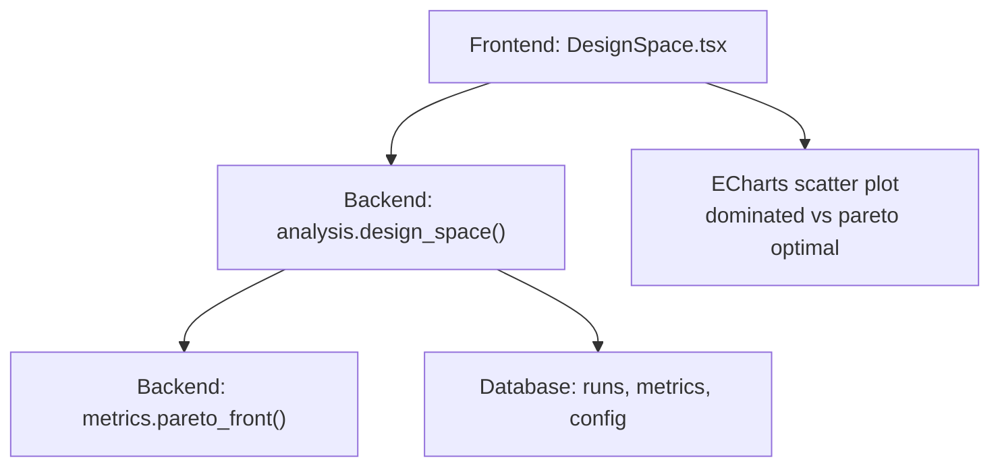
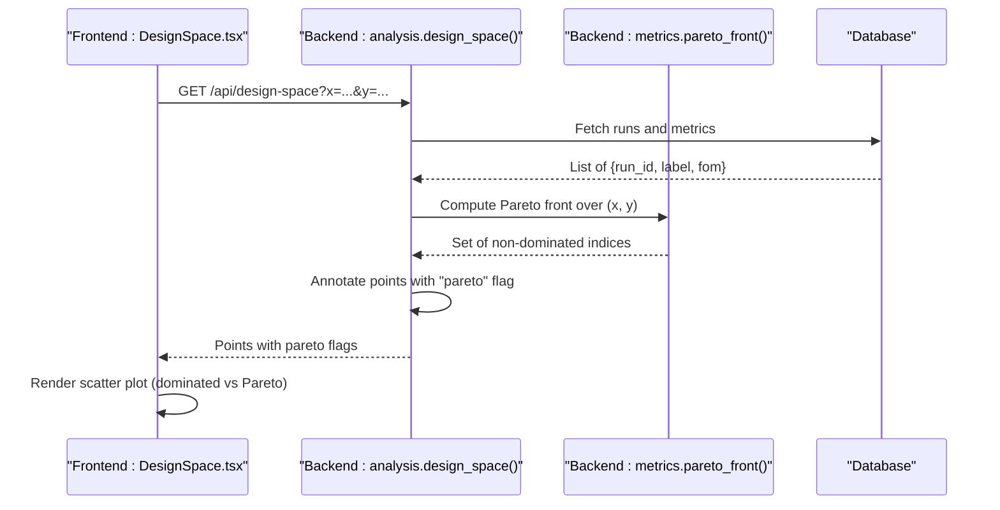
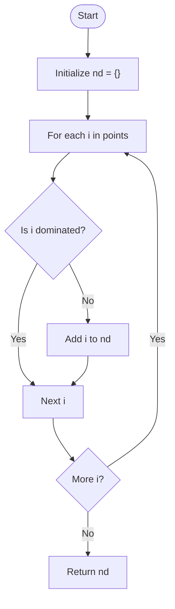
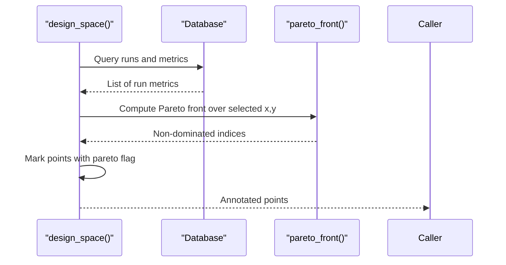
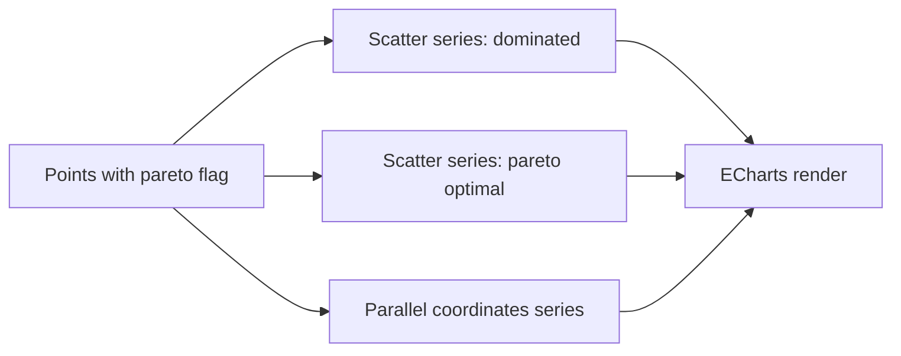
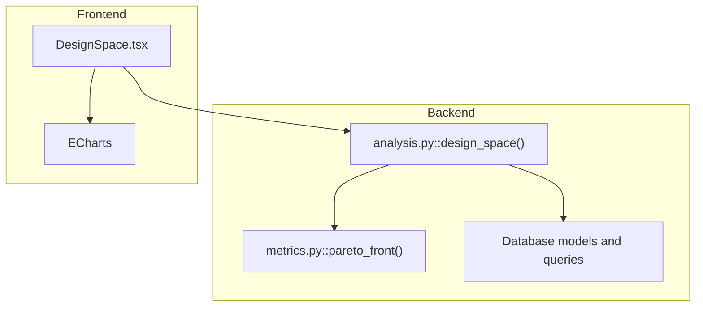

# Pareto Front Identification

<cite>
**Referenced Files in This Document**
- [metrics.py](file://backend/ppa/metrics.py)
- [analysis.py](file://backend/ppa/analysis.py)
- [test_backend.py](file://backend/tests/test_backend.py)
- [DesignSpace.tsx](file://frontend/src/views/DesignSpace.tsx)
</cite>

## Table of Contents
1. [Introduction](#introduction)
2. [Project Structure](#project-structure)
3. [Core Components](#core-components)
4. [Architecture Overview](#architecture-overview)
5. [Detailed Component Analysis](#detailed-component-analysis)
6. [Dependency Analysis](#dependency-analysis)
7. [Performance Considerations](#performance-considerations)
8. [Troubleshooting Guide](#troubleshooting-guide)
9. [Conclusion](#conclusion)
10. [Appendices](#appendices)

## Introduction
This document explains the Pareto front identification algorithm used for multi-objective optimization in design space exploration. It focuses on the pareto_front() function that identifies non-dominated solutions across two objectives, supporting both minimization and maximization directions. The documentation covers dominance criteria, trade-off handling (e.g., power vs performance), practical usage examples, computational complexity, and potential optimizations for large design spaces.

## Project Structure
The Pareto analysis is implemented in the backend metrics module and integrated into the design space explorer view. The frontend visualizes both dominated and non-dominated points and supports interactive selection.

**Diagram sources**
- [DesignSpace.tsx:17-101](file://frontend/src/views/DesignSpace.tsx#L17-L101)
- [analysis.py:204-219](file://backend/ppa/analysis.py#L204-L219)
- [metrics.py:239-257](file://backend/ppa/metrics.py#L239-L257)

**Section sources**
- [metrics.py:239-257](file://backend/ppa/metrics.py#L239-L257)
- [analysis.py:204-219](file://backend/ppa/analysis.py#L204-L219)
- [DesignSpace.tsx:17-101](file://frontend/src/views/DesignSpace.tsx#L17-L101)

## Core Components
- Pareto front computation:
  - Function: pareto_front(points, x, y, x_max=False, y_max=True)
  - Purpose: Returns indices of non-dominated points given two objective dimensions with configurable optimization direction.
  - Default behavior: minimize x (e.g., power), maximize y (e.g., performance score).
- Design space integration:
  - Function: design_space(session, x="total_power_mw", y="specint_score")
  - Purpose: Builds a set of candidate designs from database metrics and computes Pareto optimality to annotate each point as dominated or non-dominated.
- Frontend visualization:
  - Component: DesignSpace.tsx
  - Purpose: Renders scatter plots distinguishing dominated vs Pareto-optimal points and provides parallel coordinates for multi-metric comparison.

**Section sources**
- [metrics.py:239-257](file://backend/ppa/metrics.py#L239-L257)
- [analysis.py:204-219](file://backend/ppa/analysis.py#L204-L219)
- [DesignSpace.tsx:17-101](file://frontend/src/views/DesignSpace.tsx#L17-L101)

## Architecture Overview
The end-to-end flow for Pareto-based design space exploration:

**Diagram sources**
- [analysis.py:204-219](file://backend/ppa/analysis.py#L204-L219)
- [metrics.py:239-257](file://backend/ppa/metrics.py#L239-L257)
- [DesignSpace.tsx:21-24](file://frontend/src/views/DesignSpace.tsx#L21-L24)

## Detailed Component Analysis

### Pareto Front Algorithm
- Input:
  - points: list of dicts with keys x and y representing objective values.
  - x, y: names of objective fields to compare.
  - x_max, y_max: boolean flags indicating whether to maximize (True) or minimize (False) each objective. Defaults are minimize x, maximize y.
- Dominance criteria:
  - Point q dominates point p if q is at least as good as p in both objectives and strictly better in at least one.
  - Equality tolerance: differences below a small threshold are treated as equal to avoid floating-point noise.
- Output:
  - A set of indices corresponding to non-dominated points.

**Diagram sources**
- [metrics.py:239-257](file://backend/ppa/metrics.py#L239-L257)

**Section sources**
- [metrics.py:239-257](file://backend/ppa/metrics.py#L239-L257)

### Design Space Integration
- Data collection:
  - Iterates over runs within a project scope, extracts figures-of-merit metrics, and constructs points with x and y values based on user-selected metrics.
- Pareto annotation:
  - Calls pareto_front() with configured directions (minimize x, maximize y by default) and marks each point with a boolean pareto flag.
- Output structure:
  - Returns metric names and annotated points suitable for visualization.

**Diagram sources**
- [analysis.py:204-219](file://backend/ppa/analysis.py#L204-L219)
- [metrics.py:239-257](file://backend/ppa/metrics.py#L239-L257)

**Section sources**
- [analysis.py:204-219](file://backend/ppa/analysis.py#L204-L219)

### Frontend Visualization
- Scatter plot:
  - Displays all points; highlights Pareto-optimal points distinctly from dominated ones.
  - Tooltips show metric values for each point.
- Interaction:
  - Clicking a point selects the run and adds it to the comparison tray for deeper analysis.
- Parallel coordinates:
  - Visualizes all figures of merit simultaneously to understand multi-dimensional trade-offs.

**Diagram sources**
- [DesignSpace.tsx:30-75](file://frontend/src/views/DesignSpace.tsx#L30-L75)

**Section sources**
- [DesignSpace.tsx:17-101](file://frontend/src/views/DesignSpace.tsx#L17-L101)

## Dependency Analysis
- Backend dependencies:
  - analysis.design_space() depends on metrics.pareto_front() and database queries for runs and metrics.
- Frontend dependencies:
  - DesignSpace.tsx consumes the backend API response and renders charts using ECharts.

**Diagram sources**
- [analysis.py:204-219](file://backend/ppa/analysis.py#L204-L219)
- [metrics.py:239-257](file://backend/ppa/metrics.py#L239-L257)
- [DesignSpace.tsx:17-101](file://frontend/src/views/DesignSpace.tsx#L17-L101)

**Section sources**
- [analysis.py:204-219](file://backend/ppa/analysis.py#L204-L219)
- [metrics.py:239-257](file://backend/ppa/metrics.py#L239-L257)
- [DesignSpace.tsx:17-101](file://frontend/src/views/DesignSpace.tsx#L17-L101)

## Performance Considerations
- Time complexity:
  - The current implementation uses pairwise comparisons between all points, resulting in O(N^2) time where N is the number of candidate solutions.
- Space complexity:
  - O(N) to store the result set of non-dominated indices.
- Practical implications:
  - For small to moderate design spaces (hundreds to low thousands of points), O(N^2) is acceptable.
  - For very large design spaces, consider:
    - Sorting-based algorithms (e.g., divide-and-conquer or sweep-line approaches) to reduce complexity toward O(N log N) for 2D Pareto fronts.
    - Early pruning strategies: maintain a current frontier and only compare new candidates against it.
    - Vectorized operations or parallel processing to speed up comparisons.
    - Approximate methods or sampling when exhaustive analysis is too costly.
- Numerical stability:
  - Equality checks use a small epsilon to handle floating-point precision issues.

[No sources needed since this section provides general guidance]

## Troubleshooting Guide
- Unexpected Pareto results:
  - Verify objective directions: ensure x_max and y_max match your optimization goals (e.g., minimize power, maximize performance).
  - Check metric values for outliers or missing data that could skew dominance decisions.
- Visualization mismatches:
  - Confirm that the frontend correctly maps backend “pareto” flags to chart series.
  - Use tooltips to inspect exact x and y values for specific points.
- Validation via tests:
  - Unit tests assert expected Pareto sets for sample inputs, helping validate correctness.

**Section sources**
- [test_backend.py:91-94](file://backend/tests/test_backend.py#L91-L94)

## Conclusion
The Pareto front identification in this codebase provides a clear, configurable mechanism to identify non-dominated solutions across two objectives, enabling effective design space exploration. The integration with the design space explorer allows users to visualize trade-offs (e.g., power vs performance) and interactively select promising designs. While the current O(N^2) approach is simple and robust, scaling to very large design spaces may benefit from advanced algorithms and optimizations.

[No sources needed since this section summarizes without analyzing specific files]

## Appendices

### Practical Examples
- Power vs Performance trade-off:
  - Use x = total_power_mw (minimize) and y = specint_score (maximize) to find configurations that offer the best performance per unit power.
- Area vs Performance trade-off:
  - Use x = area_mm2 (minimize) and y = specint_score (maximize) to identify compact designs with high performance.
- Energy Efficiency:
  - Use x = epi_pj (minimize) and y = specint_score (maximize) to find energy-efficient high-performance designs.

[No sources needed since this section provides general guidance]