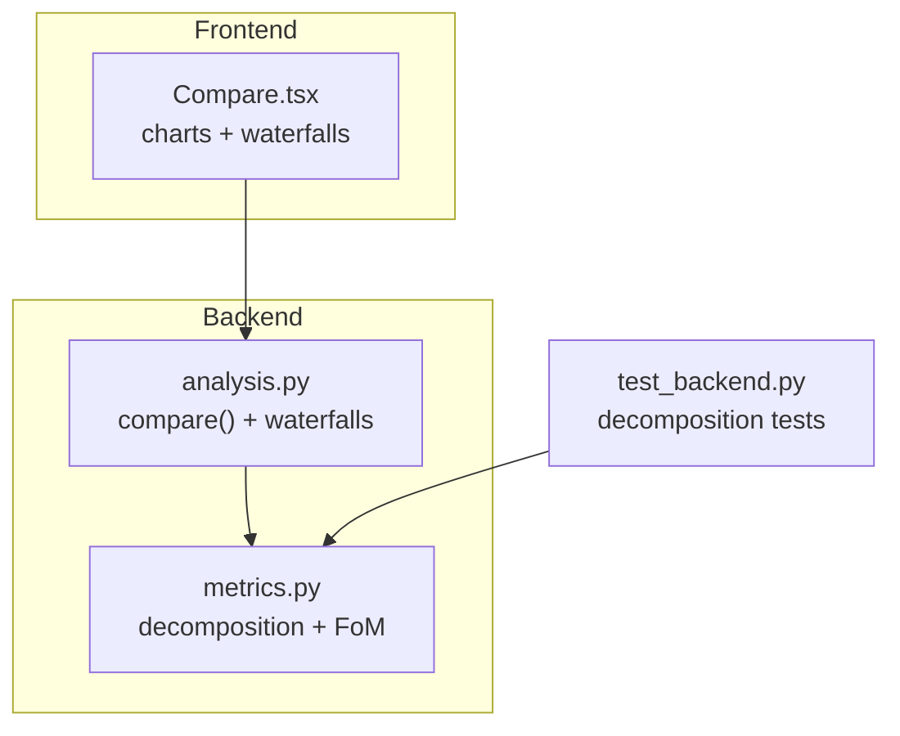
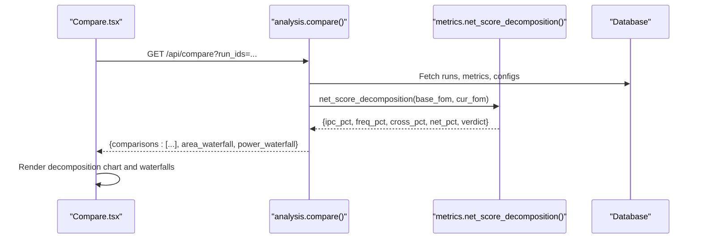
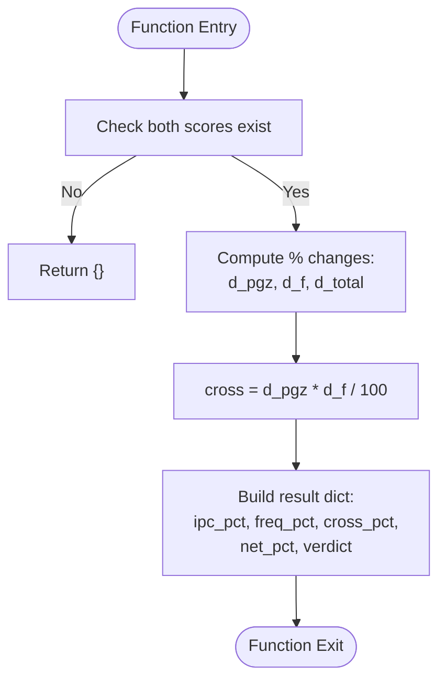
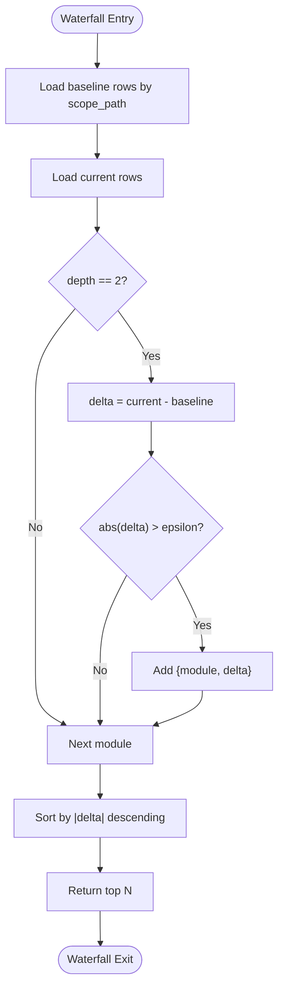
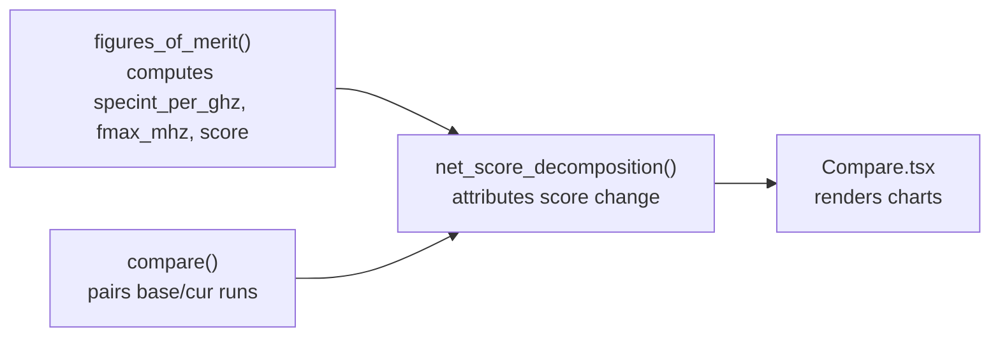

# Score Decomposition Analysis

<cite>
**Referenced Files in This Document**
- [metrics.py](file://backend/ppa/metrics.py)
- [analysis.py](file://backend/ppa/analysis.py)
- [Compare.tsx](file://frontend/src/views/Compare.tsx)
- [test_backend.py](file://backend/tests/test_backend.py)
</cite>

## Table of Contents
1. [Introduction](#introduction)
2. [Project Structure](#project-structure)
3. [Core Components](#core-components)
4. [Architecture Overview](#architecture-overview)
5. [Detailed Component Analysis](#detailed-component-analysis)
6. [Dependency Analysis](#dependency-analysis)
7. [Performance Considerations](#performance-considerations)
8. [Troubleshooting Guide](#troubleshooting-guide)
9. [Conclusion](#conclusion)

## Introduction
This document explains the net score decomposition system used to attribute performance changes between two design runs. It focuses on how the system breaks down the change in SPECint score into:
- Microarchitecture contribution (IPC or per-GHz performance)
- Physical implementation contribution (frequency, Fmax)
- Cross-term interaction between IPC and frequency

It also documents the waterfall analysis methodology that complements the decomposition by showing where area and power deltas come from at module granularity, enabling designers to understand whether gains are due to microarchitecture improvements or physical implementation changes.

## Project Structure
The decomposition logic is implemented in the backend metrics engine and consumed by the comparison view in the frontend. The key files are:
- Backend metrics engine: computes figures of merit and performs decomposition
- Backend analysis layer: orchestrates comparisons and builds waterfalls for area/power
- Frontend Compare view: visualizes decomposition and waterfalls
- Tests: validate decomposition behavior with synthetic inputs

**Diagram sources**
- [metrics.py:158-175](file://backend/ppa/metrics.py#L158-L175)
- [analysis.py:139-167](file://backend/ppa/analysis.py#L139-L167)
- [Compare.tsx:85-103](file://frontend/src/views/Compare.tsx#L85-L103)
- [test_backend.py:82-88](file://backend/tests/test_backend.py#L82-L88)

**Section sources**
- [metrics.py:1-175](file://backend/ppa/metrics.py#L1-L175)
- [analysis.py:139-200](file://backend/ppa/analysis.py#L139-L200)
- [Compare.tsx:1-148](file://frontend/src/views/Compare.tsx#L1-L148)
- [test_backend.py:82-88](file://backend/tests/test_backend.py#L82-L88)

## Core Components
- Net score decomposition function: attributes total score change to IPC, frequency, and their cross-term
- Figures of merit computation: derives specint_per_ghz, fmax_mhz, and specint_score
- Comparison orchestration: pairs base and current runs, computes deltas and decomposition
- Waterfall analysis: aggregates module-level area and power deltas to explain cost changes

Key responsibilities:
- metrics.py: pure arithmetic for decomposition and derived metrics
- analysis.py: query layer that assembles comparison results including decomposition and waterfalls
- Compare.tsx: renders decomposition chart and waterfalls for user interpretation

**Section sources**
- [metrics.py:158-175](file://backend/ppa/metrics.py#L158-L175)
- [analysis.py:139-167](file://backend/ppa/analysis.py#L139-L167)
- [Compare.tsx:85-103](file://frontend/src/views/Compare.tsx#L85-L103)

## Architecture Overview
The decomposition pipeline connects backend metrics to frontend visualization:

**Diagram sources**
- [analysis.py:139-167](file://backend/ppa/analysis.py#L139-L167)
- [metrics.py:158-175](file://backend/ppa/metrics.py#L158-L175)
- [Compare.tsx:85-103](file://frontend/src/views/Compare.tsx#L85-L103)

## Detailed Component Analysis

### Net Score Decomposition Function
The decomposition function implements a first-order attribution model based on the identity:
- Score = (SPECint per GHz) × Frequency (GHz)

It computes percentage changes for each factor and isolates the cross-term interaction:
- dScore% ≈ dPerGHz% + dFreq% + (dPerGHz% × dFreq%)
- Returns ipc_pct, freq_pct, cross_pct, net_pct, and a verdict label

Inputs:
- base: dict with specint_score, specint_per_ghz, fmax_mhz
- cur: dict with same keys for the current run

Outputs:
- ipc_pct: percentage change attributed to microarchitecture (per-GHz performance)
- freq_pct: percentage change attributed to physical implementation (frequency)
- cross_pct: interaction term capturing joint effect of IPC and frequency changes
- net_pct: overall percentage change in score
- verdict: win/loss/flat based on net_pct sign

Behavior:
- If either baseline or current score is missing, returns empty result
- Uses relative percentage differences to normalize contributions
- Provides a human-readable verdict for quick assessment

**Diagram sources**
- [metrics.py:158-175](file://backend/ppa/metrics.py#L158-L175)

**Section sources**
- [metrics.py:158-175](file://backend/ppa/metrics.py#L158-L175)

### Waterfall Analysis Methodology
Waterfall analysis identifies which modules contribute most to area or power deltas between baseline and current runs. It operates at level-2 module granularity to avoid double-counting and highlights top contributors by absolute delta magnitude.

Process:
- Load hierarchical area/power rows for both runs
- Filter to depth-2 modules (module-level breakdown)
- Compute delta per module (current minus baseline)
- Sort by absolute delta and return top N contributors

Output:
- List of {module, delta} entries sorted by impact
- Used to visualize where area or power increased/decreased

**Diagram sources**
- [analysis.py:179-199](file://backend/ppa/analysis.py#L179-L199)

**Section sources**
- [analysis.py:179-199](file://backend/ppa/analysis.py#L179-L199)

### Frontend Visualization
The Compare view renders:
- A bar chart showing freq%, ipc%, and net% for quick attribution
- A table of figure-of-merit deltas with ROI indicators
- Waterfall charts for area and power deltas by module

Interpretation aids:
- Color coding: positive vs negative contributions
- Verdict badge: win/loss/flat based on net%
- Warning message when IPC improves but net score regresses due to frequency loss

**Section sources**
- [Compare.tsx:85-103](file://frontend/src/views/Compare.tsx#L85-L103)
- [Compare.tsx:138-141](file://frontend/src/views/Compare.tsx#L138-L141)

### Mathematical Foundation and Interpretation
The decomposition relies on the multiplicative relationship:
- Score = PerGHz × Freq(GHz)

For small changes, the percentage change can be approximated as:
- ΔScore% ≈ ΔPerGHz% + ΔFreq% + (ΔPerGHz% × ΔFreq%)

Where:
- ΔPerGHz% captures microarchitecture efficiency changes (e.g., better instruction scheduling, reduced cache misses)
- ΔFreq% captures physical implementation changes (e.g., improved timing closure, lower latency paths)
- Cross-term captures joint effects when both factors change simultaneously

Limitations:
- Assumes separability of microarchitecture and physical effects
- Approximation quality depends on magnitude of changes; large changes increase cross-term significance
- Does not account for higher-order interactions beyond pairwise product
- Requires consistent frequency source (timing-derived or fixed) across runs

Examples for interpretation:
- IPC up, freq down, net down: microarchitecture gain outweighed by frequency loss
- IPC flat, freq up, net up: physical implementation improvement driving gains
- Both up, net up: strong combined improvement
- Both down, net down: coordinated degradation

**Section sources**
- [metrics.py:158-175](file://backend/ppa/metrics.py#L158-L175)
- [test_backend.py:82-88](file://backend/tests/test_backend.py#L82-L88)

## Dependency Analysis
The decomposition depends on correctly computed figures of merit and consistent data structures across runs.

**Diagram sources**
- [metrics.py:90-137](file://backend/ppa/metrics.py#L90-L137)
- [metrics.py:158-175](file://backend/ppa/metrics.py#L158-L175)
- [analysis.py:139-167](file://backend/ppa/analysis.py#L139-L167)
- [Compare.tsx:85-103](file://frontend/src/views/Compare.tsx#L85-L103)

**Section sources**
- [metrics.py:90-175](file://backend/ppa/metrics.py#L90-L175)
- [analysis.py:139-167](file://backend/ppa/analysis.py#L139-L167)
- [Compare.tsx:85-103](file://frontend/src/views/Compare.tsx#L85-L103)

## Performance Considerations
- Decomposition is O(1) per comparison pair; negligible computational overhead
- Waterfall analysis scales with number of modules; filtering to depth-2 reduces complexity
- Percentage-based attribution avoids scaling issues across different magnitude designs
- Cross-term calculation remains constant regardless of input size

[No sources needed since this section provides general guidance]

## Troubleshooting Guide
Common issues and resolutions:
- Missing scores: If baseline or current score is absent, decomposition returns empty; ensure both runs have valid SPECint scores
- Zero denominator: Frequency or per-GHz values must be non-zero for percentage calculations; check timing derivation or fixed frequency settings
- Unexpected verdicts: Verify frequency source consistency; mixed timing-derived and fixed frequencies can distort attribution
- Large cross-terms: When both IPC and frequency change significantly, cross-term dominates; interpret cautiously and consider magnitude of individual terms

Validation via tests:
- Synthetic test case verifies IPC improvement with net regression scenario
- Assertions confirm correct sign of components and verdict labeling

**Section sources**
- [metrics.py:158-175](file://backend/ppa/metrics.py#L158-L175)
- [test_backend.py:82-88](file://backend/tests/test_backend.py#L82-L88)

## Conclusion
The net score decomposition system provides a clear, mathematically grounded method to attribute performance changes to microarchitecture and physical implementation factors. Combined with waterfall analysis, it enables designers to distinguish between architectural improvements and implementation optimizations, supporting informed decision-making during design exploration. The system’s simplicity ensures interpretability while capturing essential interaction effects through the cross-term component.

[No sources needed since this section summarizes without analyzing specific files]