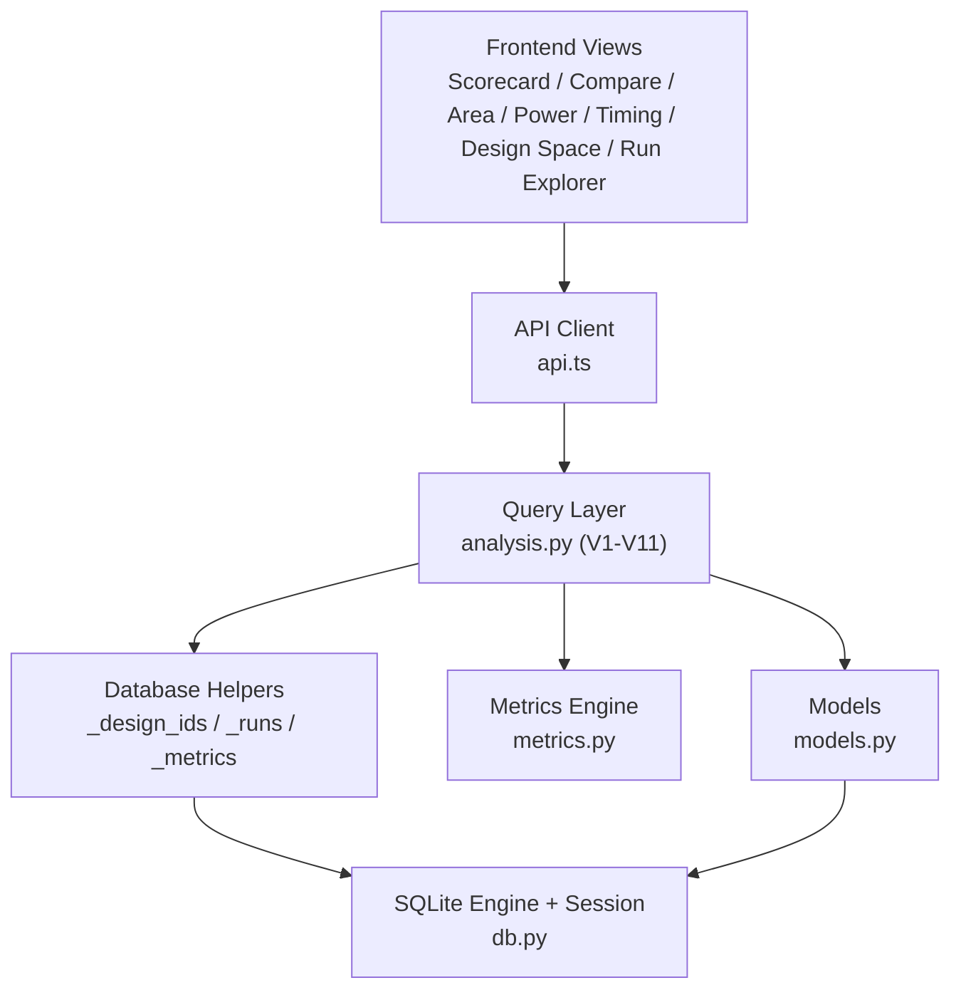
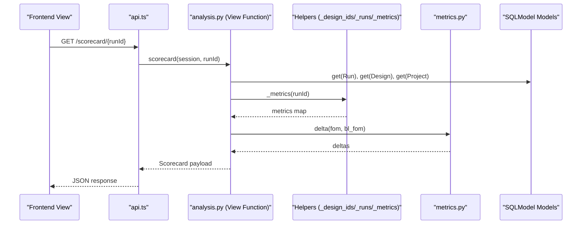
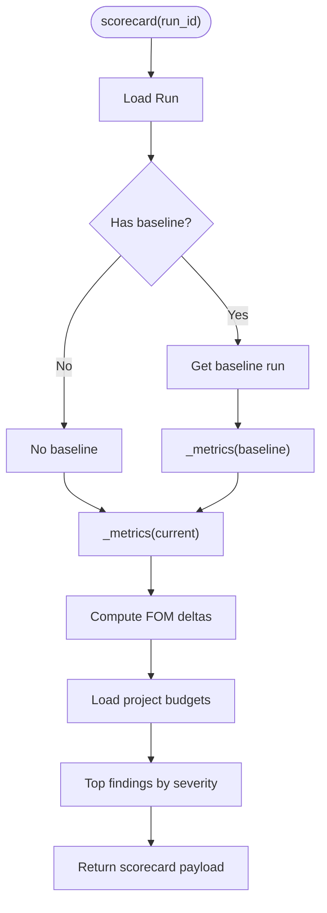
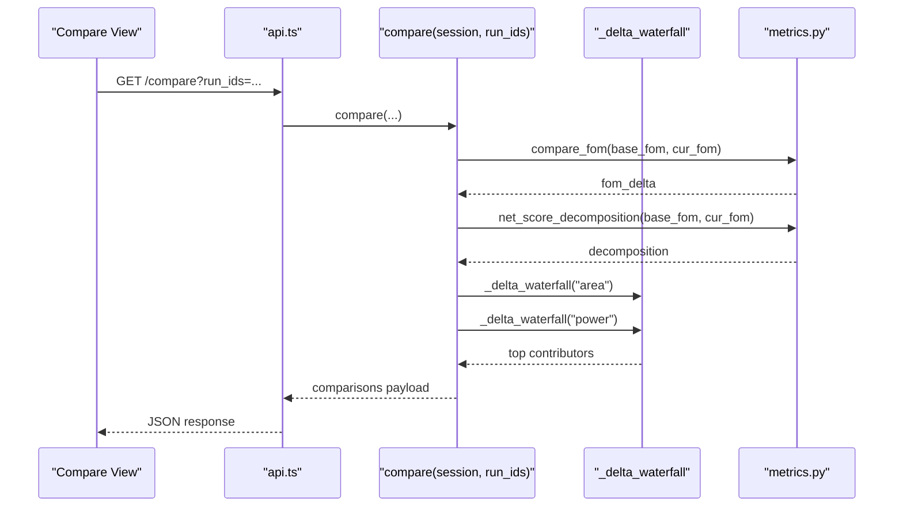
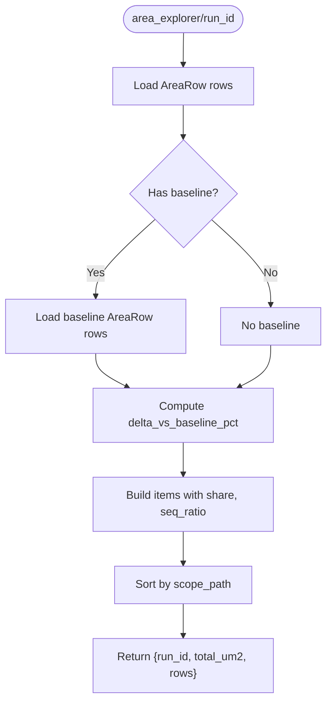
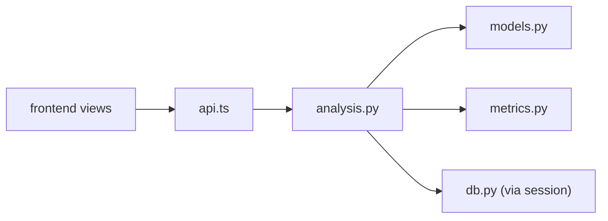

# Query Layer & View Functions

<cite>
**Referenced Files in This Document**
- [analysis.py](file://backend/ppa/analysis.py)
- [db.py](file://backend/ppa/db.py)
- [models.py](file://backend/ppa/models.py)
- [metrics.py](file://backend/ppa/metrics.py)
- [api.ts](file://frontend/src/api.ts)
- [Scorecard.tsx](file://frontend/src/views/Scorecard.tsx)
- [Compare.tsx](file://frontend/src/views/Compare.tsx)
- [AreaExplorer.tsx](file://frontend/src/views/AreaExplorer.tsx)
- [PowerExplorer.tsx](file://frontend/src/views/PowerExplorer.tsx)
- [TimingExplorer.tsx](file://frontend/src/views/TimingExplorer.tsx)
- [DesignSpace.tsx](file://frontend/src/views/DesignSpace.tsx)
- [RunExplorer.tsx](file://frontend/src/views/RunExplorer.tsx)
</cite>

## Table of Contents
1. [Introduction](#introduction)
2. [Project Structure](#project-structure)
3. [Core Components](#core-components)
4. [Architecture Overview](#architecture-overview)
5. [Detailed Component Analysis](#detailed-component-analysis)
6. [Dependency Analysis](#dependency-analysis)
7. [Performance Considerations](#performance-considerations)
8. [Troubleshooting Guide](#troubleshooting-guide)
9. [Conclusion](#conclusion)

## Introduction
This document explains PPA-Profiler’s query layer architecture that powers the frontend views with deterministic, computed data from the database. The backend exposes one dedicated function per view (V1–V11) in analysis.py. These functions:
- Read raw records via SQLModel queries
- Compute derived metrics and deltas using a centralized metrics engine
- Return stable, frontend-ready structures for each view
- Provide a deterministic data source for AI tools by avoiding ad-hoc SQL in the LLM layer

The design separates concerns:
- models.py defines the schema
- db.py manages the SQLite engine and sessions
- metrics.py computes figures of merit, deltas, Pareto frontiers, and decompositions
- analysis.py implements view functions that orchestrate data retrieval and transformation
- frontend views call typed API endpoints and render results

## Project Structure
At a high level:
- Frontend views request data through api.ts endpoints
- Backend analysis.py provides view functions that read from the database and compute outputs
- Database access is abstracted via helper functions and SQLModel models
- Metrics are computed centrally to ensure consistency across views

**Diagram sources**
- [analysis.py:16-31](file://backend/ppa/analysis.py#L16-L31)
- [db.py:13-49](file://backend/ppa/db.py#L13-L49)
- [metrics.py:90-187](file://backend/ppa/metrics.py#L90-L187)
- [api.ts:23-41](file://frontend/src/api.ts#L23-L41)

**Section sources**
- [analysis.py:1-439](file://backend/ppa/analysis.py#L1-L439)
- [db.py:1-50](file://backend/ppa/db.py#L1-L50)
- [models.py:1-217](file://backend/ppa/models.py#L1-L217)
- [metrics.py:1-258](file://backend/ppa/metrics.py#L1-L258)
- [api.ts:1-49](file://frontend/src/api.ts#L1-L49)

## Core Components
- Helper abstractions for database access:
  - _design_ids: returns design IDs optionally filtered by project
  - _runs: returns runs belonging to designs, optionally filtered by project
  - _metrics: returns key-value metrics for a run
- Baseline resolution:
  - baseline_run: resolves baseline run via project facts or explicit baseline_id
- View functions (V1–V11):
  - V1 list_runs: enumerates runs with FOMs, timing, and open findings
  - V2 scorecard: aggregates domains, budgets, deltas vs baseline, top findings
  - V3 compare: compares multiple runs with FOM deltas, config diffs, area/power waterfalls
  - V4 design_space: scatter plot points with Pareto frontier
  - V5/V6 area_explorer and power_explorer: hierarchical breakdowns with deltas and densities
  - V7 timing_explorer: slack histograms, path groups, critical module leaderboard
  - V8 perf_explorer: benchmark-level performance with geomean ratios and deltas
  - V9 hotspot: cross-domain hotspots combining area, power, and criticality
  - V10 findings: filterable findings list with severity ordering
  - V11 ingest_status: ingestion status for raw reports

**Section sources**
- [analysis.py:16-439](file://backend/ppa/analysis.py#L16-L439)
- [metrics.py:90-187](file://backend/ppa/metrics.py#L90-L187)

## Architecture Overview
The query layer enforces deterministic computation:
- All metric math lives in metrics.py; view functions only orchestrate data retrieval and formatting
- Baseline comparisons use consistent delta calculations and ROI metrics
- Data transformations convert raw rows into structured objects with share, delta, and aggregation fields
- Error handling is minimal at the query layer; missing data is handled gracefully with defaults or empty structures

**Diagram sources**
- [api.ts:23-41](file://frontend/src/api.ts#L23-L41)
- [analysis.py:69-125](file://backend/ppa/analysis.py#L69-L125)
- [metrics.py:142-187](file://backend/ppa/metrics.py#L142-L187)

## Detailed Component Analysis

### V1: list_runs
- Purpose: Enumerate runs with FOMs, timing summary, and open findings count
- Data flow:
  - Fetches runs via _runs(project_id optional)
  - For each run, loads metrics via _metrics and related Config/Corner
  - Counts open findings for the run
- Output structure includes run metadata, FOM subset, timing WNS/TNS/NVE, and open findings count

**Section sources**
- [analysis.py:46-64](file://backend/ppa/analysis.py#L46-L64)
- [models.py:55-67](file://backend/ppa/models.py#L55-L67)

### V2: scorecard
- Purpose: Aggregate domains (timing, area, power, performance), budgets, and deltas vs baseline
- Baseline comparison:
  - Resolves baseline via baseline_run
  - Computes deltas for FOMs using metrics.delta
- Budgets:
  - Uses project settings to show area_mm2 budget, power_mw budget, and target fmax_mhz
- Findings:
  - Returns top findings ordered by severity

**Diagram sources**
- [analysis.py:69-125](file://backend/ppa/analysis.py#L69-L125)
- [metrics.py:142-187](file://backend/ppa/metrics.py#L142-L187)

**Section sources**
- [analysis.py:69-125](file://backend/ppa/analysis.py#L69-L125)
- [metrics.py:142-187](file://backend/ppa/metrics.py#L142-L187)

### V3: compare
- Purpose: Compare multiple runs with FOM deltas, configuration differences, and area/power waterfalls
- Key logic:
  - First run acts as base; subsequent runs compared against it
  - FOM deltas via metrics.compare_fom
  - Net score decomposition via metrics.net_score_decomposition
  - Configuration diff via _config_diff
  - Waterfall contributions via _delta_waterfall for area and power at module granularity

**Diagram sources**
- [analysis.py:139-199](file://backend/ppa/analysis.py#L139-L199)
- [metrics.py:178-187](file://backend/ppa/metrics.py#L178-L187)

**Section sources**
- [analysis.py:139-199](file://backend/ppa/analysis.py#L139-L199)
- [metrics.py:178-187](file://backend/ppa/metrics.py#L178-L187)

### V4: design_space
- Purpose: Scatter plot of runs with Pareto frontier calculation
- Logic:
  - Collects points with x/y FOM values
  - Computes Pareto indices via metrics.pareto_front
  - Marks points on the frontier

**Section sources**
- [analysis.py:204-219](file://backend/ppa/analysis.py#L204-L219)
- [metrics.py:239-258](file://backend/ppa/metrics.py#L239-L258)

### V5/V6: area_explorer and power_explorer
- Purpose: Hierarchical breakdowns of area and power with deltas and densities
- Area explorer:
  - Loads AreaRow hierarchy
  - Computes share, delta_vs_baseline_pct, seq_ratio
  - Aggregates total area at minimum depth
- Power explorer:
  - Loads PowerRow hierarchy
  - Joins with AreaRow for power density
  - Computes share, delta_vs_baseline_pct, leakage_share
  - Includes clock gating efficiency and toggle rate from metrics

**Diagram sources**
- [analysis.py:224-244](file://backend/ppa/analysis.py#L224-L244)

**Section sources**
- [analysis.py:224-274](file://backend/ppa/analysis.py#L224-L274)

### V7: timing_explorer
- Purpose: Timing analysis with slack histogram, path group summaries, and critical module leaderboard
- Logic:
  - Filters setup paths (non-hold)
  - Groups by path_group and computes WNS, TNS, NVE
  - Builds coarse histogram from path slacks
  - Counts top modules by critical path occurrences

**Section sources**
- [analysis.py:279-326](file://backend/ppa/analysis.py#L279-L326)

### V8: perf_explorer
- Purpose: Benchmark-level performance with geomean ratio and deltas
- Logic:
  - Loads PerfRow entries
  - Compares IPC and other metrics against baseline if provided
  - Computes geomean_ratio_1ghz and delta percentage

**Section sources**
- [analysis.py:331-356](file://backend/ppa/analysis.py#L331-L356)

### V9: hotspot
- Purpose: Cross-domain hotspots combining area, power, and criticality
- Logic:
  - Combines area and power hierarchies
  - Computes area/power shares and power density
  - Derives criticality from top timing paths
  - Calculates deltas vs baseline where available

**Section sources**
- [analysis.py:361-398](file://backend/ppa/analysis.py#L361-L398)

### V10: findings
- Purpose: Filterable and ordered findings list
- Logic:
  - Applies filters for run_id, severity, category, status
  - Enriches with run label
  - Orders by severity priority and category

**Section sources**
- [analysis.py:403-423](file://backend/ppa/analysis.py#L403-L423)

### V11: ingest_status
- Purpose: Ingestion status for raw reports
- Logic:
  - Lists RawReport entries with run labels and truncated logs

**Section sources**
- [analysis.py:428-438](file://backend/ppa/analysis.py#L428-L438)

## Dependency Analysis
The query layer has clear dependencies:
- analysis.py depends on:
  - models.py for SQLModel definitions
  - metrics.py for computations
  - db.py indirectly via session management
- Frontend views depend on:
  - api.ts for typed endpoints
  - store.ts for state management (not shown here)

**Diagram sources**
- [analysis.py:6-13](file://backend/ppa/analysis.py#L6-L13)
- [api.ts:23-41](file://frontend/src/api.ts#L23-L41)

**Section sources**
- [analysis.py:1-439](file://backend/ppa/analysis.py#L1-L439)
- [models.py:1-217](file://backend/ppa/models.py#L1-L217)
- [metrics.py:1-258](file://backend/ppa/metrics.py#L1-L258)
- [db.py:1-50](file://backend/ppa/db.py#L1-L50)
- [api.ts:1-49](file://frontend/src/api.ts#L1-L49)

## Performance Considerations
- Database:
  - SQLite with WAL enabled for concurrent reads
  - Foreign keys enforced for data integrity
  - Sessions managed via context manager to avoid leaks
- Query optimization:
  - Helper functions minimize repeated queries
  - Metrics computed once per run where possible
  - Filtering at query time (e.g., depth == 2 for module-level views)
- Frontend:
  - React Query caches responses by queryKey
  - Views compute lightweight UI transformations client-side

[No sources needed since this section provides general guidance]

## Troubleshooting Guide
Common issues and strategies:
- Missing baseline:
  - baseline_run returns None if no baseline found; views should handle empty deltas gracefully
- Empty datasets:
  - Many functions return empty lists/dicts when no data exists
  - Frontend views display loading states and empty messages
- Metric availability:
  - Some metrics may be None; code uses .get() with defaults
- Session management:
  - Use get_session() context manager to ensure proper cleanup
  - Engine created once and reused

**Section sources**
- [db.py:47-49](file://backend/ppa/db.py#L47-L49)
- [analysis.py:34-41](file://backend/ppa/analysis.py#L34-L41)

## Conclusion
PPA-Profiler’s query layer provides a robust, deterministic foundation for frontend views and AI tools. By centralizing metric computations in metrics.py and exposing one function per view in analysis.py, the system ensures:
- Consistent calculations across all views
- Clear separation between data retrieval and transformation
- Stable interfaces for both frontend and AI components
- Scalable architecture that can handle tens of runs efficiently

The design enables powerful analysis capabilities including baseline comparisons, Pareto optimization, and cross-domain insights while maintaining simplicity and reliability.

[No sources needed since this section summarizes without analyzing specific files]