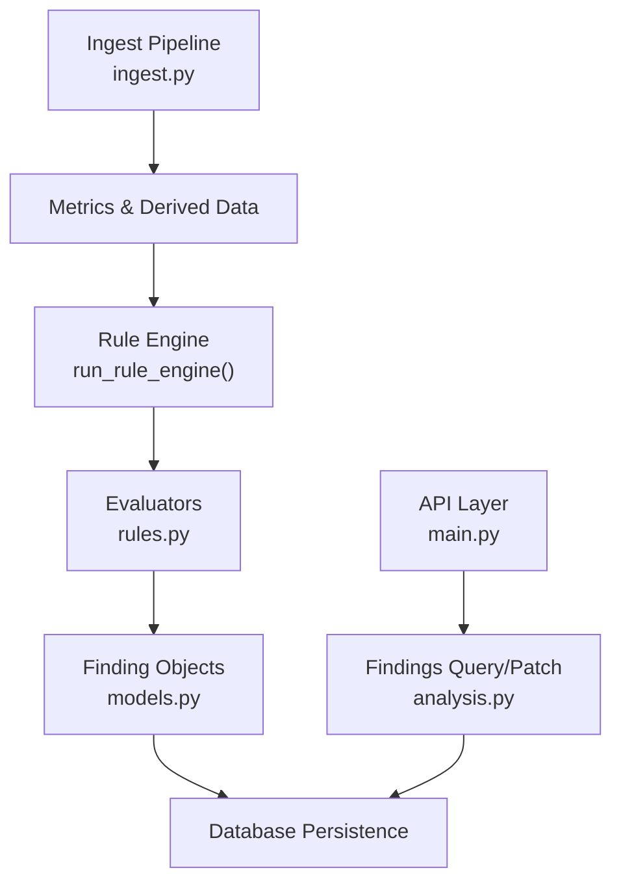
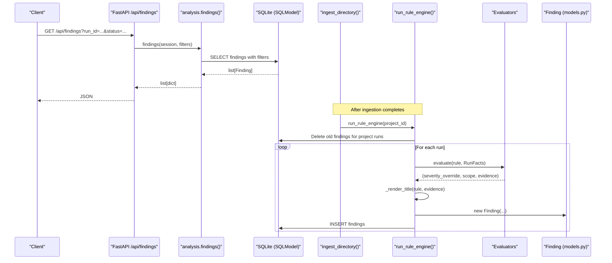
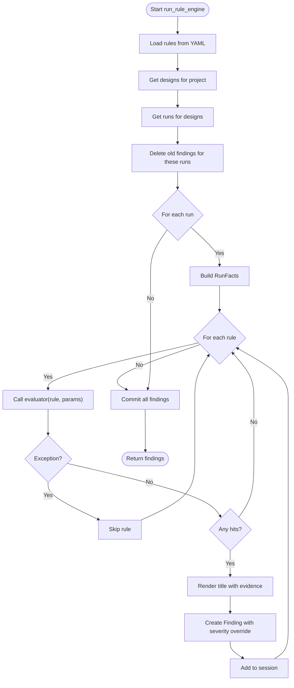
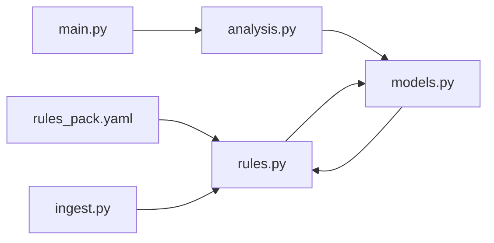

# Finding Generation & Status Management

<cite>
**Referenced Files in This Document**
- [rules.py](file://backend/ppa/rules.py)
- [models.py](file://backend/ppa/models.py)
- [ingest.py](file://backend/ppa/ingest.py)
- [analysis.py](file://backend/ppa/analysis.py)
- [main.py](file://backend/ppa/main.py)
- [rules_pack.yaml](file://backend/ppa/rules_pack.yaml)
</cite>

## Table of Contents
1. [Introduction](#introduction)
2. [Project Structure](#project-structure)
3. [Core Components](#core-components)
4. [Architecture Overview](#architecture-overview)
5. [Detailed Component Analysis](#detailed-component-analysis)
6. [Dependency Analysis](#dependency-analysis)
7. [Performance Considerations](#performance-considerations)
8. [Troubleshooting Guide](#troubleshooting-guide)
9. [Conclusion](#conclusion)
10. [Appendices](#appendices)

## Introduction
This document explains the finding generation pipeline that converts rule evaluation results into structured Finding objects, and how findings are persisted, queried, and managed throughout their lifecycle. It focuses on:
- The run_rule_engine function that orchestrates rule execution across all runs in a project
- The finding lifecycle including creation, persistence, cleanup of old findings, and status management
- The severity override mechanism where evaluators can modify default rule severities
- Evidence JSON serialization and metadata preservation
- Title rendering with dynamic evidence values
- Error handling strategies that prevent broken rules from disrupting ingestion
- Examples of custom finding creation and status workflows

## Project Structure
The finding pipeline spans several modules:
- Rule definitions live in a YAML pack and are loaded at runtime
- Evaluators read precomputed facts per run and return hits with severity overrides, scope, and evidence
- The rule engine clears stale findings, evaluates rules for each run, renders titles, builds Finding instances, and persists them
- Ingestion computes metrics and may create data-quality findings directly
- APIs expose querying and patching of findings



**Diagram sources**
- [ingest.py:267-311](file://backend/ppa/ingest.py#L267-L311)
- [rules.py:313-352](file://backend/ppa/rules.py#L313-L352)
- [models.py:168-181](file://backend/ppa/models.py#L168-L181)
- [analysis.py:403-423](file://backend/ppa/analysis.py#L403-L423)
- [main.py:101-131](file://backend/ppa/main.py#L101-L131)

**Section sources**
- [ingest.py:267-311](file://backend/ppa/ingest.py#L267-L311)
- [rules.py:313-352](file://backend/ppa/rules.py#L313-L352)
- [models.py:168-181](file://backend/ppa/models.py#L168-L181)
- [analysis.py:403-423](file://backend/ppa/analysis.py#L403-L423)
- [main.py:101-131](file://backend/ppa/main.py#L101-L131)

## Core Components
- Rule Pack: Declarative rules with id, category, severity, title template, and params
- RunFacts: Precomputed per-run context (metrics, area/power/timing/perf rows, baseline)
- Evaluators: Pure functions mapping RunFacts + params to hits (severity override, scope, evidence)
- Rule Engine: Clears old findings, iterates runs and rules, calls evaluators, renders titles, creates Findings, persists
- Finding Model: Structured record with severity, category, scope_path, title, evidence_json, status, AI fields, timestamps
- API Endpoints: List and filter findings; patch status and AI fields; feedback

Key responsibilities:
- Ingestion computes metrics and may create data-quality findings directly
- Rule engine ensures deterministic re-evaluation by deleting prior findings for affected runs before regenerating
- Title rendering uses rule templates and evidence values
- Evidence is serialized as a JSON dict containing only primitive types

**Section sources**
- [rules_pack.yaml:1-119](file://backend/ppa/rules_pack.yaml#L1-L119)
- [rules.py:24-79](file://backend/ppa/rules.py#L24-L79)
- [rules.py:84-310](file://backend/ppa/rules.py#L84-L310)
- [rules.py:313-361](file://backend/ppa/rules.py#L313-L361)
- [models.py:168-181](file://backend/ppa/models.py#L168-L181)
- [ingest.py:230-240](file://backend/ppa/ingest.py#L230-L240)
- [analysis.py:403-423](file://backend/ppa/analysis.py#L403-L423)
- [main.py:101-131](file://backend/ppa/main.py#L101-L131)

## Architecture Overview
End-to-end flow from ingestion to findings:



**Diagram sources**
- [main.py:101-105](file://backend/ppa/main.py#L101-L105)
- [analysis.py:403-423](file://backend/ppa/analysis.py#L403-L423)
- [ingest.py:267-311](file://backend/ppa/ingest.py#L267-L311)
- [rules.py:313-352](file://backend/ppa/rules.py#L313-L352)
- [models.py:168-181](file://backend/ppa/models.py#L168-L181)

## Detailed Component Analysis

### run_rule_engine: Orchestration and Lifecycle
Responsibilities:
- Load rules from YAML
- Identify design and run IDs for the project
- Delete existing findings for those runs to ensure deterministic regeneration
- For each run, build RunFacts and iterate rules
- Call evaluator; if it raises an exception, skip the rule without breaking the pipeline
- Render title using rule template and evidence
- Build Finding with severity override or default, category, scope_path, evidence_json, and persist
- Commit and return findings



**Diagram sources**
- [rules.py:313-352](file://backend/ppa/rules.py#L313-L352)

**Section sources**
- [rules.py:313-352](file://backend/ppa/rules.py#L313-L352)

### Severity Override Mechanism
- Each evaluator returns tuples of (severity_override, scope_dict, evidence_dict)
- If severity_override is provided, it replaces the rule’s default severity; otherwise, the rule’s declared severity is used
- This allows fine-grained control per hit while keeping defaults in the rule pack

Example behaviors:
- Timing WNS negative can be “high” or “critical” based on threshold
- Area over budget yields “high”
- Performance regressions yield “medium” or “info” for isolated outliers

**Section sources**
- [rules.py:84-310](file://backend/ppa/rules.py#L84-L310)
- [rules.py:339-348](file://backend/ppa/rules.py#L339-L348)
- [rules_pack.yaml:1-119](file://backend/ppa/rules_pack.yaml#L1-L119)

### Evidence JSON Serialization and Metadata Preservation
- Evidence is built from the third element of evaluator hits: a dict of key-value pairs
- Only primitive types (int, float, str) are preserved in evidence_json
- This ensures safe JSON serialization and consistent storage
- Scope path is extracted from the scope dict under the “module” key when present

Notes:
- Non-primitive values are filtered out during construction
- Evidence remains attached to the Finding and is exposed via analysis endpoints

**Section sources**
- [rules.py:339-348](file://backend/ppa/rules.py#L339-L348)
- [analysis.py:128-134](file://backend/ppa/analysis.py#L128-L134)

### Title Rendering System
- Titles are defined in the rule pack with format placeholders
- During finding creation, the rule’s title is rendered using the evidence dict
- If formatting fails due to missing keys or invalid values, the original title is returned as fallback

Examples:
- “Setup WNS is {wns:.3f} ns (violating)”
- “Module {module} owns {share:.0%} of top timing paths”
- “Benchmark {benchmark} regressed {pct:.1%} vs baseline”

**Section sources**
- [rules.py:355-361](file://backend/ppa/rules.py#L355-L361)
- [rules_pack.yaml:1-119](file://backend/ppa/rules_pack.yaml#L1-L119)

### Error Handling Strategies
- Broken evaluators do not disrupt ingestion: exceptions are caught and the rule is skipped
- Parsing errors in individual reports are recorded but do not stop processing other reports
- Data-quality findings are created for unmatched power vs area paths

Implications:
- Robustness: One failing rule does not block others
- Observability: Parse logs and statuses help diagnose issues
- Continuity: Ingestion proceeds even with partial failures

**Section sources**
- [rules.py:335-338](file://backend/ppa/rules.py#L335-L338)
- [ingest.py:93-113](file://backend/ppa/ingest.py#L93-L113)
- [ingest.py:230-240](file://backend/ppa/ingest.py#L230-L240)

### Custom Finding Creation and Status Management Workflows
- Direct creation: During ingestion, unmatched power vs area paths trigger a data-quality Finding with specific evidence
- Status management: API PATCH endpoint updates status among open, acknowledged, fixed, wont_fix
- Feedback: POST endpoint records up/down feedback linked to a finding

Workflows:
- Create: Either via rule engine or direct insertion during ingestion
- Update: Patch status and optional AI fields
- Query: Filter by run_id, severity, category, status

**Section sources**
- [ingest.py:230-240](file://backend/ppa/ingest.py#L230-L240)
- [main.py:108-131](file://backend/ppa/main.py#L108-L131)
- [main.py:134-149](file://backend/ppa/main.py#L134-L149)
- [analysis.py:403-423](file://backend/ppa/analysis.py#L403-L423)

### Class Relationships and Data Models
```mermaid
classDiagram
class Project {
+int id
+string name
+float area_budget_mm2
+float power_budget_mw
+dict settings_json
}
class Design {
+int id
+int project_id
+string rtl_git_sha
+string rtl_branch
+datetime date
}
class Run {
+int id
+int design_id
+int config_id
+int corner_id
+string label
+string stage
+datetime started_at
+string status
}
class Finding {
+int id
+int run_id
+string rule_id
+string severity
+string category
+string scope_path
+string title
+dict evidence_json
+string status
+string ai_explanation
+string ai_proposal
+datetime created_at
}
class Baseline {
+int id
+int project_id
+int run_id
+string label
+bool is_golden
}
Project ||--o{ Design : "has many"
Design ||--o{ Run : "has many"
Run ||--o{ Finding : "has many"
Project ||--o{ Baseline : "has one"
```

**Diagram sources**
- [models.py:17-67](file://backend/ppa/models.py#L17-L67)
- [models.py:160-181](file://backend/ppa/models.py#L160-L181)

**Section sources**
- [models.py:17-67](file://backend/ppa/models.py#L17-L67)
- [models.py:160-181](file://backend/ppa/models.py#L160-L181)

## Dependency Analysis
- Rule engine depends on models for database entities and on YAML for rule definitions
- Ingestion depends on parsers and metrics to produce data consumed by evaluators
- Analysis layer provides query functions and exposes findings via API
- API layer wires endpoints to analysis functions and handles input validation



**Diagram sources**
- [rules.py:11-16](file://backend/ppa/rules.py#L11-L16)
- [ingest.py:11-23](file://backend/ppa/ingest.py#L11-L23)
- [analysis.py:6-13](file://backend/ppa/analysis.py#L6-L13)
- [main.py:12-17](file://backend/ppa/main.py#L12-L17)

**Section sources**
- [rules.py:11-16](file://backend/ppa/rules.py#L11-L16)
- [ingest.py:11-23](file://backend/ppa/ingest.py#L11-L23)
- [analysis.py:6-13](file://backend/ppa/analysis.py#L6-L13)
- [main.py:12-17](file://backend/ppa/main.py#L12-L17)

## Performance Considerations
- Deleting old findings before regeneration ensures deterministic state and avoids duplicates
- RunFacts caches per-run queries to minimize repeated database access
- Evaluators are pure functions and short-circuit early when thresholds are not met
- Evidence filtering to primitives reduces payload size and serialization overhead

Recommendations:
- Keep evaluator logic efficient and bounded (e.g., limiting top paths considered)
- Use baseline comparisons judiciously to avoid unnecessary computations
- Batch commits for large numbers of findings to reduce transaction overhead

[No sources needed since this section provides general guidance]

## Troubleshooting Guide
Common issues and diagnostics:
- Missing reports: Data-quality findings indicate missing report kinds; check parse_status and parse_log
- Parser errors: RawReport entries capture error messages; verify file integrity and parser versions
- Broken rules: Exceptions in evaluators are caught; inspect rule parameters and evaluator logic
- Unmatched paths: Data-quality findings highlight mismatches between power and area hierarchies

Actions:
- Review ingest status via API to identify problematic reports
- Validate rule parameters in YAML against evaluator expectations
- Re-ingest after fixing inputs or updating parsers to regenerate findings

**Section sources**
- [ingest.py:93-113](file://backend/ppa/ingest.py#L93-L113)
- [ingest.py:230-240](file://backend/ppa/ingest.py#L230-L240)
- [rules.py:335-338](file://backend/ppa/rules.py#L335-L338)

## Conclusion
The finding generation pipeline provides a robust, deterministic mechanism to convert rule evaluation results into structured, persistent findings. It supports:
- Configurable rules with dynamic titles and severity overrides
- Safe error handling to keep ingestion resilient
- Clear lifecycle management with cleanup and regeneration
- Flexible status workflows and feedback mechanisms
- Clean evidence serialization preserving relevant metadata

This design enables scalable analysis across multiple runs and projects while maintaining observability and extensibility.

[No sources needed since this section summarizes without analyzing specific files]

## Appendices

### Example: Custom Finding Creation During Ingestion
- When power-report hierarchy paths do not match area-report paths, a data-quality Finding is created with evidence listing unmatched paths
- This helps identify integration issues early in the pipeline

**Section sources**
- [ingest.py:230-240](file://backend/ppa/ingest.py#L230-L240)

### Example: Status Management Workflow
- Clients can patch a finding’s status to acknowledge, fix, or mark as wont_fix
- AI explanation and proposal fields can be updated alongside status changes
- Feedback endpoints allow recording up/down verdicts for rule tuning

**Section sources**
- [main.py:108-131](file://backend/ppa/main.py#L108-L131)
- [main.py:134-149](file://backend/ppa/main.py#L134-L149)