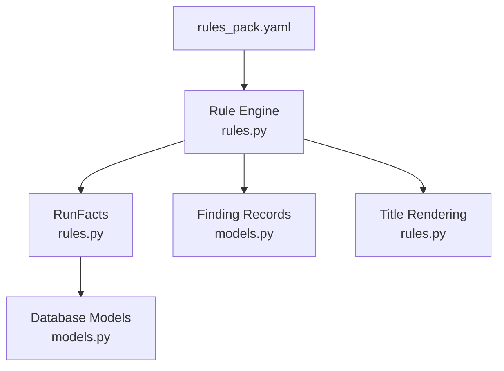
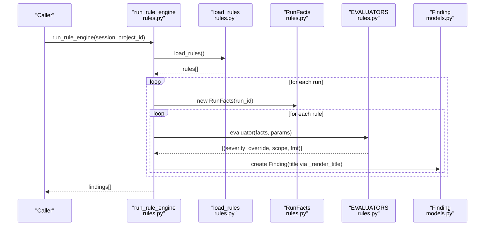
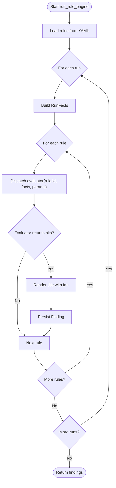
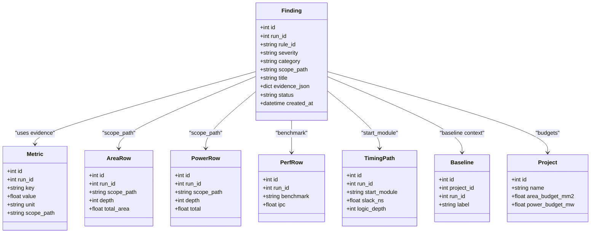
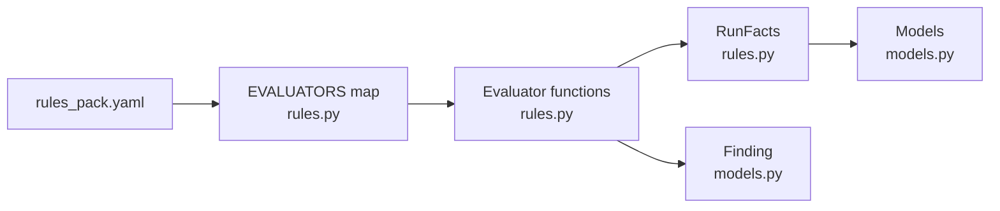

# Rule Definitions & Configuration

<cite>
**Referenced Files in This Document**
- [rules_pack.yaml](file://backend/ppa/rules_pack.yaml)
- [rules.py](file://backend/ppa/rules.py)
- [models.py](file://backend/ppa/models.py)
- [analysis.py](file://backend/ppa/analysis.py)
- [config.py](file://backend/ppa/config.py)
</cite>

## Table of Contents
1. [Introduction](#introduction)
2. [Project Structure](#project-structure)
3. [Core Components](#core-components)
4. [Architecture Overview](#architecture-overview)
5. [Detailed Component Analysis](#detailed-component-analysis)
6. [Dependency Analysis](#dependency-analysis)
7. [Performance Considerations](#performance-considerations)
8. [Troubleshooting Guide](#troubleshooting-guide)
9. [Conclusion](#conclusion)
10. [Appendices](#appendices)

## Introduction
This document explains the YAML-based rule definition system used for deterministic PPA diagnosis. It covers the complete structure of rule definitions (IDs, severity levels, categories, titles, and parameters), how rules are organized into domains (timing, area, power, performance, cross-domain, data quality), and how parameters control thresholds and behavior. It also documents the title templating system with format strings and evidence variables, provides examples of different rule types and parameter customization patterns, and outlines best practices for organizing rules and strategies for versioning and migrating existing rules.

## Project Structure
The rule system is implemented as a separation of concerns:
- Declarative rules live in a YAML pack that designers can edit without touching code.
- A Python rule engine loads the YAML, evaluates each rule against run facts, and persists findings.
- Data models define the schema for findings, metrics, and related entities.
- Baseline context enables comparative checks across runs within a project.

**Diagram sources**
- [rules_pack.yaml:1-119](file://backend/ppa/rules_pack.yaml#L1-L119)
- [rules.py:19-21](file://backend/ppa/rules.py#L19-L21)
- [rules.py:24-73](file://backend/ppa/rules.py#L24-L73)
- [models.py:168-181](file://backend/ppa/models.py#L168-L181)

**Section sources**
- [rules_pack.yaml:1-119](file://backend/ppa/rules_pack.yaml#L1-L119)
- [rules.py:19-21](file://backend/ppa/rules.py#L19-L21)
- [models.py:168-181](file://backend/ppa/models.py#L168-L181)

## Core Components
- Rule Pack (YAML): Declares rules with id, category, severity, title, and optional params. Each rule maps to an evaluator function in the engine.
- Rule Engine (Python): Loads the YAML, constructs RunFacts per run, invokes evaluators, renders titles, and persists findings.
- Data Models: Define Finding and supporting tables (Metric, AreaRow, PowerRow, PerfRow, TimingPath, RawReport, Baseline, Project).
- Baseline Context: Enables comparisons between current and baseline runs for performance and cross-domain rules.

Key responsibilities:
- YAML defines what to check and how to present results.
- Evaluators implement domain logic using precomputed facts.
- Engine orchestrates evaluation and output.
- Models persist structured findings for UI and downstream analysis.

**Section sources**
- [rules_pack.yaml:1-119](file://backend/ppa/rules_pack.yaml#L1-L119)
- [rules.py:24-73](file://backend/ppa/rules.py#L24-L73)
- [rules.py:290-310](file://backend/ppa/rules.py#L290-L310)
- [rules.py:313-360](file://backend/ppa/rules.py#L313-L360)
- [models.py:168-181](file://backend/ppa/models.py#L168-L181)

## Architecture Overview
The rule engine follows a deterministic pipeline:
1. Load rules from YAML.
2. For each run in the project, build RunFacts (metrics, area/power/perf/timing paths, reports, baseline context).
3. For each rule, call its evaluator with RunFacts and rule params.
4. On hits, render a human-readable title using format strings and evidence variables, then persist a Finding.
5. Return all findings for the project.

**Diagram sources**
- [rules.py:19-21](file://backend/ppa/rules.py#L19-L21)
- [rules.py:24-73](file://backend/ppa/rules.py#L24-L73)
- [rules.py:290-310](file://backend/ppa/rules.py#L290-L310)
- [rules.py:313-360](file://backend/ppa/rules.py#L313-L360)
- [models.py:168-181](file://backend/ppa/models.py#L168-L181)

## Detailed Component Analysis

### Rule Definition Schema (YAML)
Each rule entry includes:
- id: Unique identifier mapping to an evaluator in the engine.
- category: Domain grouping such as timing, area, power, performance, cross_domain, data_quality.
- severity: Default severity level (critical, high, medium, low, info). Evaluators may override severity per hit.
- title: Human-readable template string using Python format placeholders.
- params: Optional threshold or configuration values consumed by the evaluator.

Examples of categories and representative rules:
- timing: WNS negative, NVE threshold, module dominance, deep logic depth.
- area: Over budget, sequential ratio, module growth vs baseline.
- power: Leakage share, clock network share, clock gating efficiency, density, over budget.
- performance: Benchmark regression vs baseline, isolated outlier detection.
- cross_domain: Net IPC vs SPEC score trade-offs; ROI checks for area/power vs score.
- data_quality: Missing reports, parse warnings/errors.

Parameterization patterns:
- Thresholds: e.g., nve_threshold, share_threshold, threshold, threshold_mw_um2.
- Scaling points: e.g., scale_high_at to adjust severity based on metric magnitude.
- Defaults: Evaluators use .get("param", default) so YAML can omit optional keys.

Best practices:
- Keep ids stable and descriptive (domain prefix + short name).
- Use params for tunable thresholds; avoid hardcoding in evaluators.
- Provide meaningful titles with format placeholders for key evidence variables.
- Group related rules under consistent categories.

**Section sources**
- [rules_pack.yaml:1-119](file://backend/ppa/rules_pack.yaml#L1-L119)
- [rules.py:290-310](file://backend/ppa/rules.py#L290-L310)

### Rule Engine and Evaluation Flow
- Loading: The engine reads the YAML pack and extracts the rules list.
- Facts construction: For each run, RunFacts aggregates metrics, area/power/perf/timing rows, raw reports, and baseline context if available.
- Evaluator dispatch: Each rule id maps to a specific evaluator function. Evaluators return tuples of (severity_override_or_none, scope_dict, fmt_dict).
- Title rendering: Titles are rendered using Python str.format with fmt variables; missing keys fall back to the static title.
- Persistence: Findings are created with rule_id, severity (overridable), category, scope_path, title, and evidence_json containing numeric/string evidence.

Robustness:
- Broken evaluators do not halt ingestion; exceptions are caught and skipped.
- Severity overrides allow fine-grained control per hit while keeping defaults in YAML.

**Diagram sources**
- [rules.py:313-360](file://backend/ppa/rules.py#L313-L360)
- [rules.py:290-310](file://backend/ppa/rules.py#L290-L310)

**Section sources**
- [rules.py:19-21](file://backend/ppa/rules.py#L19-L21)
- [rules.py:24-73](file://backend/ppa/rules.py#L24-L73)
- [rules.py:290-310](file://backend/ppa/rules.py#L290-L310)
- [rules.py:313-360](file://backend/ppa/rules.py#L313-L360)

### Data Model Integration
Findings store:
- rule_id, severity, category, scope_path, title, evidence_json, status, timestamps, and optional AI fields.
Baseline context:
- Baseline runs are associated at the project level and used for comparative checks (e.g., perf regressions, ROI calculations).
Project budgets:
- Area and power budgets are read from the project model to support budget violation rules.

**Diagram sources**
- [models.py:168-181](file://backend/ppa/models.py#L168-L181)
- [models.py:83-149](file://backend/ppa/models.py#L83-L149)
- [models.py:160-166](file://backend/ppa/models.py#L160-L166)
- [models.py:17-27](file://backend/ppa/models.py#L17-L27)

**Section sources**
- [models.py:168-181](file://backend/ppa/models.py#L168-L181)
- [models.py:83-149](file://backend/ppa/models.py#L83-L149)
- [models.py:160-166](file://backend/ppa/models.py#L160-L166)
- [models.py:17-27](file://backend/ppa/models.py#L17-L27)

### Title Templating System
- Titles are Python format strings embedded in YAML.
- Evaluators supply fmt dictionaries with evidence variables (e.g., wns, nve, tns, module, share, pct, roi).
- The engine renders titles using these variables; if formatting fails, it falls back to the static title.
- Evidence variables are also persisted in evidence_json for UI display and downstream analysis.

Example variable usage patterns:
- Numeric formatting: {:.3f}, {:.1%}, {:+.1%}.
- String interpolation: {module}, {benchmark}, {kind}.
- Derived values: computed ratios, deltas, densities.

**Section sources**
- [rules.py:355-360](file://backend/ppa/rules.py#L355-L360)
- [rules_pack.yaml:1-119](file://backend/ppa/rules_pack.yaml#L1-L119)

### Examples of Rule Types and Parameter Customization
- Timing:
  - Negative WNS triggers severity based on a scaling threshold.
  - High NVE triggers with TNS included in evidence.
  - Module dominance uses top timing paths to compute share.
  - Deep logic checks logic depth against a configurable threshold.
- Area:
  - Over budget compares total area to project budget.
  - Sequential ratio compares seq area to total area.
  - Module growth compares current area to baseline area.
- Power:
  - Leakage share, clock share, and clock gating efficiency thresholds.
  - Density computed per module path and compared to threshold.
  - Over budget compares total power to project budget.
- Performance:
  - Benchmarks regressing beyond threshold vs baseline.
  - Isolated outlier detection when geomean is stable but one benchmark regresses.
- Cross-domain:
  - IPC up but net score down indicates frequency loss dominates.
  - ROI checks compare score improvement relative to area/power cost.
- Data Quality:
  - Missing required report kinds.
  - Parse warnings/errors surfaced with counts.

Parameters commonly include:
- Thresholds: nve_threshold, share_threshold, threshold, threshold_mw_um2.
- Scaling points: scale_high_at for dynamic severity.
- Defaults are applied in evaluators when params are omitted.

**Section sources**
- [rules_pack.yaml:1-119](file://backend/ppa/rules_pack.yaml#L1-L119)
- [rules.py:84-287](file://backend/ppa/rules.py#L84-L287)

### Best Practices for Rule Organization
- Naming:
  - Use clear, unique ids with domain prefixes (TIM_, AREA_, PWR_, PERF_, XDOM_, DQ_).
- Categories:
  - Assign rules to appropriate categories for filtering and reporting.
- Severity:
  - Set sensible defaults in YAML; allow evaluators to override per hit when needed.
- Parameters:
  - Prefer externalizing thresholds in params; keep evaluators generic.
- Titles:
  - Include key evidence variables to make findings self-descriptive.
- Baseline usage:
  - Ensure baseline runs exist for comparative rules; otherwise, skip gracefully.
- Robustness:
  - Handle missing metrics and edge cases in evaluators to avoid ingestion failures.

**Section sources**
- [rules_pack.yaml:1-119](file://backend/ppa/rules_pack.yaml#L1-L119)
- [rules.py:313-360](file://backend/ppa/rules.py#L313-L360)

## Dependency Analysis
- YAML pack depends on evaluator implementations being present and correctly mapped by rule id.
- Evaluators depend on RunFacts providing consistent access to metrics, area/power/perf/timing rows, reports, and baseline context.
- Findings depend on models for persistence and UI consumption.
- Baseline context depends on project-level baseline associations.

**Diagram sources**
- [rules_pack.yaml:1-119](file://backend/ppa/rules_pack.yaml#L1-L119)
- [rules.py:290-310](file://backend/ppa/rules.py#L290-L310)
- [rules.py:24-73](file://backend/ppa/rules.py#L24-L73)
- [models.py:168-181](file://backend/ppa/models.py#L168-L181)

**Section sources**
- [rules.py:290-310](file://backend/ppa/rules.py#L290-L310)
- [rules.py:24-73](file://backend/ppa/rules.py#L24-L73)
- [models.py:168-181](file://backend/ppa/models.py#L168-L181)

## Performance Considerations
- Deterministic evaluation: Same inputs produce same findings, enabling reproducible diagnostics.
- Minimal overhead: Evaluators operate on precomputed RunFacts; no ad-hoc queries inside loops.
- Exception safety: Broken rules are skipped to protect ingestion pipelines.
- Baseline caching: Baseline metrics/area/perf are loaded once per run to avoid repeated lookups.

[No sources needed since this section provides general guidance]

## Troubleshooting Guide
Common issues and resolutions:
- Missing evaluator: If a rule id has no corresponding evaluator, it is silently skipped. Add the evaluator and map it in the registry.
- Broken evaluator: Exceptions are caught; check logs and fix the evaluator logic.
- Missing baseline: Comparative rules (perf regressions, ROI) require a baseline run; ensure baseline association exists.
- Title formatting errors: If format placeholders are missing, the engine falls back to the static title; add required variables in the evaluator’s fmt dict.
- Data quality issues: Missing reports trigger DQ rules; ingest the required reports to resolve.

**Section sources**
- [rules.py:313-360](file://backend/ppa/rules.py#L313-L360)
- [rules.py:290-310](file://backend/ppa/rules.py#L290-L310)

## Conclusion
The YAML-based rule system separates policy (thresholds and presentation) from logic (evaluators), enabling designers to tune sensitivity without code changes. Rules are organized by domain, supported by robust baseline comparisons and flexible title templating. Following the outlined best practices ensures maintainability, clarity, and reliability of the diagnosis pipeline.

[No sources needed since this section summarizes without analyzing specific files]

## Appendices

### Appendix A: Rule Categories and Representative IDs
- timing: TIM_WNS_NEG, TIM_NVE_HIGH, TIM_MOD_DOMINATES, TIM_DEEP_LOGIC
- area: AREA_OVER_BUDGET, AREA_SEQ_RATIO, AREA_MOD_GROWTH
- power: PWR_LEAK_SHARE, PWR_CLOCK_SHARE, PWR_CG_LOW, PWR_DENSITY_HIGH, PWR_OVER_BUDGET
- performance: PERF_BENCH_REGRESS, PERF_ISOLATED_OUTLIER
- cross_domain: XDOM_NET_SCORE_DOWN, XDOM_AREA_ROI_LOW, XDOM_POWER_ROI_LOW
- data_quality: DQ_MISSING_REPORT, DQ_PARSE_WARNINGS

**Section sources**
- [rules_pack.yaml:1-119](file://backend/ppa/rules_pack.yaml#L1-L119)

### Appendix B: Versioning and Migration Strategies
Current state:
- The YAML pack does not include explicit version metadata.
- The engine loads rules directly from the YAML file.

Recommended strategies:
- Introduce a version field in the YAML pack header to track rule pack versions.
- Maintain backward compatibility by:
  - Keeping rule ids stable.
  - Using default parameters in evaluators to handle missing or renamed params.
  - Supporting deprecated params with deprecation warnings.
- Migration approach:
  - When changing thresholds or semantics, increment the pack version.
  - Provide migration scripts to update historical findings or re-run evaluation after upgrades.
  - Document breaking changes and provide rollback plans.

[No sources needed since this section proposes general strategies not tied to specific files]