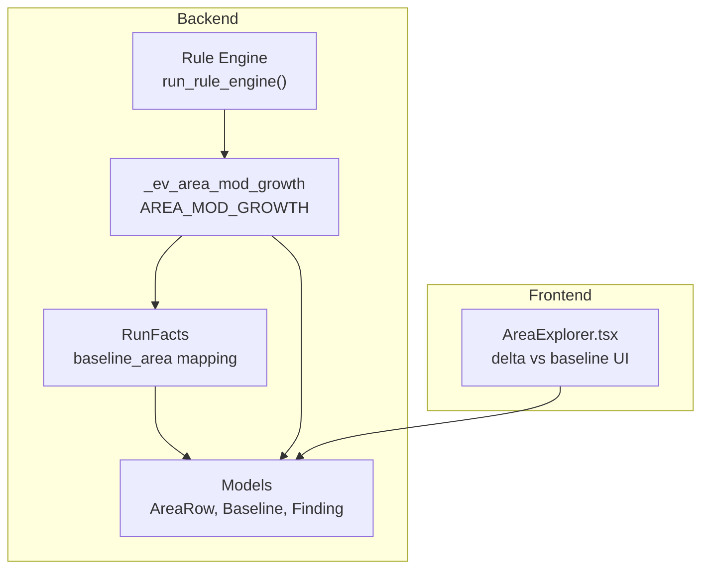
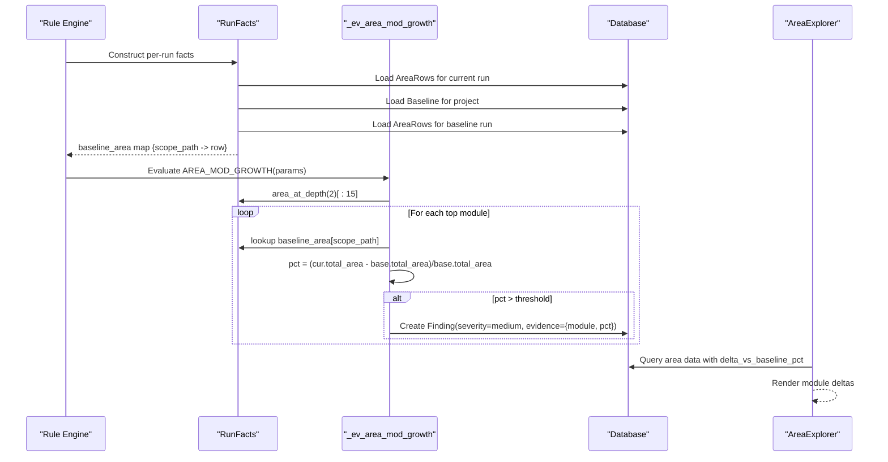
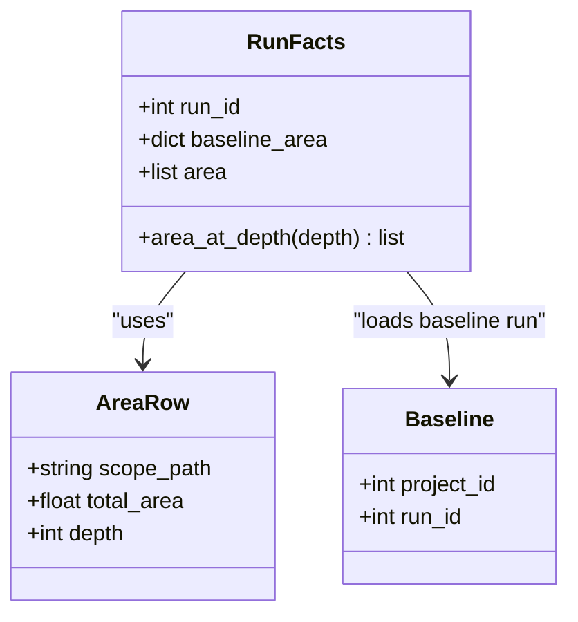
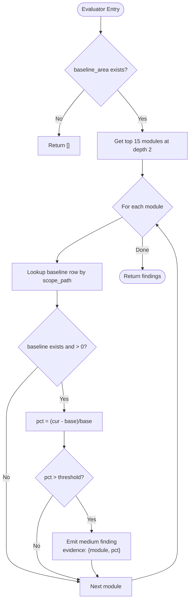
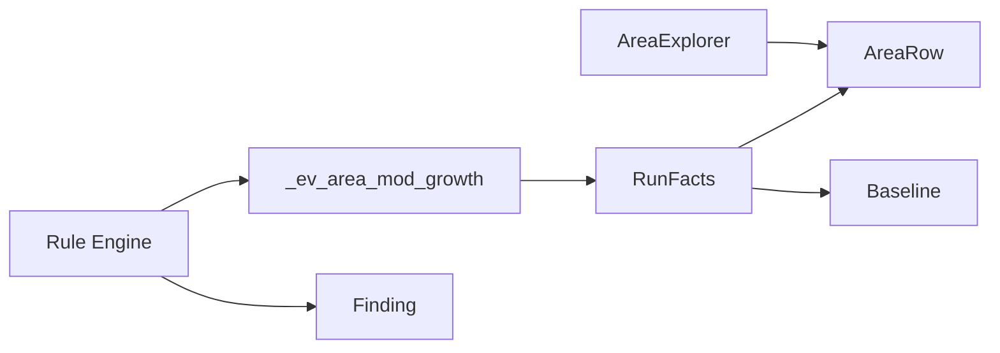

# Area Module Growth Evaluator

<cite>
**Referenced Files in This Document**
- [rules.py](file://backend/ppa/rules.py)
- [rules_pack.yaml](file://backend/ppa/rules_pack.yaml)
- [models.py](file://backend/ppa/models.py)
- [analysis.py](file://backend/ppa/analysis.py)
- [AreaExplorer.tsx](file://frontend/src/views/AreaExplorer.tsx)
</cite>

## Table of Contents
1. [Introduction](#introduction)
2. [Project Structure](#project-structure)
3. [Core Components](#core-components)
4. [Architecture Overview](#architecture-overview)
5. [Detailed Component Analysis](#detailed-component-analysis)
6. [Dependency Analysis](#dependency-analysis)
7. [Performance Considerations](#performance-considerations)
8. [Troubleshooting Guide](#troubleshooting-guide)
9. [Conclusion](#conclusion)

## Introduction
This document explains the AREA_MOD_GROWTH evaluator, which tracks module-level area growth by comparing a current design run against a project baseline. It identifies modules that grew beyond a configurable threshold and generates medium-severity findings with evidence for downstream analysis and visualization.

The evaluator:
- Accesses baseline_area mappings from the baseline run associated with the same project.
- Iterates through the top 15 modules at depth 2 (module granularity).
- Calculates percentage growth as (current_area - baseline_area) / baseline_area.
- Emits a medium severity finding for each module exceeding the configured threshold (default 0.05).

It integrates with design evolution tracking via the rule engine and is surfaced in the frontend area explorer where delta vs baseline is visualized.

## Project Structure
The AREA_MOD_GROWTH feature spans backend rule evaluation and frontend visualization:
- Backend rule engine: defines RunFacts, loads baseline context, and evaluates rules to produce findings.
- Data model: stores area rows, baselines, and findings.
- Frontend: displays area hierarchy and per-module deltas versus baseline.

**Diagram sources**
- [rules.py:24-77](file://backend/ppa/rules.py#L24-L77)
- [rules.py:141-153](file://backend/ppa/rules.py#L141-L153)
- [rules.py:313-352](file://backend/ppa/rules.py#L313-L352)
- [models.py:93-106](file://backend/ppa/models.py#L93-L106)
- [models.py:160-166](file://backend/ppa/models.py#L160-L166)
- [models.py:168-180](file://backend/ppa/models.py#L168-L180)
- [AreaExplorer.tsx:9-30](file://frontend/src/views/AreaExplorer.tsx#L9-L30)

**Section sources**
- [rules.py:24-77](file://backend/ppa/rules.py#L24-L77)
- [rules.py:141-153](file://backend/ppa/rules.py#L141-L153)
- [rules.py:313-352](file://backend/ppa/rules.py#L313-L352)
- [models.py:93-106](file://backend/ppa/models.py#L93-L106)
- [models.py:160-166](file://backend/ppa/models.py#L160-L166)
- [models.py:168-180](file://backend/ppa/models.py#L168-L180)
- [AreaExplorer.tsx:9-30](file://frontend/src/views/AreaExplorer.tsx#L9-L30)

## Core Components
- RunFacts: Precomputes per-run data including baseline_area mapping keyed by scope_path for the project’s baseline run.
- _ev_area_mod_growth: The evaluator implementing AREA_MOD_GROWTH logic.
- Rule pack: Declares the rule id, default severity, title template, and default threshold parameter.
- Models: AreaRow (area metrics), Baseline (links project to baseline run), Finding (stores generated findings).
- Frontend Area Explorer: Visualizes per-module delta_vs_baseline_pct and supports drill-down into module hierarchies.

Key behaviors:
- Threshold configuration: default 0.05 (5% growth), overridable via rule params.
- Scope: only modules at depth 2 are considered; limited to top 15 by total area.
- Output: medium severity findings with evidence containing module path and growth percentage.

**Section sources**
- [rules.py:24-77](file://backend/ppa/rules.py#L24-L77)
- [rules.py:141-153](file://backend/ppa/rules.py#L141-L153)
- [rules_pack.yaml:43-47](file://backend/ppa/rules_pack.yaml#L43-L47)
- [models.py:93-106](file://backend/ppa/models.py#L93-L106)
- [models.py:160-166](file://backend/ppa/models.py#L160-L166)
- [models.py:168-180](file://backend/ppa/models.py#L168-L180)
- [AreaExplorer.tsx:9-30](file://frontend/src/views/AreaExplorer.tsx#L9-L30)

## Architecture Overview
The rule engine runs for each project and invokes evaluators per run. For AREA_MOD_GROWTH:
- RunFacts builds baseline_area from the project’s baseline run.
- The evaluator filters to depth 2 modules, sorts by area, and inspects the top 15.
- For each module present in both current and baseline with non-zero baseline area, it computes percentage growth.
- If growth exceeds the threshold, a finding is created with medium severity and evidence.

**Diagram sources**
- [rules.py:24-77](file://backend/ppa/rules.py#L24-L77)
- [rules.py:141-153](file://backend/ppa/rules.py#L141-L153)
- [rules.py:313-352](file://backend/ppa/rules.py#L313-L352)
- [models.py:93-106](file://backend/ppa/models.py#L93-L106)
- [models.py:160-166](file://backend/ppa/models.py#L160-L166)
- [models.py:168-180](file://backend/ppa/models.py#L168-L180)
- [AreaExplorer.tsx:9-30](file://frontend/src/views/AreaExplorer.tsx#L9-L30)

## Detailed Component Analysis

### RunFacts and Baseline Context
- Loads all AreaRows for the current run and constructs baseline_area mapping for the project’s baseline run.
- Provides area_at_depth(depth) helper that returns modules at the specified depth sorted by descending total_area.

**Diagram sources**
- [rules.py:24-77](file://backend/ppa/rules.py#L24-L77)
- [models.py:93-106](file://backend/ppa/models.py#L93-L106)
- [models.py:160-166](file://backend/ppa/models.py#L160-L166)

**Section sources**
- [rules.py:24-77](file://backend/ppa/rules.py#L24-L77)
- [models.py:93-106](file://backend/ppa/models.py#L93-L106)
- [models.py:160-166](file://backend/ppa/models.py#L160-L166)

### AREA_MOD_GROWTH Evaluator Logic
- Guards: if no baseline_area exists, return no findings.
- Threshold: read from params with default 0.05.
- Iteration: get top 15 modules at depth 2 by area.
- Calculation: for each module present in baseline with positive baseline area, compute pct = (current - baseline)/baseline.
- Findings: if pct > threshold, append a medium severity finding with evidence containing module name and pct.

**Diagram sources**
- [rules.py:141-153](file://backend/ppa/rules.py#L141-L153)

**Section sources**
- [rules.py:141-153](file://backend/ppa/rules.py#L141-L153)

### Rule Pack Configuration
- Rule id: AREA_MOD_GROWTH
- Category: area
- Default severity: medium
- Title template includes module and growth percentage
- Default threshold: 0.05 (configurable)

**Section sources**
- [rules_pack.yaml:43-47](file://backend/ppa/rules_pack.yaml#L43-L47)

### Data Model Integration
- AreaRow stores per-module area metrics including total_area and depth.
- Baseline links a project to a baseline run used for comparisons.
- Finding stores rule results with severity, category, scope_path, and evidence_json.

**Section sources**
- [models.py:93-106](file://backend/ppa/models.py#L93-L106)
- [models.py:160-166](file://backend/ppa/models.py#L160-L166)
- [models.py:168-180](file://backend/ppa/models.py#L168-L180)

### Frontend Visualization and Evidence Usage
- AreaExplorer consumes area data including delta_vs_baseline_pct and renders per-module deltas.
- The tree builder uses delta values to color or size nodes, enabling quick identification of growing modules.

**Section sources**
- [AreaExplorer.tsx:9-30](file://frontend/src/views/AreaExplorer.tsx#L9-L30)
- [AreaExplorer.tsx:114-138](file://frontend/src/views/AreaExplorer.tsx#L114-L138)

## Dependency Analysis
- The evaluator depends on RunFacts for baseline_area and area_at_depth.
- RunFacts depends on models (AreaRow, Baseline) to load baseline context.
- The rule engine orchestrates evaluation and persists findings.
- Frontend consumes area data enriched with delta_vs_baseline_pct for visualization.

**Diagram sources**
- [rules.py:313-352](file://backend/ppa/rules.py#L313-L352)
- [rules.py:24-77](file://backend/ppa/rules.py#L24-L77)
- [rules.py:141-153](file://backend/ppa/rules.py#L141-L153)
- [models.py:93-106](file://backend/ppa/models.py#L93-L106)
- [models.py:160-166](file://backend/ppa/models.py#L160-L166)
- [models.py:168-180](file://backend/ppa/models.py#L168-L180)
- [AreaExplorer.tsx:9-30](file://frontend/src/views/AreaExplorer.tsx#L9-L30)

**Section sources**
- [rules.py:313-352](file://backend/ppa/rules.py#L313-L352)
- [rules.py:24-77](file://backend/ppa/rules.py#L24-L77)
- [rules.py:141-153](file://backend/ppa/rules.py#L141-L153)
- [models.py:93-106](file://backend/ppa/models.py#L93-L106)
- [models.py:160-166](file://backend/ppa/models.py#L160-L166)
- [models.py:168-180](file://backend/ppa/models.py#L168-L180)
- [AreaExplorer.tsx:9-30](file://frontend/src/views/AreaExplorer.tsx#L9-L30)

## Performance Considerations
- Filtering to depth 2 ensures module-level granularity and reduces noise.
- Limiting to top 15 modules focuses attention on the largest contributors to area growth.
- Using baseline_area mapping avoids repeated database lookups during iteration.
- Percentage calculation is O(1) per module; overall complexity is dominated by sorting top N modules.

[No sources needed since this section provides general guidance]

## Troubleshooting Guide
- No baseline set: If baseline_area is empty, the evaluator returns no findings. Ensure a baseline run is associated with the project.
- Missing baseline entries: If a module exists in the current run but not in the baseline, it is skipped. Verify canonical scope_path consistency across runs.
- Zero baseline area: Modules with baseline total_area equal to zero are skipped to avoid division-by-zero.
- Threshold tuning: Adjust the threshold parameter in the rule pack to reduce false positives or increase sensitivity.
- Frontend display: Ensure area data includes delta_vs_baseline_pct for visualization; check the area API response structure.

**Section sources**
- [rules.py:141-153](file://backend/ppa/rules.py#L141-L153)
- [rules.py:24-77](file://backend/ppa/rules.py#L24-L77)
- [AreaExplorer.tsx:9-30](file://frontend/src/views/AreaExplorer.tsx#L9-L30)

## Conclusion
The AREA_MOD_GROWTH evaluator provides a focused, configurable mechanism to detect module-level area regressions relative to a project baseline. By operating at depth 2 and limiting to the top 15 modules, it highlights the most impactful changes while generating actionable findings with clear evidence. Integrated with the rule engine and frontend visualization, it supports continuous design evolution tracking and rapid identification of area growth hotspots.

[No sources needed since this section summarizes without analyzing specific files]