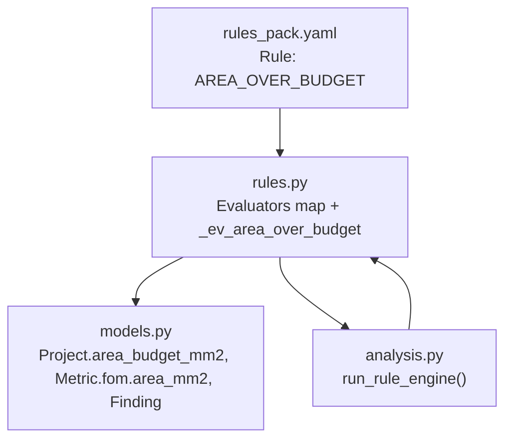
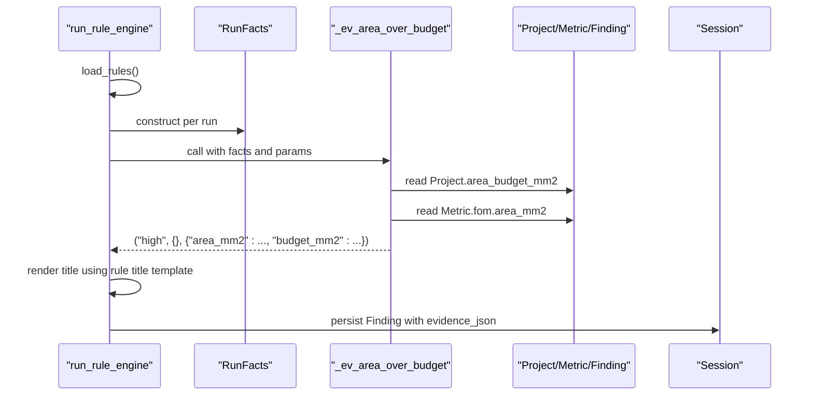
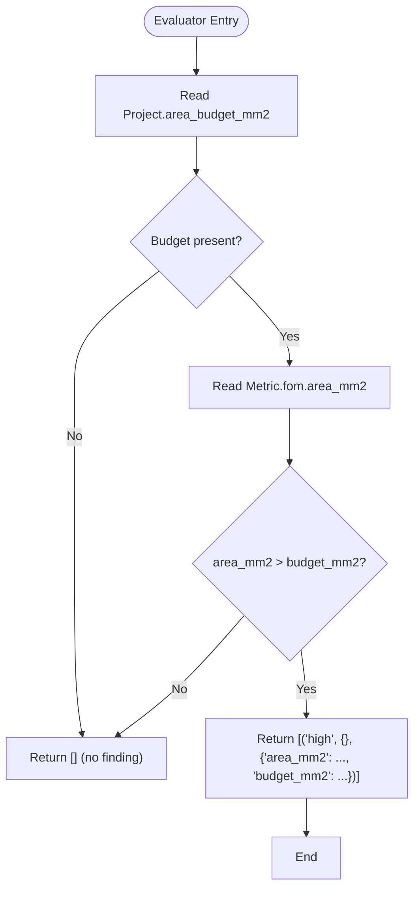
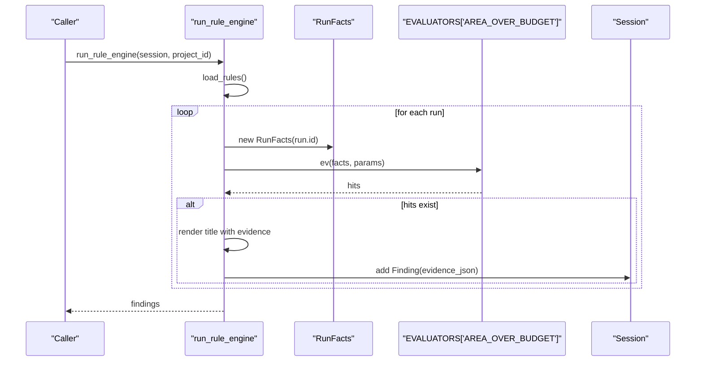
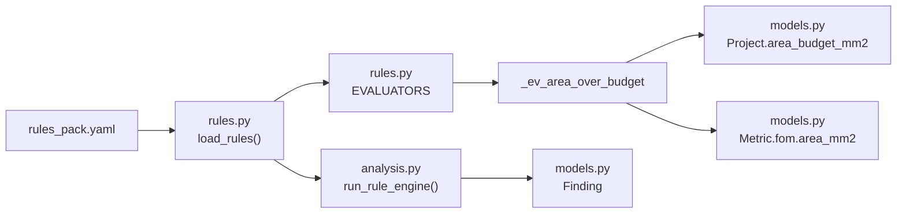

# Area Over Budget Evaluator

<cite>
**Referenced Files in This Document**
- [rules.py](file://backend/ppa/rules.py)
- [rules_pack.yaml](file://backend/ppa/rules_pack.yaml)
- [models.py](file://backend/ppa/models.py)
- [analysis.py](file://backend/ppa/analysis.py)
</cite>

## Table of Contents
1. [Introduction](#introduction)
2. [Project Structure](#project-structure)
3. [Core Components](#core-components)
4. [Architecture Overview](#architecture-overview)
5. [Detailed Component Analysis](#detailed-component-analysis)
6. [Dependency Analysis](#dependency-analysis)
7. [Performance Considerations](#performance-considerations)
8. [Troubleshooting Guide](#troubleshooting-guide)
9. [Conclusion](#conclusion)

## Introduction
This document explains the AREA_OVER_BUDGET evaluator, which detects when a design’s total area exceeds the project’s allocated area budget. It covers how the evaluator reads the project budget from RunFacts, retrieves the current design’s area metric, compares them, and generates high-severity findings integrated into the rule engine’s finding pipeline. It also provides configuration examples from rules_pack.yaml and describes the evidence data structures produced by the evaluator.

## Project Structure
The AREA_OVER_BUDGET logic is implemented as part of the deterministic rule engine:
- Rule definition (id, category, severity, title) lives in rules_pack.yaml.
- The evaluator function is implemented in rules.py and registered in an evaluators map.
- Data access uses models.py for Project, Metric, Finding, and related tables.
- The rule engine orchestrates evaluation per run and persists findings via analysis.py utilities.

**Diagram sources**
- [rules_pack.yaml:31-36](file://backend/ppa/rules_pack.yaml#L31-L36)
- [rules.py:125-130](file://backend/ppa/rules.py#L125-L130)
- [rules.py:290-310](file://backend/ppa/rules.py#L290-L310)
- [models.py:17-27](file://backend/ppa/models.py#L17-L27)
- [models.py:83-90](file://backend/ppa/models.py#L83-L90)
- [models.py:168-180](file://backend/ppa/models.py#L168-L180)
- [analysis.py:313-352](file://backend/ppa/analysis.py#L313-L352)

**Section sources**
- [rules_pack.yaml:31-36](file://backend/ppa/rules_pack.yaml#L31-L36)
- [rules.py:125-130](file://backend/ppa/rules.py#L125-L130)
- [rules.py:290-310](file://backend/ppa/rules.py#L290-L310)
- [models.py:17-27](file://backend/ppa/models.py#L17-L27)
- [models.py:83-90](file://backend/ppa/models.py#L83-L90)
- [models.py:168-180](file://backend/ppa/models.py#L168-L180)
- [analysis.py:313-352](file://backend/ppa/analysis.py#L313-L352)

## Core Components
- Rule definition: AREA_OVER_BUDGET in rules_pack.yaml sets category, severity, and title template with placeholders for area_mm2 and budget_mm2.
- Evaluator: _ev_area_over_budget in rules.py performs the comparison and returns a tuple containing severity, scope, and evidence dict.
- Data model: Project stores area_budget_mm2; Metric stores fom.area_mm2; Finding stores persisted results including evidence_json.
- Rule engine: run_rule_engine in analysis.py loads rules, constructs RunFacts per run, invokes evaluators, renders titles, and persists findings.

Key behaviors:
- If no project or no area budget is set, the evaluator does not trigger.
- If the current design’s area_mm2 exceeds the project’s area_budget_mm2, it emits a high-severity finding with evidence containing both values.

**Section sources**
- [rules_pack.yaml:31-36](file://backend/ppa/rules_pack.yaml#L31-L36)
- [rules.py:125-130](file://backend/ppa/rules.py#L125-L130)
- [models.py:17-27](file://backend/ppa/models.py#L17-L27)
- [models.py:83-90](file://backend/ppa/models.py#L83-L90)
- [models.py:168-180](file://backend/ppa/models.py#L168-L180)
- [analysis.py:313-352](file://backend/ppa/analysis.py#L313-L352)

## Architecture Overview
The AREA_OVER_BUDGET flow integrates YAML rule definitions with Python evaluators and SQL-backed models to produce actionable findings.

**Diagram sources**
- [analysis.py:313-352](file://backend/ppa/analysis.py#L313-L352)
- [rules.py:125-130](file://backend/ppa/rules.py#L125-L130)
- [rules.py:290-310](file://backend/ppa/rules.py#L290-L310)
- [models.py:17-27](file://backend/ppa/models.py#L17-L27)
- [models.py:83-90](file://backend/ppa/models.py#L83-L90)
- [models.py:168-180](file://backend/ppa/models.py#L168-L180)

## Detailed Component Analysis

### Evaluator Logic: _ev_area_over_budget
- Inputs:
  - RunFacts.project.area_budget_mm2 (from Project table).
  - RunFacts.metrics["fom.area_mm2"] (from Metric table keyed by key="fom.area_mm2").
- Decision:
  - If budget exists and area > budget, return a high-severity hit with evidence {area_mm2, budget_mm2}.
  - Otherwise, return no hits.
- Output format:
  - Tuple list of (severity, scope_dict, evidence_dict). For this rule, severity is "high", scope is empty, evidence includes both values.

**Diagram sources**
- [rules.py:125-130](file://backend/ppa/rules.py#L125-L130)
- [models.py:17-27](file://backend/ppa/models.py#L17-L27)
- [models.py:83-90](file://backend/ppa/models.py#L83-L90)

**Section sources**
- [rules.py:125-130](file://backend/ppa/rules.py#L125-L130)
- [models.py:17-27](file://backend/ppa/models.py#L17-L27)
- [models.py:83-90](file://backend/ppa/models.py#L83-L90)

### Rule Definition and Title Rendering
- Rule id: AREA_OVER_BUDGET
- Category: area
- Severity: high
- Title template uses placeholders area_mm2 and budget_mm2, which are filled from the evidence dict returned by the evaluator.
- Params: none required for this rule.

Title rendering occurs in the rule engine after evaluator returns hits, formatting the title with the evidence fields.

**Section sources**
- [rules_pack.yaml:31-36](file://backend/ppa/rules_pack.yaml#L31-L36)
- [analysis.py:313-352](file://backend/ppa/analysis.py#L313-L352)

### Integration with the Rule Engine
- run_rule_engine iterates over all runs for a project, builds RunFacts, and calls each evaluator mapped by rule id.
- For each hit, it renders the title using the rule’s title template and the evaluator’s evidence dict, then creates a Finding with severity, category, scope_path, and evidence_json.
- Findings are persisted to the database and returned to callers.

**Diagram sources**
- [analysis.py:313-352](file://backend/ppa/analysis.py#L313-L352)
- [rules.py:290-310](file://backend/ppa/rules.py#L290-L310)
- [models.py:168-180](file://backend/ppa/models.py#L168-L180)

**Section sources**
- [analysis.py:313-352](file://backend/ppa/analysis.py#L313-L352)
- [rules.py:290-310](file://backend/ppa/rules.py#L290-L310)
- [models.py:168-180](file://backend/ppa/models.py#L168-L180)

### Evidence Data Structures
When a violation is detected, the evaluator returns evidence that includes:
- area_mm2: float representing the current design’s total area in mm².
- budget_mm2: float representing the project’s allocated area budget in mm².

These values are stored in the Finding’s evidence_json and used to render the title string.

Example evidence shape (conceptual):
- {"area_mm2": <float>, "budget_mm2": <float>}

Note: Do not include literal code here; refer to the source lines for exact behavior.

**Section sources**
- [rules.py:125-130](file://backend/ppa/rules.py#L125-L130)
- [models.py:168-180](file://backend/ppa/models.py#L168-L180)

### Threshold Configuration in rules_pack.yaml
- The AREA_OVER_BUDGET rule has no numeric threshold parameters; it strictly enforces the project-level budget.
- To adjust sensitivity, change Project.area_budget_mm2 at the project level rather than rule params.
- Other area rules (e.g., AREA_SEQ_RATIO, AREA_MOD_GROWTH) demonstrate how thresholds are configured via params in rules_pack.yaml.

Configuration reference:
- Rule id: AREA_OVER_BUDGET
- Category: area
- Severity: high
- Title template: uses area_mm2 and budget_mm2 placeholders

**Section sources**
- [rules_pack.yaml:31-36](file://backend/ppa/rules_pack.yaml#L31-L36)
- [models.py:17-27](file://backend/ppa/models.py#L17-L27)

## Dependency Analysis
- RULES_FILE points to rules_pack.yaml, loaded by run_rule_engine.
- EVALUATORS maps rule ids to functions; AREA_OVER_BUDGET maps to _ev_area_over_budget.
- RunFacts aggregates metrics, area/power/perf rows, reports, and project context for each run.
- models.py defines Project.area_budget_mm2, Metric.key/value pairs, and Finding persistence schema.

**Diagram sources**
- [rules.py:16-21](file://backend/ppa/rules.py#L16-L21)
- [rules.py:290-310](file://backend/ppa/rules.py#L290-L310)
- [rules.py:125-130](file://backend/ppa/rules.py#L125-L130)
- [models.py:17-27](file://backend/ppa/models.py#L17-L27)
- [models.py:83-90](file://backend/ppa/models.py#L83-L90)
- [models.py:168-180](file://backend/ppa/models.py#L168-L180)
- [analysis.py:313-352](file://backend/ppa/analysis.py#L313-L352)

**Section sources**
- [rules.py:16-21](file://backend/ppa/rules.py#L16-L21)
- [rules.py:290-310](file://backend/ppa/rules.py#L290-L310)
- [rules.py:125-130](file://backend/ppa/rules.py#L125-L130)
- [models.py:17-27](file://backend/ppa/models.py#L17-L27)
- [models.py:83-90](file://backend/ppa/models.py#L83-L90)
- [models.py:168-180](file://backend/ppa/models.py#L168-L180)
- [analysis.py:313-352](file://backend/ppa/analysis.py#L313-L352)

## Performance Considerations
- The evaluator performs constant-time checks against preloaded RunFacts metrics and project attributes; no additional I/O during evaluation.
- Cost is dominated by loading RunFacts once per run, which batches queries for metrics, area/power/perf rows, and baseline context.
- Avoid adding heavy computations inside evaluators; keep them pure and fast.

[No sources needed since this section provides general guidance]

## Troubleshooting Guide
Common issues and resolutions:
- No finding generated despite expected violation:
  - Ensure Project.area_budget_mm2 is set for the project associated with the run.
  - Verify Metric.fom.area_mm2 exists for the run; if missing, the evaluator defaults to 0.0 and will not trigger.
- Unexpected high severity:
  - Confirm the rule severity in rules_pack.yaml is set to high for AREA_OVER_BUDGET.
- Title not formatted:
  - Check that evidence contains keys area_mm2 and budget_mm2; title rendering depends on these keys.

Relevant implementation references:
- Evaluator logic and evidence emission.
- Rule engine title rendering and finding persistence.
- Project and Metric model fields.

**Section sources**
- [rules.py:125-130](file://backend/ppa/rules.py#L125-L130)
- [analysis.py:313-352](file://backend/ppa/analysis.py#L313-L352)
- [models.py:17-27](file://backend/ppa/models.py#L17-L27)
- [models.py:83-90](file://backend/ppa/models.py#L83-L90)
- [models.py:168-180](file://backend/ppa/models.py#L168-L180)

## Conclusion
The AREA_OVER_BUDGET evaluator provides a straightforward, high-severity check that enforces project-level area budgets against actual design area. It leverages RunFacts for efficient data access, relies on clear metric keys, and integrates seamlessly with the rule engine to produce persistent, human-readable findings. Adjusting sensitivity involves updating the project’s area budget rather than rule parameters, keeping configuration simple and centralized.

[No sources needed since this section summarizes without analyzing specific files]