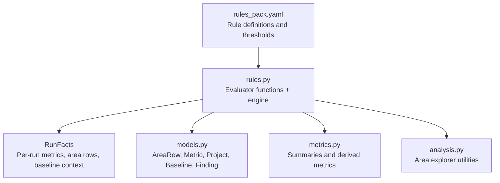
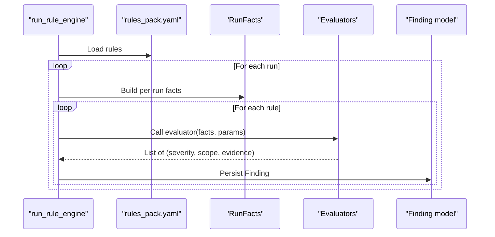
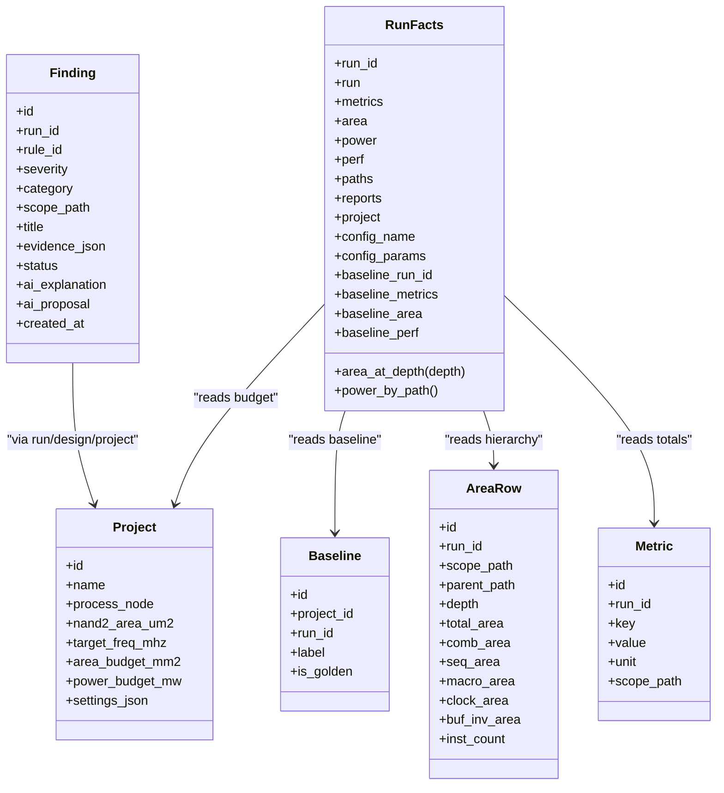

# Area Rule Evaluators

<cite>
**Referenced Files in This Document**
- [rules.py](file://backend/ppa/rules.py)
- [rules_pack.yaml](file://backend/ppa/rules_pack.yaml)
- [metrics.py](file://backend/ppa/metrics.py)
- [models.py](file://backend/ppa/models.py)
- [analysis.py](file://backend/ppa/analysis.py)
</cite>

## Table of Contents
1. [Introduction](#introduction)
2. [Project Structure](#project-structure)
3. [Core Components](#core-components)
4. [Architecture Overview](#architecture-overview)
5. [Detailed Component Analysis](#detailed-component-analysis)
6. [Dependency Analysis](#dependency-analysis)
7. [Performance Considerations](#performance-considerations)
8. [Troubleshooting Guide](#troubleshooting-guide)
9. [Conclusion](#conclusion)

## Introduction
This document explains the area-related rule evaluators that monitor area usage and growth patterns across design runs. It focuses on three rules:
- AREA_OVER_BUDGET: Detects when total area exceeds a project-defined budget.
- AREA_SEQ_RATIO: Flags designs where sequential (register) area is too high relative to total area.
- AREA_MOD_GROWTH: Tracks module-level area growth against a baseline run for a project.

You will learn how evaluators access metrics from RunFacts, compute ratios and percentages, compare against budgets and baselines, and generate findings with severity levels and evidence data.

## Project Structure
The area rule engine is implemented as a set of pure-Python evaluators that read precomputed facts per run and emit findings stored in the database. The configuration for each rule (thresholds, titles, categories, severities) lives in a YAML pack.

**Diagram sources**
- [rules_pack.yaml:31-47](file://backend/ppa/rules_pack.yaml#L31-L47)
- [rules.py:24-73](file://backend/ppa/rules.py#L24-L73)
- [models.py:17-26](file://backend/ppa/models.py#L17-L26)
- [models.py:83-106](file://backend/ppa/models.py#L83-L106)
- [models.py:160-180](file://backend/ppa/models.py#L160-L180)
- [metrics.py:192-203](file://backend/ppa/metrics.py#L192-L203)
- [analysis.py:224-244](file://backend/ppa/analysis.py#L224-L244)

**Section sources**
- [rules_pack.yaml:1-119](file://backend/ppa/rules_pack.yaml#L1-L119)
- [rules.py:1-361](file://backend/ppa/rules.py#L1-L361)
- [models.py:1-217](file://backend/ppa/models.py#L1-L217)
- [metrics.py:1-258](file://backend/ppa/metrics.py#L1-L258)
- [analysis.py:224-244](file://backend/ppa/analysis.py#L224-L244)

## Core Components
- RunFacts: Precomputes all data needed by evaluators for a single run, including metrics, area/power/perf rows, timing paths, reports, project info, config, and baseline context.
- Evaluators: Pure functions that take RunFacts and rule parameters and return hits as tuples of (severity, scope, evidence).
- Rule Pack: YAML file declaring rule IDs, categories, severities, titles, and parameterized thresholds.
- Models: Database schema for area rows, metrics, projects, baselines, and findings.

Key responsibilities:
- AREA_OVER_BUDGET compares total area to project budget.
- AREA_SEQ_RATIO computes sequential area ratio and flags if above threshold.
- AREA_MOD_GROWTH compares module-level areas at a specific depth to baseline and flags significant growth.

**Section sources**
- [rules.py:24-73](file://backend/ppa/rules.py#L24-L73)
- [rules.py:125-153](file://backend/ppa/rules.py#L125-L153)
- [rules_pack.yaml:31-47](file://backend/ppa/rules_pack.yaml#L31-L47)
- [models.py:17-26](file://backend/ppa/models.py#L17-L26)
- [models.py:83-106](file://backend/ppa/models.py#L83-L106)
- [models.py:160-180](file://backend/ppa/models.py#L160-L180)

## Architecture Overview
The rule engine loads rules from YAML, iterates over runs for a project, builds RunFacts per run, invokes matching evaluators, and persists findings.

**Diagram sources**
- [rules.py:313-352](file://backend/ppa/rules.py#L313-L352)
- [rules.py:290-310](file://backend/ppa/rules.py#L290-L310)
- [rules_pack.yaml:1-119](file://backend/ppa/rules_pack.yaml#L1-L119)
- [models.py:168-180](file://backend/ppa/models.py#L168-L180)

## Detailed Component Analysis

### AREA_OVER_BUDGET
Purpose: Detect when total area exceeds the project’s area budget.

How it works:
- Reads the project’s area budget from the project record.
- Reads total area from the run’s metrics (figure-of-merit area in mm^2).
- If area > budget, emits a finding with severity “high” and evidence containing both values.

Data accessed:
- Project.area_budget_mm2
- Metric key for figure-of-merit area in mm^2

Evidence structure:
- area_mm2: current total area in mm^2
- budget_mm2: project budget in mm^2

Threshold configuration:
- No explicit threshold in YAML; severity is fixed to “high”. Budget is configured in the project record.

Example evidence fields:
- { "area_mm2": <float>, "budget_mm2": <float> }

Severity:
- “high”

**Section sources**
- [rules.py:125-130](file://backend/ppa/rules.py#L125-L130)
- [models.py:17-26](file://backend/ppa/models.py#L17-L26)
- [rules_pack.yaml:31-36](file://backend/ppa/rules_pack.yaml#L31-L36)

### AREA_SEQ_RATIO
Purpose: Flag designs where sequential (register) area is disproportionately large compared to total area.

How it works:
- Reads sequential area and total area from the run’s metrics.
- Computes ratio = seq / total.
- If ratio exceeds the configured threshold, emits a finding with severity “low”.

Data accessed:
- Metric keys for sequential area (um^2) and total area (um^2)

Evidence structure:
- ratio: computed sequential area ratio (unitless fraction)

Threshold configuration:
- Configured via YAML parameter threshold (default 0.50).

Example evidence fields:
- { "ratio": <float> }

Severity:
- “low”

**Section sources**
- [rules.py:133-138](file://backend/ppa/rules.py#L133-L138)
- [rules_pack.yaml:37-41](file://backend/ppa/rules_pack.yaml#L37-L41)

### AREA_MOD_GROWTH
Purpose: Track module-level area growth versus a baseline run for the same project.

How it works:
- Requires a baseline run to be associated with the project.
- Retrieves area rows for the current run at a specific depth (module level).
- For each module present in the baseline, computes percentage growth: (current - baseline) / baseline.
- If growth exceeds the configured threshold, emits a finding with severity “medium”, scoped to the module.

Data accessed:
- Current run area rows (hierarchical), filtered by depth.
- Baseline area rows keyed by scope_path.

Evidence structure:
- module: short name extracted from scope path
- pct: percentage growth vs baseline

Threshold configuration:
- Configured via YAML parameter threshold (default 0.05).

Example evidence fields:
- { "module": "<string>", "pct": <float> }

Severity:
- “medium”

Notes:
- Uses a helper to retrieve area rows at a given depth, sorted by area.
- Only modules with positive baseline area are considered to avoid division by zero or undefined growth.

**Section sources**
- [rules.py:24-73](file://backend/ppa/rules.py#L24-L73)
- [rules.py:141-153](file://backend/ppa/rules.py#L141-L153)
- [rules_pack.yaml:43-47](file://backend/ppa/rules_pack.yaml#L43-L47)
- [models.py:93-106](file://backend/ppa/models.py#L93-L106)
- [models.py:160-166](file://backend/ppa/models.py#L160-L166)

### How RunFacts Provides Data
RunFacts preloads:
- Metrics map: key -> value for the run.
- Area rows: list of hierarchical area records for the run.
- Power, performance, timing paths, raw reports.
- Project and config details.
- Baseline context: baseline metrics, baseline area map, baseline performance rows.

It also provides:
- area_at_depth(depth): returns area rows at a given depth, sorted by area descending.
- power_by_path(): maps scope_path to power row.

These abstractions simplify evaluator logic and ensure consistent data access.

**Section sources**
- [rules.py:24-73](file://backend/ppa/rules.py#L24-L73)

### Evidence and Findings
Each evaluator returns hits as tuples:
- severity: string override or None to use rule default
- scope: dict with optional module key
- evidence: dict of numeric/string values used to render titles and persist as JSON

The engine renders titles using rule templates and stores findings with category, severity, scope, and evidence.

**Section sources**
- [rules.py:313-352](file://backend/ppa/rules.py#L313-L352)
- [models.py:168-180](file://backend/ppa/models.py#L168-L180)

## Dependency Analysis

**Diagram sources**
- [models.py:17-26](file://backend/ppa/models.py#L17-L26)
- [models.py:83-106](file://backend/ppa/models.py#L83-L106)
- [models.py:160-180](file://backend/ppa/models.py#L160-L180)
- [rules.py:24-73](file://backend/ppa/rules.py#L24-L73)

**Section sources**
- [models.py:17-26](file://backend/ppa/models.py#L17-L26)
- [models.py:83-106](file://backend/ppa/models.py#L83-L106)
- [models.py:160-180](file://backend/ppa/models.py#L160-L180)
- [rules.py:24-73](file://backend/ppa/rules.py#L24-L73)

## Performance Considerations
- RunFacts preloads all necessary data per run once, minimizing repeated queries during evaluation.
- AREA_MOD_GROWTH limits analysis to top N modules at a specific depth to keep computation bounded.
- All arithmetic is performed in Python evaluators; avoid heavy computations inside loops.
- Ensure baseline mapping uses scope_path keys for O(1) lookups.

[No sources needed since this section provides general guidance]

## Troubleshooting Guide
Common issues and checks:
- Missing baseline: AREA_MOD_GROWTH requires a baseline run associated with the project. If none exists, no findings are generated.
- Zero baseline area: Growth calculation skips modules with zero baseline area to avoid division errors.
- Empty metrics: AREA_SEQ_RATIO requires both sequential and total area metrics; missing data yields no findings.
- Budget not set: AREA_OVER_BUDGET only triggers when a project area budget is defined.

Where to inspect:
- RunFacts initialization and baseline loading.
- Evaluator conditionals and thresholds.
- Rule pack parameters and severities.

**Section sources**
- [rules.py:24-73](file://backend/ppa/rules.py#L24-L73)
- [rules.py:125-153](file://backend/ppa/rules.py#L125-L153)
- [rules_pack.yaml:31-47](file://backend/ppa/rules_pack.yaml#L31-L47)

## Conclusion
The area rule evaluators provide deterministic, configurable checks for area budget compliance, sequential area dominance, and module-level growth trends. By leveraging RunFacts, they access consistent metrics and baseline context, compute simple ratios and percentages, and produce actionable findings with clear evidence and severity. Thresholds and behavior are tuned via the YAML rule pack without code changes, enabling rapid iteration and designer control.

[No sources needed since this section summarizes without analyzing specific files]