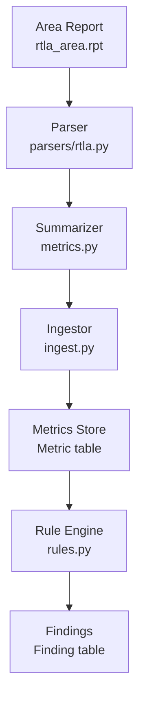
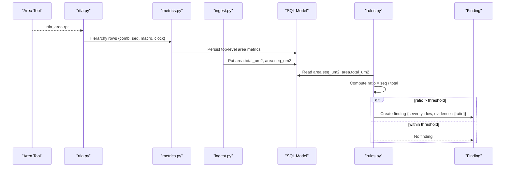
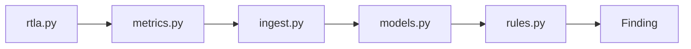

# Area Sequential Ratio Evaluator

<cite>
**Referenced Files in This Document**
- [rules.py](file://backend/ppa/rules.py)
- [rules_pack.yaml](file://backend/ppa/rules_pack.yaml)
- [metrics.py](file://backend/ppa/metrics.py)
- [ingest.py](file://backend/ppa/ingest.py)
- [rtla.py](file://backend/ppa/parsers/rtla.py)
- [models.py](file://backend/ppa/models.py)
- [analysis.py](file://backend/ppa/analysis.py)
- [rtla_area.rpt](file://sample_runs/baseline/rtla_area.rpt)
</cite>

## Table of Contents
1. [Introduction](#introduction)
2. [Project Structure](#project-structure)
3. [Core Components](#core-components)
4. [Architecture Overview](#architecture-overview)
5. [Detailed Component Analysis](#detailed-component-analysis)
6. [Dependency Analysis](#dependency-analysis)
7. [Performance Considerations](#performance-considerations)
8. [Troubleshooting Guide](#troubleshooting-guide)
9. [Conclusion](#conclusion)
10. [Appendices](#appendices)

## Introduction
This document explains the AREA_SEQ_RATIO evaluator, which detects when sequential elements (flip-flops and latches) consume too much area relative to the total design area. It covers how the ratio is computed from area metrics, how thresholds are configured, what evidence is produced, and how to interpret results for RISC-V designs.

The evaluator is part of a deterministic rule engine that runs after ingestion and metric summarization. It reads normalized metrics stored per run and emits low-severity findings when the sequential area share exceeds a configurable threshold.

## Project Structure
The AREA_SEQ_RATIO evaluation spans several modules:
- Parsing of area reports into structured rows
- Summarization into top-level area metrics
- Ingestion of those metrics into a key-value store
- Rule evaluation against those metrics
- Storage of findings with evidence

**Diagram sources**
- [rtla.py:25-71](file://backend/ppa/parsers/rtla.py#L25-L71)
- [metrics.py:192-203](file://backend/ppa/metrics.py#L192-L203)
- [ingest.py:196-200](file://backend/ppa/ingest.py#L196-L200)
- [rules.py:133-138](file://backend/ppa/rules.py#L133-L138)
- [models.py:83-90](file://backend/ppa/models.py#L83-L90)

**Section sources**
- [rtla.py:25-71](file://backend/ppa/parsers/rtla.py#L25-L71)
- [metrics.py:192-203](file://backend/ppa/metrics.py#L192-L203)
- [ingest.py:196-200](file://backend/ppa/ingest.py#L196-L200)
- [rules.py:133-138](file://backend/ppa/rules.py#L133-L138)
- [models.py:83-90](file://backend/ppa/models.py#L83-L90)

## Core Components
- Area report parser extracts hierarchical area breakdowns including combinatorial, sequential, macro, clock, and buffer/inverter areas.
- Summarizer computes top-level totals and derived ratios such as seq_ratio.
- Ingestor persists normalized metrics like area.total_um2 and area.seq_um2.
- Rule evaluator implements AREA_SEQ_RATIO using these metrics and a configurable threshold.
- Findings are stored with severity, category, title, and evidence JSON containing the computed ratio.

Key responsibilities:
- Parser: convert raw tool output into typed rows
- Summarizer: aggregate to top-level metrics and compute ratios
- Ingestor: persist metrics for downstream consumers
- Rule engine: evaluate rules and produce findings
- Models: define storage schema for metrics and findings

**Section sources**
- [rtla.py:25-71](file://backend/ppa/parsers/rtla.py#L25-L71)
- [metrics.py:32-44](file://backend/ppa/metrics.py#L32-L44)
- [metrics.py:192-203](file://backend/ppa/metrics.py#L192-L203)
- [ingest.py:196-200](file://backend/ppa/ingest.py#L196-L200)
- [rules.py:133-138](file://backend/ppa/rules.py#L133-L138)
- [models.py:83-90](file://backend/ppa/models.py#L83-L90)

## Architecture Overview
End-to-end flow for AREA_SEQ_RATIO:

**Diagram sources**
- [rtla.py:25-71](file://backend/ppa/parsers/rtla.py#L25-L71)
- [metrics.py:192-203](file://backend/ppa/metrics.py#L192-L203)
- [ingest.py:196-200](file://backend/ppa/ingest.py#L196-L200)
- [rules.py:133-138](file://backend/ppa/rules.py#L133-L138)
- [models.py:83-90](file://backend/ppa/models.py#L83-L90)

## Detailed Component Analysis

### Area Report Parsing
- The parser reads RTLA area reports and extracts per-module and total rows.
- Each row includes combinatorial, sequential, macro, clock, buffer/inverter area, and instruction count.
- The “Total” row provides the top-level values used for summaries.

Evidence path:
- Raw report lines map to structured rows with fields for comb, seq, macro, clock, buf_inv, cells.

**Section sources**
- [rtla.py:25-71](file://backend/ppa/parsers/rtla.py#L25-L71)
- [rtla_area.rpt:1-34](file://sample_runs/baseline/rtla_area.rpt#L1-L34)

### Area Summarization and Derived Ratios
- Summarizer selects the top-level row (minimum depth) to avoid double-counting hierarchy.
- It constructs an AreaSummary with total_um2, comb_um2, seq_um2, macro_um2, clock_um2, inst_count, util_pct.
- AreaSummary exposes a seq_ratio property equal to seq_um2 / total_um2 (safe-guarded for zero total).

Complexity:
- O(1) selection of top-level row; ratio computation is constant time.

**Section sources**
- [metrics.py:192-203](file://backend/ppa/metrics.py#L192-L203)
- [metrics.py:32-44](file://backend/ppa/metrics.py#L32-L44)

### Metric Ingestion
- After summarization, ingest stores normalized metrics under keys like area.total_um2 and area.seq_um2 with units.
- These keys are consumed by the rule engine without re-parsing reports.

Storage model:
- Metric table holds key/value pairs per run, enabling flexible queries by evaluators.

**Section sources**
- [ingest.py:196-200](file://backend/ppa/ingest.py#L196-L200)
- [models.py:83-90](file://backend/ppa/models.py#L83-L90)

### RULE: AREA_SEQ_RATIO Evaluator
- Reads area.seq_um2 and area.total_um2 from the run’s metrics.
- Computes ratio = seq_um2 / total_um2 if total_um2 is non-zero.
- Compares ratio against threshold parameter (default 0.50).
- If exceeded, returns a low-severity finding with evidence containing the ratio.

Behavioral notes:
- Safe division: no division-by-zero when total_um2 is zero.
- Severity: always “low”.
- Evidence: includes the computed ratio value.

Configuration:
- Threshold is defined in the rule pack and can be tuned per project or run context.

**Section sources**
- [rules.py:133-138](file://backend/ppa/rules.py#L133-L138)
- [rules_pack.yaml:37-41](file://backend/ppa/rules_pack.yaml#L37-L41)

### Finding Generation and Storage
- The rule engine iterates rules, calls evaluators, and creates Finding records with severity, category, scope_path, title, and evidence_json.
- For AREA_SEQ_RATIO, scope_path is typically None since it applies at the top level.

Title rendering:
- Titles are templated with evidence values (e.g., ratio formatted as percentage).

**Section sources**
- [rules.py:313-352](file://backend/ppa/rules.py#L313-L352)
- [rules_pack.yaml:37-41](file://backend/ppa/rules_pack.yaml#L37-L41)

### Area Explorer Integration
- The area explorer computes per-scope seq_ratio for visualization and comparison.
- It also shows delta vs baseline percentages and shares of total area.

Use cases:
- Identify modules where sequential area dominates.
- Track changes across runs or baselines.

**Section sources**
- [analysis.py:224-244](file://backend/ppa/analysis.py#L224-L244)

## Dependency Analysis
The AREA_SEQ_RATIO rule depends on:
- Parsed area data to build summaries
- Summaries to provide top-level metrics
- Ingestion to persist metrics for later consumption
- Models to store metrics and findings

**Diagram sources**
- [rtla.py:25-71](file://backend/ppa/parsers/rtla.py#L25-L71)
- [metrics.py:192-203](file://backend/ppa/metrics.py#L192-L203)
- [ingest.py:196-200](file://backend/ppa/ingest.py#L196-L200)
- [models.py:83-90](file://backend/ppa/models.py#L83-L90)
- [rules.py:133-138](file://backend/ppa/rules.py#L133-L138)

**Section sources**
- [rtla.py:25-71](file://backend/ppa/parsers/rtla.py#L25-L71)
- [metrics.py:192-203](file://backend/ppa/metrics.py#L192-L203)
- [ingest.py:196-200](file://backend/ppa/ingest.py#L196-L200)
- [models.py:83-90](file://backend/ppa/models.py#L83-L90)
- [rules.py:133-138](file://backend/ppa/rules.py#L133-L138)

## Performance Considerations
- The evaluator performs constant-time arithmetic on two scalar metrics.
- Parsing and summarization dominate runtime; they operate over area report rows once per run.
- Avoid repeated recomputation by relying on persisted metrics during rule evaluation.

[No sources needed since this section provides general guidance]

## Troubleshooting Guide
Common issues and resolutions:
- Missing area report: Ensure rtla_area.rpt exists and contains valid hierarchy rows. The parser raises an error if no rows are found.
- Zero total area: The evaluator safely handles zero total_um2 by not triggering a finding.
- Unexpected high ratio: Verify that sequential area includes flip-flops/latches and that macros/clocks are categorized correctly in the source report.
- Threshold tuning: Adjust the threshold in the rule pack to match design goals. Lower thresholds increase sensitivity; higher thresholds reduce false positives.

Evidence inspection:
- Check the Finding’s evidence_json for the ratio value.
- Use the area explorer to inspect per-module seq_ratio and deltas versus baseline.

**Section sources**
- [rtla.py:25-71](file://backend/ppa/parsers/rtla.py#L25-L71)
- [rules.py:133-138](file://backend/ppa/rules.py#L133-L138)
- [analysis.py:224-244](file://backend/ppa/analysis.py#L224-L244)

## Conclusion
The AREA_SEQ_RATIO evaluator provides a simple, robust check for excessive sequential area in RISC-V designs. By computing seq_um2 / total_um2 and comparing against a configurable threshold, it flags potential imbalance between sequential and combinational logic. Designers can tune thresholds based on architecture targets and use the area explorer to drill down into module-level contributions.

[No sources needed since this section summarizes without analyzing specific files]

## Appendices

### Threshold Configuration Examples
- Default threshold: 0.50 (50% sequential area)
- To lower sensitivity: set threshold to 0.60
- To raise sensitivity: set threshold to 0.40

Configuration location:
- Rule definition and default parameters are declared in the rule pack.

**Section sources**
- [rules_pack.yaml:37-41](file://backend/ppa/rules_pack.yaml#L37-L41)

### Evidence Data Structures
When a finding is generated, evidence_json includes:
- ratio: float representing seq_um2 / total_um2

Example interpretation:
- ratio = 0.55 means 55% of total area is sequential.
- Compare against threshold to determine severity and action.

**Section sources**
- [rules.py:133-138](file://backend/ppa/rules.py#L133-L138)

### Interpreting Sequential vs Combinational Area Balance in RISC-V Designs
- High sequential share often indicates large stateful structures (e.g., ROB, LSQ, caches, BTAC).
- Low sequential share suggests a more combinational-heavy datapath (ALUs, decoders).
- Use per-module seq_ratio to identify dominant contributors and guide optimization (e.g., memory sizing, pipeline depth, register file organization).

Visualization aids:
- Area explorer shows per-module seq_ratio and delta vs baseline.
- Combine with power and timing insights to balance performance, area, and power.

**Section sources**
- [analysis.py:224-244](file://backend/ppa/analysis.py#L224-L244)
- [rtla_area.rpt:1-34](file://sample_runs/baseline/rtla_area.rpt#L1-L34)