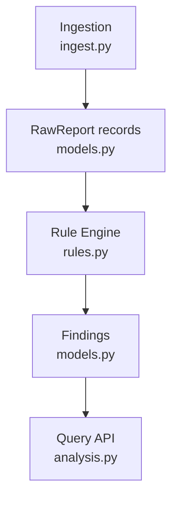
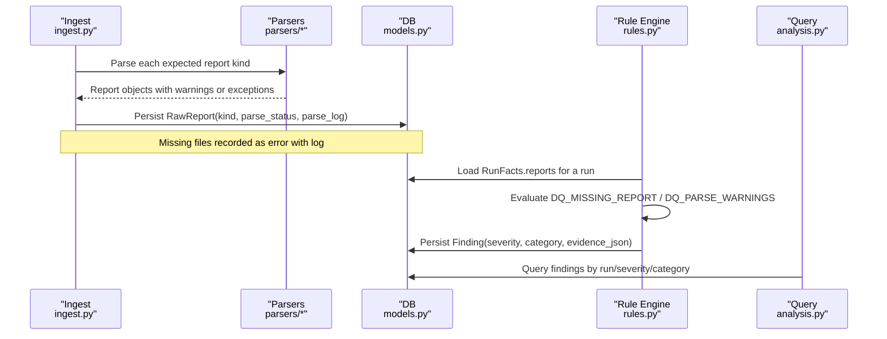
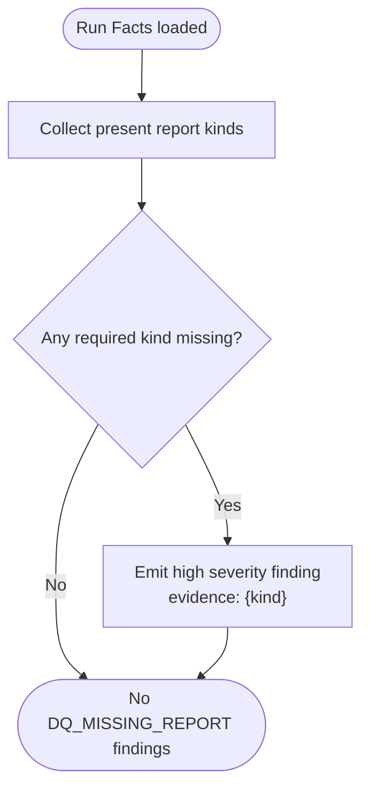
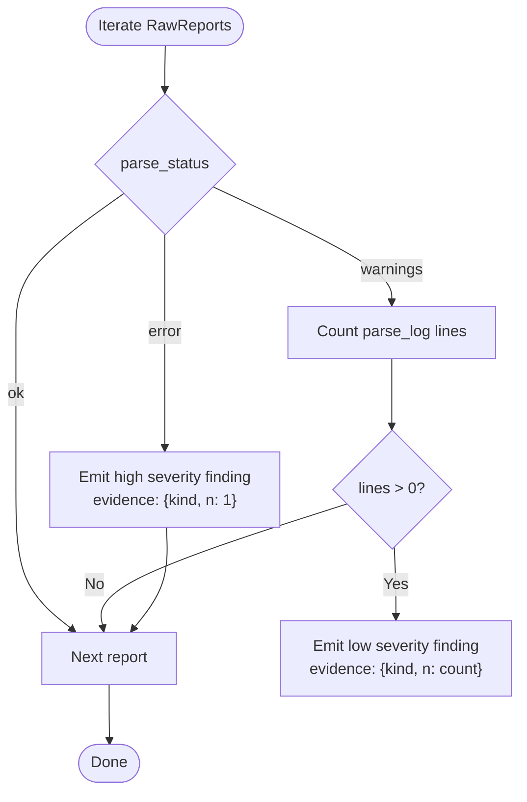
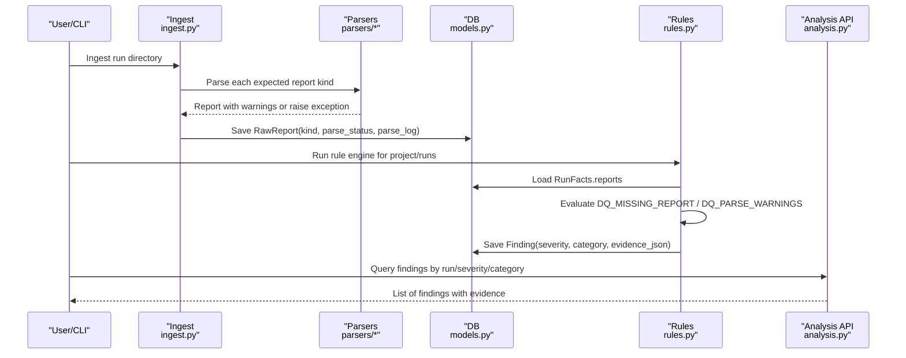
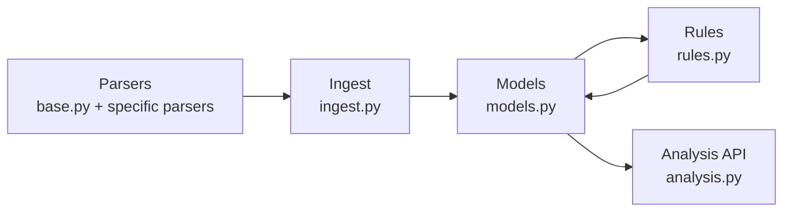

# Data Quality Rule Evaluators

<cite>
**Referenced Files in This Document**
- [rules.py](file://backend/ppa/rules.py)
- [rules_pack.yaml](file://backend/ppa/rules_pack.yaml)
- [models.py](file://backend/ppa/models.py)
- [ingest.py](file://backend/ppa/ingest.py)
- [analysis.py](file://backend/ppa/analysis.py)
- [cli.py](file://backend/ppa/cli.py)
- [base.py](file://backend/ppa/parsers/base.py)
</cite>

## Table of Contents
1. [Introduction](#introduction)
2. [Project Structure](#project-structure)
3. [Core Components](#core-components)
4. [Architecture Overview](#architecture-overview)
5. [Detailed Component Analysis](#detailed-component-analysis)
6. [Dependency Analysis](#dependency-analysis)
7. [Performance Considerations](#performance-considerations)
8. [Troubleshooting Guide](#troubleshooting-guide)
9. [Conclusion](#conclusion)

## Introduction
This document explains the data quality rule evaluators that ensure completeness and reliability of analysis data produced by EDA and simulation tools. It focuses on two rules:
- DQ_MISSING_REPORT: Detects missing tool reports required for a complete analysis run.
- DQ_PARSE_WARNINGS: Identifies parser failures and warnings across parsed reports.

The evaluators operate deterministically over ingested data, producing findings with severity levels and evidence to support diagnosis and remediation.

## Project Structure
Data quality evaluation is implemented as part of a deterministic rule engine. The workflow spans ingestion (parsing and persistence), rule evaluation, and finding retrieval.

**Diagram sources**
- [ingest.py:61-113](file://backend/ppa/ingest.py#L61-L113)
- [models.py:69-78](file://backend/ppa/models.py#L69-L78)
- [rules.py:313-352](file://backend/ppa/rules.py#L313-L352)
- [analysis.py:401-438](file://backend/ppa/analysis.py#L401-L438)

**Section sources**
- [ingest.py:1-35](file://backend/ppa/ingest.py#L1-L35)
- [models.py:69-78](file://backend/ppa/models.py#L69-L78)
- [rules.py:313-352](file://backend/ppa/rules.py#L313-L352)
- [analysis.py:401-438](file://backend/ppa/analysis.py#L401-L438)

## Core Components
- RawReport: Stores each report’s kind, file path, content hash, parser version, parse status, and parse log.
- RunFacts: Precomputed per-run context including all RawReport entries for a run.
- Evaluators: Pure functions that inspect RunFacts and return findings tuples (severity, scope, evidence).
- Rule Pack: YAML configuration declaring rule IDs, categories, severities, titles, and thresholds.

Key responsibilities:
- Ingestion persists parse outcomes and logs for every expected report kind.
- Evaluators scan these persisted records to detect missing reports and parsing issues.
- Findings are created with severity and evidence for downstream querying and UI display.

**Section sources**
- [models.py:69-78](file://backend/ppa/models.py#L69-L78)
- [rules.py:24-49](file://backend/ppa/rules.py#L24-L49)
- [rules.py:269-287](file://backend/ppa/rules.py#L269-L287)
- [rules_pack.yaml:109-119](file://backend/ppa/rules_pack.yaml#L109-L119)

## Architecture Overview
The data quality evaluation pipeline integrates with ingestion and the rule engine:

**Diagram sources**
- [ingest.py:93-113](file://backend/ppa/ingest.py#L93-L113)
- [models.py:69-78](file://backend/ppa/models.py#L69-L78)
- [rules.py:313-352](file://backend/ppa/rules.py#L313-L352)
- [analysis.py:401-438](file://backend/ppa/analysis.py#L401-L438)

## Detailed Component Analysis

### DQ_MISSING_REPORT: Missing EDA Tool Report Detection
Purpose:
- Ensure completeness by verifying that all required report kinds exist for a run.
- Required kinds: rtla_area, rtla_timing, rtla_qor, primepower, specint.

How it works:
- During ingestion, for each expected report kind, if the file does not exist, a RawReport is persisted with parse_status set to error and parse_log indicating missing file.
- The evaluator collects all existing report kinds for the run and compares against the required set; any missing kind produces a high-severity finding.

Severity assignment logic:
- Severity is always high because missing critical reports compromise downstream metrics and cross-domain comparisons.

Evidence collection:
- Evidence includes the missing kind, enabling precise remediation.

Validation workflow example:
- If a run lacks rtla_timing.rpt, ingestion records an error RawReport; the evaluator emits a finding with kind=rtla_timing and severity=high.

**Diagram sources**
- [rules.py:269-275](file://backend/ppa/rules.py#L269-L275)
- [ingest.py:93-113](file://backend/ppa/ingest.py#L93-L113)

**Section sources**
- [rules.py:269-275](file://backend/ppa/rules.py#L269-L275)
- [ingest.py:93-113](file://backend/ppa/ingest.py#L93-L113)
- [rules_pack.yaml:109-114](file://backend/ppa/rules_pack.yaml#L109-L114)

### DQ_PARSE_WARNINGS: Parser Warning and Error Identification
Purpose:
- Identify parsing failures and warnings across all reports for a run.
- Surface both hard errors (parse failures) and soft issues (warnings).

How it works:
- Ingestion sets parse_status based on parser behavior:
  - ok when no warnings
  - warnings when one or more warnings were collected
  - error when an exception occurred during parsing
- The evaluator iterates through all RawReport entries for the run:
  - If parse_status is error, emit a high-severity finding with kind and count indicator.
  - If parse_status is warnings and parse_log has lines, count lines and emit a low-severity finding with kind and warning count.

Severity assignment logic:
- Errors are high severity because they indicate parsing failure and likely missing or corrupted data.
- Warnings are low severity to flag potential concerns without halting analysis.

Evidence collection:
- For errors: kind and a count indicator.
- For warnings: kind and number of warning lines captured from parse_log.

Validation workflow example:
- If rtla_area.rpt parses successfully but contains warnings, ingestion stores parse_status=warnings and a truncated parse_log; the evaluator counts lines and emits a low-severity finding with n equal to the line count.

**Diagram sources**
- [rules.py:278-287](file://backend/ppa/rules.py#L278-L287)
- [ingest.py:93-113](file://backend/ppa/ingest.py#L93-L113)

**Section sources**
- [rules.py:278-287](file://backend/ppa/rules.py#L278-L287)
- [ingest.py:93-113](file://backend/ppa/ingest.py#L93-L113)
- [rules_pack.yaml:115-119](file://backend/ppa/rules_pack.yaml#L115-L119)

### Report Validation Workflows and Evidence Collection
End-to-end flow:
- Ingestion attempts to parse each expected report kind using dedicated parsers.
- On success, it records parse_status and up to 50 warnings in parse_log.
- On failure, it records parse_status=error and the exception message in parse_log.
- Missing files are recorded with parse_status=error and parse_log="missing file".
- The rule engine loads all RawReport entries for a run via RunFacts.reports.
- DQ_MISSING_REPORT checks for absent kinds and emits high-severity findings.
- DQ_PARSE_WARNINGS inspects parse_status and parse_log to emit high or low findings.
- Findings are queryable by run, severity, and category, and include structured evidence_json for automation and UI rendering.

**Diagram sources**
- [ingest.py:93-113](file://backend/ppa/ingest.py#L93-L113)
- [rules.py:313-352](file://backend/ppa/rules.py#L313-L352)
- [analysis.py:401-438](file://backend/ppa/analysis.py#L401-L438)

**Section sources**
- [ingest.py:93-113](file://backend/ppa/ingest.py#L93-L113)
- [rules.py:313-352](file://backend/ppa/rules.py#L313-L352)
- [analysis.py:401-438](file://backend/ppa/analysis.py#L401-L438)

## Dependency Analysis
- Ingestion depends on parsers and writes RawReport records with parse_status and parse_log.
- Rules depend on models to read RunFacts.reports and write Finding records.
- Analysis provides APIs to retrieve findings and ingest status for UI consumption.

**Diagram sources**
- [base.py:1-62](file://backend/ppa/parsers/base.py#L1-L62)
- [ingest.py:93-113](file://backend/ppa/ingest.py#L93-L113)
- [models.py:69-78](file://backend/ppa/models.py#L69-L78)
- [rules.py:313-352](file://backend/ppa/rules.py#L313-L352)
- [analysis.py:401-438](file://backend/ppa/analysis.py#L401-L438)

**Section sources**
- [base.py:1-62](file://backend/ppa/parsers/base.py#L1-L62)
- [ingest.py:93-113](file://backend/ppa/ingest.py#L93-L113)
- [models.py:69-78](file://backend/ppa/models.py#L69-L78)
- [rules.py:313-352](file://backend/ppa/rules.py#L313-L352)
- [analysis.py:401-438](file://backend/ppa/analysis.py#L401-L438)

## Performance Considerations
- Evaluation is O(N) over the number of reports per run, which is small and fixed (five kinds).
- Parsing and logging capture limited lines (up to 50 warnings) to keep storage and processing lightweight.
- Rule engine runs once per project after ingestion; findings are recomputed by clearing old findings for relevant runs before reinsertion.

[No sources needed since this section provides general guidance]

## Troubleshooting Guide
Common issues and how to diagnose them:
- Missing report files:
  - Symptom: DQ_MISSING_REPORT findings with kind values.
  - Cause: Expected .rpt files not present in the run directory.
  - Resolution: Provide the missing report files and re-ingest.
- Parser exceptions:
  - Symptom: DQ_PARSE_WARNINGS findings with high severity and kind.
  - Cause: File format mismatch or parser crash.
  - Resolution: Inspect parse_log for the exception message; update or fix input; consider updating parsers if tool output changed.
- Excessive warnings:
  - Symptom: DQ_PARSE_WARNINGS findings with low severity and large n.
  - Cause: Non-fatal parsing warnings (e.g., deprecated fields).
  - Resolution: Review parse_log; validate tool versions; adjust inputs if necessary.

Useful utilities:
- CLI check-format command can attempt to parse a single report and print extracted rows and warnings to help debug parser behavior.

**Section sources**
- [cli.py:72-98](file://backend/ppa/cli.py#L72-L98)
- [ingest.py:93-113](file://backend/ppa/ingest.py#L93-L113)
- [rules.py:269-287](file://backend/ppa/rules.py#L269-L287)

## Conclusion
The data quality rule evaluators provide deterministic, evidence-backed checks for report completeness and parsing integrity. DQ_MISSING_REPORT ensures all required reports are present, while DQ_PARSE_WARNINGS surfaces parsing failures and warnings with appropriate severity. Together, they safeguard the reliability of downstream metrics and analysis, enabling rapid identification and remediation of data quality issues.