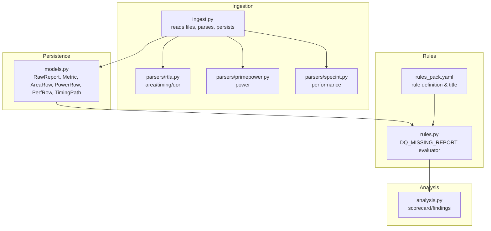
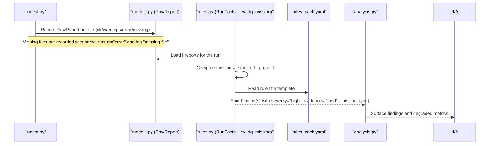
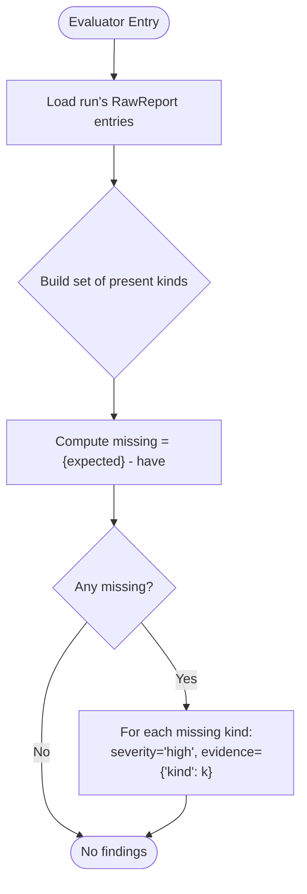
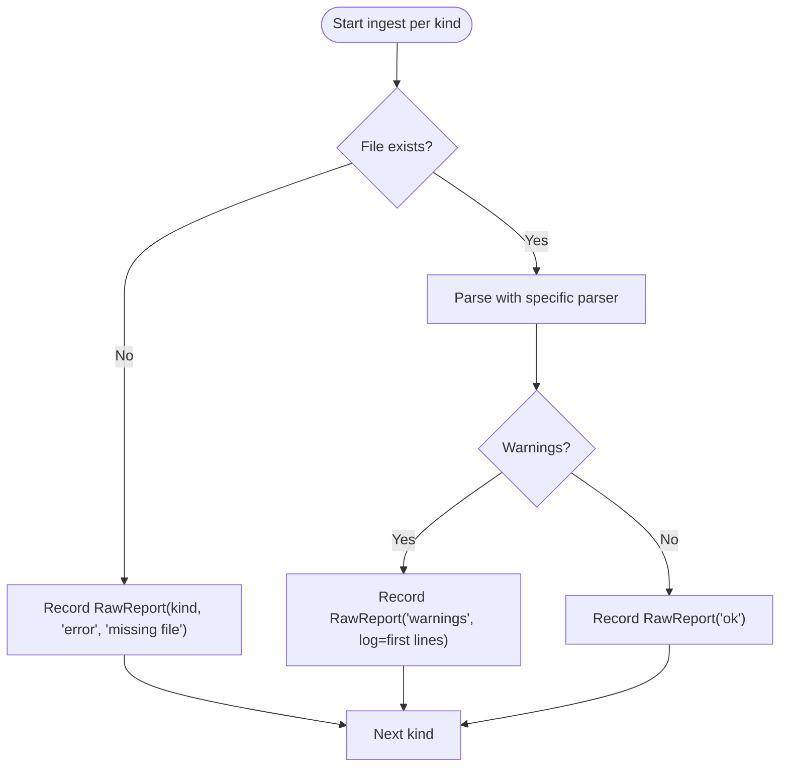
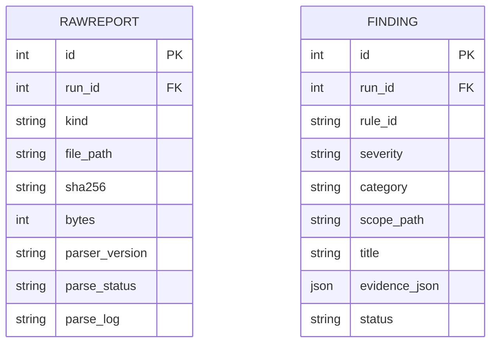
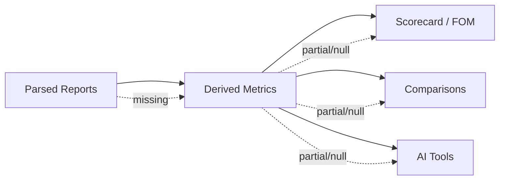
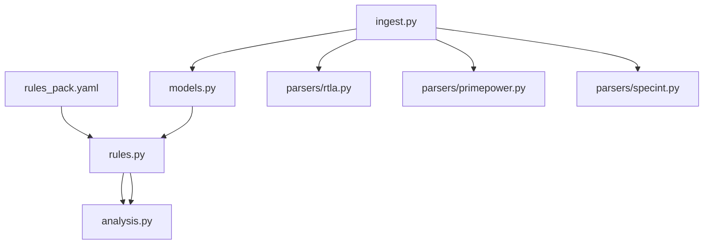

# Missing Report Detection

<cite>
**Referenced Files in This Document**
- [rules.py](file://backend/ppa/rules.py)
- [rules_pack.yaml](file://backend/ppa/rules_pack.yaml)
- [ingest.py](file://backend/ppa/ingest.py)
- [models.py](file://backend/ppa/models.py)
- [analysis.py](file://backend/ppa/analysis.py)
- [rtla.py](file://backend/ppa/parsers/rtla.py)
- [primepower.py](file://backend/ppa/parsers/primepower.py)
- [specint.py](file://backend/ppa/parsers/specint.py)
</cite>

## Table of Contents
1. Introduction
2. Project Structure
3. Core Components
4. Architecture Overview
5. Detailed Component Analysis
6. Dependency Analysis
7. Performance Considerations
8. Troubleshooting Guide
9. Conclusion

## Introduction
This document explains the DQ_MISSING_REPORT data quality rule evaluator that detects missing EDA tool reports for a run. It covers how the system scans the run’s report inventory, identifies absent critical analysis outputs (RTLA area/timing/QOR reports, PrimePower results, and SPECint performance data), assigns severity, collects evidence, and how missing reports propagate into downstream analysis and user experience.

## Project Structure
The missing-report detection spans ingestion, persistence, rule evaluation, and analysis:
- Ingestion reads expected report files per run, records parse status, and persists structured rows and metrics.
- Rule evaluation inspects the run’s stored RawReport entries to detect missing kinds and emits findings.
- Analysis surfaces findings and metrics used by dashboards and AI tools.

**Diagram sources**
- [ingest.py:25-31](file://backend/ppa/ingest.py#L25-L31)
- [models.py:69-79](file://backend/ppa/models.py#L69-L79)
- [rules.py:269-275](file://backend/ppa/rules.py#L269-L275)
- [rules_pack.yaml:109-114](file://backend/ppa/rules_pack.yaml#L109-L114)
- [analysis.py:69-125](file://backend/ppa/analysis.py#L69-L125)

**Section sources**
- [ingest.py:25-31](file://backend/ppa/ingest.py#L25-L31)
- [models.py:69-79](file://backend/ppa/models.py#L69-L79)
- [rules.py:269-275](file://backend/ppa/rules.py#L269-L275)
- [rules_pack.yaml:109-114](file://backend/ppa/rules_pack.yaml#L109-L114)
- [analysis.py:69-125](file://backend/ppa/analysis.py#L69-L125)

## Core Components
- RunFacts: Precomputed context per run including all RawReport entries for that run.
- DQ_MISSING_REPORT evaluator: Compares expected report kinds against present ones and emits high-severity findings for each missing kind.
- Rule pack: Declares the rule ID, category, severity, and title template used to render findings.
- Ingestion pipeline: Records missing files as RawReport with error status and continues processing other reports.
- Analysis layer: Exposes findings and metrics to UI and AI tools; missing reports can degrade or block certain views.

Key responsibilities:
- Detect absence of RTLA area, timing, QOR, PrimePower, and SPECint reports.
- Assign severity “high” for any missing critical report.
- Capture which specific report type is missing in evidence_json.

**Section sources**
- [rules.py:24-39](file://backend/ppa/rules.py#L24-L39)
- [rules.py:269-275](file://backend/ppa/rules.py#L269-L275)
- [rules_pack.yaml:109-114](file://backend/ppa/rules_pack.yaml#L109-L114)
- [ingest.py:93-113](file://backend/ppa/ingest.py#L93-L113)
- [analysis.py:69-125](file://backend/ppa/analysis.py#L69-L125)

## Architecture Overview
The DQ_MISSING_REPORT flow integrates ingestion, rule evaluation, and analysis:

**Diagram sources**
- [ingest.py:93-113](file://backend/ppa/ingest.py#L93-L113)
- [rules.py:24-39](file://backend/ppa/rules.py#L24-L39)
- [rules.py:269-275](file://backend/ppa/rules.py#L269-L275)
- [rules_pack.yaml:109-114](file://backend/ppa/rules_pack.yaml#L109-L114)
- [analysis.py:69-125](file://backend/ppa/analysis.py#L69-L125)

## Detailed Component Analysis

### DQ_MISSING_REPORT Evaluator
- Expected report kinds: rtla_area, rtla_timing, rtla_qor, primepower, specint.
- Evidence collection: For each missing kind, emits a finding with evidence_json containing {"kind": <missing_kind>}.
- Severity assignment: Always "high" for missing reports, independent of thresholds.
- Integration: Uses RunFacts.reports, which aggregates all RawReport entries for the run.

**Diagram sources**
- [rules.py:269-275](file://backend/ppa/rules.py#L269-L275)
- [rules.py:24-39](file://backend/ppa/rules.py#L24-L39)

**Section sources**
- [rules.py:269-275](file://backend/ppa/rules.py#L269-L275)
- [rules.py:24-39](file://backend/ppa/rules.py#L24-L39)
- [rules_pack.yaml:109-114](file://backend/ppa/rules_pack.yaml#L109-L114)

### Ingestion and Report Inventory
- The ingestion pipeline defines five expected report kinds and their filenames.
- If a file is missing, it records a RawReport entry with kind, file path, parse_status="error", and parse_log="missing file".
- If parsing fails, it records parse_status="error" with the exception message.
- On success, it records parse_status based on warnings and stores parser version and checksums.

**Diagram sources**
- [ingest.py:25-31](file://backend/ppa/ingest.py#L25-L31)
- [ingest.py:93-113](file://backend/ppa/ingest.py#L93-L113)

**Section sources**
- [ingest.py:25-31](file://backend/ppa/ingest.py#L25-L31)
- [ingest.py:93-113](file://backend/ppa/ingest.py#L93-L113)

### Data Models and Evidence
- RawReport stores kind, file_path, sha256, bytes, parser_version, parse_status, parse_log.
- Findings store rule_id, severity, category, scope_path, title, evidence_json, and status.
- The DQ_MISSING_REPORT finding’s evidence_json contains the missing kind, enabling precise reporting and filtering.

**Diagram sources**
- [models.py:69-79](file://backend/ppa/models.py#L69-L79)
- [models.py:168-180](file://backend/ppa/models.py#L168-L180)

**Section sources**
- [models.py:69-79](file://backend/ppa/models.py#L69-L79)
- [models.py:168-180](file://backend/ppa/models.py#L168-L180)

### Downstream Impact and User Experience
- Metrics and figures of merit depend on parsed reports:
  - Timing metrics require rtla_timing.
  - Area metrics require rtla_area.
  - Power metrics require primepower.
  - Performance metrics require specint.
  - QOR-derived metrics require rtla_qor.
- When reports are missing, derived metrics may be absent or incomplete, causing:
  - Scorecard views to show null or zeroed domains.
  - Comparisons to be limited or unavailable if baseline or current runs lack required reports.
  - AI tools to reference missing data gracefully but with reduced insight.
- Findings from DQ_MISSING_REPORT surface prominently due to high severity, alerting users early.

[No sources needed since this diagram shows conceptual workflow, not actual code structure]

**Section sources**
- [ingest.py:115-187](file://backend/ppa/ingest.py#L115-L187)
- [analysis.py:69-125](file://backend/ppa/analysis.py#L69-L125)

### Parser Details for Critical Outputs
- RTLA parsers handle area, timing, and QOR text formats and raise errors when content is invalid.
- PrimePower parser handles hierarchical power output and categories.
- SPECint parser extracts per-benchmark IPC and ratios.

These parsers feed structured rows and metrics; missing inputs mean those structures remain empty, which the rule engine then flags via DQ_MISSING_REPORT.

**Section sources**
- [rtla.py:25-71](file://backend/ppa/parsers/rtla.py#L25-L71)
- [rtla.py:81-135](file://backend/ppa/parsers/rtla.py#L81-L135)
- [rtla.py:155-181](file://backend/ppa/parsers/rtla.py#L155-L181)
- [primepower.py:19-85](file://backend/ppa/parsers/primepower.py#L19-L85)
- [specint.py:21-65](file://backend/ppa/parsers/specint.py#L21-L65)

## Dependency Analysis
- rules.py depends on models.py for RunFacts and database access, and on rules_pack.yaml for rule metadata.
- ingest.py depends on parsers and models to persist RawReport and derived rows/metrics.
- analysis.py consumes metrics and findings to build views and comparisons.

**Diagram sources**
- [rules.py:269-275](file://backend/ppa/rules.py#L269-L275)
- [rules_pack.yaml:109-114](file://backend/ppa/rules_pack.yaml#L109-L114)
- [ingest.py:25-31](file://backend/ppa/ingest.py#L25-L31)
- [analysis.py:69-125](file://backend/ppa/analysis.py#L69-L125)

**Section sources**
- [rules.py:269-275](file://backend/ppa/rules.py#L269-L275)
- [rules_pack.yaml:109-114](file://backend/ppa/rules_pack.yaml#L109-L114)
- [ingest.py:25-31](file://backend/ppa/ingest.py#L25-L31)
- [analysis.py:69-125](file://backend/ppa/analysis.py#L69-L125)

## Performance Considerations
- The missing-report check is O(k) where k is the number of expected report kinds (constant at five).
- Evidence collection is minimal and does not read file contents again; it operates on already-parsed metadata.
- Ingestion tolerates missing files without aborting other report processing, preserving throughput.

[No sources needed since this section provides general guidance]

## Troubleshooting Guide
Common scenarios and resolutions:
- Missing report file:
  - Symptom: Finding with rule_id DQ_MISSING_REPORT and evidence {"kind": "<type>"}.
  - Cause: File not present in run directory during ingestion.
  - Resolution: Provide the expected report file for the run and re-ingest.
- Parsing errors:
  - Symptom: RawReport parse_status="error" with detailed parse_log.
  - Cause: Report format mismatch or corrupted content.
  - Resolution: Validate report format using the appropriate parser expectations and fix upstream generation.
- Partial data:
  - Symptom: Some metrics are missing or zero in scorecard/comparisons.
  - Cause: One or more reports missing or failed to parse.
  - Resolution: Address missing reports; verify that all five kinds are present and successfully parsed.

**Section sources**
- [ingest.py:93-113](file://backend/ppa/ingest.py#L93-L113)
- [rules.py:269-275](file://backend/ppa/rules.py#L269-L275)
- [analysis.py:69-125](file://backend/ppa/analysis.py#L69-L125)

## Conclusion
The DQ_MISSING_REPORT rule provides deterministic, high-severity detection of missing critical EDA reports. It leverages the run’s persisted RawReport inventory to identify absent RTLA area/timing/QOR, PrimePower, and SPECint outputs, captures the exact missing kind in evidence, and ensures downstream analyses reflect data gaps through degraded metrics and visible findings. By addressing missing reports early, teams maintain reliable comparisons, accurate scorecards, and actionable insights across the design space.