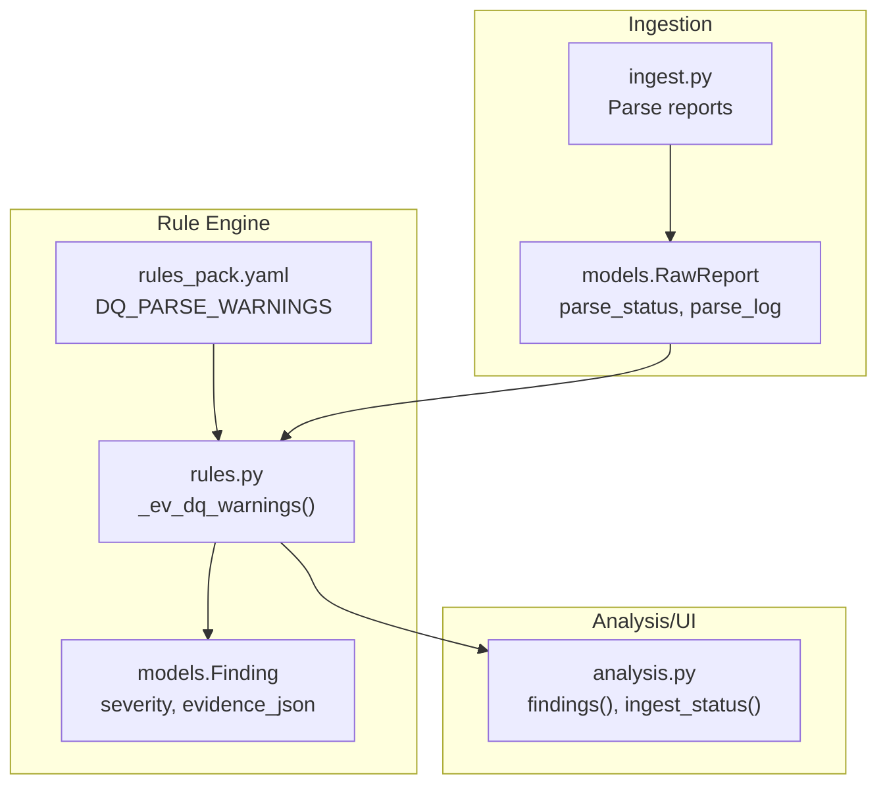
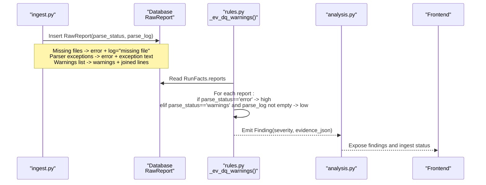
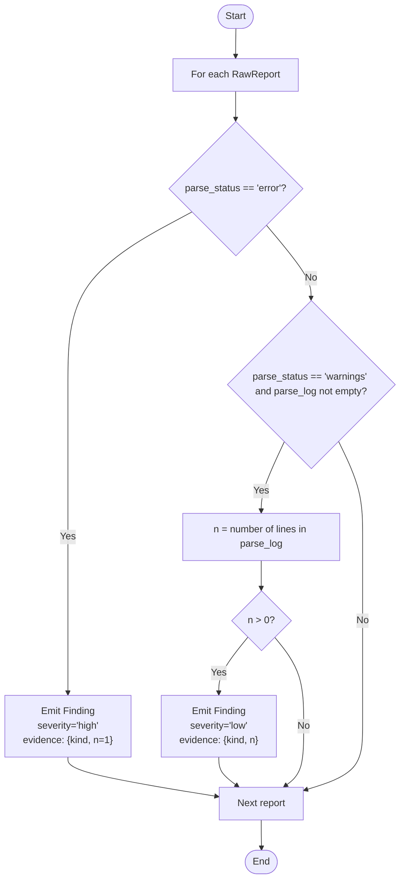
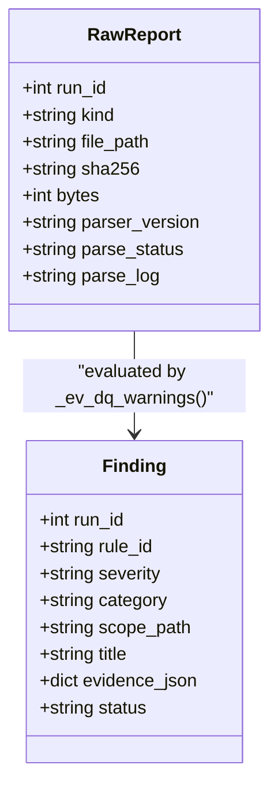
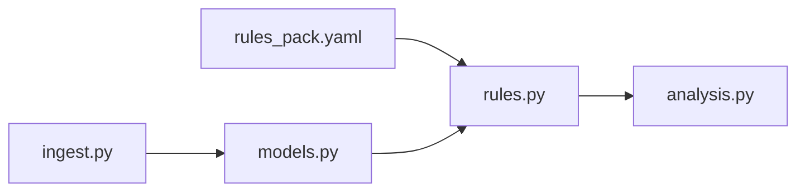

# Parse Warning Detection

<cite>
**Referenced Files in This Document**
- [rules.py](file://backend/ppa/rules.py)
- [rules_pack.yaml](file://backend/ppa/rules_pack.yaml)
- [models.py](file://backend/ppa/models.py)
- [ingest.py](file://backend/ppa/ingest.py)
- [analysis.py](file://backend/ppa/analysis.py)
</cite>

## Table of Contents
1. Introduction
2. Project Structure
3. Core Components
4. Architecture Overview
5. Detailed Component Analysis
6. Dependency Analysis
7. Performance Considerations
8. Troubleshooting Guide
9. Conclusion

## Introduction
This document explains the DQ_PARSE_WARNINGS data quality rule evaluator that detects parsing issues in EDA tool reports. It focuses on how the evaluator inspects parse_status and parse_log to identify both error conditions and warning conditions, how severity is assigned, what evidence is collected, and what these findings imply for data reliability.

## Project Structure
The DQ_PARSE_WARNINGS rule is part of a deterministic rule engine that evaluates run-level facts against a YAML-defined rule pack. The key pieces are:
- Rule definitions in the YAML pack (rule id, category, default severity, title template).
- A pure Python evaluator function that reads precomputed run facts from the database.
- Ingestion logic that populates RawReport records with parse_status and parse_log during report parsing.
- An analysis API that exposes ingest status and findings for UI consumption.

**Diagram sources**
- [ingest.py:90-113](file://backend/ppa/ingest.py#L90-L113)
- [models.py:70-79](file://backend/ppa/models.py#L70-L79)
- [rules_pack.yaml:109-118](file://backend/ppa/rules_pack.yaml#L109-L118)
- [rules.py:278-310](file://backend/ppa/rules.py#L278-L310)
- [analysis.py:401-438](file://backend/ppa/analysis.py#L401-L438)

**Section sources**
- [ingest.py:90-113](file://backend/ppa/ingest.py#L90-L113)
- [models.py:70-79](file://backend/ppa/models.py#L70-L79)
- [rules_pack.yaml:109-118](file://backend/ppa/rules_pack.yaml#L109-L118)
- [rules.py:278-310](file://backend/ppa/rules.py#L278-L310)
- [analysis.py:401-438](file://backend/ppa/analysis.py#L401-L438)

## Core Components
- RawReport model fields used by the rule:
  - kind: identifies the report type (e.g., rtla_area, rtla_timing, rtla_qor, primepower, specint).
  - parse_status: one of ok, warnings, or error.
  - parse_log: text capturing warnings or errors encountered during parsing.
- DQ_PARSE_WARNINGS rule definition:
  - Category: data_quality.
  - Default severity: low (overridden per condition by the evaluator).
  - Title template includes the number of warnings captured.
- Evaluator _ev_dq_warnings:
  - Iterates all RawReport entries for a run.
  - Emits high-severity findings when parse_status == 'error'.
  - Emits low-severity findings when parse_status == 'warnings' and parse_log has at least one line; counts lines as evidence.

**Section sources**
- [models.py:70-79](file://backend/ppa/models.py#L70-L79)
- [rules_pack.yaml:109-118](file://backend/ppa/rules_pack.yaml#L109-L118)
- [rules.py:278-310](file://backend/ppa/rules.py#L278-L310)

## Architecture Overview
The flow from ingestion to findings:

**Diagram sources**
- [ingest.py:90-113](file://backend/ppa/ingest.py#L90-L113)
- [rules.py:278-310](file://backend/ppa/rules.py#L278-L310)
- [analysis.py:401-438](file://backend/ppa/analysis.py#L401-L438)

## Detailed Component Analysis

### DQ_PARSE_WARNINGS Evaluator Logic
The evaluator processes each RawReport for a run and applies the following decision logic:

- Error condition: parse_status == 'error' triggers a high-severity finding regardless of parse_log content.
- Warning condition: parse_status == 'warnings' with non-empty parse_log triggers a low-severity finding; the number of lines in parse_log is recorded as evidence.

**Diagram sources**
- [rules.py:278-287](file://backend/ppa/rules.py#L278-L287)

**Section sources**
- [rules.py:278-287](file://backend/ppa/rules.py#L278-L287)

### Evidence Collection Mechanism
- kind: the report type (e.g., rtla_area, rtla_timing, rtla_qor, primepower, specint), enabling identification of which report had parsing issues.
- n:
  - For errors: fixed value 1, indicating an error occurred for that report.
  - For warnings: number of lines in parse_log, representing the count of warning messages captured during parsing.
- These values are stored in evidence_json and surfaced in findings for filtering and display.

Evidence is derived directly from RawReport fields populated during ingestion:
- parse_status indicates success, warnings, or error.
- parse_log contains either the joined warning lines or an error message.

**Section sources**
- [models.py:70-79](file://backend/ppa/models.py#L70-L79)
- [rules.py:278-287](file://backend/ppa/rules.py#L278-L287)
- [ingest.py:90-113](file://backend/ppa/ingest.py#L90-L113)

### Severity Assignment Logic
- Errors receive 'high' severity because they indicate complete parsing failure for a report, potentially invalidating downstream metrics and comparisons.
- Warnings receive 'low' severity because they suggest partial parsing issues or non-critical anomalies that may still allow usable metrics but warrant attention.

These severities align with the rule’s intent to prioritize actionable data-quality issues while keeping noise manageable.

**Section sources**
- [rules.py:278-287](file://backend/ppa/rules.py#L278-L287)
- [rules_pack.yaml:109-118](file://backend/ppa/rules_pack.yaml#L109-L118)

### Data Flow and Integration Points
- Ingestion populates RawReport.parse_status and parse_log:
  - Missing files: parse_status='error', parse_log='missing file'.
  - Parser exceptions: parse_status='error', parse_log=exception text.
  - Successful parse with warnings: parse_status='warnings', parse_log=joined warning lines (up to a limit).
- Rule engine consumes these fields to generate findings.
- Analysis API exposes findings and ingest status for UI filtering and inspection.

**Diagram sources**
- [models.py:70-79](file://backend/ppa/models.py#L70-L79)
- [models.py:168-180](file://backend/ppa/models.py#L168-L180)
- [rules.py:278-310](file://backend/ppa/rules.py#L278-L310)

**Section sources**
- [ingest.py:90-113](file://backend/ppa/ingest.py#L90-L113)
- [analysis.py:401-438](file://backend/ppa/analysis.py#L401-L438)

## Dependency Analysis
- rules.py depends on models.py for data structures (RawReport, Finding) and on the YAML pack for rule metadata.
- ingest.py writes RawReport records that feed into the rule engine.
- analysis.py provides APIs to retrieve findings and ingest status for visualization.

**Diagram sources**
- [rules_pack.yaml:109-118](file://backend/ppa/rules_pack.yaml#L109-L118)
- [rules.py:278-310](file://backend/ppa/rules.py#L278-L310)
- [models.py:70-79](file://backend/ppa/models.py#L70-L79)
- [ingest.py:90-113](file://backend/ppa/ingest.py#L90-L113)
- [analysis.py:401-438](file://backend/ppa/analysis.py#L401-L438)

**Section sources**
- [rules.py:278-310](file://backend/ppa/rules.py#L278-L310)
- [models.py:70-79](file://backend/ppa/models.py#L70-L79)
- [ingest.py:90-113](file://backend/ppa/ingest.py#L90-L113)
- [analysis.py:401-438](file://backend/ppa/analysis.py#L401-L438)

## Performance Considerations
- The evaluator iterates RawReport entries once per run; complexity is O(N) where N is the number of reports for a run.
- Line counting in parse_log uses splitlines(), which is efficient for typical warning logs.
- No heavy computations or external calls occur within the evaluator, minimizing overhead.

[No sources needed since this section provides general guidance]

## Troubleshooting Guide
Common parsing failure scenarios and their diagnostic implications:

- Missing report file:
  - Behavior: parse_status='error', parse_log='missing file'.
  - Implication: Metrics derived from that report will be absent; downstream analyses may be incomplete or biased.
  - Action: Ensure the expected report exists in the run directory before ingestion.

- Parser exception during parsing:
  - Behavior: parse_status='error', parse_log contains exception text.
  - Implication: Parsing failed; any extracted metrics from that report are unreliable or missing.
  - Action: Inspect the exception details in parse_log, validate report format compatibility, and re-run ingestion after fixing inputs or parsers.

- Non-empty warnings with parse_status='warnings':
  - Behavior: parse_status='warnings', parse_log contains one or more warning lines; evaluator emits low-severity findings with n equal to the number of warning lines.
  - Implication: Some parts of the report could not be parsed or contained anomalies; results may be partially valid.
  - Action: Review parse_log to identify unparsed sections or unexpected formats; update parsers if necessary.

- Empty parse_log with parse_status='warnings':
  - Behavior: parse_status='warnings' but no warning lines; evaluator does not emit a finding.
  - Implication: Likely benign; confirm parser behavior and consider adjusting logging if needed.

- Multiple report types affected:
  - Behavior: Multiple findings across different kinds (e.g., rtla_timing, primepower).
  - Implication: Systemic issue such as tool version mismatch or environment problem affecting multiple outputs.
  - Action: Validate tool versions and environment consistency across runs.

Evidence visibility:
- Findings include kind and n, enabling quick triage of which reports were impacted and how many warnings were recorded.
- Ingest status endpoints expose RawReport parse_status and truncated parse_log for rapid inspection.

**Section sources**
- [ingest.py:90-113](file://backend/ppa/ingest.py#L90-L113)
- [rules.py:278-287](file://backend/ppa/rules.py#L278-L287)
- [analysis.py:428-438](file://backend/ppa/analysis.py#L428-L438)

## Conclusion
The DQ_PARSE_WARNINGS rule provides a focused, reliable mechanism to detect parsing problems in EDA tool reports. By distinguishing between critical parsing failures (high severity) and non-fatal warnings (low severity), it helps maintain data integrity and guides timely remediation. The evidence captured—report kind and warning count—enables precise diagnostics and supports informed decisions about data reliability and next steps.

[No sources needed since this section summarizes without analyzing specific files]