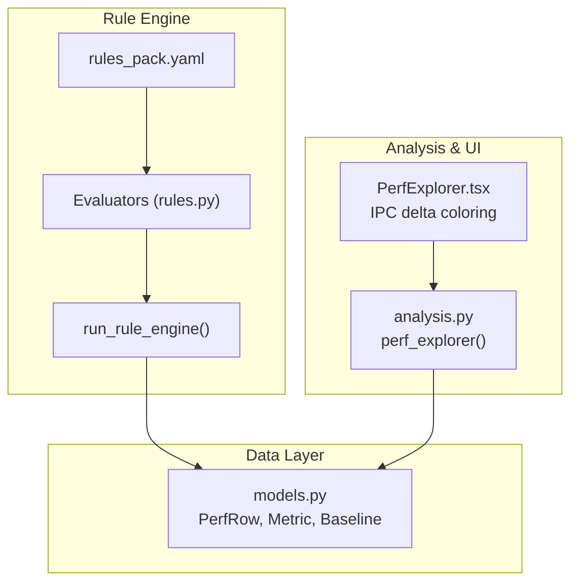
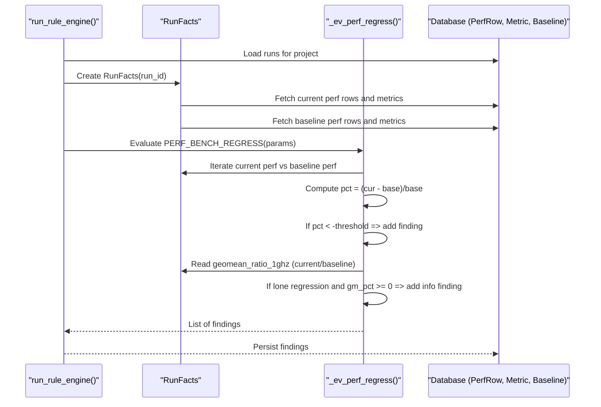
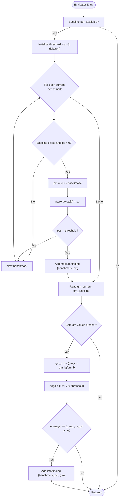
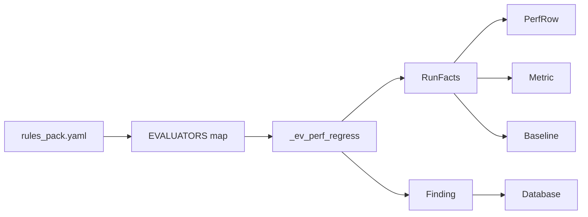

# PERF_BENCH_REGRESS - Benchmark Performance Regression Detection

<cite>
**Referenced Files in This Document**
- [rules.py](file://backend/ppa/rules.py)
- [rules_pack.yaml](file://backend/ppa/rules_pack.yaml)
- [models.py](file://backend/ppa/models.py)
- [analysis.py](file://backend/ppa/analysis.py)
- [sample_data.py](file://backend/ppa/sample_data.py)
- [PerfExplorer.tsx](file://frontend/src/views/PerfExplorer.tsx)
</cite>

## Table of Contents
1. [Introduction](#introduction)
2. [Project Structure](#project-structure)
3. [Core Components](#core-components)
4. [Architecture Overview](#architecture-overview)
5. [Detailed Component Analysis](#detailed-component-analysis)
6. [Dependency Analysis](#dependency-analysis)
7. [Performance Considerations](#performance-considerations)
8. [Troubleshooting Guide](#troubleshooting-guide)
9. [Conclusion](#conclusion)
10. [Appendices](#appendices)

## Introduction
This document explains the PERF_BENCH_REGRESS rule evaluator that detects benchmark-specific performance regressions by comparing current run IPC values against a baseline run. It details how percentage deltas are computed, how individual benchmarks with drops exceeding a configured threshold are flagged, and how an isolated outlier detection mechanism identifies single-benchmark regressions when the geometric mean remains stable. It also provides examples for interpreting findings and configuring thresholds to guide targeted optimization.

## Project Structure
The regression detection logic is implemented as part of a deterministic rule engine:
- Rule definitions (IDs, categories, severities, titles, parameters) live in a YAML pack.
- Evaluators implement the business logic and return findings consumed by the rule engine.
- Data models define the schema for runs, metrics, and per-benchmark performance rows.
- Sample data shows how benchmark IPCs and ratios are generated and used.
- Frontend visualization highlights regressions using delta colors.

**Diagram sources**
- [rules_pack.yaml:79-90](file://backend/ppa/rules_pack.yaml#L79-L90)
- [rules.py:200-224](file://backend/ppa/rules.py#L200-L224)
- [rules.py:313-352](file://backend/ppa/rules.py#L313-L352)
- [models.py:137-149](file://backend/ppa/models.py#L137-L149)
- [analysis.py:331-356](file://backend/ppa/analysis.py#L331-L356)
- [PerfExplorer.tsx:7-10](file://frontend/src/views/PerfExplorer.tsx#L7-L10)

**Section sources**
- [rules_pack.yaml:79-90](file://backend/ppa/rules_pack.yaml#L79-L90)
- [rules.py:200-224](file://backend/ppa/rules.py#L200-L224)
- [rules.py:313-352](file://backend/ppa/rules.py#L313-L352)
- [models.py:137-149](file://backend/ppa/models.py#L137-L149)
- [analysis.py:331-356](file://backend/ppa/analysis.py#L331-L356)
- [PerfExplorer.tsx:7-10](file://frontend/src/views/PerfExplorer.tsx#L7-L10)

## Core Components
- PERF_BENCH_REGRESS rule: Declares category, severity, title template, and default threshold for benchmark IPC regression detection.
- Evaluator _ev_perf_regress: Computes per-benchmark IPC deltas vs baseline, flags those below the negative threshold, and adds an “isolated outlier” finding when exactly one benchmark regresses while the geometric mean does not.
- RunFacts: Preloads current and baseline performance rows and metrics for efficient evaluation.
- Data models: PerfRow stores per-benchmark IPC; Metric stores aggregate metrics including geometric mean ratio; Baseline links project-level baseline run.

Key responsibilities:
- Compare current run IPC to baseline IPC per benchmark.
- Compute percentage delta using (current_ipc - baseline_ipc) / baseline_ipc.
- Flag benchmarks with negative delta beyond the configured threshold.
- Detect isolated outliers where only one benchmark regresses and overall geometric mean is non-negative.

**Section sources**
- [rules_pack.yaml:79-90](file://backend/ppa/rules_pack.yaml#L79-L90)
- [rules.py:24-72](file://backend/ppa/rules.py#L24-L72)
- [rules.py:200-224](file://backend/ppa/rules.py#L200-L224)
- [models.py:137-149](file://backend/ppa/models.py#L137-L149)
- [models.py:160-166](file://backend/ppa/models.py#L160-L166)

## Architecture Overview
The rule engine loads rules from YAML, instantiates RunFacts for each run, and invokes matching evaluators. For PERF_BENCH_REGRESS, the evaluator compares current and baseline IPCs, computes deltas, and emits findings with evidence. The same evaluator also implements PERF_ISOLATED_OUTLIER behavior by detecting lone regressions when the geometric mean stays stable or improves.

**Diagram sources**
- [rules.py:313-352](file://backend/ppa/rules.py#L313-L352)
- [rules.py:24-72](file://backend/ppa/rules.py#L24-L72)
- [rules.py:200-224](file://backend/ppa/rules.py#L200-L224)

## Detailed Component Analysis

### PERF_BENCH_REGRESS Evaluator Logic
- Inputs:
  - Current run’s per-benchmark IPC values (PerfRow).
  - Baseline run’s per-benchmark IPC values (PerfRow).
  - Geometric mean ratio at 1GHz metric for both runs (Metric key).
- Processing:
  - For each benchmark present in both current and baseline, compute percentage delta: (current_ipc - baseline_ipc) / baseline_ipc.
  - If delta is less than negative threshold (e.g., -1%), emit a medium-severity finding scoped to the benchmark with evidence containing benchmark name and percentage.
  - Collect all negative deltas to detect isolated outliers.
  - Compute geometric mean delta: (gm_current - gm_baseline) / gm_baseline.
  - If there is exactly one negative delta and the geometric mean delta is non-negative, emit an info-severity finding indicating a lone outlier with both benchmark delta and geometric mean delta.
- Outputs:
  - Findings with severity, scope_path set to benchmark name, and evidence JSON containing benchmark, pct, and optionally gm.

**Diagram sources**
- [rules.py:200-224](file://backend/ppa/rules.py#L200-L224)

**Section sources**
- [rules.py:200-224](file://backend/ppa/rules.py#L200-L224)

### Rule Definition and Configuration
- Rule ID: PERF_BENCH_REGRESS
- Category: performance
- Severity: medium (default; can be overridden by evaluator output)
- Title template includes benchmark name and percentage delta
- Parameters:
  - threshold: default 0.01 (i.e., 1% drop triggers a finding)
- Related rule: PERF_ISOLATED_OUTLIER shares the same evaluator implementation but uses info severity and different title formatting.

Configuration guidance:
- Lowering threshold increases sensitivity (more findings).
- Raising threshold reduces noise but may miss small regressions.
- Typical starting point: 1% (0.01), adjust based on workload stability and measurement variance.

**Section sources**
- [rules_pack.yaml:79-90](file://backend/ppa/rules_pack.yaml#L79-L90)

### Data Model Context
- PerfRow: Stores per-benchmark IPC and related metrics for each run.
- Metric: Tall table storing aggregate metrics like geometric mean ratio at 1GHz.
- Baseline: Links a project to a baseline run used for comparisons.

These structures enable the evaluator to access both current and baseline performance data efficiently.

**Section sources**
- [models.py:137-149](file://backend/ppa/models.py#L137-L149)
- [models.py:83-90](file://backend/ppa/models.py#L83-L90)
- [models.py:160-166](file://backend/ppa/models.py#L160-L166)

### Integration with Analysis and Visualization
- analysis.perf_explorer computes per-benchmark IPC deltas and geometric mean delta for display.
- PerfExplorer frontend colors bars green/red based on IPC delta thresholds to highlight improvements/regressions visually.

This integration helps users quickly identify problematic benchmarks and correlate with rule findings.

**Section sources**
- [analysis.py:331-356](file://backend/ppa/analysis.py#L331-L356)
- [PerfExplorer.tsx:7-10](file://frontend/src/views/PerfExplorer.tsx#L7-L10)
- [PerfExplorer.tsx:77-107](file://frontend/src/views/PerfExplorer.tsx#L77-L107)

## Dependency Analysis
- Rules pack defines rule IDs and parameters consumed by the evaluator registry.
- run_rule_engine maps rule IDs to evaluator functions and persists findings.
- RunFacts depends on database models to load current and baseline data.
- Evaluator depends on PerfRow and Metric tables for IPC and geometric mean values.
- Frontend visualization depends on analysis API outputs to render deltas.

**Diagram sources**
- [rules_pack.yaml:79-90](file://backend/ppa/rules_pack.yaml#L79-L90)
- [rules.py:290-310](file://backend/ppa/rules.py#L290-L310)
- [rules.py:200-224](file://backend/ppa/rules.py#L200-L224)
- [models.py:137-149](file://backend/ppa/models.py#L137-L149)
- [models.py:83-90](file://backend/ppa/models.py#L83-L90)
- [models.py:160-166](file://backend/ppa/models.py#L160-L166)

**Section sources**
- [rules.py:290-310](file://backend/ppa/rules.py#L290-L310)
- [rules.py:313-352](file://backend/ppa/rules.py#L313-L352)

## Performance Considerations
- Complexity: O(N) over number of benchmarks per run for delta computation and outlier detection.
- Memory: Minimal overhead; stores deltas dictionary keyed by benchmark name.
- I/O: Reads baseline and current perf rows once via RunFacts; avoids repeated queries.
- Scalability: Suitable for typical SPEC-like suites (dozens of benchmarks); linear scaling with benchmark count.

[No sources needed since this section provides general guidance]

## Troubleshooting Guide
Common issues and resolutions:
- No findings despite suspected regression:
  - Verify baseline run is correctly associated with the project and has perf data.
  - Ensure threshold is not too high; lower it to increase sensitivity.
  - Confirm that baseline IPC values are positive; zero or missing baseline IPC prevents delta calculation.
- Isolated outlier not detected:
  - Requires exactly one benchmark to regress beyond threshold and geometric mean delta to be non-negative.
  - Check geometric mean metric presence and correctness for both runs.
- False positives due to noise:
  - Increase threshold slightly to reduce sensitivity.
  - Review measurement variance across runs; consider smoothing or multiple samples.

Actionable checks:
- Inspect evidence_json in findings for benchmark names and percentages.
- Use analysis.perf_explorer to view per-benchmark IPC deltas and geometric mean delta.
- Validate baseline association via Baseline model entries.

**Section sources**
- [rules.py:200-224](file://backend/ppa/rules.py#L200-L224)
- [analysis.py:331-356](file://backend/ppa/analysis.py#L331-L356)
- [models.py:160-166](file://backend/ppa/models.py#L160-L166)

## Conclusion
PERF_BENCH_REGRESS provides robust detection of benchmark-specific performance regressions by comparing IPC against a baseline and flagging significant drops. Its integrated isolated outlier detection helps pinpoint single-benchmark issues even when overall performance appears stable. By tuning the threshold and reviewing findings alongside visual analytics, teams can focus optimization efforts precisely where they matter most.

[No sources needed since this section summarizes without analyzing specific files]

## Appendices

### Example Scenarios
- Single benchmark regression:
  - One benchmark drops by 2% while others remain stable; geometric mean improves slightly.
  - Result: Medium finding for the regressed benchmark; Info finding marking it as an isolated outlier.
- Widespread regression:
  - Multiple benchmarks drop above threshold; geometric mean declines.
  - Result: Medium findings for each regressed benchmark; no isolated outlier info finding.
- Stable performance:
  - All benchmarks within threshold; geometric mean stable.
  - Result: No findings.

### Threshold Configuration Tips
- Default threshold: 0.01 (1%).
- Adjust based on:
  - Measurement noise characteristics.
  - Workload sensitivity to small changes.
  - Desired balance between false positives and missed regressions.

### Interpreting Findings
- Focus on medium-severity findings first for actionable regressions.
- Use info-severity isolated outlier findings to investigate single-benchmark anomalies that do not affect overall score.
- Correlate with frontend visualization to confirm trends and prioritize optimization targets.

[No sources needed since this section provides general guidance]