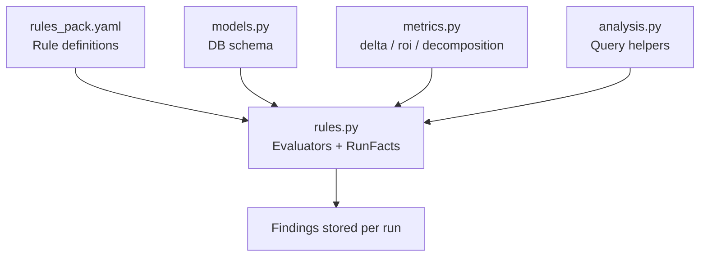
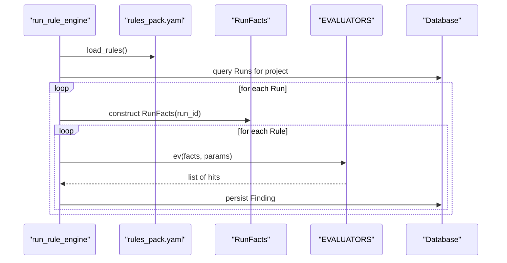
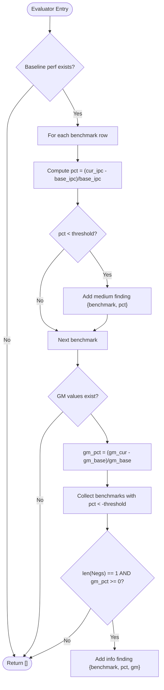
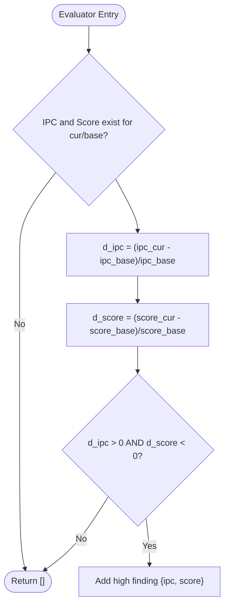
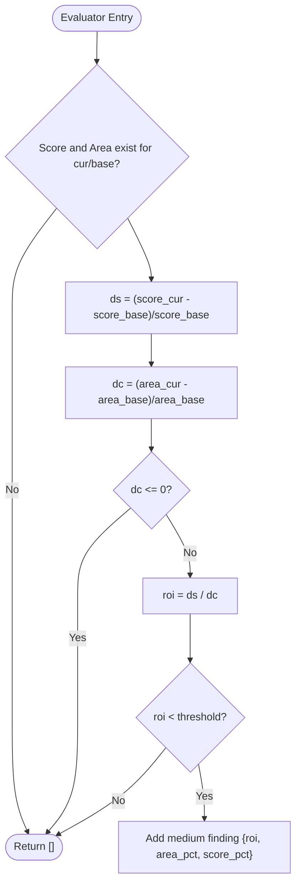
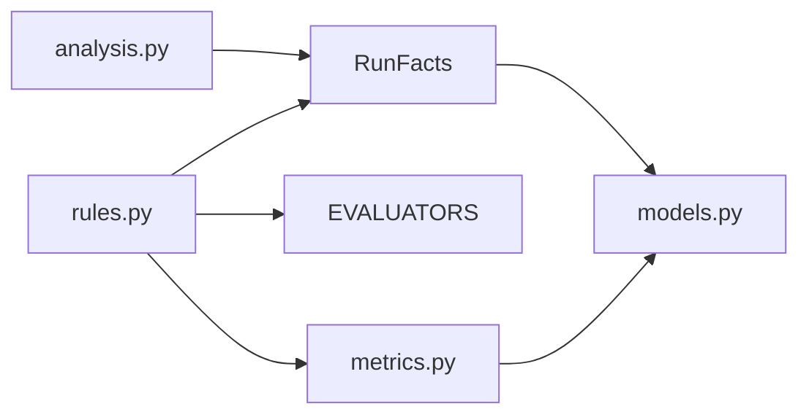

# Performance Rule Evaluators

<cite>
**Referenced Files in This Document**
- [rules.py](file://backend/ppa/rules.py)
- [rules_pack.yaml](file://backend/ppa/rules_pack.yaml)
- [metrics.py](file://backend/ppa/metrics.py)
- [analysis.py](file://backend/ppa/analysis.py)
- [models.py](file://backend/ppa/models.py)
</cite>

## Table of Contents
1. [Introduction](#introduction)
2. [Project Structure](#project-structure)
3. [Core Components](#core-components)
4. [Architecture Overview](#architecture-overview)
5. [Detailed Component Analysis](#detailed-component-analysis)
6. [Dependency Analysis](#dependency-analysis)
7. [Performance Considerations](#performance-considerations)
8. [Troubleshooting Guide](#troubleshooting-guide)
9. [Conclusion](#conclusion)

## Introduction
This document explains the performance-related rule evaluators that detect regressions and optimization opportunities across runs by comparing current results against a project baseline. It focuses on:
- PERF_BENCH_REGRESS: benchmark-specific performance regression detection with isolated outlier handling
- XDOM_NET_SCORE_DOWN: net score degradation despite IPC improvements
- XDOM_AREA_ROI_LOW: poor area return-on-investment (ROI) evaluation
- XDOM_POWER_ROI_LOW: poor power ROI evaluation

It also describes how deltas are computed, how outliers are identified, and how ROI is assessed for design changes.

## Project Structure
The rule engine loads declarative rules from a YAML pack and executes pure-Python evaluators against precomputed run facts. The metrics layer centralizes all arithmetic for figures of merit, comparisons, and decompositions.

**Diagram sources**
- [rules.py:19-21](file://backend/ppa/rules.py#L19-L21)
- [rules.py:24-73](file://backend/ppa/rules.py#L24-L73)
- [rules.py:290-310](file://backend/ppa/rules.py#L290-L310)
- [metrics.py:142-187](file://backend/ppa/metrics.py#L142-L187)
- [analysis.py:34-41](file://backend/ppa/analysis.py#L34-L41)

**Section sources**
- [rules.py:19-21](file://backend/ppa/rules.py#L19-L21)
- [rules.py:24-73](file://backend/ppa/rules.py#L24-L73)
- [rules.py:290-310](file://backend/ppa/rules.py#L290-L310)
- [metrics.py:142-187](file://backend/ppa/metrics.py#L142-L187)
- [analysis.py:34-41](file://backend/ppa/analysis.py#L34-L41)

## Core Components
- RunFacts: Precomputes per-run context including metrics, area/power/perf rows, timing paths, reports, and baseline data when available.
- Evaluators: Pure functions that take RunFacts and rule parameters and return findings tuples (severity, scope, evidence).
- Metrics utilities: delta(), roi(), compare_fom(), net_score_decomposition() used to compute deltas and ROI consistently.
- Rule pack: Declarative thresholds, titles, categories, and severities for each rule.

Key responsibilities:
- Compare current run metrics against baseline metrics
- Compute percentage deltas for benchmarks and aggregate scores
- Identify isolated outliers where only one benchmark regresses while geometric mean remains stable
- Evaluate ROI as score gain per cost increase (area or power)

**Section sources**
- [rules.py:24-73](file://backend/ppa/rules.py#L24-L73)
- [rules.py:200-266](file://backend/ppa/rules.py#L200-L266)
- [metrics.py:142-187](file://backend/ppa/metrics.py#L142-L187)
- [rules_pack.yaml:79-107](file://backend/ppa/rules_pack.yaml#L79-L107)

## Architecture Overview
The rule engine evaluates every run in a project using the loaded rule pack. For each rule, it calls the corresponding evaluator with RunFacts and rule parameters. Findings are persisted with severity, category, scope, title, and evidence.

**Diagram sources**
- [rules.py:313-352](file://backend/ppa/rules.py#L313-L352)
- [rules.py:19-21](file://backend/ppa/rules.py#L19-L21)
- [rules.py:24-73](file://backend/ppa/rules.py#L24-L73)

## Detailed Component Analysis

### PERF_BENCH_REGRESS: Benchmark-specific regression with outlier handling
Purpose:
- Detect per-benchmark IPC regressions relative to baseline
- Flag isolated outliers where a single benchmark regresses but the geometric mean does not

Logic overview:
- For each benchmark row, compute percent delta vs baseline IPC if baseline IPC > 0
- If delta < threshold (default 1%), record a medium-severity finding
- Compute geometric mean ratio at 1 GHz for both current and baseline; if there is exactly one negative delta below threshold and the overall geometric mean did not regress, emit an info-level “isolated outlier” finding

**Diagram sources**
- [rules.py:200-224](file://backend/ppa/rules.py#L200-L224)

Example comparison logic:
- Per-benchmark delta: (current IPC − baseline IPC) / baseline IPC
- Geometric mean ratio at 1 GHz: derived from per-benchmark ratio_1ghz values; see metrics utility
- Isolated outlier: exactly one benchmark below threshold while overall geometric mean is non-negative

ROI assessment:
- Not directly part of this rule; ROI is handled by XDOM_* rules

**Section sources**
- [rules.py:200-224](file://backend/ppa/rules.py#L200-L224)
- [metrics.py:70-85](file://backend/ppa/metrics.py#L70-L85)
- [rules_pack.yaml:79-89](file://backend/ppa/rules_pack.yaml#L79-L89)

### XDOM_NET_SCORE_DOWN: Net score degradation despite IPC improvements
Purpose:
- Detect cases where IPC improves but the final SPEC score decreases, indicating frequency loss dominates

Logic overview:
- Retrieve current and baseline geometric mean ratio at 1 GHz (IPC proxy) and SPEC score
- Compute deltas for IPC and score
- If IPC delta > 0 and score delta < 0, emit a high-severity finding with both deltas

**Diagram sources**
- [rules.py:227-240](file://backend/ppa/rules.py#L227-L240)

Interpretation:
- IPC improvement alone is insufficient; frequency (or other factors) may reduce the net score
- Use net_score_decomposition to attribute contributions to IPC vs frequency

**Section sources**
- [rules.py:227-240](file://backend/ppa/rules.py#L227-L240)
- [metrics.py:158-175](file://backend/ppa/metrics.py#L158-L175)
- [rules_pack.yaml:91-96](file://backend/ppa/rules_pack.yaml#L91-L96)

### XDOM_AREA_ROI_LOW: Poor area ROI evaluation
Purpose:
- Assess whether area growth yields sufficient SPEC score gains

Logic overview:
- Compute score delta and area delta between current and baseline
- Only consider positive area increases
- ROI = score_delta_pct / area_delta_pct
- If ROI < threshold (default 0.3), emit a medium-severity finding with ROI and deltas

**Diagram sources**
- [rules.py:243-266](file://backend/ppa/rules.py#L243-L266)

ROI calculation example:
- If area grows by 5% and score grows by 1%, ROI = 1/5 = 0.2 (below default 0.3 threshold) → flagged

**Section sources**
- [rules.py:243-266](file://backend/ppa/rules.py#L243-L266)
- [metrics.py:151-155](file://backend/ppa/metrics.py#L151-L155)
- [rules_pack.yaml:97-101](file://backend/ppa/rules_pack.yaml#L97-L101)

### XDOM_POWER_ROI_LOW: Poor power ROI evaluation
Purpose:
- Assess whether power growth yields sufficient SPEC score gains

Logic overview:
- Same ROI pattern as area ROI, but using total power instead of area
- Only considers positive power increases
- If ROI < threshold (default 0.3), emit a medium-severity finding

**Diagram sources**
- [rules.py:247-266](file://backend/ppa/rules.py#L247-L266)

ROI calculation example:
- If power grows by 10% and score grows by 2%, ROI = 2/10 = 0.2 (below default 0.3 threshold) → flagged

**Section sources**
- [rules.py:247-266](file://backend/ppa/rules.py#L247-L266)
- [metrics.py:151-155](file://backend/ppa/metrics.py#L151-L155)
- [rules_pack.yaml:103-107](file://backend/ppa/rules_pack.yaml#L103-L107)

## Dependency Analysis
- Rules depend on RunFacts to access metrics, area/power/perf rows, and baseline context
- Metrics utilities provide consistent delta and ROI calculations
- Analysis module provides helper functions to retrieve baseline runs and compose comparisons
- Models define the database schema used by RunFacts and analysis

**Diagram sources**
- [rules.py:24-73](file://backend/ppa/rules.py#L24-L73)
- [rules.py:290-310](file://backend/ppa/rules.py#L290-L310)
- [metrics.py:142-187](file://backend/ppa/metrics.py#L142-L187)
- [analysis.py:34-41](file://backend/ppa/analysis.py#L34-L41)
- [models.py:83-166](file://backend/ppa/models.py#L83-L166)

**Section sources**
- [rules.py:24-73](file://backend/ppa/rules.py#L24-L73)
- [rules.py:290-310](file://backend/ppa/rules.py#L290-L310)
- [metrics.py:142-187](file://backend/ppa/metrics.py#L142-L187)
- [analysis.py:34-41](file://backend/ppa/analysis.py#L34-L41)
- [models.py:83-166](file://backend/ppa/models.py#L83-L166)

## Performance Considerations
- Baseline lookup: RunFacts caches baseline metrics, area, and perf rows once per run to avoid repeated queries
- Aggregation: Geometric mean computation uses logarithms for numerical stability
- Threshold tuning: Adjust rule thresholds in the YAML pack without code changes
- Isolation logic: PERF_BENCH_REGRESS isolates single-benchmark regressions to avoid false alarms when overall performance is stable

[No sources needed since this section provides general guidance]

## Troubleshooting Guide
Common issues and diagnostics:
- Missing baseline: Many evaluators return no findings if baseline data is absent; ensure a baseline run is set for the project
- Zero denominators: Deltas and ROI require non-zero baselines; check for missing or zero-valued metrics
- Unexpected outliers: Verify that geometric mean ratio values exist and are non-zero before interpreting isolated outlier findings
- Data quality: Missing or error-parsed reports can cause incomplete metrics; use data quality rules to identify gaps

Relevant checks:
- Ensure baseline_run resolution works via analysis helpers
- Validate metric keys used by evaluators exist in the run’s metrics table
- Review parse logs for warnings/errors that could affect metrics

**Section sources**
- [analysis.py:34-41](file://backend/ppa/analysis.py#L34-L41)
- [rules.py:24-73](file://backend/ppa/rules.py#L24-L73)
- [rules.py:269-287](file://backend/ppa/rules.py#L269-L287)

## Conclusion
The performance rule evaluators provide deterministic, baseline-driven diagnostics for performance regressions and suboptimal trade-offs:
- PERF_BENCH_REGRESS flags per-benchmark regressions and highlights isolated outliers
- XDOM_NET_SCORE_DOWN catches cases where IPC gains are offset by frequency losses
- XDOM_AREA_ROI_LOW and XDOM_POWER_ROI_LOW quantify ROI to guide design decisions

By centralizing arithmetic in the metrics layer and keeping evaluators pure and configurable, the system enables reliable, repeatable performance analysis and actionable insights.

[No sources needed since this section summarizes without analyzing specific files]