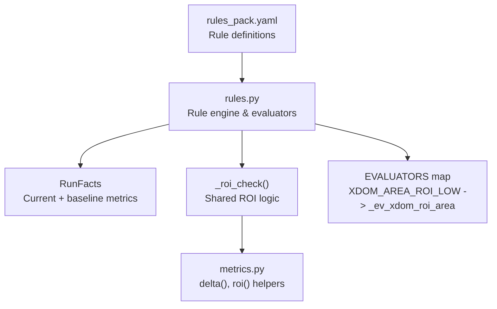
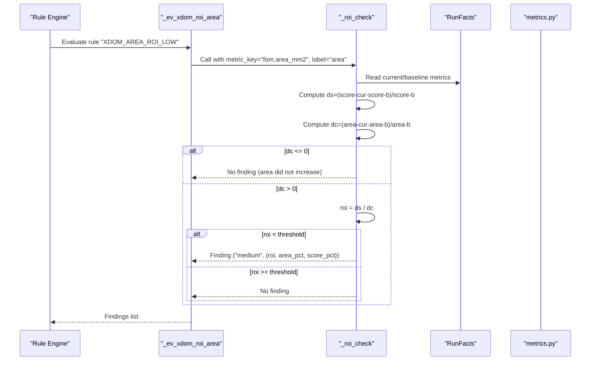
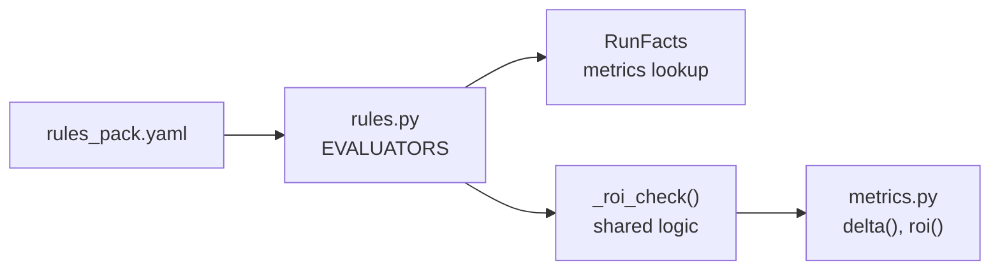

# XDOM_AREA_ROI_LOW - Poor Area Return-on-Investment

<cite>
**Referenced Files in This Document**
- [rules.py](file://backend/ppa/rules.py)
- [metrics.py](file://backend/ppa/metrics.py)
- [rules_pack.yaml](file://backend/ppa/rules_pack.yaml)
</cite>

## Table of Contents
1. [Introduction](#introduction)
2. [Project Structure](#project-structure)
3. [Core Components](#core-components)
4. [Architecture Overview](#architecture-overview)
5. [Detailed Component Analysis](#detailed-component-analysis)
6. [Dependency Analysis](#dependency-analysis)
7. [Performance Considerations](#performance-considerations)
8. [Troubleshooting Guide](#troubleshooting-guide)
9. [Conclusion](#conclusion)

## Introduction
This document explains the XDOM_AREA_ROI_LOW rule evaluator that flags area optimizations with poor return-on-investment (ROI). It focuses on how the system computes ROI as the ratio of performance gain to area cost, and how it identifies cases where area increases but provide insufficient SPECint score improvement relative to a configurable threshold. It also documents the shared _roi_check function used by both area and power ROI evaluators, including parameter validation, metric key handling, and threshold configuration. Finally, it provides examples of low ROI scenarios and guidance for evaluating whether area investments are justified by performance gains.

## Project Structure
The XDOM_AREA_ROI_LOW rule is part of a deterministic rule engine that:
- Loads rules from a YAML pack defining rule IDs, categories, severities, titles, and parameters.
- Evaluates each rule against run facts (current and baseline metrics) to produce findings.
- Uses shared helper functions for consistent ROI computation across domains.

**Diagram sources**
- [rules_pack.yaml:97-101](file://backend/ppa/rules_pack.yaml#L97-L101)
- [rules.py:243-266](file://backend/ppa/rules.py#L243-L266)
- [metrics.py:142-155](file://backend/ppa/metrics.py#L142-L155)

**Section sources**
- [rules_pack.yaml:1-119](file://backend/ppa/rules_pack.yaml#L1-L119)
- [rules.py:1-361](file://backend/ppa/rules.py#L1-L361)
- [metrics.py:1-258](file://backend/ppa/metrics.py#L1-L258)

## Core Components
- Rule definition: XDOM_AREA_ROI_LOW is defined in the rule pack with category cross_domain, severity medium, a title template, and a default threshold parameter.
- Evaluator mapping: The rule ID maps to an evaluator function that delegates to a shared ROI checker.
- Shared ROI checker: Computes percent changes in SPECint score and area, enforces positive area growth, calculates ROI, and compares against the configured threshold.
- Metrics utilities: Provide delta and ROI helpers used elsewhere for comparison and reporting.

Key responsibilities:
- Validate inputs (baseline availability, numeric metrics).
- Compute ds (SPECint score change %) and dc (area change %).
- Enforce dc > 0 to focus on area-expanding changes.
- Calculate roi = ds / dc and flag when roi < threshold.
- Emit a finding with evidence fields roi, area_pct, and score_pct.

**Section sources**
- [rules_pack.yaml:97-101](file://backend/ppa/rules_pack.yaml#L97-L101)
- [rules.py:243-266](file://backend/ppa/rules.py#L243-L266)
- [metrics.py:142-155](file://backend/ppa/metrics.py#L142-L155)

## Architecture Overview
The evaluation flow for XDOM_AREA_ROI_LOW:

**Diagram sources**
- [rules.py:243-266](file://backend/ppa/rules.py#L243-L266)
- [metrics.py:142-155](file://backend/ppa/metrics.py#L142-L155)

## Detailed Component Analysis

### XDOM_AREA_ROI_LOW Rule Definition
- Category: cross_domain
- Severity: medium
- Title template includes ROI value, area percentage change, and score percentage change.
- Default threshold: 0.3 (configurable via params.threshold).

Interpretation:
- When area increases (dc > 0), the rule expects a proportional SPECint score improvement. If roi falls below the threshold, the investment is considered poor.

**Section sources**
- [rules_pack.yaml:97-101](file://backend/ppa/rules_pack.yaml#L97-L101)

### Evaluator: _ev_xdom_roi_area
- Delegates to _roi_check with metric_key "fom.area_mm2" and label "area".
- Returns findings only when conditions are met; otherwise returns empty.

Behavior highlights:
- Requires baseline metrics to exist.
- Requires valid numeric values for both current and baseline SPECint score and area.
- Only considers cases where area increased (dc > 0).
- Emits a finding with evidence fields roi, area_pct, and score_pct when roi < threshold.

**Section sources**
- [rules.py:243-245](file://backend/ppa/rules.py#L243-L245)

### Shared ROI Checker: _roi_check
Purpose:
- Centralizes ROI logic for both area and power ROI evaluations.

Parameters:
- f: RunFacts containing current and baseline metrics.
- p: Rule parameters dict, including optional threshold.
- metric_key: Key for the cost metric (e.g., "fom.area_mm2").
- label: Label used to name the cost percentage field in evidence (e.g., "area").

Processing steps:
1. Guard clause: If no baseline metrics, return no findings.
2. Retrieve current and baseline SPECint scores and the chosen cost metric.
3. Guard clause: If any required value is missing or non-numeric, return no findings.
4. Compute ds = (score_cur - score_base) / score_base.
5. Compute dc = (cost_cur - cost_base) / cost_base.
6. Guard clause: If dc <= 0 (no area increase), return no findings.
7. Compute roi = ds / dc.
8. If roi < threshold (default 0.3), return a finding with severity "medium" and evidence {roi, area_pct=dc, score_pct=ds}.
9. Otherwise, return no findings.

Notes:
- Threshold defaults to 0.3 if not provided in rule params.
- Evidence fields use dynamic naming based on label (e.g., area_pct for area, power_pct for power).

**Section sources**
- [rules.py:251-266](file://backend/ppa/rules.py#L251-L266)

### Metrics Utilities: delta and roi
- delta(cur, base): Produces a dict with current, baseline, absolute difference, and percentage difference. Used for general comparisons and reports.
- roi(delta_score_pct, delta_cost_pct): Computes ROI as percent score gain divided by percent cost gain. Returns None if either input is None or cost change is near zero.

These utilities support broader analysis and reporting beyond the rule engine.

**Section sources**
- [metrics.py:142-155](file://backend/ppa/metrics.py#L142-L155)

### Data Flow and Evidence
When XDOM_AREA_ROI_LOW triggers, the finding includes:
- roi: Computed ROI value (ds/dc).
- area_pct: Percent change in area (dc).
- score_pct: Percent change in SPECint score (ds).

These fields enable clear interpretation of why the ROI was deemed low.

**Section sources**
- [rules.py:263-266](file://backend/ppa/rules.py#L263-L266)

## Dependency Analysis
The XDOM_AREA_ROI_LOW rule depends on:
- Rule pack configuration for thresholds and metadata.
- Rule engine to load and execute evaluators.
- RunFacts to access current and baseline metrics.
- Shared ROI checker for consistent logic across area and power.
- Metrics utilities for delta and ROI calculations.

**Diagram sources**
- [rules_pack.yaml:97-101](file://backend/ppa/rules_pack.yaml#L97-L101)
- [rules.py:243-266](file://backend/ppa/rules.py#L243-L266)
- [metrics.py:142-155](file://backend/ppa/metrics.py#L142-L155)

**Section sources**
- [rules.py:290-310](file://backend/ppa/rules.py#L290-L310)
- [rules_pack.yaml:97-101](file://backend/ppa/rules_pack.yaml#L97-L101)

## Performance Considerations
- Early exits: The evaluator quickly returns when baseline metrics are missing or required values are invalid, minimizing unnecessary computation.
- Single-pass calculation: ds, dc, and roi are computed once per evaluation.
- Threshold tuning: Adjusting the threshold allows balancing sensitivity to low ROI cases versus acceptable trade-offs.

[No sources needed since this section provides general guidance]

## Troubleshooting Guide
Common issues and resolutions:
- Missing baseline metrics: Ensure a baseline run exists and is associated with the project so that baseline_metrics are populated. Without baseline data, the rule cannot compute ds or dc and will not trigger.
- Non-numeric metrics: If any of the required metrics (SPECint score or area) are missing or non-numeric, the evaluator returns no findings. Verify that metrics were parsed and stored correctly.
- Area did not increase: The rule only triggers when area increases (dc > 0). If area decreased or stayed flat, no finding is produced. Review other rules for area reduction opportunities.
- Threshold too high/low: If you see too many or too few findings, adjust the threshold in the rule pack params. Lowering the threshold makes the rule stricter; raising it relaxes the requirement.

Evidence interpretation:
- roi: Ratio of score gain to area cost. Values below the threshold indicate poor ROI.
- area_pct: Positive value indicates area growth; negative or zero means no area increase.
- score_pct: Positive value indicates performance improvement; negative indicates regression.

**Section sources**
- [rules.py:251-266](file://backend/ppa/rules.py#L251-L266)
- [rules_pack.yaml:97-101](file://backend/ppa/rules_pack.yaml#L97-L101)

## Conclusion
XDOM_AREA_ROI_LOW provides a systematic way to identify area optimizations that do not pay off in performance. By computing ROI as the ratio of SPECint score change to area change and comparing it against a configurable threshold, the rule helps designers avoid costly area expansions that yield minimal performance benefits. The shared _roi_check function ensures consistent behavior across area and power ROI evaluations, while the metrics utilities support broader analysis and reporting. Use the evidence fields to understand the magnitude of changes and adjust thresholds to align with project goals.

[No sources needed since this section summarizes without analyzing specific files]