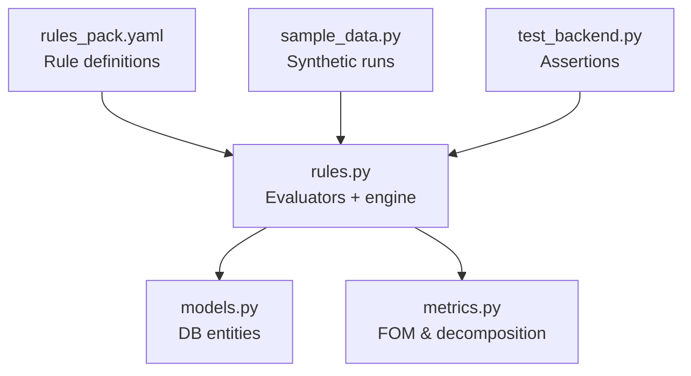
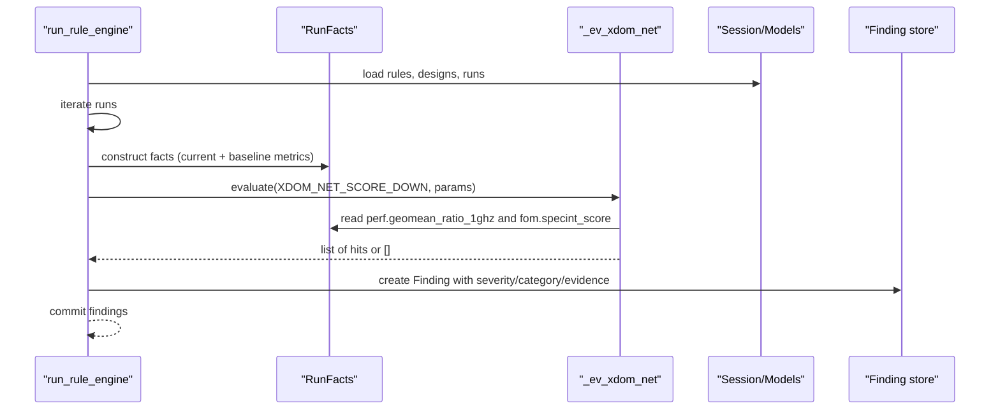
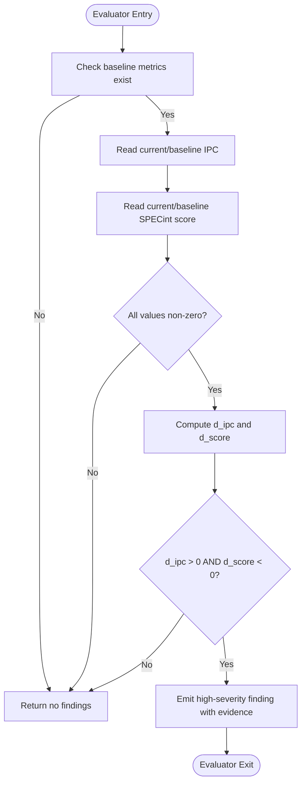
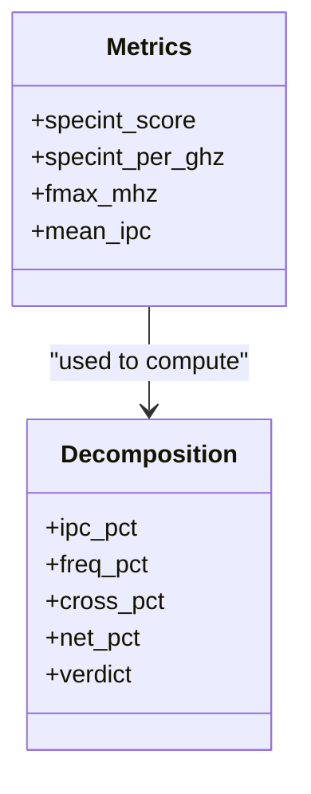
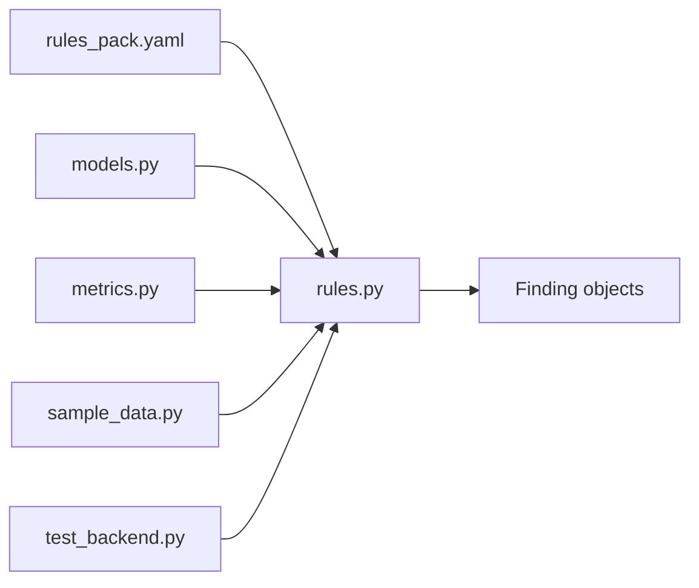

# XDOM_NET_SCORE_DOWN - Net Score Degradation Detection

<cite>
**Referenced Files in This Document**
- [rules.py](file://backend/ppa/rules.py)
- [rules_pack.yaml](file://backend/ppa/rules_pack.yaml)
- [metrics.py](file://backend/ppa/metrics.py)
- [sample_data.py](file://backend/ppa/sample_data.py)
- [test_backend.py](file://backend/tests/test_backend.py)
</cite>

## Table of Contents
1. [Introduction](#introduction)
2. [Project Structure](#project-structure)
3. [Core Components](#core-components)
4. [Architecture Overview](#architecture-overview)
5. [Detailed Component Analysis](#detailed-component-analysis)
6. [Dependency Analysis](#dependency-analysis)
7. [Performance Considerations](#performance-considerations)
8. [Troubleshooting Guide](#troubleshooting-guide)
9. [Conclusion](#conclusion)

## Introduction
This document explains the XDOM_NET_SCORE_DOWN rule evaluator that detects cases where SPECint score degrades even though IPC improves. It focuses on the cross-domain analysis logic that compares IPC changes against overall score changes using delta calculations:
- d_ipc = (ipc - ipc_b) / ipc_b
- d_score = (score - score_b) / score_b

The evaluator flags scenarios where IPC increases (d_ipc > 0) but SPECint score decreases (d_score < 0), indicating potential issues in other performance factors such as frequency, power, or area impacts. It also provides guidance for investigating root causes and interpreting misleading IPC improvements.

## Project Structure
The rule engine is implemented in a modular backend with:
- Rule definitions in a YAML pack
- Evaluators in Python
- Metrics computation utilities
- Sample data to exercise rules
- Tests validating rule behavior

**Diagram sources**
- [rules_pack.yaml:91-107](file://backend/ppa/rules_pack.yaml#L91-L107)
- [rules.py:227-240](file://backend/ppa/rules.py#L227-L240)
- [metrics.py:158-175](file://backend/ppa/metrics.py#L158-L175)
- [sample_data.py:22-36](file://backend/ppa/sample_data.py#L22-L36)
- [test_backend.py:100-115](file://backend/tests/test_backend.py#L100-L115)

**Section sources**
- [rules_pack.yaml:91-107](file://backend/ppa/rules_pack.yaml#L91-L107)
- [rules.py:227-240](file://backend/ppa/rules.py#L227-L240)
- [metrics.py:158-175](file://backend/ppa/metrics.py#L158-L175)
- [sample_data.py:22-36](file://backend/ppa/sample_data.py#L22-L36)
- [test_backend.py:100-115](file://backend/tests/test_backend.py#L100-L115)

## Core Components
- Rule definition: XDOM_NET_SCORE_DOWN is defined in the rule pack with category “cross_domain” and severity “high”. The title template includes both IPC and score deltas for narrative output.
- Evaluator: _ev_xdom_net computes normalized deltas for IPC and SPECint score and triggers when IPC improves while net score degrades.
- Metrics: FOM fields include specint_score, specint_per_ghz, fmax_mhz, and mean_ipc; net score decomposition attributes score change into microarch (IPC per GHz) and physical (frequency) contributions.
- Data context: RunFacts loads current and baseline metrics, enabling cross-run comparisons.

Key responsibilities:
- Load baseline and current metrics from the database session
- Compute relative deltas for IPC and SPECint score
- Flag high-severity findings when IPC goes up but score goes down
- Provide evidence JSON with ipc and score deltas for downstream reporting

**Section sources**
- [rules_pack.yaml:91-107](file://backend/ppa/rules_pack.yaml#L91-L107)
- [rules.py:227-240](file://backend/ppa/rules.py#L227-L240)
- [metrics.py:112-137](file://backend/ppa/metrics.py#L112-L137)
- [metrics.py:158-175](file://backend/ppa/metrics.py#L158-L175)
- [rules.py:24-72](file://backend/ppa/rules.py#L24-L72)

## Architecture Overview
The rule engine evaluates all configured rules for each run in a project. For XDOM_NET_SCORE_DOWN:
- The engine loads the rule pack and iterates over runs
- For each run, it constructs RunFacts including baseline metrics
- It calls the evaluator function associated with the rule id
- If the condition holds, it creates a Finding with severity, category, scope, title, and evidence

**Diagram sources**
- [rules.py:313-352](file://backend/ppa/rules.py#L313-L352)
- [rules.py:227-240](file://backend/ppa/rules.py#L227-L240)
- [rules.py:24-72](file://backend/ppa/rules.py#L24-L72)

## Detailed Component Analysis

### XDOM_NET_SCORE_DOWN Evaluator Logic
The evaluator performs cross-domain comparison between IPC and SPECint score:
- Retrieves current and baseline IPC via perf.geomean_ratio_1ghz
- Retrieves current and baseline SPECint score via fom.specint_score
- Computes d_ipc and d_score as relative changes
- Triggers a high-severity finding if d_ipc > 0 and d_score < 0
- Emits evidence containing ipc and score deltas

**Diagram sources**
- [rules.py:227-240](file://backend/ppa/rules.py#L227-L240)

**Section sources**
- [rules.py:227-240](file://backend/ppa/rules.py#L227-L240)

### Cross-Domain Context: SPECint Decomposition
SPECint score equals SPECint per GHz multiplied by frequency (GHz). Changes in score can be decomposed into:
- Microarch contribution: change in SPECint per GHz (often correlated with IPC)
- Physical contribution: change in frequency (fmax)
- Cross term: interaction between IPC and frequency changes

This decomposition helps explain why IPC can improve while net score degrades due to frequency loss.

**Diagram sources**
- [metrics.py:112-137](file://backend/ppa/metrics.py#L112-L137)
- [metrics.py:158-175](file://backend/ppa/metrics.py#L158-L175)

**Section sources**
- [metrics.py:112-137](file://backend/ppa/metrics.py#L112-L137)
- [metrics.py:158-175](file://backend/ppa/metrics.py#L158-L175)

### Rule Definition and Title Rendering
The rule pack defines:
- id: XDOM_NET_SCORE_DOWN
- category: cross_domain
- severity: high
- title template that interpolates ipc and score deltas

The engine renders titles using the evidence dict provided by evaluators.

**Section sources**
- [rules_pack.yaml:91-107](file://backend/ppa/rules_pack.yaml#L91-L107)
- [rules.py:355-361](file://backend/ppa/rules.py#L355-L361)

### Test Coverage and Intentional Anomalies
Tests assert that the sample dataset triggers XDOM_NET_SCORE_DOWN for specific configurations designed to exhibit this anomaly. This validates the evaluator’s detection logic under realistic synthetic conditions.

**Section sources**
- [test_backend.py:100-115](file://backend/tests/test_backend.py#L100-L115)

## Dependency Analysis
The XDOM_NET_SCORE_DOWN rule depends on:
- Rule pack configuration for metadata and thresholds
- RunFacts for baseline/current metrics
- Metrics FOM fields for IPC and SPECint score
- Rule engine for evaluation orchestration and finding creation

**Diagram sources**
- [rules_pack.yaml:91-107](file://backend/ppa/rules_pack.yaml#L91-L107)
- [rules.py:227-240](file://backend/ppa/rules.py#L227-L240)
- [metrics.py:158-175](file://backend/ppa/metrics.py#L158-L175)
- [sample_data.py:22-36](file://backend/ppa/sample_data.py#L22-L36)
- [test_backend.py:100-115](file://backend/tests/test_backend.py#L100-L115)

**Section sources**
- [rules.py:290-310](file://backend/ppa/rules.py#L290-L310)
- [rules.py:313-352](file://backend/ppa/rules.py#L313-L352)

## Performance Considerations
- The evaluator performs constant-time arithmetic once per run after loading metrics, so overhead is minimal.
- Baseline metric availability is required; missing baselines result in no findings.
- Thresholds are not configurable for this rule; the condition is strictly d_ipc > 0 and d_score < 0.
- When analyzing large design spaces, ensure baseline selection is appropriate to avoid spurious detections.

[No sources needed since this section provides general guidance]

## Troubleshooting Guide
Common issues and how to investigate:
- Missing baseline metrics: Ensure a baseline run exists and is linked to the project; otherwise, the evaluator returns no findings.
- Zero or invalid metrics: The evaluator requires non-zero IPC and score values; check parsing and ingestion pipelines for these FOM fields.
- Misleading IPC gains: Use the net score decomposition to attribute whether frequency dropped enough to offset IPC gains.
- Investigate timing regressions: Look at WNS/TNS and critical path modules; a deeper critical path can reduce fmax and thus net score.
- Power/area trade-offs: Evaluate ROI checks for area and power to understand cost vs. benefit of changes that may degrade frequency.

Validation in tests confirms that intentional anomalies (e.g., rob192) trigger the rule, helping verify correct setup and data ingestion.

**Section sources**
- [rules.py:227-240](file://backend/ppa/rules.py#L227-L240)
- [metrics.py:158-175](file://backend/ppa/metrics.py#L158-L175)
- [test_backend.py:100-115](file://backend/tests/test_backend.py#L100-L115)

## Conclusion
XDOM_NET_SCORE_DOWN provides a robust cross-domain signal that IPC improvements do not always translate to better SPECint scores. By computing normalized deltas and flagging cases where IPC rises while score falls, it directs attention to underlying physical factors—most commonly frequency reductions due to timing constraints, power, or area trade-offs. Use the net score decomposition and related ROI rules to pinpoint root causes and guide design decisions.

[No sources needed since this section summarizes without analyzing specific files]