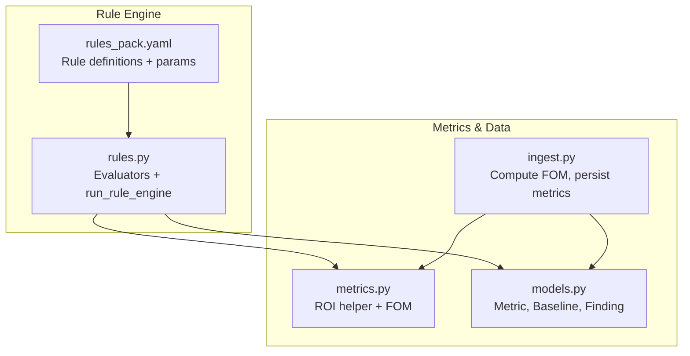
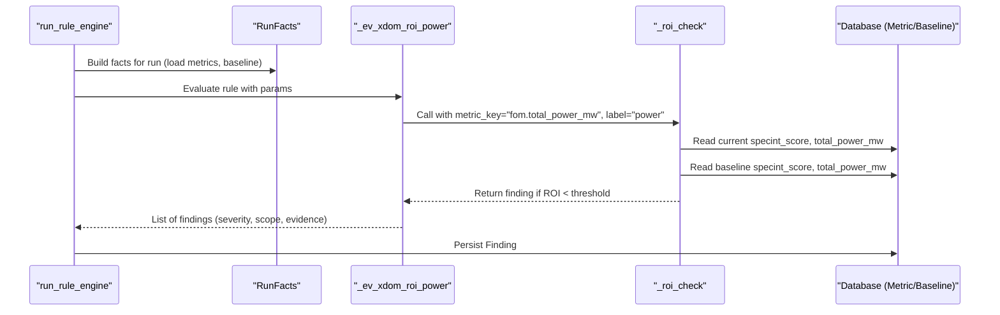
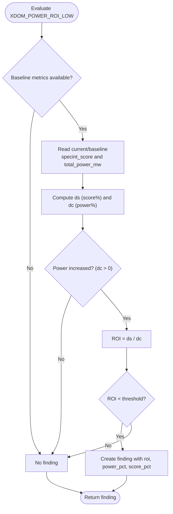
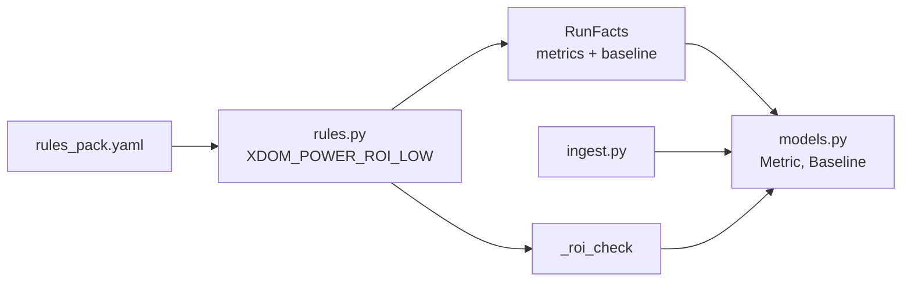

# XDOM_POWER_ROI_LOW - Poor Power Return-on-Investment

<cite>
**Referenced Files in This Document**
- [rules.py](file://backend/ppa/rules.py)
- [rules_pack.yaml](file://backend/ppa/rules_pack.yaml)
- [metrics.py](file://backend/ppa/metrics.py)
- [models.py](file://backend/ppa/models.py)
- [ingest.py](file://backend/ppa/ingest.py)
</cite>

## Table of Contents
1. [Introduction](#introduction)
2. [Project Structure](#project-structure)
3. [Core Components](#core-components)
4. [Architecture Overview](#architecture-overview)
5. [Detailed Component Analysis](#detailed-component-analysis)
6. [Dependency Analysis](#dependency-analysis)
7. [Performance Considerations](#performance-considerations)
8. [Troubleshooting Guide](#troubleshooting-guide)
9. [Conclusion](#conclusion)
10. [Appendices](#appendices)

## Introduction
This document explains the XDOM_POWER_ROI_LOW rule evaluator, which flags power optimizations that deliver poor return on investment (ROI). It uses the same ROI methodology as area ROI evaluation but focuses on power metrics instead of area. The evaluator compares SPECint score changes against total power consumption changes and flags cases where power increases provide inadequate performance benefits relative to a configurable threshold. It integrates with a shared _roi_check function, passes parameters from the YAML rule pack, and relies on baseline vs current metrics stored in the database.

## Project Structure
The rule engine is implemented in Python under backend/ppa:
- rules.py defines evaluators and the rule execution pipeline
- rules_pack.yaml declares thresholds, titles, and categories for each rule
- metrics.py computes derived figures of merit and ROI helpers
- models.py defines data structures including Metric, Baseline, and Finding
- ingest.py computes Figures of Merit (FOM) and persists metrics used by rules

**Diagram sources**
- [rules.py:290-310](file://backend/ppa/rules.py#L290-L310)
- [rules_pack.yaml:91-107](file://backend/ppa/rules_pack.yaml#L91-L107)
- [metrics.py:151-155](file://backend/ppa/metrics.py#L151-L155)
- [models.py:83-90](file://backend/ppa/models.py#L83-L90)
- [ingest.py:184-190](file://backend/ppa/ingest.py#L184-L190)

**Section sources**
- [rules.py:290-310](file://backend/ppa/rules.py#L290-L310)
- [rules_pack.yaml:91-107](file://backend/ppa/rules_pack.yaml#L91-L107)
- [metrics.py:151-155](file://backend/ppa/metrics.py#L151-L155)
- [models.py:83-90](file://backend/ppa/models.py#L83-L90)
- [ingest.py:184-190](file://backend/ppa/ingest.py#L184-L190)

## Core Components
- XDOM_POWER_ROI_LOW rule: Declared in rules_pack.yaml with category cross_domain, severity medium, and a default threshold of 0.3 for ROI.
- Evaluator mapping: In rules.py, XDOM_POWER_ROI_LOW maps to _ev_xdom_roi_power, which delegates to _roi_check using the metric key "fom.total_power_mw" and label "power".
- Shared ROI logic: _roi_check computes percent change in SPECint score and percent change in total power, then calculates ROI as score% / power%. If power increases (positive delta) and ROI falls below the configured threshold, it returns a finding.
- Metrics source: The FOM fields (including "fom.specint_score" and "fom.total_power_mw") are computed during ingestion and persisted as Metric rows keyed by run_id.
- Baseline context: RunFacts loads baseline metrics for the project’s baseline run to compute deltas between current and baseline runs.

Key responsibilities:
- Identify when power increases do not justify the resulting SPECint score gains.
- Provide evidence in findings: roi, power_pct, score_pct.
- Allow tuning via the rule’s threshold parameter.

**Section sources**
- [rules_pack.yaml:97-107](file://backend/ppa/rules_pack.yaml#L97-L107)
- [rules.py:247-266](file://backend/ppa/rules.py#L247-L266)
- [metrics.py:112-125](file://backend/ppa/metrics.py#L112-L125)
- [models.py:83-90](file://backend/ppa/models.py#L83-L90)

## Architecture Overview
The rule evaluation flow for XDOM_POWER_ROI_LOW:

**Diagram sources**
- [rules.py:313-352](file://backend/ppa/rules.py#L313-L352)
- [rules.py:247-266](file://backend/ppa/rules.py#L247-L266)
- [models.py:83-90](file://backend/ppa/models.py#L83-L90)

## Detailed Component Analysis

### XDOM_POWER_ROI_LOW Rule Definition
- Category: cross_domain
- Severity: medium
- Title template includes ROI, power percentage change, and score percentage change
- Parameter: threshold (default 0.3)

Interpretation:
- A low ROI indicates that the increase in power did not yield proportional SPECint score improvement.
- Thresholds can be tuned per project or design family.

**Section sources**
- [rules_pack.yaml:97-107](file://backend/ppa/rules_pack.yaml#L97-L107)

### Evaluator: _ev_xdom_roi_power
- Delegates to _roi_check with metric_key "fom.total_power_mw" and label "power"
- Returns findings only when power increased and ROI is below threshold

Behavior highlights:
- No finding if power decreased (dc <= 0), since lower power with any score gain is always good.
- Evidence includes roi, power_pct, score_pct for transparency.

**Section sources**
- [rules.py:247-266](file://backend/ppa/rules.py#L247-L266)

### Shared ROI Logic: _roi_check
Algorithm:
1. Ensure baseline metrics exist; otherwise skip.
2. Read current and baseline values for:
   - Score: "fom.specint_score"
   - Cost: "fom.total_power_mw"
3. Compute percent changes:
   - ds = (score_current - score_baseline) / score_baseline
   - dc = (power_current - power_baseline) / power_baseline
4. Skip if cost did not increase (dc <= 0).
5. Compute ROI = ds / dc.
6. If ROI < threshold, return a finding with evidence {roi, power_pct, score_pct}.

Complexity:
- O(1) per run after baseline metrics are loaded.

Edge cases:
- Missing baseline metrics or zero denominators result in no finding.
- Negative or zero power delta is ignored (no penalty for power reductions).

**Section sources**
- [rules.py:251-266](file://backend/ppa/rules.py#L251-L266)

### Metrics and FOM Integration
- FOM computation stores "fom.specint_score" and "fom.total_power_mw" as Metric rows keyed by run_id.
- These metrics are consumed by RunFacts.metrics for both current and baseline runs.
- The frontend also displays power ROI alongside area ROI for comparison.

Data flow:
- ingest.py computes FOM and persists metrics
- rules.py reads metrics via RunFacts
- _roi_check performs ratio calculation and threshold check

**Section sources**
- [metrics.py:112-125](file://backend/ppa/metrics.py#L112-L125)
- [ingest.py:184-190](file://backend/ppa/ingest.py#L184-L190)
- [rules.py:24-72](file://backend/ppa/rules.py#L24-L72)

### Evaluation Flow Visualization

**Diagram sources**
- [rules.py:251-266](file://backend/ppa/rules.py#L251-L266)

## Dependency Analysis
- Rule definition depends on rules_pack.yaml for id, category, severity, title, and params.
- Evaluator depends on:
  - RunFacts for metrics and baseline
  - _roi_check for ROI logic
  - Database for Metric and Baseline entities
- Metrics depend on ingest pipeline to compute FOM and persist them.

**Diagram sources**
- [rules_pack.yaml:97-107](file://backend/ppa/rules_pack.yaml#L97-L107)
- [rules.py:247-266](file://backend/ppa/rules.py#L247-L266)
- [models.py:83-90](file://backend/ppa/models.py#L83-L90)
- [ingest.py:184-190](file://backend/ppa/ingest.py#L184-L190)

**Section sources**
- [rules.py:247-266](file://backend/ppa/rules.py#L247-L266)
- [rules_pack.yaml:97-107](file://backend/ppa/rules_pack.yaml#L97-L107)
- [models.py:83-90](file://backend/ppa/models.py#L83-L90)
- [ingest.py:184-190](file://backend/ppa/ingest.py#L184-L190)

## Performance Considerations
- The ROI check is constant-time per run after baseline metrics are loaded.
- Avoid unnecessary recomputation by relying on precomputed RunFacts.
- Threshold tuning should reflect acceptable trade-offs for your design goals; lower thresholds flag more potential issues.

[No sources needed since this section provides general guidance]

## Troubleshooting Guide
Common issues and resolutions:
- No finding despite suspected poor ROI:
  - Verify baseline metrics exist for the project’s baseline run.
  - Ensure both "fom.specint_score" and "fom.total_power_mw" are present for current and baseline runs.
  - Confirm power actually increased (dc > 0); decreases are intentionally ignored.
- Unexpected findings:
  - Check the threshold value in rules_pack.yaml; lowering it increases sensitivity.
  - Review evidence_json in findings for roi, power_pct, score_pct to understand the ratio.
- Data quality:
  - Ensure reports were parsed successfully; missing or error reports may prevent metric computation.

**Section sources**
- [rules.py:251-266](file://backend/ppa/rules.py#L251-L266)
- [rules_pack.yaml:97-107](file://backend/ppa/rules_pack.yaml#L97-L107)

## Conclusion
XDOM_POWER_ROI_LOW provides a consistent, threshold-driven mechanism to identify power optimizations that fail to deliver proportional SPECint score improvements. By reusing the shared _roi_check logic, it aligns power ROI analysis with area ROI evaluation, enabling designers to quickly spot wasteful power increases and focus efforts on high-impact optimizations. Proper baseline setup and threshold tuning ensure accurate and actionable findings.

[No sources needed since this section summarizes without analyzing specific files]

## Appendices

### Practical Examples and Interpretation
- Example scenario:
  - Baseline: SPECint score 100, total power 50 mW
  - Current: SPECint score 105, total power 60 mW
  - ds = 5%, dc = 20%, ROI = 0.25
  - With default threshold 0.3, this triggers XDOM_POWER_ROI_LOW, indicating power growth outpaced score gains.
- Strategies:
  - Prefer changes that reduce power while maintaining or improving score.
  - Investigate modules with high power density and low contribution to IPC or frequency.
  - Use area ROI alongside power ROI to balance silicon cost and energy efficiency.

[No sources needed since this section provides conceptual examples]