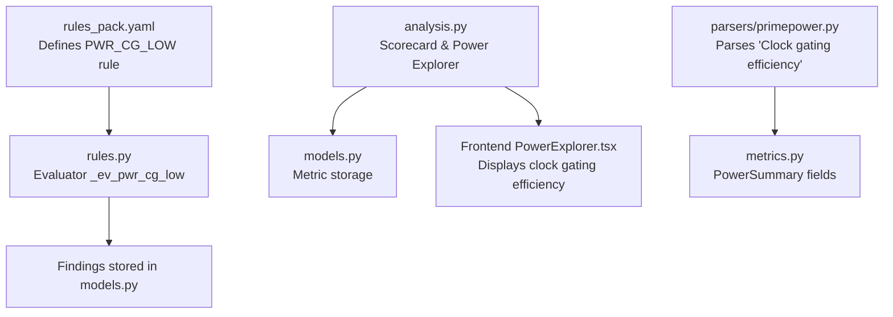
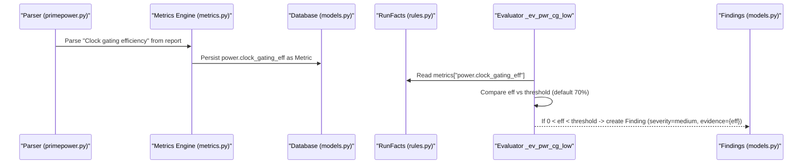
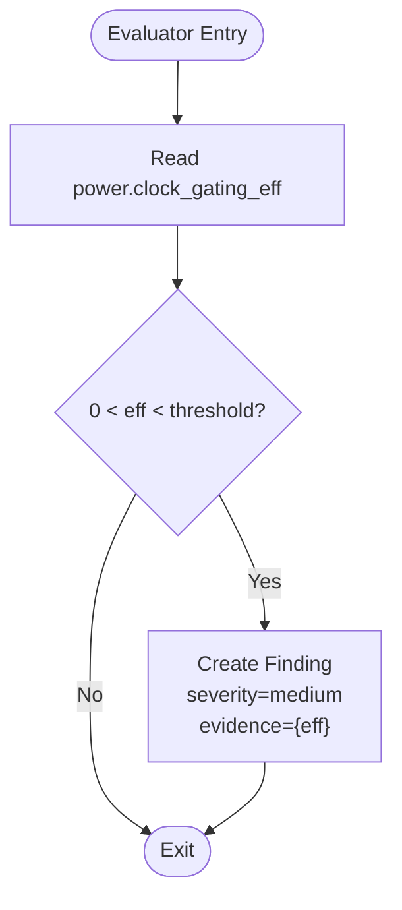
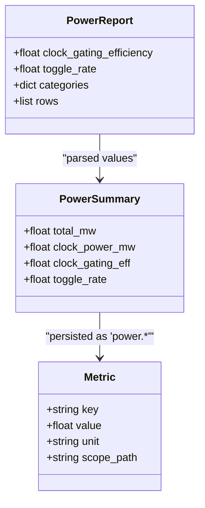
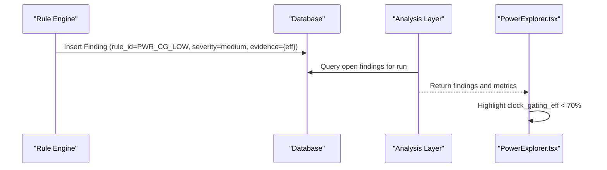
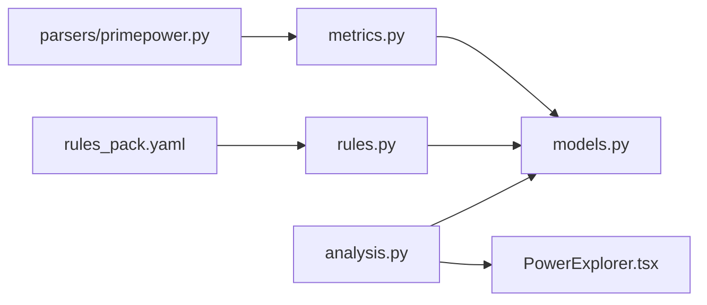

# PWR_CG_LOW - Clock Gating Effectiveness Analysis

<cite>
**Referenced Files in This Document**
- [rules.py](file://backend/ppa/rules.py)
- [rules_pack.yaml](file://backend/ppa/rules_pack.yaml)
- [metrics.py](file://backend/ppa/metrics.py)
- [models.py](file://backend/ppa/models.py)
- [analysis.py](file://backend/ppa/analysis.py)
- [primepower.py](file://backend/ppa/parsers/primepower.py)
- [PowerExplorer.tsx](file://frontend/src/views/PowerExplorer.tsx)
</cite>

## Table of Contents
1. [Introduction](#introduction)
2. [Project Structure](#project-structure)
3. [Core Components](#core-components)
4. [Architecture Overview](#architecture-overview)
5. [Detailed Component Analysis](#detailed-component-analysis)
6. [Dependency Analysis](#dependency-analysis)
7. [Performance Considerations](#performance-considerations)
8. [Troubleshooting Guide](#troubleshooting-guide)
9. [Conclusion](#conclusion)
10. [Appendices](#appendices)

## Introduction
This document explains the PWR_CG_LOW rule evaluator that assesses clock gating effectiveness to support power optimization. It covers how the system processes the power.clock_gating_eff metric, evaluates it against a configurable threshold (default 70%), and generates findings when clock gating is insufficient. The rule carries a medium severity classification and includes evidence containing the measured effectiveness percentage. It also outlines how this evaluation fits into broader power management strategies and provides guidance for improving clock gating implementation.

## Project Structure
The PWR_CG_LOW rule is part of a deterministic rule engine that:
- Loads rules from a YAML pack defining IDs, categories, severities, titles, and parameters.
- Evaluates each rule using pure Python evaluators that read precomputed facts from the database.
- Produces findings with severity, category, scope, title, and JSON evidence.

**Diagram sources**
- [rules_pack.yaml:62-66](file://backend/ppa/rules_pack.yaml#L62-L66)
- [rules.py:170-174](file://backend/ppa/rules.py#L170-L174)
- [primepower.py:39-42](file://backend/ppa/parsers/primepower.py#L39-L42)
- [metrics.py:47-68](file://backend/ppa/metrics.py#L47-L68)
- [analysis.py:69-125](file://backend/ppa/analysis.py#L69-L125)
- [PowerExplorer.tsx:46-58](file://frontend/src/views/PowerExplorer.tsx#L46-L58)

**Section sources**
- [rules_pack.yaml:1-119](file://backend/ppa/rules_pack.yaml#L1-L119)
- [rules.py:1-361](file://backend/ppa/rules.py#L1-L361)
- [analysis.py:1-439](file://backend/ppa/analysis.py#L1-L439)
- [models.py:1-217](file://backend/ppa/models.py#L1-L217)
- [primepower.py:1-86](file://backend/ppa/parsers/primepower.py#L1-L86)
- [metrics.py:1-258](file://backend/ppa/metrics.py#L1-L258)
- [PowerExplorer.tsx:46-58](file://frontend/src/views/PowerExplorer.tsx#L46-L58)

## Core Components
- Rule definition: PWR_CG_LOW is defined in the rule pack with category "power", severity "medium", and a default threshold of 70%.
- Evaluator: _ev_pwr_cg_low reads power.clock_gating_eff from RunFacts metrics and triggers a finding if the value is between 0% and the configured threshold.
- Metric source: The parser extracts "Clock gating efficiency" from PrimePower reports; metrics are stored as key-value pairs per run.
- Findings: When triggered, a Finding record is created with severity "medium", category "power", and evidence_json containing the effectiveness percentage.

Key behaviors:
- Thresholding: Configurable via params.threshold; default 70%.
- Evidence: Includes the measured effectiveness percentage (eff).
- Severity: Medium by default; can be overridden by rule configuration.

**Section sources**
- [rules_pack.yaml:62-66](file://backend/ppa/rules_pack.yaml#L62-L66)
- [rules.py:170-174](file://backend/ppa/rules.py#L170-L174)
- [rules.py:313-352](file://backend/ppa/rules.py#L313-L352)
- [primepower.py:39-42](file://backend/ppa/parsers/primepower.py#L39-L42)
- [metrics.py:47-68](file://backend/ppa/metrics.py#L47-L68)
- [models.py:168-180](file://backend/ppa/models.py#L168-L180)

## Architecture Overview
The end-to-end flow for PWR_CG_LOW:

**Diagram sources**
- [primepower.py:39-42](file://backend/ppa/parsers/primepower.py#L39-L42)
- [metrics.py:47-68](file://backend/ppa/metrics.py#L47-L68)
- [models.py:83-90](file://backend/ppa/models.py#L83-L90)
- [rules.py:24-48](file://backend/ppa/rules.py#L24-L48)
- [rules.py:170-174](file://backend/ppa/rules.py#L170-L174)
- [rules.py:313-352](file://backend/ppa/rules.py#L313-L352)

## Detailed Component Analysis

### PWR_CG_LOW Rule Definition
- ID: PWR_CG_LOW
- Category: power
- Severity: medium
- Title template: "Clock gating efficiency only {eff:.0f}%"
- Parameters: threshold (default 70)

This rule targets designs where clock gating is not sufficiently applied, leading to unnecessary switching activity on clocks and higher dynamic power consumption.

**Section sources**
- [rules_pack.yaml:62-66](file://backend/ppa/rules_pack.yaml#L62-L66)

### Evaluator Logic (_ev_pwr_cg_low)
- Reads power.clock_gating_eff from RunFacts.metrics.
- Triggers when 0 < eff < threshold.
- Returns a finding tuple with severity "medium" and evidence containing the effectiveness percentage.

**Diagram sources**
- [rules.py:170-174](file://backend/ppa/rules.py#L170-L174)

**Section sources**
- [rules.py:170-174](file://backend/ppa/rules.py#L170-L174)

### Metric Extraction and Storage
- Parser: Extracts "Clock gating efficiency" from PrimePower-style reports.
- Metrics engine: Stores the value in PowerSummary and exposes it as a domain metric.
- Storage: Saved as a Metric row keyed by "power.clock_gating_eff".

**Diagram sources**
- [primepower.py:39-42](file://backend/ppa/parsers/primepower.py#L39-L42)
- [metrics.py:47-68](file://backend/ppa/metrics.py#L47-L68)
- [models.py:83-90](file://backend/ppa/models.py#L83-L90)

**Section sources**
- [primepower.py:19-86](file://backend/ppa/parsers/primepower.py#L19-L86)
- [metrics.py:47-68](file://backend/ppa/metrics.py#L47-L68)
- [models.py:83-90](file://backend/ppa/models.py#L83-L90)

### Findings Creation and Presentation
- Findings are created by the rule engine with severity, category, scope, title, and evidence_json.
- The frontend displays clock gating efficiency alongside other power indicators, highlighting values below thresholds.

**Diagram sources**
- [rules.py:313-352](file://backend/ppa/rules.py#L313-L352)
- [analysis.py:69-125](file://backend/ppa/analysis.py#L69-L125)
- [PowerExplorer.tsx:46-58](file://frontend/src/views/PowerExplorer.tsx#L46-L58)

**Section sources**
- [rules.py:313-352](file://backend/ppa/rules.py#L313-L352)
- [analysis.py:69-125](file://backend/ppa/analysis.py#L69-L125)
- [PowerExplorer.tsx:46-58](file://frontend/src/views/PowerExplorer.tsx#L46-L58)

## Dependency Analysis
- Rule pack defines PWR_CG_LOW parameters and metadata.
- Evaluator depends on RunFacts.metrics populated from stored Metric rows.
- Parser feeds metrics into the system by extracting values from tool reports.
- Frontend consumes analysis outputs to visualize clock gating efficiency and related metrics.

**Diagram sources**
- [rules_pack.yaml:62-66](file://backend/ppa/rules_pack.yaml#L62-L66)
- [rules.py:170-174](file://backend/ppa/rules.py#L170-L174)
- [primepower.py:39-42](file://backend/ppa/parsers/primepower.py#L39-L42)
- [metrics.py:47-68](file://backend/ppa/metrics.py#L47-L68)
- [models.py:83-90](file://backend/ppa/models.py#L83-L90)
- [analysis.py:69-125](file://backend/ppa/analysis.py#L69-L125)
- [PowerExplorer.tsx:46-58](file://frontend/src/views/PowerExplorer.tsx#L46-L58)

**Section sources**
- [rules_pack.yaml:1-119](file://backend/ppa/rules_pack.yaml#L1-L119)
- [rules.py:1-361](file://backend/ppa/rules.py#L1-L361)
- [primepower.py:1-86](file://backend/ppa/parsers/primepower.py#L1-L86)
- [metrics.py:1-258](file://backend/ppa/metrics.py#L1-L258)
- [models.py:1-217](file://backend/ppa/models.py#L1-L217)
- [analysis.py:1-439](file://backend/ppa/analysis.py#L1-L439)
- [PowerExplorer.tsx:46-58](file://frontend/src/views/PowerExplorer.tsx#L46-L58)

## Performance Considerations
- The evaluator is lightweight: constant-time check against a single metric and threshold.
- Parsing overhead occurs upstream when reading PrimePower reports; ensure reports include the "Clock gating efficiency" line for accurate assessment.
- Database queries are scoped to a single run’s metrics, minimizing load during rule evaluation.

[No sources needed since this section provides general guidance]

## Troubleshooting Guide
Common issues and resolutions:
- Missing or zero clock gating efficiency:
  - Verify the PrimePower report contains the "Clock gating efficiency" line.
  - Confirm the parser successfully extracted the value and stored it as "power.clock_gating_eff".
- Unexpected triggering of PWR_CG_LOW:
  - Adjust the threshold in rules_pack.yaml if your design’s target differs from the default 70%.
  - Review whether modules lack gating enable signals or have always-on clock paths.
- Frontend display anomalies:
  - Ensure the analysis layer returns power.clock_gating_eff and that the UI renders it correctly.

**Section sources**
- [primepower.py:39-42](file://backend/ppa/parsers/primepower.py#L39-L42)
- [rules_pack.yaml:62-66](file://backend/ppa/rules_pack.yaml#L62-L66)
- [analysis.py:69-125](file://backend/ppa/analysis.py#L69-L125)
- [PowerExplorer.tsx:46-58](file://frontend/src/views/PowerExplorer.tsx#L46-L58)

## Conclusion
PWR_CG_LOW provides a focused, configurable check for insufficient clock gating effectiveness. By evaluating power.clock_gating_eff against a threshold and generating medium-severity findings with clear evidence, it helps teams identify opportunities to reduce dynamic power through better gating practices. Integrating this rule into the broader power management workflow enables consistent detection and actionable insights across runs.

[No sources needed since this section summarizes without analyzing specific files]

## Appendices

### Example Scenarios
- High effectiveness (≥70%): No PWR_CG_LOW finding; indicates effective gating strategy.
- Low effectiveness (<70%): Finding generated with evidence showing the measured percentage; prompts investigation of missing or ineffective gating.

[No sources needed since this section provides conceptual examples]

### Best Practices for Clock Gating
- Apply gating at module boundaries where data is idle for multiple cycles.
- Use gating enable signals derived from control logic to avoid unnecessary toggling.
- Avoid gating low-frequency or always-active clocks unless justified by power savings.
- Validate gating effectiveness with vectorless power analysis and compare against thresholds.

[No sources needed since this section provides general guidance]

### Measurement Methodology
- Source: PrimePower “Clock gating efficiency” line parsed by the tool-specific parser.
- Storage: Persisted as a metric under the power domain for cross-domain analysis.
- Evaluation: Compared against configurable thresholds to generate findings.

**Section sources**
- [primepower.py:39-42](file://backend/ppa/parsers/primepower.py#L39-L42)
- [metrics.py:47-68](file://backend/ppa/metrics.py#L47-L68)
- [rules.py:170-174](file://backend/ppa/rules.py#L170-L174)