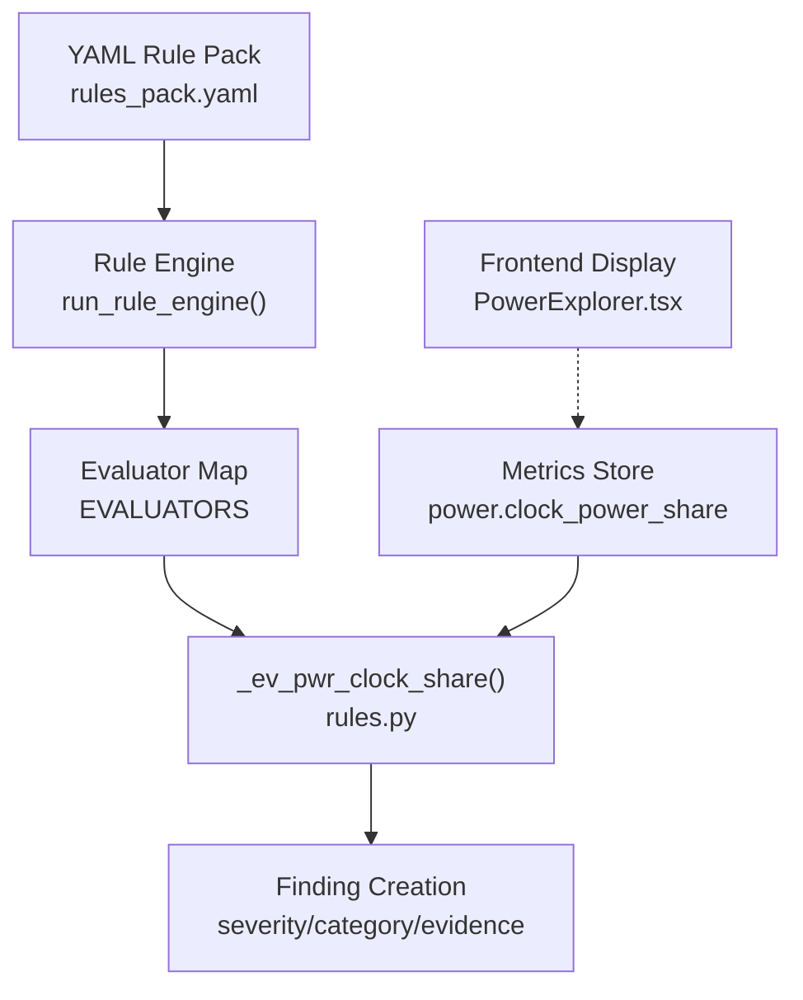
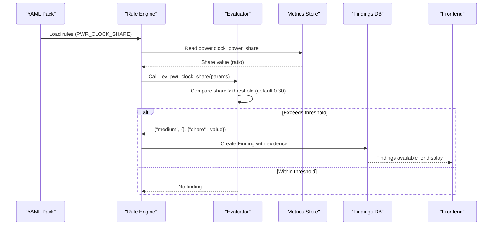
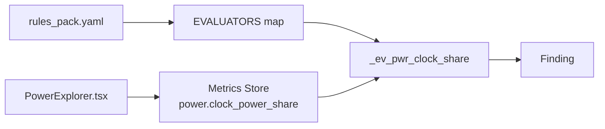

# PWR_CLOCK_SHARE - Clock Power Distribution Analysis

<cite>
**Referenced Files in This Document**
- [rules.py](file://backend/ppa/rules.py)
- [rules_pack.yaml](file://backend/ppa/rules_pack.yaml)
- [metrics.py](file://backend/ppa/metrics.py)
- [ingest.py](file://backend/ppa/ingest.py)
- [analysis.py](file://backend/ppa/analysis.py)
- [PowerExplorer.tsx](file://frontend/src/views/PowerExplorer.tsx)
</cite>

## Table of Contents
1. [Introduction](#introduction)
2. [Project Structure](#project-structure)
3. [Core Components](#core-components)
4. [Architecture Overview](#architecture-overview)
5. [Detailed Component Analysis](#detailed-component-analysis)
6. [Dependency Analysis](#dependency-analysis)
7. [Performance Considerations](#performance-considerations)
8. [Troubleshooting Guide](#troubleshooting-guide)
9. [Conclusion](#conclusion)
10. [Appendices](#appendices)

## Introduction
This document explains the PWR_CLOCK_SHARE power rule evaluator that analyzes clock power distribution efficiency. It covers how the evaluator processes the power.clock_power_share metric, compares it against a configurable threshold (default 0.30 or 30%), and identifies excessive clock power usage. It also documents severity classification (medium), evidence structure (share percentage), and the relationship to clock gating effectiveness. Finally, it provides guidance on interpreting results and strategies for optimizing clock power.

## Project Structure
The PWR_CLOCK_SHARE rule is part of a deterministic rule engine that:
- Loads rules from a YAML pack
- Evaluates metrics computed during ingestion
- Produces findings with severity, category, scope, title, and evidence

**Diagram sources**
- [rules_pack.yaml:56-60](file://backend/ppa/rules_pack.yaml#L56-L60)
- [rules.py:290-310](file://backend/ppa/rules.py#L290-L310)
- [rules.py:163-167](file://backend/ppa/rules.py#L163-L167)
- [ingest.py:200-214](file://backend/ppa/ingest.py#L200-L214)
- [PowerExplorer.tsx:46-58](file://frontend/src/views/PowerExplorer.tsx#L46-L58)

**Section sources**
- [rules_pack.yaml:1-119](file://backend/ppa/rules_pack.yaml#L1-L119)
- [rules.py:1-361](file://backend/ppa/rules.py#L1-L361)
- [ingest.py:200-214](file://backend/ppa/ingest.py#L200-L214)
- [PowerExplorer.tsx:46-58](file://frontend/src/views/PowerExplorer.tsx#L46-L58)

## Core Components
- Rule definition: The PWR_CLOCK_SHARE rule is defined in the YAML pack with category "power", default severity "medium", and a default threshold of 0.30.
- Evaluator: _ev_pwr_clock_share reads power.clock_power_share from the run’s metrics and triggers when the share exceeds the configured threshold.
- Metrics computation: power.clock_power_share is derived as clock_power_mw / total_mw from the PowerSummary.
- Ingestion: During ingestion, power.clock_power_share is stored as a metric for each run.
- Frontend: The Power Explorer displays clock power share and highlights values above 30% as an opportunity area.

Key responsibilities:
- Threshold-based detection of excessive clock power share
- Evidence capture of the actual share percentage
- Consistent severity and categorization for downstream analysis and UI

**Section sources**
- [rules_pack.yaml:56-60](file://backend/ppa/rules_pack.yaml#L56-L60)
- [rules.py:163-167](file://backend/ppa/rules.py#L163-L167)
- [metrics.py:47-68](file://backend/ppa/metrics.py#L47-L68)
- [ingest.py:200-214](file://backend/ppa/ingest.py#L200-L214)
- [PowerExplorer.tsx:46-58](file://frontend/src/views/PowerExplorer.tsx#L46-L58)

## Architecture Overview
The evaluation flow for PWR_CLOCK_SHARE:

**Diagram sources**
- [rules_pack.yaml:56-60](file://backend/ppa/rules_pack.yaml#L56-L60)
- [rules.py:290-310](file://backend/ppa/rules.py#L290-L310)
- [rules.py:163-167](file://backend/ppa/rules.py#L163-L167)
- [ingest.py:200-214](file://backend/ppa/ingest.py#L200-L214)
- [PowerExplorer.tsx:46-58](file://frontend/src/views/PowerExplorer.tsx#L46-L58)

## Detailed Component Analysis

### PWR_CLOCK_SHARE Rule Definition
- Category: power
- Severity: medium
- Default threshold: 0.30 (30%)
- Title template includes the share percentage for reporting

Tuning guidelines:
- Lower thresholds (e.g., 0.20–0.25) for aggressive power targets
- Higher thresholds (e.g., 0.35–0.40) for designs where clock networks are inherently large
- Adjust based on architecture style (e.g., many small gated domains vs. global clock trees)

**Section sources**
- [rules_pack.yaml:56-60](file://backend/ppa/rules_pack.yaml#L56-L60)

### Evaluator Logic: _ev_pwr_clock_share
- Reads power.clock_power_share from RunFacts.metrics
- Compares against params.threshold (default 0.30)
- Returns a finding tuple with severity "medium" and evidence {"share": value} if exceeded

Complexity: O(1) per run; constant-time lookup and comparison.

Error handling:
- If the metric is missing, defaults to 0.0, so no false positives occur due to missing data.

**Section sources**
- [rules.py:163-167](file://backend/ppa/rules.py#L163-L167)

### Metrics Computation: power.clock_power_share
- Derived from PowerSummary.clock_power_mw / PowerSummary.total_mw
- Ensures safe division by checking total_mw != 0
- Integrated into figures-of-merit pipeline and persisted via ingestion

Data flow:
- PrimePower parser categories include "clock"
- summarize_power aggregates top-level totals and category breakdowns
- ingest stores power.clock_power_share as a metric

**Section sources**
- [metrics.py:47-68](file://backend/ppa/metrics.py#L47-L68)
- [metrics.py:206-221](file://backend/ppa/metrics.py#L206-L221)
- [ingest.py:200-214](file://backend/ppa/ingest.py#L200-L214)

### Integration with Clock Gating Effectiveness
- Separate rule PWR_CG_LOW evaluates clock_gating_efficiency; low values indicate wasted clock power
- When both PWR_CLOCK_SHARE and PWR_CG_LOW trigger, it suggests opportunities to improve gating coverage or reduce unnecessary toggles
- Frontend surfaces both metrics together to guide optimization decisions

Interpretation:
- High clock power share + low gating efficiency → prioritize improving gating and reducing toggle activity
- High clock power share + high gating efficiency → consider CTS restructuring, lowering clock frequency, or reducing clock domain crossings

**Section sources**
- [rules.py:170-174](file://backend/ppa/rules.py#L170-L174)
- [PowerExplorer.tsx:46-58](file://frontend/src/views/PowerExplorer.tsx#L46-L58)

### Visualization and User Guidance
- Frontend highlights clock power share > 30% as an opportunity area
- Displays clock gating efficiency with color coding (<70% flagged)
- Provides context for designers to correlate share and gating efficiency

**Section sources**
- [PowerExplorer.tsx:46-58](file://frontend/src/views/PowerExplorer.tsx#L46-L58)

## Dependency Analysis
The PWR_CLOCK_SHARE rule depends on:
- YAML rule pack for configuration (threshold, severity, category)
- Metrics store for power.clock_power_share
- Rule engine for execution and finding creation
- Frontend for visualization and user feedback

**Diagram sources**
- [rules_pack.yaml:56-60](file://backend/ppa/rules_pack.yaml#L56-L60)
- [rules.py:290-310](file://backend/ppa/rules.py#L290-L310)
- [rules.py:163-167](file://backend/ppa/rules.py#L163-L167)
- [ingest.py:200-214](file://backend/ppa/ingest.py#L200-L214)
- [PowerExplorer.tsx:46-58](file://frontend/src/views/PowerExplorer.tsx#L46-L58)

**Section sources**
- [rules.py:290-310](file://backend/ppa/rules.py#L290-L310)
- [ingest.py:200-214](file://backend/ppa/ingest.py#L200-L214)

## Performance Considerations
- The evaluator performs a single metric lookup and comparison; overhead is negligible.
- Avoid frequent threshold tuning in tight loops; changes apply at rule evaluation time.
- Ensure accurate power measurements; vectorless estimates are relative and suitable for design exploration but not signoff.

[No sources needed since this section provides general guidance]

## Troubleshooting Guide
Common issues and resolutions:
- Missing metric: If power.clock_power_share is absent, the evaluator defaults to 0.0 and will not flag. Verify ingestion path and parser outputs.
- Unexpected threshold behavior: Confirm the active threshold in the YAML pack; overrides in params take precedence.
- Correlation with gating efficiency: If clock power share is high but gating efficiency appears acceptable, inspect toggle rates and CTS structure.

Diagnostic steps:
- Check frontend Power Explorer for current share and gating efficiency values
- Review ingestion logs for primepower parsing and category extraction
- Validate that categories include "clock" and totals are non-zero

**Section sources**
- [rules.py:163-167](file://backend/ppa/rules.py#L163-L167)
- [ingest.py:200-214](file://backend/ppa/ingest.py#L200-L214)
- [PowerExplorer.tsx:46-58](file://frontend/src/views/PowerExplorer.tsx#L46-L58)

## Conclusion
The PWR_CLOCK_SHARE rule provides a simple, configurable mechanism to detect excessive clock power consumption. By comparing power.clock_power_share against a threshold (default 30%), it flags designs where clock networks may be over-provisioned or inefficiently gated. Combined with clock gating efficiency insights, teams can target specific optimizations such as improved gating coverage, CTS restructuring, and reduced toggle activity to achieve meaningful power reductions.

[No sources needed since this section summarizes without analyzing specific files]

## Appendices

### Evidence Structure
When PWR_CLOCK_SHARE triggers, the finding includes:
- severity: "medium"
- category: "power"
- evidence_json: {"share": <float ratio>}

Example interpretation:
- share = 0.35 means clock power accounts for 35% of total power, exceeding the default threshold.

**Section sources**
- [rules_pack.yaml:56-60](file://backend/ppa/rules_pack.yaml#L56-L60)
- [rules.py:163-167](file://backend/ppa/rules.py#L163-L167)

### Optimization Strategies
- Improve clock gating coverage to reduce unnecessary toggles
- Restructure clock tree synthesis (CTS) to minimize capacitance and switching
- Reduce clock domain crossings where possible
- Lower clock frequency if performance allows
- Partition clocks to isolate high-toggle regions

[No sources needed since this section provides general guidance]

### Threshold Tuning Guidelines
- Start with default 0.30; adjust based on architecture and goals
- For aggressive power budgets, use lower thresholds (e.g., 0.20–0.25)
- For designs with inherently large clock networks, consider higher thresholds (e.g., 0.35–0.40)
- Re-evaluate thresholds after major architectural changes

**Section sources**
- [rules_pack.yaml:56-60](file://backend/ppa/rules_pack.yaml#L56-L60)

### Interpretation of Results
- Below threshold: Clock power share is within acceptable range; continue monitoring gating efficiency
- Above threshold: Investigate gating coverage and CTS; consider targeted optimizations
- Combined with PWR_CG_LOW: Strong signal to improve gating and reduce toggles

**Section sources**
- [rules.py:170-174](file://backend/ppa/rules.py#L170-L174)
- [PowerExplorer.tsx:46-58](file://frontend/src/views/PowerExplorer.tsx#L46-L58)