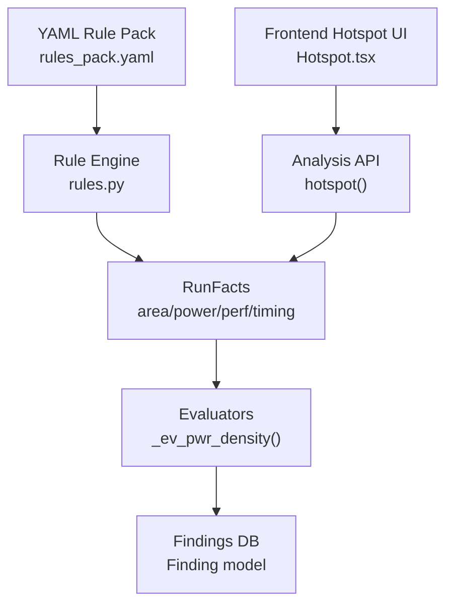
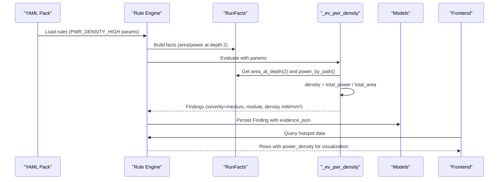
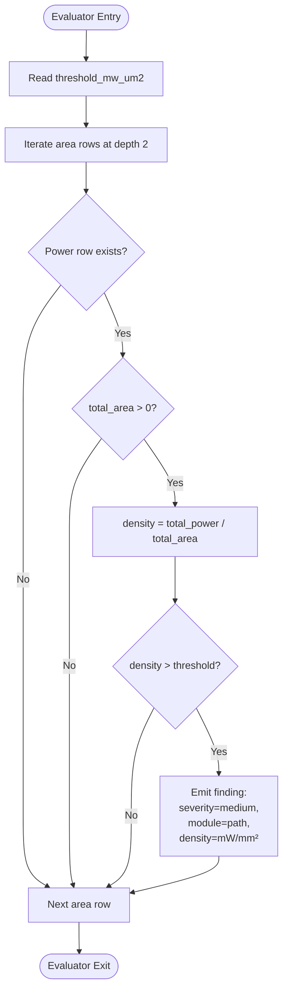
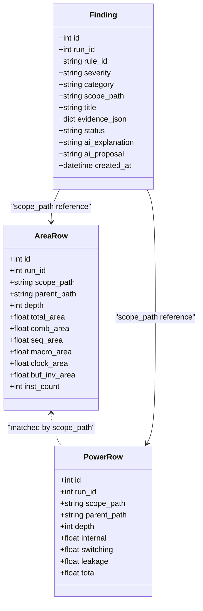
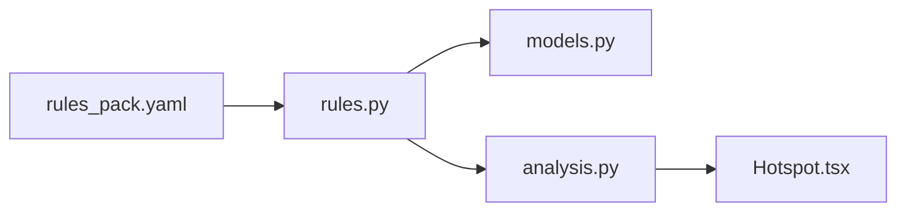

# PWR_DENSITY_HIGH - Power Density Hotspot Analysis

<cite>
**Referenced Files in This Document**
- [rules.py](file://backend/ppa/rules.py)
- [rules_pack.yaml](file://backend/ppa/rules_pack.yaml)
- [models.py](file://backend/ppa/models.py)
- [analysis.py](file://backend/ppa/analysis.py)
- [Hotspot.tsx](file://frontend/src/views/Hotspot.tsx)
</cite>

## Table of Contents
1. [Introduction](#introduction)
2. [Project Structure](#project-structure)
3. [Core Components](#core-components)
4. [Architecture Overview](#architecture-overview)
5. [Detailed Component Analysis](#detailed-component-analysis)
6. [Dependency Analysis](#dependency-analysis)
7. [Performance Considerations](#performance-considerations)
8. [Troubleshooting Guide](#troubleshooting-guide)
9. [Conclusion](#conclusion)
10. [Appendices](#appendices)

## Introduction
This document explains the PWR_DENSITY_HIGH power rule evaluator that identifies power density hotspots at module level. It details how the evaluator computes power density by dividing total power by area for each module at depth 2, compares against a configurable threshold (default 0.00045 mW/μm²), and generates findings with medium severity. It also documents the evidence structure (module path and density values converted to mW/mm²), the hotspot identification methodology, example workflows, threshold tuning guidance based on technology node, and strategies for addressing power density issues through architectural changes.

## Project Structure
The PWR_DENSITY_HIGH rule is part of a deterministic rule engine that:
- Loads rules from a YAML pack defining IDs, categories, severities, titles, and parameters.
- Evaluates each rule using pure Python evaluators that read precomputed facts per run.
- Emits findings stored in the database with severity, category, scope, title, and evidence.

**Diagram sources**
- [rules_pack.yaml:68-73](file://backend/ppa/rules_pack.yaml#L68-L73)
- [rules.py:17-21](file://backend/ppa/rules.py#L17-L21)
- [rules.py:24-79](file://backend/ppa/rules.py#L24-L79)
- [rules.py:177-189](file://backend/ppa/rules.py#L177-L189)
- [models.py:168-180](file://backend/ppa/models.py#L168-L180)
- [analysis.py:361-398](file://backend/ppa/analysis.py#L361-L398)
- [Hotspot.tsx:18-56](file://frontend/src/views/Hotspot.tsx#L18-L56)

**Section sources**
- [rules_pack.yaml:1-119](file://backend/ppa/rules_pack.yaml#L1-L119)
- [rules.py:1-361](file://backend/ppa/rules.py#L1-L361)
- [models.py:1-217](file://backend/ppa/models.py#L1-L217)
- [analysis.py:361-398](file://backend/ppa/analysis.py#L361-L398)
- [Hotspot.tsx:1-56](file://frontend/src/views/Hotspot.tsx#L1-L56)

## Core Components
- Rule definition: PWR_DENSITY_HIGH is defined in the YAML pack with category "power", severity "medium", and a default threshold parameter threshold_mw_um2 set to 0.00045.
- Evaluator: _ev_pwr_density computes per-module power density at depth 2 and flags modules exceeding the threshold.
- Data models: AreaRow and PowerRow provide hierarchical area and power metrics; Finding stores generated findings with evidence JSON.
- Analysis integration: The hotspot analysis aggregates per-module metrics including power density for visualization and comparison.

Key responsibilities:
- Load and parse rules from YAML.
- Build RunFacts per run (area, power, timing, performance).
- Evaluate PWR_DENSITY_HIGH and produce findings with medium severity when thresholds are exceeded.
- Provide frontend-friendly data via hotspot analysis.

**Section sources**
- [rules_pack.yaml:68-73](file://backend/ppa/rules_pack.yaml#L68-L73)
- [rules.py:177-189](file://backend/ppa/rules.py#L177-L189)
- [models.py:93-118](file://backend/ppa/models.py#L93-L118)
- [models.py:168-180](file://backend/ppa/models.py#L168-L180)
- [analysis.py:361-398](file://backend/ppa/analysis.py#L361-L398)

## Architecture Overview
The PWR_DENSITY_HIGH evaluation flow integrates rule configuration, data ingestion, evaluator logic, and finding persistence.

**Diagram sources**
- [rules_pack.yaml:68-73](file://backend/ppa/rules_pack.yaml#L68-L73)
- [rules.py:17-21](file://backend/ppa/rules.py#L17-L21)
- [rules.py:24-79](file://backend/ppa/rules.py#L24-L79)
- [rules.py:177-189](file://backend/ppa/rules.py#L177-L189)
- [models.py:168-180](file://backend/ppa/models.py#L168-L180)
- [analysis.py:361-398](file://backend/ppa/analysis.py#L361-L398)
- [Hotspot.tsx:18-56](file://frontend/src/views/Hotspot.tsx#L18-L56)

## Detailed Component Analysis

### PWR_DENSITY_HIGH Evaluator Logic
The evaluator performs the following steps:
- Reads the threshold parameter threshold_mw_um2 (default 0.00045).
- Retrieves all modules at depth 2 from area data.
- For each module, looks up corresponding power row by scope_path.
- Computes density as total power divided by total area.
- If density exceeds threshold, emits a finding with:
  - Severity: medium
  - Scope: module path
  - Evidence: module short name and density value converted to mW/mm² by multiplying by 1e6.

**Diagram sources**
- [rules.py:177-189](file://backend/ppa/rules.py#L177-L189)

**Section sources**
- [rules.py:177-189](file://backend/ppa/rules.py#L177-L189)

### Data Models and Evidence Structure
- AreaRow provides hierarchical area metrics including total_area and depth.
- PowerRow provides hierarchical power metrics including total power.
- Finding stores rule_id, severity, category, scope_path, title, and evidence_json containing module and density values.

Evidence fields emitted by PWR_DENSITY_HIGH:
- module: Short module name extracted from scope_path.
- density: Power density in mW/mm² computed as (total_power / total_area) * 1e6.

**Section sources**
- [models.py:93-118](file://backend/ppa/models.py#L93-L118)
- [models.py:168-180](file://backend/ppa/models.py#L168-L180)
- [rules.py:177-189](file://backend/ppa/rules.py#L177-L189)

### Hotspot Identification Methodology
The hotspot analysis complements the rule engine by aggregating per-module metrics at depth 2:
- Computes area_share and power_share relative to totals.
- Calculates criticality based on top timing paths originating from modules.
- Derives power_density per module as total_power / total_area.
- Sorts modules by combined importance (area_share + power_share + criticality).

This enables visual identification of dense hotspots alongside timing-critical modules.

**Diagram sources**
- [models.py:93-118](file://backend/ppa/models.py#L93-L118)
- [models.py:168-180](file://backend/ppa/models.py#L168-L180)
- [analysis.py:361-398](file://backend/ppa/analysis.py#L361-L398)

**Section sources**
- [analysis.py:361-398](file://backend/ppa/analysis.py#L361-L398)

### Frontend Visualization Integration
The frontend displays hotspot data including power density:
- Tooltip shows area share, power share, criticality percentage, and density in mW/mm².
- Scatter plot uses area share vs power share with color mapping by density.
- Visual map scales density values for intuitive hotspot identification.

**Section sources**
- [Hotspot.tsx:18-56](file://frontend/src/views/Hotspot.tsx#L18-L56)

## Dependency Analysis
The PWR_DENSITY_HIGH rule depends on:
- YAML rule pack for configuration and parameters.
- RunFacts for accessing area and power data at depth 2.
- Models for persisting findings and storing evidence.
- Analysis functions for generating hotspot views.

**Diagram sources**
- [rules_pack.yaml:68-73](file://backend/ppa/rules_pack.yaml#L68-L73)
- [rules.py:177-189](file://backend/ppa/rules.py#L177-L189)
- [models.py:168-180](file://backend/ppa/models.py#L168-L180)
- [analysis.py:361-398](file://backend/ppa/analysis.py#L361-L398)
- [Hotspot.tsx:18-56](file://frontend/src/views/Hotspot.tsx#L18-L56)

**Section sources**
- [rules_pack.yaml:68-73](file://backend/ppa/rules_pack.yaml#L68-L73)
- [rules.py:177-189](file://backend/ppa/rules.py#L177-L189)
- [models.py:168-180](file://backend/ppa/models.py#L168-L180)
- [analysis.py:361-398](file://backend/ppa/analysis.py#L361-L398)
- [Hotspot.tsx:18-56](file://frontend/src/views/Hotspot.tsx#L18-L56)

## Performance Considerations
- The evaluator iterates over area rows at depth 2 once per run, making it efficient for typical designs.
- Power lookups use a dictionary keyed by scope_path for O(1) access.
- Sorting area rows by total_area helps prioritize larger modules during inspection.
- Frontend visualization scales density values for better user experience without impacting backend performance.

[No sources needed since this section provides general guidance]

## Troubleshooting Guide
Common issues and resolutions:
- Missing power data for a module: Ensure power reports are parsed and loaded into PowerRow entries before running the rule engine.
- Zero area values: Modules with zero total_area are skipped to avoid division errors.
- Threshold sensitivity: Adjust threshold_mw_um2 in the YAML pack if false positives or negatives occur due to technology node differences.
- Evidence format: Verify that evidence_json contains module and density fields for proper frontend display.

**Section sources**
- [rules.py:177-189](file://backend/ppa/rules.py#L177-L189)
- [rules_pack.yaml:68-73](file://backend/ppa/rules_pack.yaml#L68-L73)

## Conclusion
The PWR_DENSITY_HIGH rule provides a robust mechanism for identifying power density hotspots at module level. By computing density as total power divided by area for modules at depth 2 and comparing against a configurable threshold, it enables designers to focus optimization efforts on high-density regions. The medium severity classification and structured evidence facilitate actionable insights, while frontend visualization supports intuitive hotspot analysis.

[No sources needed since this section summarizes without analyzing specific files]

## Appendices

### Example Power Density Calculation Workflow
1. Load area and power data for all modules at depth 2.
2. For each module, calculate density = total_power / total_area.
3. Compare density against threshold_mw_um2 (default 0.00045).
4. If exceeded, generate finding with medium severity and evidence containing module name and density in mW/mm².
5. Store finding in database and display in frontend hotspot view.

**Section sources**
- [rules.py:177-189](file://backend/ppa/rules.py#L177-L189)
- [analysis.py:361-398](file://backend/ppa/analysis.py#L361-L398)
- [Hotspot.tsx:18-56](file://frontend/src/views/Hotspot.tsx#L18-L56)

### Threshold Tuning Based on Technology Node
- Default threshold of 0.00045 mW/μm² serves as a starting point for modern nodes.
- For advanced nodes with higher transistor densities, consider increasing the threshold to account for increased power density capabilities.
- For older or less dense technologies, decrease the threshold to identify potential thermal and IR risks earlier.
- Validate threshold effectiveness by reviewing generated findings and correlating with physical design constraints.

**Section sources**
- [rules_pack.yaml:68-73](file://backend/ppa/rules_pack.yaml#L68-L73)

### Strategies for Addressing Power Density Issues
- Architectural changes: Redistribute logic across modules to balance power density.
- Module partitioning: Split large dense modules into smaller submodules with optimized placement.
- Clock gating: Improve clock gating efficiency to reduce dynamic power in dense areas.
- Voltage scaling: Apply local voltage scaling techniques where feasible.
- Placement optimization: Use place-and-route tools to spread out high-power components.
- Technology selection: Consider alternative standard cell libraries with better power characteristics.

[No sources needed since this section provides general guidance]