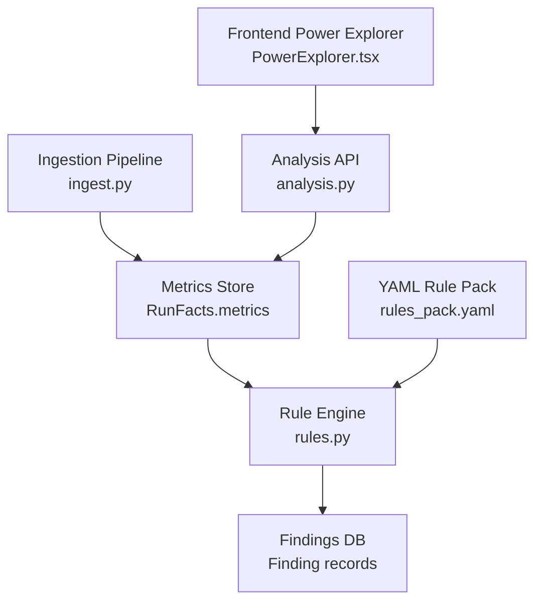
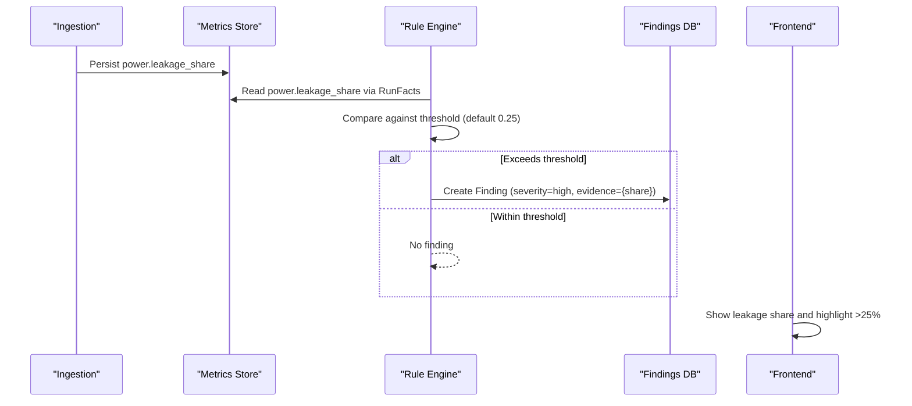
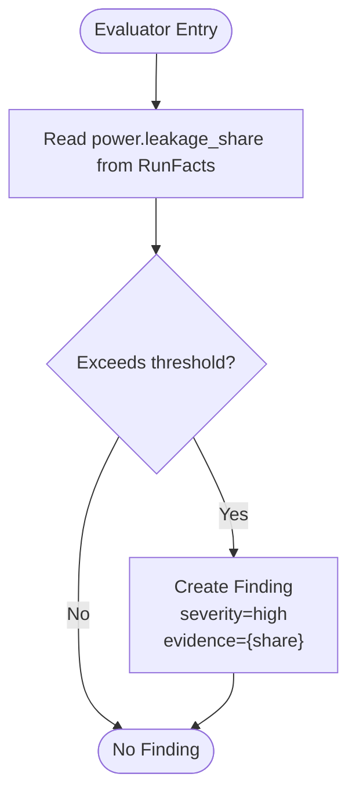
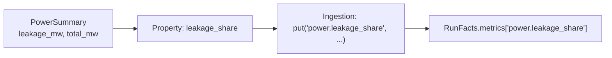
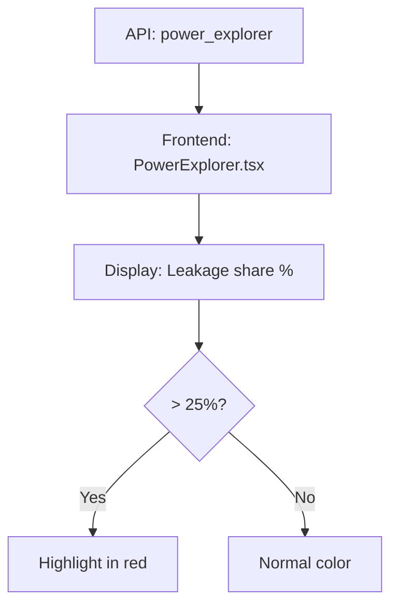
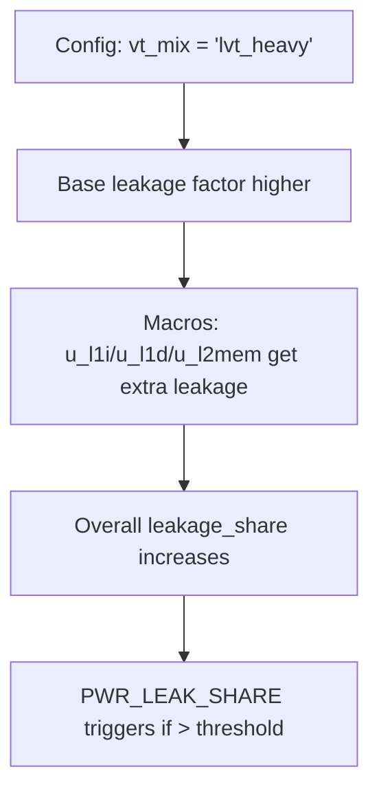
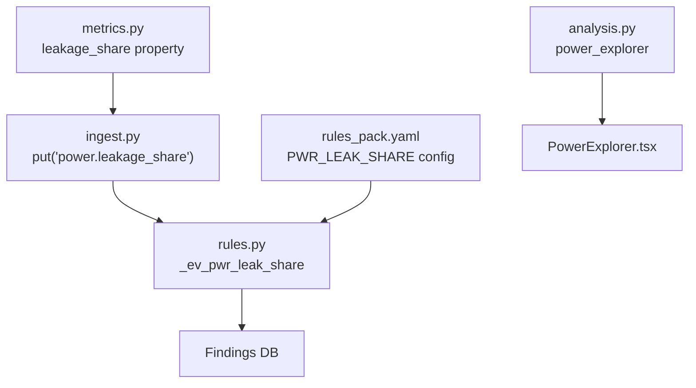

# PWR_LEAK_SHARE - Leakage Power Share Analysis

<cite>
**Referenced Files in This Document**
- [rules.py](file://backend/ppa/rules.py)
- [rules_pack.yaml](file://backend/ppa/rules_pack.yaml)
- [metrics.py](file://backend/ppa/metrics.py)
- [ingest.py](file://backend/ppa/ingest.py)
- [analysis.py](file://backend/ppa/analysis.py)
- [PowerExplorer.tsx](file://frontend/src/views/PowerExplorer.tsx)
- [sample_data.py](file://backend/ppa/sample_data.py)
- [test_backend.py](file://backend/tests/test_backend.py)
</cite>

## Table of Contents
1. [Introduction](#introduction)
2. [Project Structure](#project-structure)
3. [Core Components](#core-components)
4. [Architecture Overview](#architecture-overview)
5. [Detailed Component Analysis](#detailed-component-analysis)
6. [Dependency Analysis](#dependency-analysis)
7. [Performance Considerations](#performance-considerations)
8. [Troubleshooting Guide](#troubleshooting-guide)
9. [Conclusion](#conclusion)
10. [Appendices](#appendices)

## Introduction
This document explains the PWR_LEAK_SHARE power rule evaluator that analyzes leakage power share as a percentage of total power. It covers how the evaluator reads the power.leakage_share metric from RunFacts, compares it against a configurable threshold (default 0.25 or 25%), and generates findings with high severity when leakage exceeds acceptable levels. It also documents the evidence structure, integration into the broader power analysis workflow, typical leakage scenarios, configuration options, and guidance for interpreting results to guide design optimization.

## Project Structure
The PWR_LEAK_SHARE rule is part of a deterministic rule engine that evaluates metrics stored per run and produces findings. The key pieces involved are:
- Rule definition and parameters in the YAML pack
- Evaluator implementation in Python
- Metric computation and ingestion pipeline
- Visualization and user-facing indicators
- Sample data that includes a “leaky” scenario



**Diagram sources**
- [ingest.py:190-215](file://backend/ppa/ingest.py#L190-L215)
- [rules.py:313-352](file://backend/ppa/rules.py#L313-L352)
- [rules_pack.yaml:49-55](file://backend/ppa/rules_pack.yaml#L49-L55)
- [analysis.py:247-274](file://backend/ppa/analysis.py#L247-L274)
- [PowerExplorer.tsx:46-64](file://frontend/src/views/PowerExplorer.tsx#L46-L64)

**Section sources**
- [rules_pack.yaml:49-55](file://backend/ppa/rules_pack.yaml#L49-L55)
- [rules.py:156-160](file://backend/ppa/rules.py#L156-L160)
- [ingest.py:190-215](file://backend/ppa/ingest.py#L190-L215)
- [analysis.py:247-274](file://backend/ppa/analysis.py#L247-L274)
- [PowerExplorer.tsx:46-64](file://frontend/src/views/PowerExplorer.tsx#L46-L64)

## Core Components
- Rule definition: PWR_LEAK_SHARE is defined in the rule pack with category “power”, default severity “high”, and a threshold parameter (default 0.25).
- Evaluator: Reads power.leakage_share from RunFacts and triggers a finding if the value exceeds the configured threshold.
- Metrics source: power.leakage_share is computed as leakage_mw / total_mw and persisted during ingestion.
- Integration: The rule engine runs over all runs in a project after ingestion; findings are stored and later surfaced via APIs and UI.

Key responsibilities:
- Threshold-driven detection of excessive leakage share
- Evidence capture including the actual share percentage
- Severity classification as high when threshold exceeded

**Section sources**
- [rules_pack.yaml:49-55](file://backend/ppa/rules_pack.yaml#L49-L55)
- [rules.py:156-160](file://backend/ppa/rules.py#L156-L160)
- [metrics.py:61-64](file://backend/ppa/metrics.py#L61-L64)
- [ingest.py:201-209](file://backend/ppa/ingest.py#L201-L209)

## Architecture Overview
The PWR_LEAK_SHARE evaluation follows a clear pipeline:
1. Ingestion computes power summaries and writes power.leakage_share to the metrics store.
2. The rule engine loads rules from the YAML pack and evaluates each rule against RunFacts for every run.
3. When power.leakage_share exceeds the threshold, a high-severity finding is created with evidence containing the share percentage.
4. The frontend displays leakage share alongside other power metrics and highlights values above thresholds.



**Diagram sources**
- [ingest.py:201-209](file://backend/ppa/ingest.py#L201-L209)
- [rules.py:156-160](file://backend/ppa/rules.py#L156-L160)
- [rules.py:313-352](file://backend/ppa/rules.py#L313-L352)
- [PowerExplorer.tsx:59-64](file://frontend/src/views/PowerExplorer.tsx#L59-L64)

## Detailed Component Analysis

### PWR_LEAK_SHARE Evaluator Logic
The evaluator performs a simple threshold check on power.leakage_share:
- Reads the metric from RunFacts
- Compares against the configured threshold (default 0.25)
- Returns a high-severity finding with evidence containing the share percentage when exceeded



**Diagram sources**
- [rules.py:156-160](file://backend/ppa/rules.py#L156-L160)

**Section sources**
- [rules.py:156-160](file://backend/ppa/rules.py#L156-L160)

### Metric Computation and Storage
- power.leakage_share is derived from leakage_mw divided by total_mw
- During ingestion, this metric is persisted under the key power.leakage_share
- The analysis API exposes per-module leakage share for visualization



**Diagram sources**
- [metrics.py:61-64](file://backend/ppa/metrics.py#L61-L64)
- [ingest.py:201-209](file://backend/ppa/ingest.py#L201-L209)

**Section sources**
- [metrics.py:61-64](file://backend/ppa/metrics.py#L61-L64)
- [ingest.py:201-209](file://backend/ppa/ingest.py#L201-L209)
- [analysis.py:247-274](file://backend/ppa/analysis.py#L247-L274)

### Rule Configuration and Title Rendering
- The rule pack defines PWR_LEAK_SHARE with category “power”, severity “high”, and params.threshold default 0.25
- Titles can be templated using evidence fields; for PWR_LEAK_SHARE, the title includes the share percentage
- The rule engine renders titles using the evidence dictionary passed from evaluators

```mermaid
classDiagram
class RulePack {
+id : "PWR_LEAK_SHARE"
+category : "power"
+severity : "high"
+title : "Leakage is {share : .0%} of total power..."
+params : {threshold : 0.25}
}
class Evaluator {
+_ev_pwr_leak_share(f, p) -> list[tuple]
}
class RuleEngine {
+run_rule_engine(session, project_id) -> list[Finding]
+_render_title(rule, fmt) -> string
}
RulePack --> Evaluator : "defines params"
Evaluator --> RuleEngine : "produces evidence"
RuleEngine --> RulePack : "reads config"
```

**Diagram sources**
- [rules_pack.yaml:49-55](file://backend/ppa/rules_pack.yaml#L49-L55)
- [rules.py:156-160](file://backend/ppa/rules.py#L156-L160)
- [rules.py:355-361](file://backend/ppa/rules.py#L355-L361)

**Section sources**
- [rules_pack.yaml:49-55](file://backend/ppa/rules_pack.yaml#L49-L55)
- [rules.py:313-352](file://backend/ppa/rules.py#L313-L352)
- [rules.py:355-361](file://backend/ppa/rules.py#L355-L361)

### Frontend Visualization and Threshold Highlighting
- The Power Explorer shows leakage share as a percentage and highlights values above 25%
- It also displays related power metrics such as clock power share and clock gating efficiency



**Diagram sources**
- [analysis.py:247-274](file://backend/ppa/analysis.py#L247-L274)
- [PowerExplorer.tsx:59-64](file://frontend/src/views/PowerExplorer.tsx#L59-L64)

**Section sources**
- [PowerExplorer.tsx:46-64](file://frontend/src/views/PowerExplorer.tsx#L46-L64)
- [analysis.py:247-274](file://backend/ppa/analysis.py#L247-L274)

### Typical Leakage Scenarios and Sample Data
- The sample data generator includes a “leaky” configuration with an aggressive low-VT mix that increases leakage share
- Macros like caches leak more; dense CAM/RAM blocks have reduced leakage factors relative to base
- This creates realistic scenarios where PWR_LEAK_SHARE triggers due to VT mix choices



**Diagram sources**
- [sample_data.py:350-383](file://backend/ppa/sample_data.py#L350-L383)
- [sample_data.py:22-35](file://backend/ppa/sample_data.py#L22-L35)

**Section sources**
- [sample_data.py:22-35](file://backend/ppa/sample_data.py#L22-L35)
- [sample_data.py:350-383](file://backend/ppa/sample_data.py#L350-L383)

## Dependency Analysis
The PWR_LEAK_SHARE rule depends on:
- The metrics pipeline to compute and persist power.leakage_share
- The rule engine to evaluate the rule and create findings
- The YAML pack for threshold and title configuration
- The frontend for visualization and threshold highlighting



**Diagram sources**
- [metrics.py:61-64](file://backend/ppa/metrics.py#L61-L64)
- [ingest.py:201-209](file://backend/ppa/ingest.py#L201-L209)
- [rules.py:156-160](file://backend/ppa/rules.py#L156-L160)
- [rules_pack.yaml:49-55](file://backend/ppa/rules_pack.yaml#L49-L55)
- [analysis.py:247-274](file://backend/ppa/analysis.py#L247-L274)
- [PowerExplorer.tsx:59-64](file://frontend/src/views/PowerExplorer.tsx#L59-L64)

**Section sources**
- [metrics.py:61-64](file://backend/ppa/metrics.py#L61-L64)
- [ingest.py:201-209](file://backend/ppa/ingest.py#L201-L209)
- [rules.py:156-160](file://backend/ppa/rules.py#L156-L160)
- [rules_pack.yaml:49-55](file://backend/ppa/rules_pack.yaml#L49-L55)
- [analysis.py:247-274](file://backend/ppa/analysis.py#L247-L274)
- [PowerExplorer.tsx:59-64](file://frontend/src/views/PowerExplorer.tsx#L59-L64)

## Performance Considerations
- The evaluator is O(1) per run since it reads a single metric and compares against a threshold
- The overall rule engine iterates over all runs and rules; ensure the number of runs and rules remains manageable
- Avoid frequent re-runs of the rule engine unless necessary; batch ingestion and analysis can reduce overhead

[No sources needed since this section provides general guidance]

## Troubleshooting Guide
Common issues and resolutions:
- Missing power.leakage_share metric: Ensure ingestion completed successfully and primepower parsing produced power summaries
- Unexpected findings: Verify the threshold in the rule pack matches your design goals; adjust params.threshold accordingly
- False positives/negatives: Review the leakage breakdown per module using the Power Explorer to identify specific contributors
- Validation: Tests assert that the “leaky” configuration triggers PWR_LEAK_SHARE; use these tests to validate environment setup

**Section sources**
- [ingest.py:201-209](file://backend/ppa/ingest.py#L201-L209)
- [rules_pack.yaml:49-55](file://backend/ppa/rules_pack.yaml#L49-L55)
- [test_backend.py:100-116](file://backend/tests/test_backend.py#L100-L116)

## Conclusion
The PWR_LEAK_SHARE rule provides a straightforward, threshold-based mechanism to detect excessive leakage power share. It integrates cleanly with the ingestion and rule engine pipelines, surfaces actionable findings with high severity, and supports visualization and interpretation in the frontend. By tuning the threshold and examining per-module leakage contributions, designers can optimize VT mixes and reduce leakage to meet power budgets.

[No sources needed since this section summarizes without analyzing specific files]

## Appendices

### Configuration Options
- Default threshold: 0.25 (25%)
- Category: power
- Severity: high
- Title template includes share percentage for easy interpretation

To adjust behavior:
- Modify params.threshold in the rule pack to raise or lower sensitivity
- Keep category and severity aligned with project policy

**Section sources**
- [rules_pack.yaml:49-55](file://backend/ppa/rules_pack.yaml#L49-L55)

### Evidence Structure
When a finding is generated, the evidence contains:
- share: the leakage share percentage (as a float between 0 and 1)

This enables consistent title rendering and downstream analysis.

**Section sources**
- [rules.py:156-160](file://backend/ppa/rules.py#L156-L160)
- [rules.py:339-348](file://backend/ppa/rules.py#L339-L348)

### Interpretation Guidance
- If leakage share exceeds 25%, investigate VT mix choices, macro leakage characteristics, and potential opportunities to reduce leakage in large blocks
- Use the Power Explorer to identify modules contributing most to leakage and compare against baseline runs
- Combine with clock gating efficiency and clock power share insights to prioritize optimizations

**Section sources**
- [PowerExplorer.tsx:46-64](file://frontend/src/views/PowerExplorer.tsx#L46-L64)
- [analysis.py:247-274](file://backend/ppa/analysis.py#L247-L274)