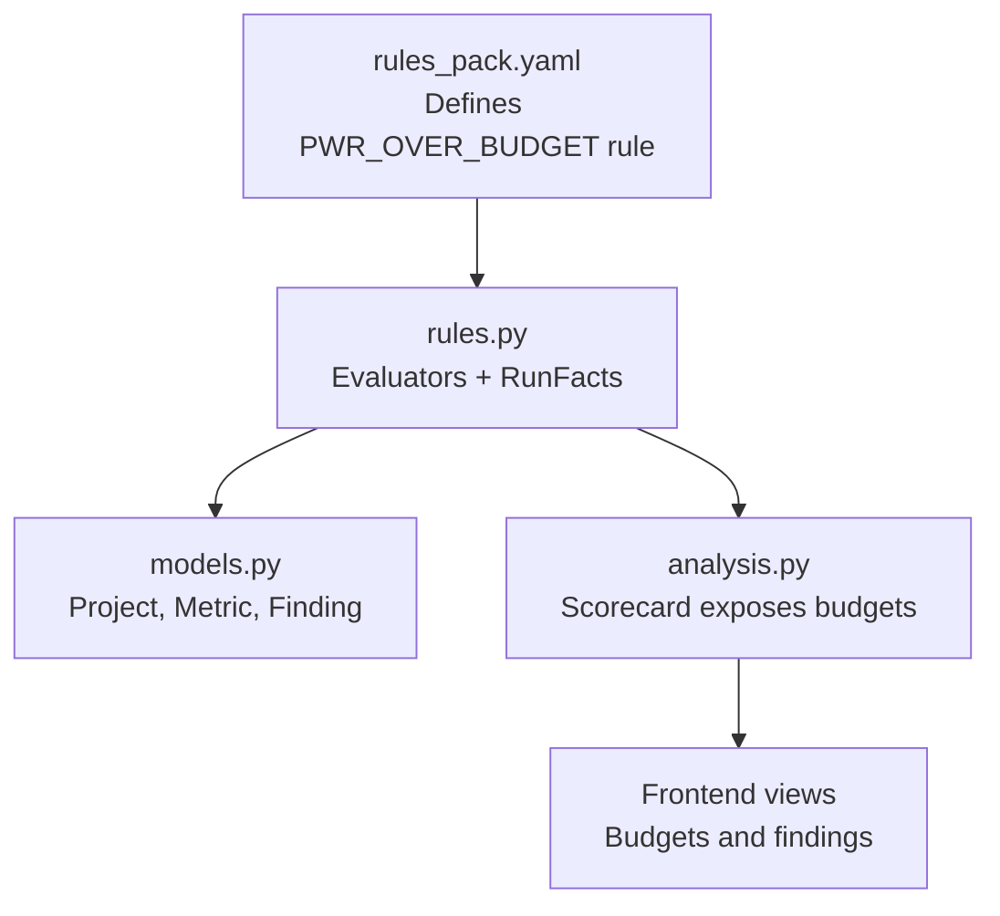
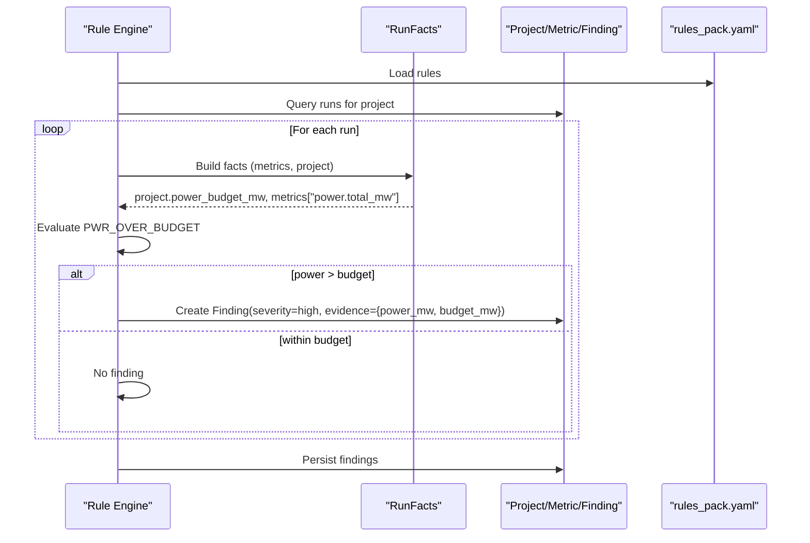
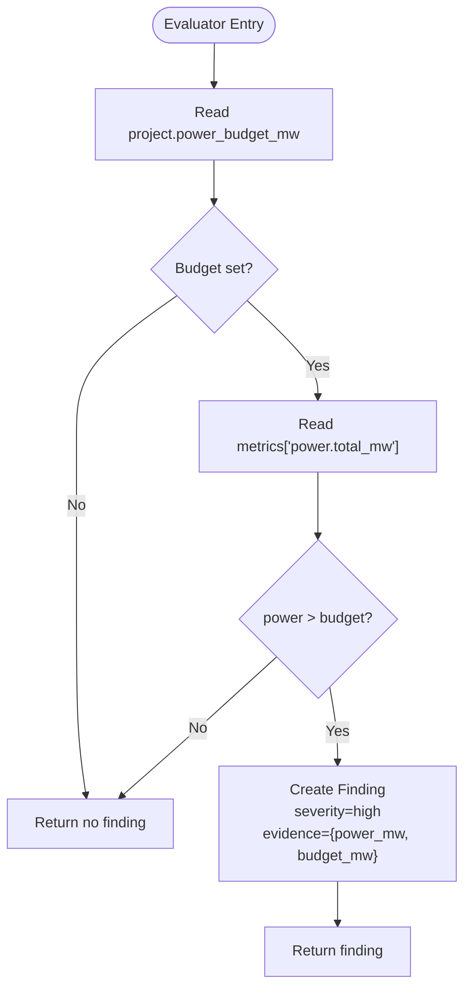
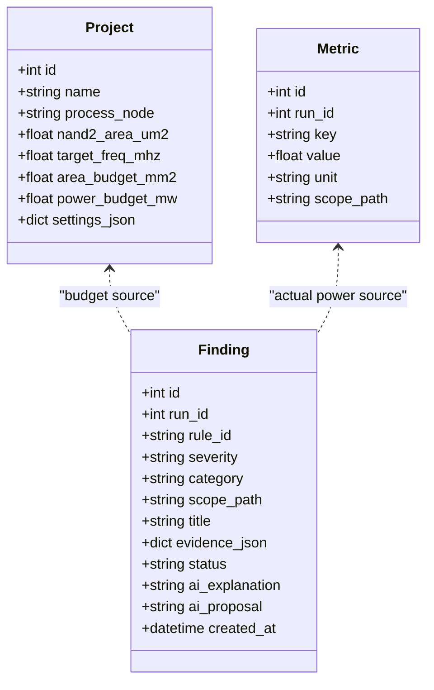
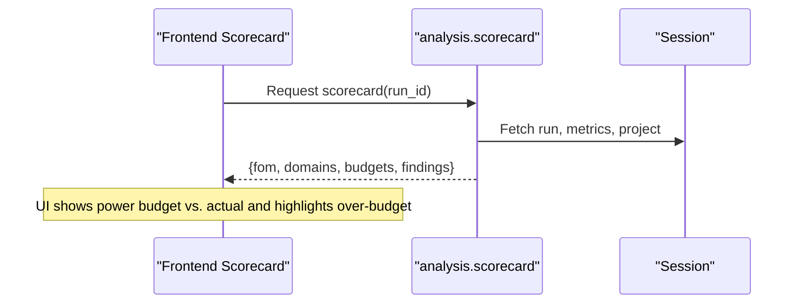
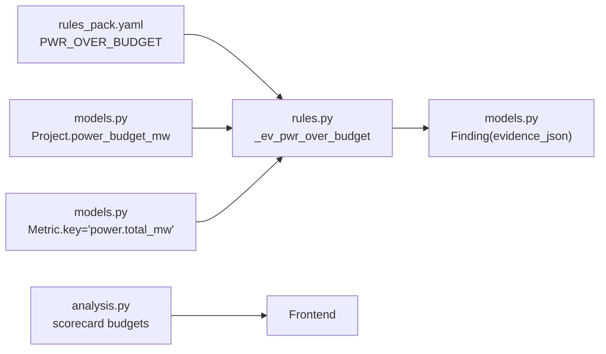

# PWR_OVER_BUDGET - Power Budget Violation Analysis

<cite>
**Referenced Files in This Document**
- [rules.py](file://backend/ppa/rules.py)
- [models.py](file://backend/ppa/models.py)
- [rules_pack.yaml](file://backend/ppa/rules_pack.yaml)
- [analysis.py](file://backend/ppa/analysis.py)
- [sample_data.py](file://backend/ppa/sample_data.py)
</cite>

## Table of Contents
1. [Introduction](#introduction)
2. [Project Structure](#project-structure)
3. [Core Components](#core-components)
4. [Architecture Overview](#architecture-overview)
5. [Detailed Component Analysis](#detailed-component-analysis)
6. [Dependency Analysis](#dependency-analysis)
7. [Performance Considerations](#performance-considerations)
8. [Troubleshooting Guide](#troubleshooting-guide)
9. [Conclusion](#conclusion)
10. [Appendices](#appendices)

## Introduction
This document explains the PWR_OVER_BUDGET power rule evaluator that detects when a design run exceeds its project’s allocated power budget. It covers how the evaluator retrieves the project power budget, compares it against measured total power consumption, and generates high-severity findings with structured evidence. It also describes integration points with project planning workflows, example allocation strategies, violation scenarios, and guidance for managing and reallocating budgets.

## Project Structure
The PWR_OVER_BUDGET rule is part of a deterministic rule engine that:
- Loads rules from a YAML pack
- Evaluates them per run using precomputed facts
- Persists findings into the database for downstream views and AI narration

**Diagram sources**
- [rules_pack.yaml:74-77](file://backend/ppa/rules_pack.yaml#L74-L77)
- [rules.py:192-197](file://backend/ppa/rules.py#L192-L197)
- [models.py:17-26](file://backend/ppa/models.py#L17-L26)
- [analysis.py:85-94](file://backend/ppa/analysis.py#L85-L94)

**Section sources**
- [rules_pack.yaml:1-119](file://backend/ppa/rules_pack.yaml#L1-L119)
- [rules.py:1-361](file://backend/ppa/rules.py#L1-L361)
- [models.py:1-217](file://backend/ppa/models.py#L1-L217)
- [analysis.py:1-200](file://backend/ppa/analysis.py#L1-L200)

## Core Components
- Rule definition: PWR_OVER_BUDGET is declared in the rule pack with category “power” and severity “high”.
- Evaluator: _ev_pwr_over_budget reads the project power budget and current total power to detect violations.
- Data model: Project stores power_budget_mw; Metric stores power.total_mw; Finding persists the result.
- Integration: analysis.py exposes budgets alongside metrics in the scorecard view for planning and reallocation decisions.

Key responsibilities:
- Retrieve project-level power budget (mW).
- Compare against run-level total power (mW).
- Emit a high-severity finding with evidence containing actual power and budget values.

**Section sources**
- [rules_pack.yaml:74-77](file://backend/ppa/rules_pack.yaml#L74-L77)
- [rules.py:192-197](file://backend/ppa/rules.py#L192-L197)
- [models.py:17-26](file://backend/ppa/models.py#L17-L26)
- [models.py:83-90](file://backend/ppa/models.py#L83-L90)
- [models.py:168-180](file://backend/ppa/models.py#L168-L180)
- [analysis.py:85-94](file://backend/ppa/analysis.py#L85-L94)

## Architecture Overview
The rule engine evaluates all runs under a project and writes findings. The PWR_OVER_BUDGET flow is:

**Diagram sources**
- [rules.py:313-352](file://backend/ppa/rules.py#L313-L352)
- [rules.py:192-197](file://backend/ppa/rules.py#L192-L197)
- [models.py:17-26](file://backend/ppa/models.py#L17-L26)
- [models.py:83-90](file://backend/ppa/models.py#L83-L90)
- [models.py:168-180](file://backend/ppa/models.py#L168-L180)
- [rules_pack.yaml:74-77](file://backend/ppa/rules_pack.yaml#L74-L77)

## Detailed Component Analysis

### PWR_OVER_BUDGET Evaluator
- Purpose: Detect total power exceeding project budget.
- Inputs:
  - Project power budget (mW) from Project.power_budget_mw.
  - Total power (mW) from Metric key power.total_mw.
- Logic: If budget is set and total power exceeds it, emit a high-severity finding.
- Evidence: Contains power_mw (actual) and budget_mw (limit).

**Diagram sources**
- [rules.py:192-197](file://backend/ppa/rules.py#L192-L197)

**Section sources**
- [rules.py:192-197](file://backend/ppa/rules.py#L192-L197)
- [rules_pack.yaml:74-77](file://backend/ppa/rules_pack.yaml#L74-L77)

### Project Model and Budget Storage
- Project fields relevant to power budgeting:
  - power_budget_mw: float or None — the allocated power budget for the project.
  - area_budget_mm2: float or None — used by other rules but useful context for cross-domain trade-offs.
- These fields are consumed by both rule evaluators and the scorecard view to present targets vs. actuals.

**Diagram sources**
- [models.py:17-26](file://backend/ppa/models.py#L17-L26)
- [models.py:83-90](file://backend/ppa/models.py#L83-L90)
- [models.py:168-180](file://backend/ppa/models.py#L168-L180)

**Section sources**
- [models.py:17-26](file://backend/ppa/models.py#L17-L26)
- [models.py:83-90](file://backend/ppa/models.py#L83-L90)
- [models.py:168-180](file://backend/ppa/models.py#L168-L180)

### Scorecard Integration and Planning Workflow
- The scorecard aggregates FOMs, domains, and budgets for a run.
- It includes:
  - power_mw budget and current total_power_mw
  - area_mm2 budget and current area_mm2
  - fmax_mhz target and current fmax_mhz
- Designers use this to decide whether to tighten or relax budgets and to guide reallocation across modules.

**Diagram sources**
- [analysis.py:69-125](file://backend/ppa/analysis.py#L69-L125)

**Section sources**
- [analysis.py:69-125](file://backend/ppa/analysis.py#L69-L125)

### Example Budget Allocation Strategies
- Top-down allocation: Set a project-level power_budget_mw based on system requirements and thermal constraints.
- Module-level decomposition: Allocate sub-budgets per module (e.g., ALU, ROB, caches) and monitor via power density and share metrics.
- Scenario-based budgets: Define different budgets for performance-oriented vs. low-power corners and switch via project settings or multiple projects.

These strategies inform where to focus optimization efforts when PWR_OVER_BUDGET triggers.

[No sources needed since this section provides general guidance]

### Violation Detection Scenarios
- Scenario A: Measured total power exceeds project budget → PWR_OVER_BUDGET emits high-severity finding with evidence showing power_mw and budget_mw.
- Scenario B: Budget not set → No PWR_OVER_BUDGET finding is generated (rule requires a defined budget).
- Scenario C: Power equals or below budget → No finding.

Operational tips:
- Use the scorecard to compare current total_power_mw against the budget.
- Investigate top contributors via power explorer and module-level breakdowns.

**Section sources**
- [rules.py:192-197](file://backend/ppa/rules.py#L192-L197)
- [analysis.py:85-94](file://backend/ppa/analysis.py#L85-L94)

### Guidance on Power Budget Management and Reallocation
When PWR_OVER_BUDGET fires:
- Validate measurement: Ensure primepower parsing succeeded and metrics include power.total_mw.
- Identify drivers: Check leakage share, clock power share, and module densities to find primary contributors.
- Reallocate:
  - Shift budget from non-critical modules to critical paths if performance must be preserved.
  - Reduce cache sizes or disable features temporarily to meet budget.
  - Adjust VT mix or clock gating to reduce dynamic/leakage components.
- Update budgets:
  - If the project requirement changes, update Project.power_budget_mw accordingly.
  - Re-run the rule engine to refresh findings.

[No sources needed since this section provides general guidance]

## Dependency Analysis
PWR_OVER_BUDGET depends on:
- Rule pack definition for rule metadata (id, category, severity, title).
- Project model for budget.
- Metric table for total power.
- Rule engine orchestration to evaluate and persist findings.

**Diagram sources**
- [rules_pack.yaml:74-77](file://backend/ppa/rules_pack.yaml#L74-L77)
- [rules.py:192-197](file://backend/ppa/rules.py#L192-L197)
- [models.py:17-26](file://backend/ppa/models.py#L17-L26)
- [models.py:83-90](file://backend/ppa/models.py#L83-L90)
- [models.py:168-180](file://backend/ppa/models.py#L168-L180)
- [analysis.py:85-94](file://backend/ppa/analysis.py#L85-L94)

**Section sources**
- [rules.py:290-310](file://backend/ppa/rules.py#L290-L310)
- [rules.py:313-352](file://backend/ppa/rules.py#L313-L352)
- [models.py:17-26](file://backend/ppa/models.py#L17-L26)
- [models.py:83-90](file://backend/ppa/models.py#L83-L90)
- [models.py:168-180](file://backend/ppa/models.py#L168-L180)
- [analysis.py:85-94](file://backend/ppa/analysis.py#L85-L94)

## Performance Considerations
- The evaluator performs constant-time checks per run once facts are loaded.
- Fact loading queries metrics, area, power, perf, timing paths, and reports once per run.
- Avoid frequent re-runs during iterative exploration; batch updates to project budgets and re-evaluate.

[No sources needed since this section provides general guidance]

## Troubleshooting Guide
Common issues and resolutions:
- No PWR_OVER_BUDGET finding despite high power:
  - Verify Project.power_budget_mw is set for the project associated with the run.
  - Confirm Metric key power.total_mw exists for the run.
- Unexpected high-severity findings:
  - Check parse status of power reports to ensure accurate totals.
  - Review leakage share and clock power share to understand composition.
- Budget mismatch between views:
  - Ensure the scorecard is refreshed after updating project budgets.

**Section sources**
- [rules.py:192-197](file://backend/ppa/rules.py#L192-L197)
- [analysis.py:85-94](file://backend/ppa/analysis.py#L85-L94)
- [models.py:83-90](file://backend/ppa/models.py#L83-L90)

## Conclusion
PWR_OVER_BUDGET provides a simple, robust check that flags when a design run exceeds its project’s power budget. It integrates seamlessly with the rule engine, uses well-defined data models, and surfaces actionable evidence for designers. Combined with the scorecard and power explorers, teams can manage budgets proactively, reallocate resources, and maintain alignment with project specifications.

[No sources needed since this section summarizes without analyzing specific files]

## Appendices

### Evidence Structure for PWR_OVER_BUDGET Findings
- severity: high
- category: power
- evidence_json:
  - power_mw: float — measured total power in mW
  - budget_mw: float — project power budget in mW

**Section sources**
- [rules_pack.yaml:74-77](file://backend/ppa/rules_pack.yaml#L74-L77)
- [rules.py:192-197](file://backend/ppa/rules.py#L192-L197)
- [models.py:168-180](file://backend/ppa/models.py#L168-L180)

### Sample Data Context
- Sample data generation includes power report emission and hierarchical breakdowns that feed into metrics and power rows used by the rule engine.

**Section sources**
- [sample_data.py:349-421](file://backend/ppa/sample_data.py#L349-L421)