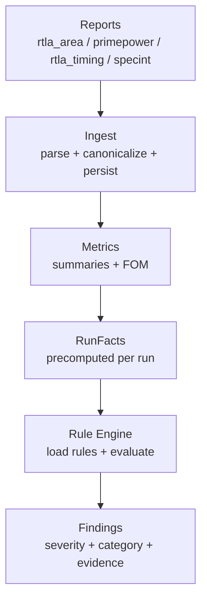
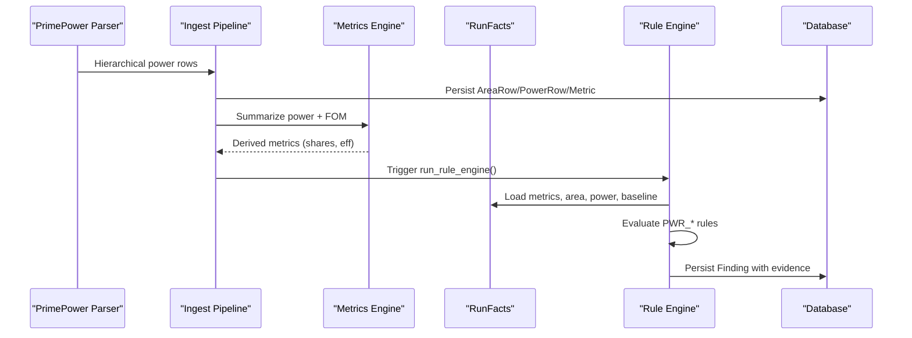
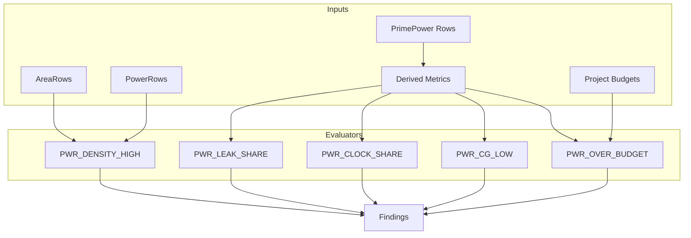

# Power Rule Evaluators

<cite>
**Referenced Files in This Document**
- [rules.py](file://backend/ppa/rules.py)
- [rules_pack.yaml](file://backend/ppa/rules_pack.yaml)
- [metrics.py](file://backend/ppa/metrics.py)
- [models.py](file://backend/ppa/models.py)
- [ingest.py](file://backend/ppa/ingest.py)
- [analysis.py](file://backend/ppa/analysis.py)
- [primepower.py](file://backend/ppa/parsers/primepower.py)
- [sample_data.py](file://backend/ppa/sample_data.py)
</cite>

## Table of Contents
1. [Introduction](#introduction)
2. [Project Structure](#project-structure)
3. [Core Components](#core-components)
4. [Architecture Overview](#architecture-overview)
5. [Detailed Component Analysis](#detailed-component-analysis)
6. [Dependency Analysis](#dependency-analysis)
7. [Performance Considerations](#performance-considerations)
8. [Troubleshooting Guide](#troubleshooting-guide)
9. [Conclusion](#conclusion)
10. [Appendices](#appendices)

## Introduction
This document explains the power-related rule evaluators that analyze power consumption patterns and efficiency. It focuses on:
- PWR_LEAK_SHARE: leakage power share analysis
- PWR_CLOCK_SHARE: clock power distribution
- PWR_CG_LOW: clock gating effectiveness
- PWR_DENSITY_HIGH: power density hotspots at module level
- PWR_OVER_BUDGET: power budget violations

It covers how metrics are ingested, summarized, and evaluated; how shares and densities are computed; how hotspots are identified per module; and how severity is determined using thresholds and project budgets. It also provides example workflows and evidence structures produced by the rules engine.

## Project Structure
The power evaluation pipeline spans ingestion, metric derivation, and deterministic rule evaluation:
- Ingestion parses reports (including PrimePower) into normalized rows and stores them in the database.
- Metrics derive domain summaries and figures of merit, including power ratios and efficiencies.
- The rule engine loads a YAML pack of rules and runs evaluators against precomputed run facts to produce findings with evidence.

**Diagram sources**
- [ingest.py:61-200](file://backend/ppa/ingest.py#L61-L200)
- [metrics.py:90-137](file://backend/ppa/metrics.py#L90-L137)
- [rules.py:19-21](file://backend/ppa/rules.py#L19-L21)
- [rules.py:313-352](file://backend/ppa/rules.py#L313-L352)

**Section sources**
- [ingest.py:61-200](file://backend/ppa/ingest.py#L61-L200)
- [metrics.py:90-137](file://backend/ppa/metrics.py#L90-L137)
- [rules.py:19-21](file://backend/ppa/rules.py#L19-L21)
- [rules.py:313-352](file://backend/ppa/rules.py#L313-L352)

## Core Components
- RunFacts: Precomputes all data a rule may need for a run, including metrics, area/power hierarchies, timing paths, and baseline context.
- PowerSummary and derived properties: Compute leakage_share and clock_power_share from parsed power totals and categories.
- Rule evaluators: Pure functions that read RunFacts and return severity, scope, and evidence tuples.
- Rule pack: YAML configuration defining rule IDs, categories, severities, titles, and parameters.

Key responsibilities:
- Ingest converts raw reports into typed rows and derives summary metrics.
- Metrics compute high-level ratios and figures of merit used by rules.
- Rules translate numeric thresholds and budgets into actionable findings.

**Section sources**
- [rules.py:24-79](file://backend/ppa/rules.py#L24-L79)
- [metrics.py:47-68](file://backend/ppa/metrics.py#L47-L68)
- [rules_pack.yaml:49-77](file://backend/ppa/rules_pack.yaml#L49-L77)

## Architecture Overview
The end-to-end flow for power rule evaluation:

**Diagram sources**
- [primepower.py:19-85](file://backend/ppa/parsers/primepower.py#L19-L85)
- [ingest.py:129-141](file://backend/ppa/ingest.py#L129-L141)
- [ingest.py:170-190](file://backend/ppa/ingest.py#L170-L190)
- [rules.py:313-352](file://backend/ppa/rules.py#L313-L352)

## Detailed Component Analysis

### PWR_LEAK_SHARE: Leakage Power Share Analysis
Purpose:
- Detect when leakage power is too large relative to total power, indicating aggressive low-VT usage or excessive static power.

How it works:
- Reads the derived metric power.leakage_share from RunFacts.
- Compares against threshold defined in the rule pack.
- Returns a finding with severity and evidence containing the share value.

Evidence structure:
- share: float ratio of leakage to total power.

Thresholds and severity:
- Default threshold is configurable via rule params; default severity is high.

Example workflow:
- Ingest computes leakage_mw and total_mw; metrics derive leakage_share = leakage_mw / total_mw.
- Rule evaluator checks if leakage_share exceeds threshold and emits a finding.

**Section sources**
- [rules.py:156-160](file://backend/ppa/rules.py#L156-L160)
- [rules_pack.yaml:49-54](file://backend/ppa/rules_pack.yaml#L49-L54)
- [metrics.py:47-68](file://backend/ppa/metrics.py#L47-L68)

### PWR_CLOCK_SHARE: Clock Power Distribution
Purpose:
- Identify when the clock network consumes an outsized portion of total power, suggesting overdesign or inefficient clock tree.

How it works:
- Reads power.clock_power_share from RunFacts.
- Compares against threshold from rule params.
- Emits a medium-severity finding with share evidence.

Evidence structure:
- share: float ratio of clock power to total power.

Thresholds and severity:
- Default threshold is configurable; default severity is medium.

Example workflow:
- PrimePower parser extracts categories including clock power; metrics compute clock_power_share.
- Rule evaluator triggers when share exceeds threshold.

**Section sources**
- [rules.py:163-167](file://backend/ppa/rules.py#L163-L167)
- [rules_pack.yaml:56-60](file://backend/ppa/rules_pack.yaml#L56-L60)
- [primepower.py:43-50](file://backend/ppa/parsers/primepower.py#L43-L50)
- [metrics.py:47-68](file://backend/ppa/metrics.py#L47-L68)

### PWR_CG_LOW: Clock Gating Effectiveness
Purpose:
- Flag designs where clock gating efficiency is low, indicating missed opportunities to reduce dynamic power.

How it works:
- Reads power.clock_gating_eff from RunFacts.
- Triggers when efficiency is positive but below threshold.
- Emits a medium-severity finding with efficiency evidence.

Evidence structure:
- eff: percentage value of clock gating efficiency.

Thresholds and severity:
- Default threshold is configurable; default severity is medium.

Example workflow:
- PrimePower report includes clock gating efficiency line; parser captures it as toggle/clock gating info.
- Metrics store power.clock_gating_eff; rule evaluator compares against threshold.

**Section sources**
- [rules.py:170-174](file://backend/ppa/rules.py#L170-L174)
- [rules_pack.yaml:62-66](file://backend/ppa/rules_pack.yaml#L62-L66)
- [primepower.py:35-42](file://backend/ppa/parsers/primepower.py#L35-L42)

### PWR_DENSITY_HIGH: Power Density Hotspots
Purpose:
- Identify modules with high power density that risk IR drop and thermal issues.

How it works:
- Iterates area rows at depth 2 (module granularity).
- For each module, looks up corresponding power row by scope_path.
- Computes density = total_power / total_area.
- If density exceeds threshold (mW/um^2), emits a finding with module scope and density evidence reported in mW/mm^2.

Evidence structure:
- module: short module name extracted from scope_path.
- density: power density in mW/mm^2.

Thresholds and severity:
- Threshold configured via threshold_mw_um2; default severity is medium.

Module-level hotspot identification:
- Uses area hierarchy to select modules at depth 2.
- Joins power rows by canonicalized scope_path.

Example workflow:
- Ingest persists AreaRow and PowerRow with canonical paths.
- Rule evaluator computes per-module density and flags hotspots.

**Section sources**
- [rules.py:177-189](file://backend/ppa/rules.py#L177-L189)
- [rules_pack.yaml:68-72](file://backend/ppa/rules_pack.yaml#L68-L72)
- [models.py:93-118](file://backend/ppa/models.py#L93-L118)

### PWR_OVER_BUDGET: Power Budget Violations
Purpose:
- Detect when total power exceeds the project’s power budget.

How it works:
- Reads project.power_budget_mw from RunFacts.project.
- Reads power.total_mw from RunFacts.metrics.
- If total power exceeds budget, emits a high-severity finding with power and budget evidence.

Evidence structure:
- power_mw: current total power.
- budget_mw: project-defined budget.

Thresholds and severity:
- Severity is high; threshold is the project budget.

Example workflow:
- Project model holds power_budget_mw; ingest computes total_mw; rule evaluator compares and records violation.

**Section sources**
- [rules.py:192-197](file://backend/ppa/rules.py#L192-L197)
- [models.py:17-26](file://backend/ppa/models.py#L17-L26)
- [rules_pack.yaml:74-77](file://backend/ppa/rules_pack.yaml#L74-L77)

### Data Flow and Evidence Structures
- Metrics keys used by power rules:
  - power.leakage_share
  - power.clock_power_share
  - power.clock_gating_eff
  - power.total_mw
- Module-level density uses:
  - AreaRow.total_area at module depth
  - PowerRow.total at same scope_path
- Findings include:
  - severity (critical/high/medium/low/info)
  - category (power)
  - scope_path (module path)
  - title (formatted with evidence values)
  - evidence_json (numeric/string fields)

**Section sources**
- [rules.py:313-352](file://backend/ppa/rules.py#L313-L352)
- [models.py:168-180](file://backend/ppa/models.py#L168-L180)

## Dependency Analysis
Power rule evaluators depend on:
- Parsed power reports (PrimePower) providing hierarchical internal/switching/leakage/total and categories.
- Canonicalized scope paths to join area and power hierarchies.
- Derived metrics for ratios and efficiencies.
- Project budgets for budget checks.

**Diagram sources**
- [primepower.py:19-85](file://backend/ppa/parsers/primepower.py#L19-L85)
- [ingest.py:129-141](file://backend/ppa/ingest.py#L129-L141)
- [metrics.py:90-137](file://backend/ppa/metrics.py#L90-L137)
- [rules.py:156-197](file://backend/ppa/rules.py#L156-L197)

**Section sources**
- [primepower.py:19-85](file://backend/ppa/parsers/primepower.py#L19-L85)
- [ingest.py:129-141](file://backend/ppa/ingest.py#L129-L141)
- [metrics.py:90-137](file://backend/ppa/metrics.py#L90-L137)
- [rules.py:156-197](file://backend/ppa/rules.py#L156-L197)

## Performance Considerations
- Module-level density computation iterates area rows at fixed depth and joins by scope_path; complexity is linear in number of modules.
- Avoid double-counting by using top-level summaries for totals and per-module rows for breakdowns.
- Threshold tuning should consider process node and target frequency; adjust threshold_mw_um2 based on technology and design style.
- Baseline comparisons (for other rules) can be expensive; ensure baseline runs exist and are consistent.

[No sources needed since this section provides general guidance]

## Troubleshooting Guide
Common issues and diagnostics:
- Missing reports: DQ_MISSING_REPORT identifies absent report types; ensure all required reports are generated.
- Parse warnings/errors: DQ_PARSE_WARNINGS lists parse issues; check parser logs and update parsers if tool output changes.
- No findings despite anomalies: Verify metrics keys exist and thresholds are appropriate; confirm canonical paths match between area and power.
- Incorrect density: Ensure area and power rows share canonical scope_paths; verify depth and parent relationships.

**Section sources**
- [rules.py:269-287](file://backend/ppa/rules.py#L269-L287)
- [primepower.py:81-85](file://backend/ppa/parsers/primepower.py#L81-L85)

## Conclusion
The power rule evaluators provide deterministic, threshold-driven diagnostics across leakage share, clock power distribution, clock gating effectiveness, module-level power density, and budget compliance. They rely on robust ingestion and metric derivation to produce actionable findings with structured evidence, enabling designers to quickly locate hotspots and address inefficiencies.

[No sources needed since this section summarizes without analyzing specific files]

## Appendices

### Example Power Analysis Workflow
- Generate sample runs with realistic power characteristics (e.g., leaky VT mix, no clock gating).
- Ingest reports to persist area/power hierarchies and derived metrics.
- Run rule engine to evaluate PWR_* rules and produce findings.
- Inspect findings and evidence to guide optimization (e.g., reduce leakage, improve clock gating, manage density).

**Section sources**
- [sample_data.py:22-35](file://backend/ppa/sample_data.py#L22-L35)
- [sample_data.py:349-421](file://backend/ppa/sample_data.py#L349-L421)
- [ingest.py:61-200](file://backend/ppa/ingest.py#L61-L200)
- [rules.py:313-352](file://backend/ppa/rules.py#L313-L352)

### Finding Evidence Examples
- PWR_LEAK_SHARE: {"share": 0.28}
- PWR_CLOCK_SHARE: {"share": 0.35}
- PWR_CG_LOW: {"eff": 45}
- PWR_DENSITY_HIGH: {"module": "u_clk", "density": 0.52}
- PWR_OVER_BUDGET: {"power_mw": 120.0, "budget_mw": 100.0}

These evidence structures are stored in Finding.evidence_json and used to format titles and present insights.

**Section sources**
- [rules.py:156-197](file://backend/ppa/rules.py#L156-L197)
- [rules_pack.yaml:49-77](file://backend/ppa/rules_pack.yaml#L49-L77)
- [models.py:168-180](file://backend/ppa/models.py#L168-L180)