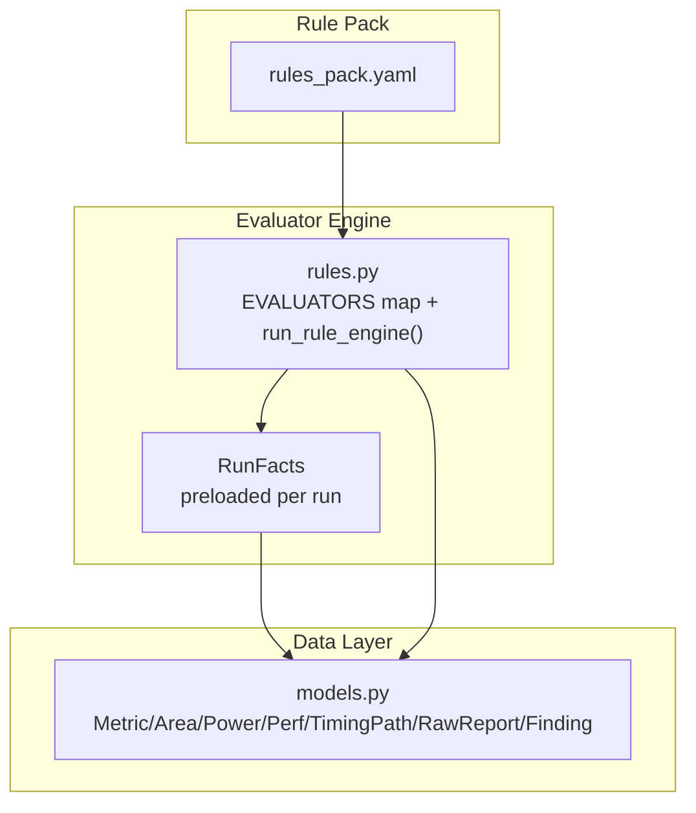
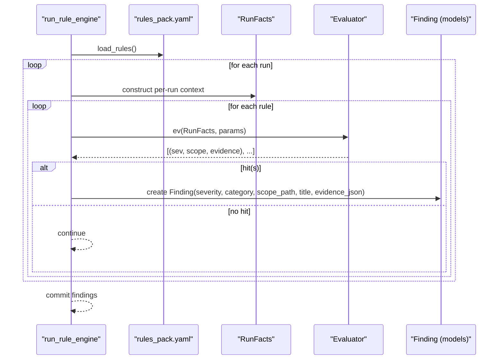
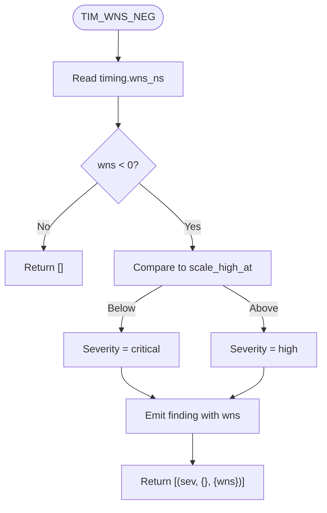
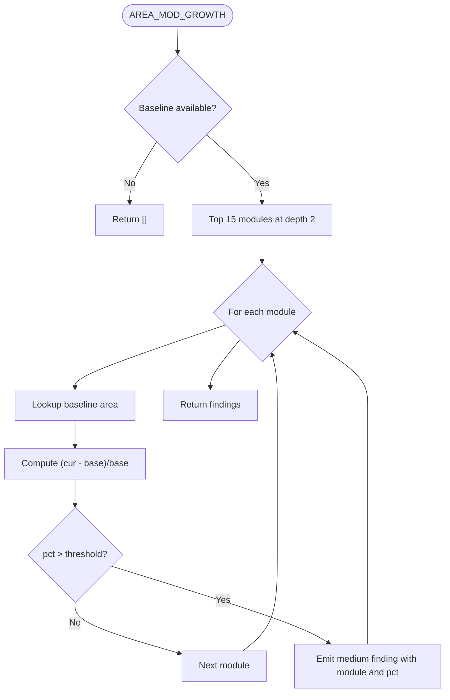
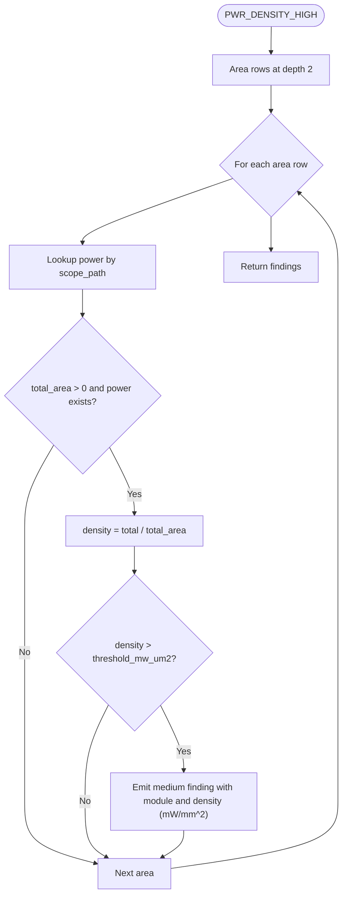
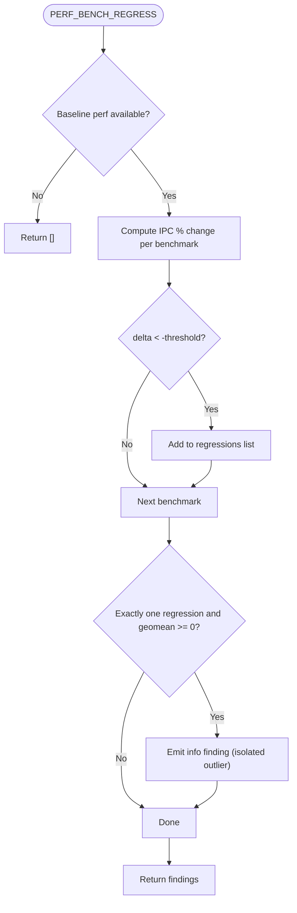
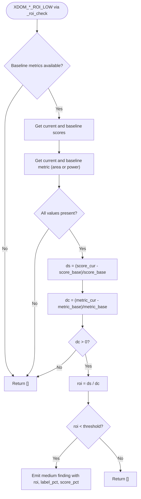
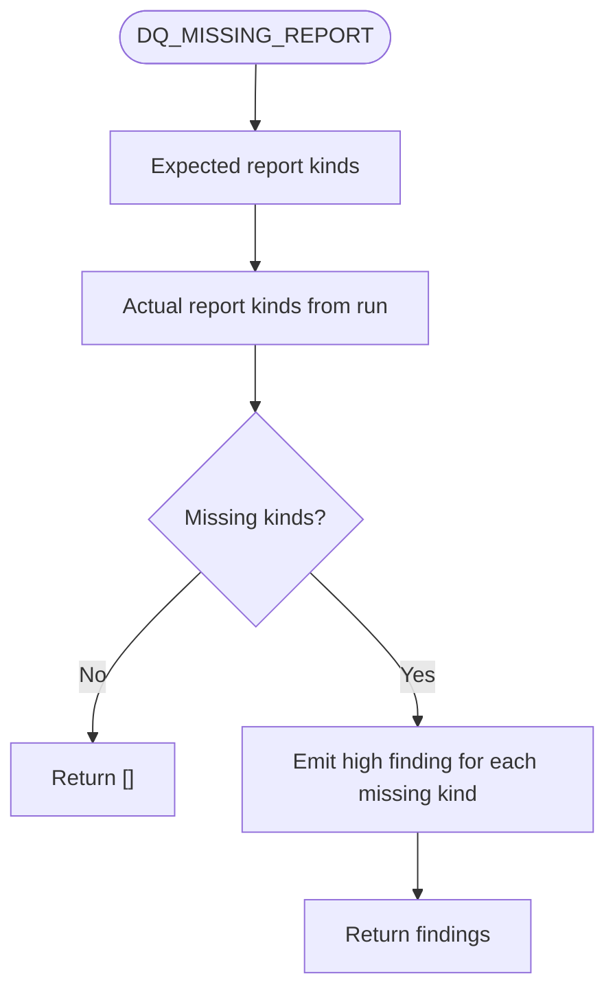
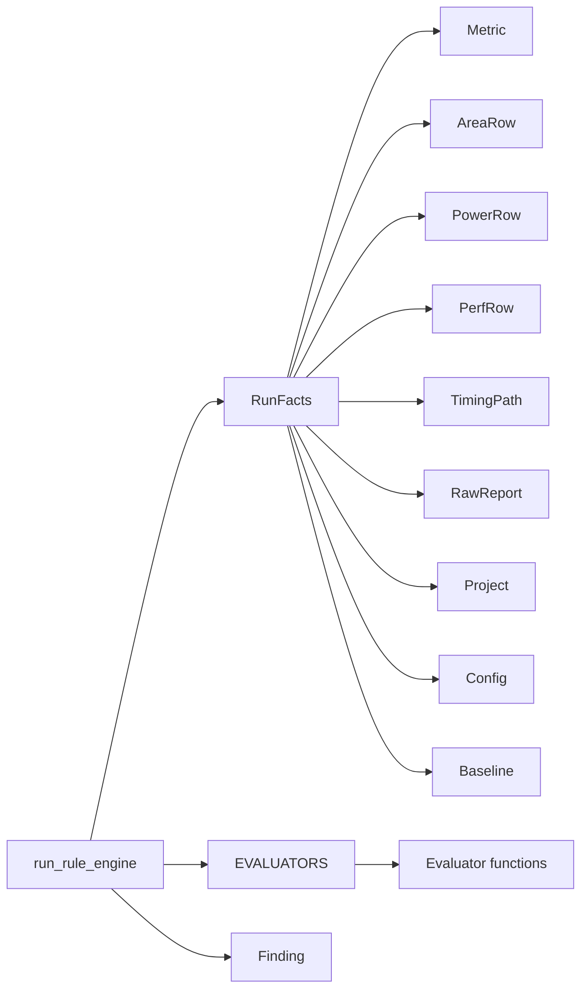

# Rule Evaluators & Detection Logic

<cite>
**Referenced Files in This Document**
- [rules.py](file://backend/ppa/rules.py)
- [rules_pack.yaml](file://backend/ppa/rules_pack.yaml)
- [models.py](file://backend/ppa/models.py)
- [analysis.py](file://backend/ppa/analysis.py)
</cite>

## Table of Contents
1. Introduction
2. Project Structure
3. Core Components
4. Architecture Overview
5. Detailed Component Analysis
6. Dependency Analysis
7. Performance Considerations
8. Troubleshooting Guide
9. Conclusion

## Introduction
This document explains the rule evaluator functions that implement detection logic across all PPA domains: timing, area, power, performance, cross-domain, and data quality. It details each category’s evaluators, their detection criteria, threshold logic, severity determination, and evidence collection. It also shows how evaluators access RunFacts data and return findings tuples with severity, scope, and evidence data used by the rule engine to persist structured findings.

## Project Structure
The rule system is implemented as a deterministic, rules-first engine:
- A YAML pack declares rule IDs, categories, severities, titles, and tunable parameters.
- Python evaluators implement detection logic for each rule ID.
- A run-time context object (RunFacts) preloads metrics, area/power/perf/timing paths, reports, project budgets, and baseline comparisons for a given run.
- The rule engine iterates runs, evaluates active rules, renders titles from evidence, and persists findings.

**Diagram sources**
- [rules.py:19-21](file://backend/ppa/rules.py#L19-L21)
- [rules.py:24-79](file://backend/ppa/rules.py#L24-L79)
- [rules.py:290-310](file://backend/ppa/rules.py#L290-L310)
- [rules.py:313-352](file://backend/ppa/rules.py#L313-L352)
- [models.py:83-149](file://backend/ppa/models.py#L83-L149)
- [models.py:168-181](file://backend/ppa/models.py#L168-L181)

**Section sources**
- [rules.py:19-21](file://backend/ppa/rules.py#L19-L21)
- [rules.py:24-79](file://backend/ppa/rules.py#L24-L79)
- [rules.py:290-310](file://backend/ppa/rules.py#L290-L310)
- [rules.py:313-352](file://backend/ppa/rules.py#L313-L352)
- [models.py:83-149](file://backend/ppa/models.py#L83-L149)
- [models.py:168-181](file://backend/ppa/models.py#L168-L181)

## Core Components
- RunFacts: Precomputes per-run data (metrics, area/power/perf/timing rows, reports, project, config, baseline). Provides helpers like area_at_depth and power_by_path.
- EVALUATORS: Maps rule IDs to pure evaluator functions that take (RunFacts, params) and return a list of tuples: (severity_override_or_None, scope_dict, evidence_dict).
- run_rule_engine: Loads rules, clears old findings for affected runs, invokes evaluators, renders titles, and persists Finding records.

Key behaviors:
- Severity override: Evaluators can return a specific severity; otherwise, the rule’s default severity applies.
- Scope path: Optional module-level scoping via scope_path in the persisted finding.
- Evidence JSON: Only scalar values (int, float, str) are stored for traceability.

**Section sources**
- [rules.py:24-79](file://backend/ppa/rules.py#L24-L79)
- [rules.py:290-310](file://backend/ppa/rules.py#L290-L310)
- [rules.py:313-352](file://backend/ppa/rules.py#L313-L352)

## Architecture Overview
The evaluation flow:
1. Load rules from YAML.
2. For each run in the project:
   - Build RunFacts.
   - For each rule, call its evaluator with params.
   - On hits, render title using evidence and persist a Finding.

**Diagram sources**
- [rules.py:19-21](file://backend/ppa/rules.py#L19-L21)
- [rules.py:290-310](file://backend/ppa/rules.py#L290-L310)
- [rules.py:313-352](file://backend/ppa/rules.py#L313-L352)
- [models.py:168-181](file://backend/ppa/models.py#L168-L181)

## Detailed Component Analysis

### Timing Rules
- TIM_WNS_NEG
  - Detection: Negative worst negative slack (WNS).
  - Thresholds: If WNS < configured scale_high_at, severity becomes critical; otherwise high.
  - Evidence: wns value.
  - Access pattern: Reads timing.wns_ns from RunFacts.metrics.
  - Return tuple: (severity, {}, {"wns": ...}).

- TIM_NVE_HIGH
  - Detection: Number of violating endpoints (NVE) above threshold.
  - Thresholds: nve_threshold from params.
  - Evidence: nve and tns_ns.
  - Access pattern: Reads timing.nve and timing.tns_ns from RunFacts.metrics.
  - Return tuple: ("medium", {}, {"nve": ..., "tns": ...}).

- TIM_MOD_DOMINATES
  - Detection: A single module dominates top non-hold timing paths beyond share_threshold.
  - Thresholds: share_threshold from params.
  - Evidence: module name and share fraction.
  - Access pattern: Uses RunFacts.paths (non-hold, up to top 100), counts start_module occurrences.
  - Return tuple: ("medium", {"module": mod}, {"module": mod, "share": ...}).

- TIM_DEEP_LOGIC
  - Detection: Critical path with logic depth exceeding threshold and negative slack.
  - Thresholds: threshold from params.
  - Evidence: depth and threshold.
  - Access pattern: Iterates RunFacts.paths; first match triggers finding.
  - Return tuple: ("medium", {"module": t.start_module}, {"depth": ..., "threshold": ...}).

**Diagram sources**
- [rules.py:84-89](file://backend/ppa/rules.py#L84-L89)

**Section sources**
- [rules.py:84-122](file://backend/ppa/rules.py#L84-L122)
- [rules_pack.yaml:7-29](file://backend/ppa/rules_pack.yaml#L7-L29)

### Area Rules
- AREA_OVER_BUDGET
  - Detection: Total area exceeds project budget.
  - Thresholds: Project.area_budget_mm2.
  - Evidence: area_mm2 and budget_mm2.
  - Access pattern: Reads fom.area_mm2 from metrics and project budget from RunFacts.project.
  - Return tuple: ("high", {}, {"area_mm2": ..., "budget_mm2": ...}).

- AREA_SEQ_RATIO
  - Detection: Sequential area ratio over threshold indicates flop-heavy design.
  - Thresholds: threshold from params.
  - Evidence: ratio.
  - Access pattern: Reads area.seq_um2 and area.total_um2 from metrics.
  - Return tuple: ("low", {}, {"ratio": ...}).

- AREA_MOD_GROWTH
  - Detection: Module area grew more than threshold vs baseline.
  - Thresholds: threshold from params.
  - Evidence: module short name and pct growth.
  - Access pattern: Uses RunFacts.area_at_depth(2) and baseline_area mapping.
  - Return tuple: ("medium", {"module": scope_path}, {"module": ..., "pct": ...}).

**Diagram sources**
- [rules.py:141-153](file://backend/ppa/rules.py#L141-L153)

**Section sources**
- [rules.py:125-153](file://backend/ppa/rules.py#L125-L153)
- [rules_pack.yaml:32-47](file://backend/ppa/rules_pack.yaml#L32-L47)

### Power Rules
- PWR_LEAK_SHARE
  - Detection: Leakage share above threshold.
  - Thresholds: threshold from params.
  - Evidence: share.
  - Access pattern: Reads power.leakage_share from metrics.
  - Return tuple: ("high", {}, {"share": ...}).

- PWR_CLOCK_SHARE
  - Detection: Clock network power share above threshold.
  - Thresholds: threshold from params.
  - Evidence: share.
  - Access pattern: Reads power.clock_power_share from metrics.
  - Return tuple: ("medium", {}, {"share": ...}).

- PWR_CG_LOW
  - Detection: Clock gating efficiency below threshold but positive.
  - Thresholds: threshold from params.
  - Evidence: eff.
  - Access pattern: Reads power.clock_gating_eff from metrics.
  - Return tuple: ("medium", {}, {"eff": ...}).

- PWR_DENSITY_HIGH
  - Detection: Per-module power density exceeds threshold.
  - Thresholds: threshold_mw_um2 from params.
  - Evidence: module short name and density in mW/mm^2.
  - Access pattern: Combines RunFacts.area_at_depth(2) with power_by_path(); computes density and converts units.
  - Return tuple: ("medium", {"module": scope_path}, {"module": ..., "density": ...}).

- PWR_OVER_BUDGET
  - Detection: Total power exceeds project budget.
  - Thresholds: Project.power_budget_mw.
  - Evidence: power_mw and budget_mw.
  - Access pattern: Reads power.total_mw from metrics and project budget from RunFacts.project.
  - Return tuple: ("high", {}, {"power_mw": ..., "budget_mw": ...}).

**Diagram sources**
- [rules.py:177-189](file://backend/ppa/rules.py#L177-L189)

**Section sources**
- [rules.py:156-197](file://backend/ppa/rules.py#L156-L197)
- [rules_pack.yaml:50-77](file://backend/ppa/rules_pack.yaml#L50-L77)

### Performance Rules
- PERF_BENCH_REGRESS
  - Detection: Benchmark IPC regressed vs baseline beyond threshold.
  - Thresholds: threshold from params.
  - Evidence: benchmark and pct regression.
  - Access pattern: Compares PerfRow.ipc against baseline_perf; collects deltas; emits medium findings for regressions.
  - Return tuple: ("medium", {"module": benchmark}, {"benchmark": ..., "pct": ...}).

- PERF_ISOLATED_OUTLIER (merged into _ev_perf_regress)
  - Detection: Single benchmark regresses while geometric mean does not.
  - Thresholds: Same threshold as regress; geomean comparison uses perf.geomean_ratio_1ghz.
  - Evidence: benchmark, pct, gm.
  - Access pattern: After collecting regressions, checks if exactly one regression exists and overall geomean delta >= 0.
  - Return tuple: ("info", {"module": benchmark}, {"benchmark": ..., "pct": ..., "gm": ...}).

**Diagram sources**
- [rules.py:200-224](file://backend/ppa/rules.py#L200-L224)

**Section sources**
- [rules.py:200-224](file://backend/ppa/rules.py#L200-L224)
- [rules_pack.yaml:79-89](file://backend/ppa/rules_pack.yaml#L79-L89)

### Cross-Domain Rules
- XDOM_NET_SCORE_DOWN
  - Detection: IPC improves but net SPEC score decreases (frequency loss dominates).
  - Thresholds: None; condition-based.
  - Evidence: ipc delta and score delta.
  - Access pattern: Compares perf.geomean_ratio_1ghz and fom.specint_score vs baseline.
  - Return tuple: ("high", {}, {"ipc": d_ipc, "score": d_score}).

- XDOM_AREA_ROI_LOW
  - Detection: Low ROI when area increases but score gain is small.
  - Thresholds: threshold from params.
  - Evidence: roi, area_pct, score_pct.
  - Access pattern: Reuses shared _roi_check with metric_key "fom.area_mm2".

- XDOM_POWER_ROI_LOW
  - Detection: Low ROI when power increases but score gain is small.
  - Thresholds: threshold from params.
  - Evidence: roi, power_pct, score_pct.
  - Access pattern: Reuses shared _roi_check with metric_key "fom.total_power_mw".

**Diagram sources**
- [rules.py:251-266](file://backend/ppa/rules.py#L251-L266)

**Section sources**
- [rules.py:227-266](file://backend/ppa/rules.py#L227-L266)
- [rules_pack.yaml:91-107](file://backend/ppa/rules_pack.yaml#L91-L107)

### Data Quality Rules
- DQ_MISSING_REPORT
  - Detection: Missing required report kinds for a run.
  - Thresholds: None; set-based check.
  - Evidence: kind of missing report.
  - Access pattern: Compares expected kinds against actual RawReport.kind entries.
  - Return tuple: ("high", {}, {"kind": ...}).

- DQ_PARSE_WARNINGS
  - Detection: Reports parsed with errors or warnings.
  - Thresholds: None; status-based.
  - Evidence: kind and number of warning lines.
  - Access pattern: Inspects RawReport.parse_status and parse_log length.
  - Return tuple: ("high" for error, "low" for warnings) with kind and n.

**Diagram sources**
- [rules.py:269-275](file://backend/ppa/rules.py#L269-L275)

**Section sources**
- [rules.py:269-287](file://backend/ppa/rules.py#L269-L287)
- [rules_pack.yaml:109-118](file://backend/ppa/rules_pack.yaml#L109-L118)

## Dependency Analysis
- Evaluator dependencies on models:
  - Metric, AreaRow, PowerRow, PerfRow, TimingPath, RawReport, Project, Baseline, Config, Finding.
- RunFacts centralizes data loading to avoid repeated queries and to provide baseline context.
- The rule engine depends on the YAML pack for rule metadata and on the EVALUATORS map for dispatch.

**Diagram sources**
- [rules.py:24-79](file://backend/ppa/rules.py#L24-L79)
- [rules.py:290-310](file://backend/ppa/rules.py#L290-L310)
- [rules.py:313-352](file://backend/ppa/rules.py#L313-L352)
- [models.py:83-181](file://backend/ppa/models.py#L83-L181)

**Section sources**
- [rules.py:24-79](file://backend/ppa/rules.py#L24-L79)
- [rules.py:290-310](file://backend/ppa/rules.py#L290-L310)
- [rules.py:313-352](file://backend/ppa/rules.py#L313-L352)
- [models.py:83-181](file://backend/ppa/models.py#L83-L181)

## Performance Considerations
- RunFacts preloads all needed data once per run to minimize database round-trips during evaluation.
- Timing path analysis limits to top 100 non-hold paths for dominance checks to bound complexity.
- Area/power density checks iterate only at depth 2 modules for manageable granularity.
- Exceptions in evaluators are caught to prevent ingestion failures; broken rules do not halt processing.

[No sources needed since this section provides general guidance]

## Troubleshooting Guide
- Missing reports: DQ_MISSING_REPORT will flag absent report kinds; ensure parsers ingest all required files.
- Parse warnings/errors: DQ_PARSE_WARNINGS surfaces issues; inspect parse_log for root causes.
- Broken evaluators: Errors are swallowed by the engine; verify rule IDs exist in EVALUATORS and params match YAML.
- Baseline context: Some rules require baseline runs; ensure Baseline is set and baseline metrics/rows exist.

**Section sources**
- [rules.py:269-287](file://backend/ppa/rules.py#L269-L287)
- [rules.py:313-352](file://backend/ppa/rules.py#L313-L352)

## Conclusion
The rule evaluator system provides a clear, configurable, and extensible mechanism to detect issues across timing, area, power, performance, cross-domain, and data quality dimensions. Each evaluator encapsulates detection criteria, thresholds, severity logic, and evidence collection, returning standardized tuples consumed by the rule engine to produce actionable findings. Designers can tune thresholds in the YAML pack without modifying code, enabling rapid iteration and consistent diagnosis.