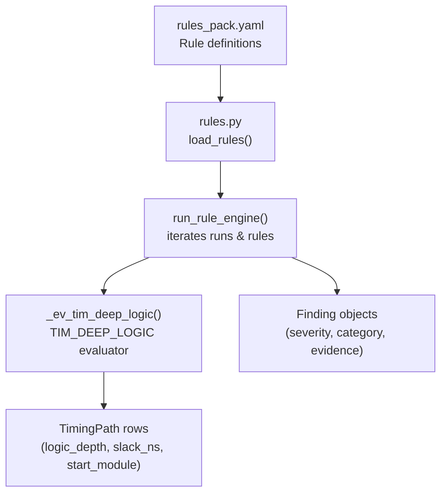
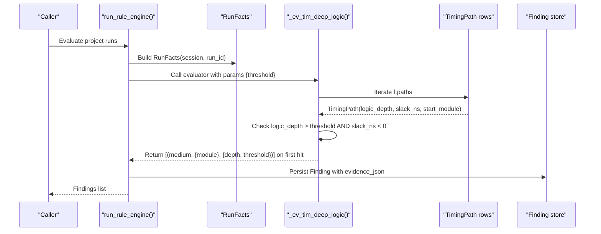
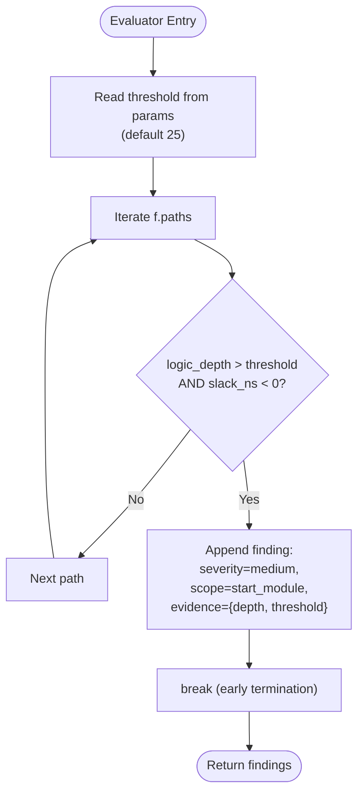
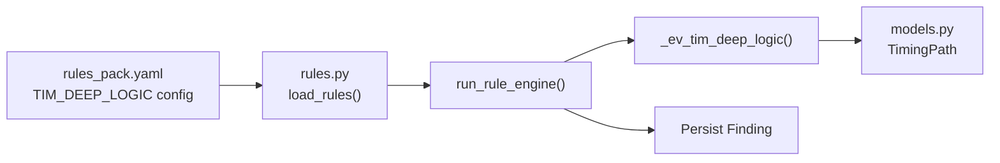

# TIM_DEEP_LOGIC - Deep Logic Path Detection

<cite>
**Referenced Files in This Document**
- [rules.py](file://backend/ppa/rules.py)
- [rules_pack.yaml](file://backend/ppa/rules_pack.yaml)
- [models.py](file://backend/ppa/models.py)
- [analysis.py](file://backend/ppa/analysis.py)
- [sample_data.py](file://backend/ppa/sample_data.py)
</cite>

## Table of Contents
1. [Introduction](#introduction)
2. [Project Structure](#project-structure)
3. [Core Components](#core-components)
4. [Architecture Overview](#architecture-overview)
5. [Detailed Component Analysis](#detailed-component-analysis)
6. [Dependency Analysis](#dependency-analysis)
7. [Performance Considerations](#performance-considerations)
8. [Troubleshooting Guide](#troubleshooting-guide)
9. [Conclusion](#conclusion)

## Introduction
This document explains the TIM_DEEP_LOGIC timing rule evaluator that detects deep logic paths causing timing violations in RISC-V processor designs. The evaluator scans timing paths for those whose logic depth exceeds a configurable threshold (default 25 levels) while also having negative slack, and it uses an early termination pattern to report only the first such violation per run. This design avoids overwhelming users with many findings when a design has numerous deep violating paths.

The presence of a deep logic path with negative slack indicates that combinational logic between registers is too long for the target clock period. In practice, this signals opportunities for pipelining or retiming optimizations to break long combinational chains into shorter stages, thereby improving timing closure and potentially increasing maximum frequency.

## Project Structure
The TIM_DEEP_LOGIC rule is part of a deterministic rule engine that:
- Loads rules from a YAML pack where thresholds and titles are declared.
- Evaluates each rule against precomputed facts for a run.
- Produces findings with severity, category, scope, title, and evidence.

**Diagram sources**
- [rules_pack.yaml:25-29](file://backend/ppa/rules_pack.yaml#L25-L29)
- [rules.py:19-21](file://backend/ppa/rules.py#L19-L21)
- [rules.py:313-352](file://backend/ppa/rules.py#L313-L352)
- [rules.py:114-122](file://backend/ppa/rules.py#L114-L122)
- [models.py:120-135](file://backend/ppa/models.py#L120-L135)

**Section sources**
- [rules_pack.yaml:25-29](file://backend/ppa/rules_pack.yaml#L25-L29)
- [rules.py:19-21](file://backend/ppa/rules.py#L19-L21)
- [rules.py:313-352](file://backend/ppa/rules.py#L313-L352)
- [models.py:120-135](file://backend/ppa/models.py#L120-L135)

## Core Components
- Rule definition: TIM_DEEP_LOGIC is defined in the YAML pack with a default threshold and a human-readable title template.
- Evaluator: _ev_tim_deep_logic implements the detection logic using RunFacts and TimingPath records.
- Data model: TimingPath stores per-path attributes including logic_depth, slack_ns, and start_module.
- Engine: run_rule_engine loads rules, iterates runs, invokes evaluators, and persists findings.

Key behaviors:
- Threshold parameter: defaults to 25 if not provided by the rule pack.
- Early termination: stops after finding the first path that satisfies both conditions (depth > threshold and negative slack).
- Evidence: includes depth and threshold values for traceability.

**Section sources**
- [rules_pack.yaml:25-29](file://backend/ppa/rules_pack.yaml#L25-L29)
- [rules.py:114-122](file://backend/ppa/rules.py#L114-L122)
- [models.py:120-135](file://backend/ppa/models.py#L120-L135)
- [rules.py:313-352](file://backend/ppa/rules.py#L313-L352)

## Architecture Overview
The TIM_DEEP_LOGIC evaluation flow integrates with the broader analysis layer and data models:

**Diagram sources**
- [rules.py:313-352](file://backend/ppa/rules.py#L313-L352)
- [rules.py:114-122](file://backend/ppa/rules.py#L114-L122)
- [models.py:120-135](file://backend/ppa/models.py#L120-L135)

## Detailed Component Analysis

### TIM_DEEP_LOGIC Evaluator Logic
The evaluator performs a single-pass scan over all timing paths for a run:
- Reads the threshold from rule parameters (default 25).
- For each path, checks two conditions:
  - logic_depth > threshold
  - slack_ns < 0
- On the first match, appends a finding with medium severity, module scope, and evidence containing depth and threshold, then immediately breaks out of the loop.

**Diagram sources**
- [rules.py:114-122](file://backend/ppa/rules.py#L114-L122)

**Section sources**
- [rules.py:114-122](file://backend/ppa/rules.py#L114-L122)

### Data Model: TimingPath
TimingPath provides the fields used by the evaluator:
- logic_depth: number of logic levels along the path
- slack_ns: negative indicates timing violation
- start_module: owning module for scoping the finding

These fields enable precise identification of problematic modules and quantification of how deep the violating path is relative to the configured threshold.

**Section sources**
- [models.py:120-135](file://backend/ppa/models.py#L120-L135)

### Rule Definition and Title Rendering
The rule pack defines:
- id: TIM_DEEP_LOGIC
- category: timing
- severity: medium
- title template: "Critical path logic depth {depth} exceeds {threshold}"
- params: {threshold: 25}

During evaluation, the engine renders the title using the evidence values (depth and threshold), producing a concise message for users.

**Section sources**
- [rules_pack.yaml:25-29](file://backend/ppa/rules_pack.yaml#L25-L29)
- [rules.py:355-361](file://backend/ppa/rules.py#L355-L361)

### Integration with Analysis Layer
The analysis layer exposes timing exploration functions that use the same TimingPath data. While TIM_DEEP_LOGIC operates at the rule-engine level, the timing explorer can be used to inspect top violating paths and their logic depths for deeper investigation.

**Section sources**
- [analysis.py:279-326](file://backend/ppa/analysis.py#L279-L326)

### Example Evidence and Interpretation
When TIM_DEEP_LOGIC triggers, the resulting finding includes:
- severity: medium
- category: timing
- scope_path: the start_module of the violating path
- evidence_json: contains depth and threshold values

Example interpretation:
- If evidence shows depth = 34 and threshold = 25, the critical path has 34 logic levels, exceeding the configured limit by 9 levels. Combined with negative slack, this indicates a long combinational chain that likely needs pipelining or retiming.

Sample timing reports in the repository demonstrate realistic path structures with logic depth and slack values, illustrating how such paths appear in real-world RISC-V cores.

**Section sources**
- [rules.py:313-352](file://backend/ppa/rules.py#L313-L352)
- [sample_data.py:307-324](file://backend/ppa/sample_data.py#L307-L324)

## Dependency Analysis
The TIM_DEEP_LOGIC rule depends on:
- YAML rule pack for configuration (threshold, title, severity)
- RunFacts for accessing TimingPath records
- TimingPath model for path attributes
- Rule engine for orchestrating evaluation and persistence

**Diagram sources**
- [rules_pack.yaml:25-29](file://backend/ppa/rules_pack.yaml#L25-L29)
- [rules.py:19-21](file://backend/ppa/rules.py#L19-L21)
- [rules.py:313-352](file://backend/ppa/rules.py#L313-L352)
- [models.py:120-135](file://backend/ppa/models.py#L120-L135)

**Section sources**
- [rules_pack.yaml:25-29](file://backend/ppa/rules_pack.yaml#L25-L29)
- [rules.py:19-21](file://backend/ppa/rules.py#L19-L21)
- [rules.py:313-352](file://backend/ppa/rules.py#L313-L352)
- [models.py:120-135](file://backend/ppa/models.py#L120-L135)

## Performance Considerations
- Early termination: The evaluator stops after the first deep violating path, minimizing CPU time and avoiding large output sets.
- Single pass: Iterates paths once; complexity is O(N) in the number of paths.
- Minimal memory: Only accumulates one finding before returning.

These characteristics make TIM_DEEP_LOGIC efficient even for designs with many timing paths.

[No sources needed since this section provides general guidance]

## Troubleshooting Guide
Common issues and resolutions:
- No findings despite deep paths: Ensure the threshold is set appropriately; if paths have positive slack, they will not trigger TIM_DEEP_LOGIC.
- Too few findings: The early termination pattern reports only the first violation per run; use the timing explorer to inspect additional deep paths.
- Mis-scoped findings: Verify that start_module is correctly populated in TimingPath records; scope_path in findings reflects this module.

To investigate further:
- Use the timing explorer to view top violating paths and their logic depths.
- Adjust the threshold in the rule pack to tune sensitivity.

**Section sources**
- [analysis.py:279-326](file://backend/ppa/analysis.py#L279-L326)
- [rules_pack.yaml:25-29](file://backend/ppa/rules_pack.yaml#L25-L29)

## Conclusion
TIM_DEEP_LOGIC provides a focused, efficient mechanism to detect deep logic paths that violate timing constraints. By combining logic depth checks with negative slack and employing early termination, it highlights actionable hotspots without overwhelming users. In RISC-V processor designs, such findings typically indicate opportunities for pipelining or retiming to reduce combinational depth and improve timing closure.

[No sources needed since this section summarizes without analyzing specific files]