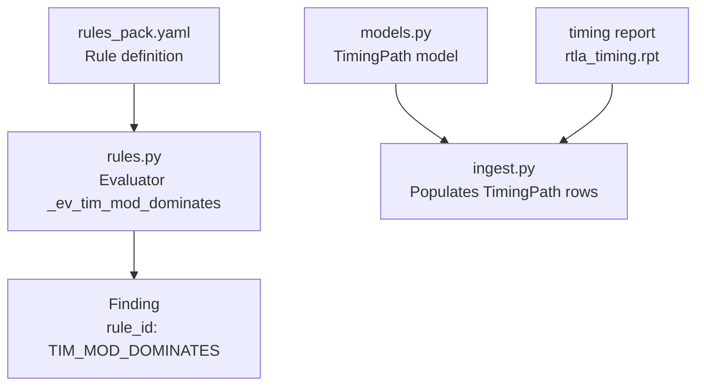
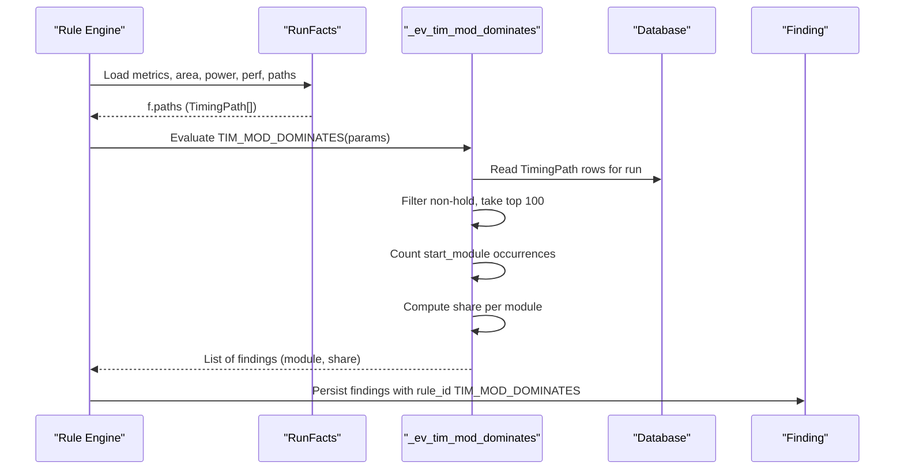
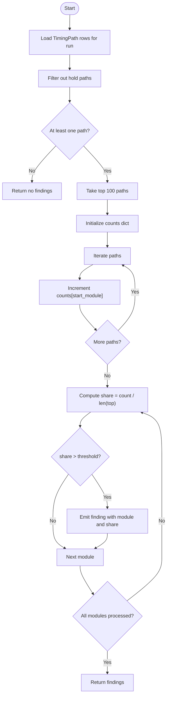
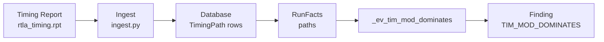

# TIM_MOD_DOMINATES - Dominant Module Analysis

<cite>
**Referenced Files in This Document**
- [rules.py](file://backend/ppa/rules.py)
- [models.py](file://backend/ppa/models.py)
- [rules_pack.yaml](file://backend/ppa/rules_pack.yaml)
- [analysis.py](file://backend/ppa/analysis.py)
- [ingest.py](file://backend/ppa/ingest.py)
- [rtla_timing.rpt](file://sample_runs/baseline/rtla_timing.rpt)
</cite>

## Table of Contents
1. [Introduction](#introduction)
2. [Project Structure](#project-structure)
3. [Core Components](#core-components)
4. [Architecture Overview](#architecture-overview)
5. [Detailed Component Analysis](#detailed-component-analysis)
6. [Dependency Analysis](#dependency-analysis)
7. [Performance Considerations](#performance-considerations)
8. [Troubleshooting Guide](#troubleshooting-guide)
9. [Conclusion](#conclusion)

## Introduction
TIM_MOD_DOMINATES is a timing rule that identifies modules dominating the worst setup timing paths. It analyzes the top 100 non-hold timing paths, counts how often each module appears as the start_module, and flags any module whose share exceeds a configurable threshold (default 30%). The goal is to help architects focus optimization efforts on the most impactful modules rather than chasing many small contributors.

## Project Structure
The rule is defined in the YAML rule pack and implemented by a pure-Python evaluator. Data about timing paths is stored in the database via models and populated during ingestion from timing reports.

**Diagram sources**
- [rules_pack.yaml:19-23](file://backend/ppa/rules_pack.yaml#L19-L23)
- [rules.py:99-111](file://backend/ppa/rules.py#L99-L111)
- [models.py:120-135](file://backend/ppa/models.py#L120-L135)
- [ingest.py:145-155](file://backend/ppa/ingest.py#L145-L155)
- [rtla_timing.rpt:35-86](file://sample_runs/baseline/rtla_timing.rpt#L35-L86)

**Section sources**
- [rules_pack.yaml:19-23](file://backend/ppa/rules_pack.yaml#L19-L23)
- [rules.py:99-111](file://backend/ppa/rules.py#L99-L111)
- [models.py:120-135](file://backend/ppa/models.py#L120-L135)
- [ingest.py:145-155](file://backend/ppa/ingest.py#L145-L155)
- [rtla_timing.rpt:35-86](file://sample_runs/baseline/rtla_timing.rpt#L35-L86)

## Core Components
- Rule definition: TIM_MOD_DOMINATES with default share_threshold 0.30 (30%) and severity medium.
- Evaluator: _ev_tim_mod_dominates reads RunFacts.paths, filters out hold paths, takes the first 100, counts occurrences per start_module, computes share, and emits findings for modules exceeding the threshold.
- Data model: TimingPath includes fields such as path_group, slack_ns, logic_depth, start_module, end_module, and is_hold.
- Ingestion: Parsers populate TimingPath rows including start_module and is_hold from timing reports.

Key behaviors:
- Excludes hold violations by filtering t.is_hold == False.
- Considers only the top 100 non-hold paths.
- Counts start_module occurrences across those paths.
- Computes share = count / number_of_paths_in_sample.
- Emits one finding per dominant module with evidence containing module name and share percentage.

**Section sources**
- [rules_pack.yaml:19-23](file://backend/ppa/rules_pack.yaml#L19-L23)
- [rules.py:99-111](file://backend/ppa/rules.py#L99-L111)
- [models.py:120-135](file://backend/ppa/models.py#L120-L135)
- [ingest.py:145-155](file://backend/ppa/ingest.py#L145-L155)

## Architecture Overview
The rule engine loads rules from YAML, constructs RunFacts for each run, and invokes evaluators. For TIM_MOD_DOMINATES, the evaluator uses TimingPath data to compute module dominance and produces findings that are persisted.

**Diagram sources**
- [rules.py:313-352](file://backend/ppa/rules.py#L313-L352)
- [rules.py:99-111](file://backend/ppa/rules.py#L99-L111)
- [models.py:120-135](file://backend/ppa/models.py#L120-L135)

## Detailed Component Analysis

### TIM_MOD_DOMINATES Evaluator Logic
The evaluator performs dominant module analysis through a clear counting mechanism:

- Input: RunFacts containing all TimingPath entries for a run.
- Filtering: Exclude hold paths (t.is_hold == False).
- Sampling: Use the first 100 non-hold paths.
- Counting: For each path, increment a counter keyed by t.start_module.
- Share calculation: For each module, share = count / len(top_paths).
- Threshold check: If share > share_threshold (default 0.30), emit a finding.
- Output: Each finding includes module name and share percentage in evidence_json.

**Diagram sources**
- [rules.py:99-111](file://backend/ppa/rules.py#L99-L111)

**Section sources**
- [rules.py:99-111](file://backend/ppa/rules.py#L99-L111)

### Data Model: TimingPath
The TimingPath model provides the essential fields used by the evaluator:
- path_group: categorizes paths (e.g., reg2reg, in2reg).
- slack_ns: negative values indicate violations; used elsewhere for sorting and histograms.
- logic_depth: depth of combinational logic along the path.
- start_module: canonical owning module of the path’s startpoint.
- end_module: canonical owning module of the path’s endpoint.
- is_hold: boolean flag indicating whether the path is a hold violation.

These fields enable filtering (is_hold), sampling (top 100), and attribution (start_module) required for dominant module analysis.

**Section sources**
- [models.py:120-135](file://backend/ppa/models.py#L120-L135)

### Ingestion: Populating TimingPath
During ingestion, parsers extract timing information from reports and create TimingPath rows. Key aspects:
- start_module and end_module are derived from startpoint and endpoint using an owner function.
- logic_depth is captured from the report.
- is_hold is determined by parsing path_group or slack annotations indicating hold conditions.

This ensures the evaluator has accurate module attribution and hold/setup classification.

**Section sources**
- [ingest.py:145-155](file://backend/ppa/ingest.py#L145-L155)
- [rtla_timing.rpt:35-86](file://sample_runs/baseline/rtla_timing.rpt#L35-L86)

### Rule Definition and Title Rendering
The rule pack defines:
- id: TIM_MOD_DOMINATES
- category: timing
- severity: medium
- title template: "Module {module} owns {share:.0%} of top timing paths"
- params: share_threshold: 0.30

The rule engine renders titles using the evidence dictionary, so findings will display the module name and its share percentage.

**Section sources**
- [rules_pack.yaml:19-23](file://backend/ppa/rules_pack.yaml#L19-L23)
- [rules.py:355-361](file://backend/ppa/rules.py#L355-L361)

## Dependency Analysis
- The evaluator depends on TimingPath rows being present for the run.
- TimingPath rows depend on successful ingestion from timing reports.
- The rule engine orchestrates evaluation and persists findings.

**Diagram sources**
- [ingest.py:145-155](file://backend/ppa/ingest.py#L145-L155)
- [rules.py:99-111](file://backend/ppa/rules.py#L99-L111)
- [rules.py:313-352](file://backend/ppa/rules.py#L313-L352)

**Section sources**
- [ingest.py:145-155](file://backend/ppa/ingest.py#L145-L155)
- [rules.py:99-111](file://backend/ppa/rules.py#L99-L111)
- [rules.py:313-352](file://backend/ppa/rules.py#L313-L352)

## Performance Considerations
- Filtering and sampling: The evaluator filters out hold paths and limits to the top 100, keeping computation linear in the number of paths considered.
- Counting: Uses a dictionary to aggregate counts per module; O(n) over the sample.
- Sorting: Modules are sorted by count descending to prioritize dominant modules; complexity O(m log m) where m is the number of unique modules in the sample.
- Memory: Minimal overhead beyond storing the counts dictionary and temporary lists.

[No sources needed since this section provides general guidance]

## Troubleshooting Guide
Common issues and checks:
- No findings generated:
  - Ensure there are non-hold paths in the run; if all paths are holds or none exist, the evaluator returns empty results.
  - Verify that timing reports were ingested successfully and TimingPath rows exist for the run.
- Unexpected modules flagged:
  - Confirm that start_module was correctly assigned during ingestion; incorrect ownership can skew dominance.
  - Adjust share_threshold if the default 30% is too strict or too lenient for your design.
- Hold vs setup confusion:
  - Paths marked as hold (is_hold == True) are excluded by design; ensure you are analyzing setup violations when using this rule.

Evidence interpretation:
- Each finding includes module and share in evidence_json; use these values to understand how much of the top 100 paths originate from that module.

**Section sources**
- [rules.py:99-111](file://backend/ppa/rules.py#L99-L111)
- [rules.py:313-352](file://backend/ppa/rules.py#L313-L352)
- [models.py:120-135](file://backend/ppa/models.py#L120-L135)

## Conclusion
TIM_MOD_DOMINATES provides a focused, deterministic way to identify modules that dominate timing problems by analyzing the top 100 non-hold paths and measuring each module’s share. By setting an appropriate share_threshold, architects can quickly pinpoint the most impactful modules to optimize, streamline debugging, and improve timing closure efficiency.

[No sources needed since this section summarizes without analyzing specific files]