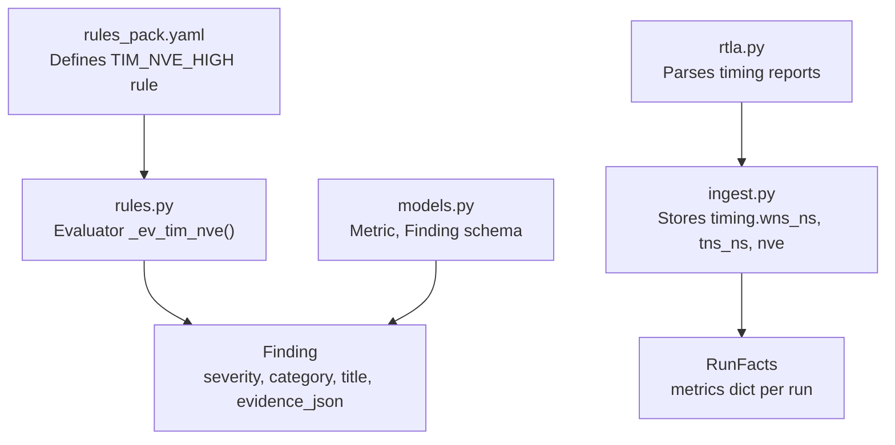
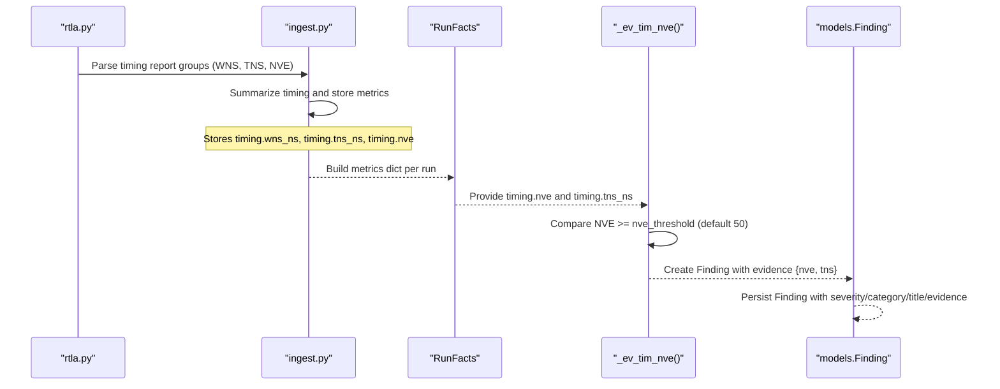
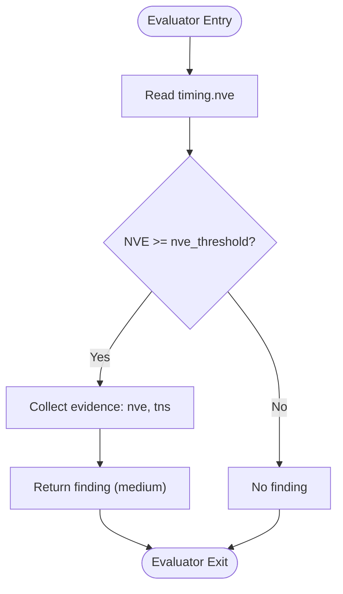
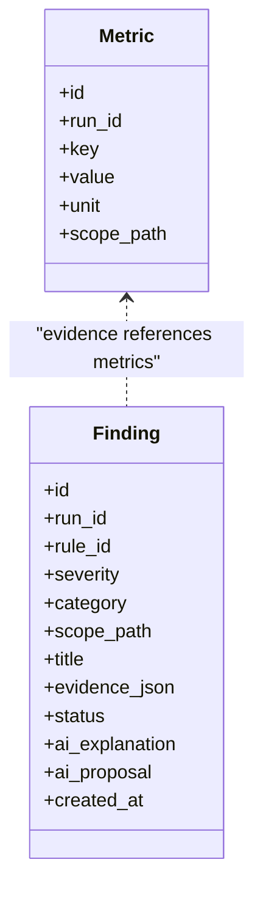
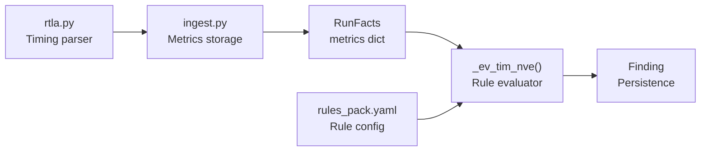

# TIM_NVE_HIGH - Non-Viable Endpoints Detection

<cite>
**Referenced Files in This Document**
- [rules.py](file://backend/ppa/rules.py)
- [rules_pack.yaml](file://backend/ppa/rules_pack.yaml)
- [models.py](file://backend/ppa/models.py)
- [ingest.py](file://backend/ppa/ingest.py)
- [rtla.py](file://backend/ppa/parsers/rtla.py)
- [TimingExplorer.tsx](file://frontend/src/views/TimingExplorer.tsx)
- [types.ts](file://frontend/src/types.ts)
</cite>

## Table of Contents
1. [Introduction](#introduction)
2. [Project Structure](#project-structure)
3. [Core Components](#core-components)
4. [Architecture Overview](#architecture-overview)
5. [Detailed Component Analysis](#detailed-component-analysis)
6. [Dependency Analysis](#dependency-analysis)
7. [Performance Considerations](#performance-considerations)
8. [Troubleshooting Guide](#troubleshooting-guide)
9. [Conclusion](#conclusion)

## Introduction
This document explains the TIM_NVE_HIGH timing rule evaluator that detects designs with excessive non-viable endpoints (NVE). It details how the evaluator compares the timing.nve metric against the nve_threshold parameter (default 50), what evidence is collected, and how findings are generated. It also clarifies why NVE matters for timing closure viability in RISC-V processor design optimization and how it relates to other timing metrics such as total negative slack (TNS) and worst negative slack (WNS).

## Project Structure
The TIM_NVE_HIGH rule is part of a deterministic rule engine that:
- Loads rules from a YAML pack
- Evaluates each rule per run using precomputed facts
- Produces findings with severity, category, scope, title, and evidence

**Diagram sources**
- [rules_pack.yaml:13-17](file://backend/ppa/rules_pack.yaml#L13-L17)
- [rules.py:92-96](file://backend/ppa/rules.py#L92-L96)
- [ingest.py:192-194](file://backend/ppa/ingest.py#L192-L194)
- [rtla.py:76-117](file://backend/ppa/parsers/rtla.py#L76-L117)
- [models.py:83-89](file://backend/ppa/models.py#L83-L89)
- [models.py:168-180](file://backend/ppa/models.py#L168-L180)

**Section sources**
- [rules_pack.yaml:1-119](file://backend/ppa/rules_pack.yaml#L1-L119)
- [rules.py:19-21](file://backend/ppa/rules.py#L19-L21)
- [ingest.py:184-214](file://backend/ppa/ingest.py#L184-L214)
- [rtla.py:76-117](file://backend/ppa/parsers/rtla.py#L76-L117)
- [models.py:83-89](file://backend/ppa/models.py#L83-L89)
- [models.py:168-180](file://backend/ppa/models.py#L168-L180)

## Core Components
- Rule definition: TIM_NVE_HIGH in the YAML pack defines severity, category, title template, and parameters including nve_threshold.
- Evaluator: _ev_tim_nve reads timing.nve and timing.tns_ns from RunFacts.metrics and triggers when NVE meets or exceeds the threshold.
- Data ingestion: ingest.py stores timing.wns_ns, timing.tns_ns, and timing.nve as metrics for each run.
- Models: Metric table stores key/value pairs; Finding table stores rule results with evidence JSON.

Key behaviors:
- Default threshold: 50 non-viable endpoints
- Evidence includes both NVE count and TNS value for context
- Severity is medium by default unless overridden by the evaluator

**Section sources**
- [rules_pack.yaml:13-17](file://backend/ppa/rules_pack.yaml#L13-L17)
- [rules.py:92-96](file://backend/ppa/rules.py#L92-L96)
- [ingest.py:192-194](file://backend/ppa/ingest.py#L192-L194)
- [models.py:83-89](file://backend/ppa/models.py#L83-L89)
- [models.py:168-180](file://backend/ppa/models.py#L168-L180)

## Architecture Overview
End-to-end flow from report parsing to finding generation:

**Diagram sources**
- [rtla.py:76-117](file://backend/ppa/parsers/rtla.py#L76-L117)
- [ingest.py:184-214](file://backend/ppa/ingest.py#L184-L214)
- [rules.py:92-96](file://backend/ppa/rules.py#L92-L96)
- [models.py:168-180](file://backend/ppa/models.py#L168-L180)

## Detailed Component Analysis

### TIM_NVE_HIGH Rule Definition
- Category: timing
- Severity: medium
- Title template includes NVE count and TNS value
- Parameter: nve_threshold defaults to 50

This rule targets designs where the number of violating endpoints is high enough to indicate potential timing closure risk.

**Section sources**
- [rules_pack.yaml:13-17](file://backend/ppa/rules_pack.yaml#L13-L17)

### Evaluator Logic: _ev_tim_nve
- Reads timing.nve from RunFacts.metrics
- Compares against nve_threshold (default 50)
- If exceeded, returns a finding with:
  - Severity: medium
  - Evidence: nve and tns (timing.tns_ns)
- Otherwise, no finding is produced

**Diagram sources**
- [rules.py:92-96](file://backend/ppa/rules.py#L92-L96)

**Section sources**
- [rules.py:92-96](file://backend/ppa/rules.py#L92-L96)

### Metrics Storage and Aggregation
- Timing parser extracts group-level WNS, TNS, and NVE from timing reports
- Ingestion summarizes these values and persists them as metrics:
  - timing.wns_ns
  - timing.tns_ns
  - timing.nve
- These metrics populate RunFacts.metrics for rule evaluation

**Diagram sources**
- [models.py:83-89](file://backend/ppa/models.py#L83-L89)
- [models.py:168-180](file://backend/ppa/models.py#L168-L180)

**Section sources**
- [rtla.py:76-117](file://backend/ppa/parsers/rtla.py#L76-L117)
- [ingest.py:184-214](file://backend/ppa/ingest.py#L184-L214)
- [models.py:83-89](file://backend/ppa/models.py#L83-L89)
- [models.py:168-180](file://backend/ppa/models.py#L168-L180)

### Evidence Collection and Findings
When TIM_NVE_HIGH triggers:
- Evidence includes:
  - nve: count of non-viable endpoints
  - tns: total negative slack in nanoseconds
- Title is rendered using the template with actual values
- Finding is stored with category "timing" and severity "medium"

Example scenarios:
- NVE = 55, TNS = -1.2 ns → Finding generated with evidence {nve: 55, tns: -1.2}
- NVE = 40, TNS = -0.5 ns → No finding (below threshold)

**Section sources**
- [rules_pack.yaml:13-17](file://backend/ppa/rules_pack.yaml#L13-L17)
- [rules.py:92-96](file://backend/ppa/rules.py#L92-L96)
- [models.py:168-180](file://backend/ppa/models.py#L168-L180)

### Relationship Between NVE, TNS, and Timing Closure Viability
- NVE (non-viable endpoints): Count of endpoints that violate timing constraints. High NVE indicates many paths cannot meet timing at target frequency.
- TNS (total negative slack): Sum of negative slacks across violating endpoints. Provides magnitude of timing violations beyond just counts.
- WNS (worst negative slack): Most negative slack among all endpoints. Indicates the worst-case violation.

For RISC-V processor design optimization:
- High NVE suggests widespread timing issues across modules (e.g., ALU, ROB, LSU)
- Combined with TNS, designers can prioritize fixes that reduce both endpoint count and violation magnitude
- Reducing NVE typically improves timing closure viability and may enable higher operating frequencies

**Section sources**
- [rules.py:92-96](file://backend/ppa/rules.py#L92-L96)
- [ingest.py:192-194](file://backend/ppa/ingest.py#L192-L194)

## Dependency Analysis
TIM_NVE_HIGH depends on several components:

**Diagram sources**
- [rtla.py:76-117](file://backend/ppa/parsers/rtla.py#L76-L117)
- [ingest.py:184-214](file://backend/ppa/ingest.py#L184-L214)
- [rules.py:92-96](file://backend/ppa/rules.py#L92-L96)
- [rules_pack.yaml:13-17](file://backend/ppa/rules_pack.yaml#L13-L17)

**Section sources**
- [rules.py:290-310](file://backend/ppa/rules.py#L290-L310)
- [rules_pack.yaml:13-17](file://backend/ppa/rules_pack.yaml#L13-L17)

## Performance Considerations
- The evaluator performs constant-time checks against precomputed metrics
- Threshold tuning affects sensitivity: lower thresholds increase false positives, higher thresholds may miss early warning signs
- Evidence collection is lightweight, only reading two metric values
- For large designs with many timing paths, focus on reducing NVE through targeted optimizations in critical modules

[No sources needed since this section provides general guidance]

## Troubleshooting Guide
Common issues and resolutions:

- **No findings when expected**: Verify timing.nve metric exists and exceeds threshold. Check if timing reports were parsed correctly.
- **Incorrect threshold**: Adjust nve_threshold in rules_pack.yaml based on design complexity and timing goals.
- **Missing TNS data**: Ensure timing reports include TNS values and parsers extract them correctly.
- **False positives**: Lower threshold or add additional filters based on module scope.

Validation steps:
- Confirm timing.wns_ns, timing.tns_ns, and timing.nve are stored in metrics
- Check that RunFacts.metrics contains these keys
- Verify rule evaluation runs after ingestion completes

**Section sources**
- [rules.py:92-96](file://backend/ppa/rules.py#L92-L96)
- [ingest.py:192-194](file://backend/ppa/ingest.py#L192-L194)
- [rtla.py:76-117](file://backend/ppa/parsers/rtla.py#L76-L117)

## Conclusion
The TIM_NVE_HIGH rule provides a straightforward mechanism to detect designs with excessive non-viable endpoints, serving as an early warning system for timing closure issues. By combining NVE counts with TNS values, it offers actionable insights for RISC-V processor optimization. Designers can use this rule to identify problematic areas, prioritize timing fixes, and improve overall timing closure viability.

[No sources needed since this section summarizes without analyzing specific files]