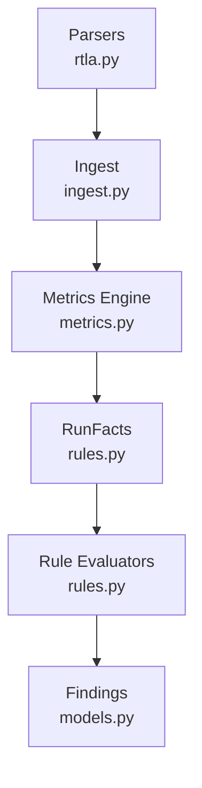
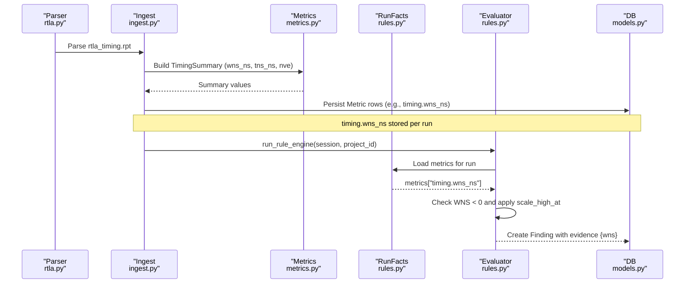
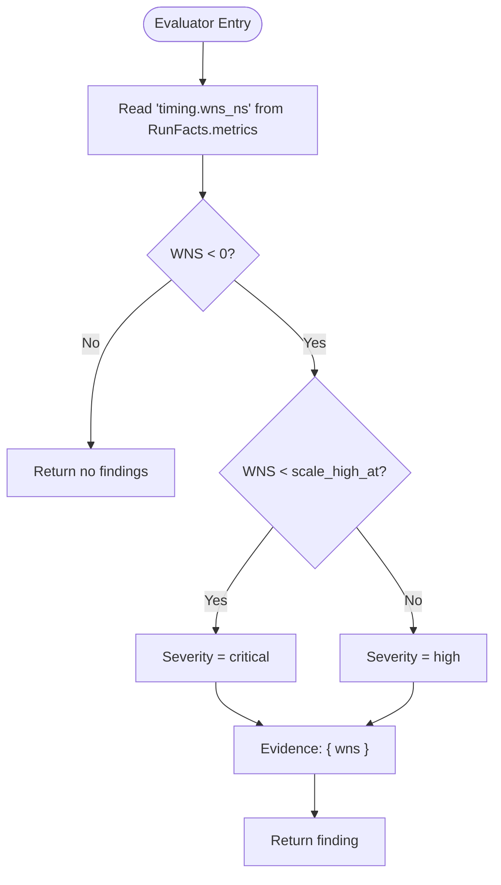
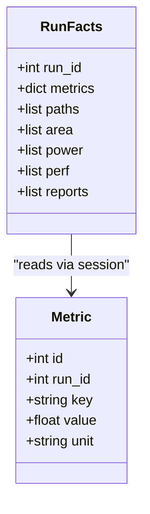
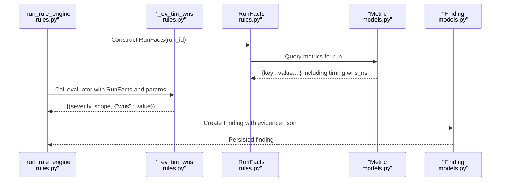
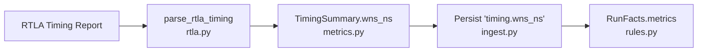
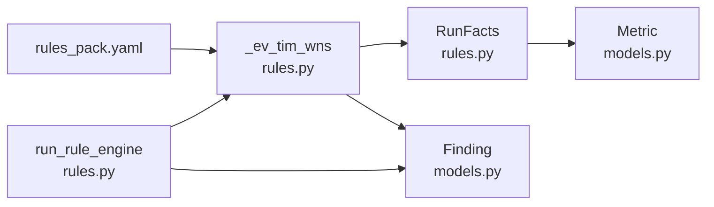

# TIM_WNS_NEG - Negative WNS Detection

<cite>
**Referenced Files in This Document**
- [rules.py](file://backend/ppa/rules.py)
- [rules_pack.yaml](file://backend/ppa/rules_pack.yaml)
- [models.py](file://backend/ppa/models.py)
- [ingest.py](file://backend/ppa/ingest.py)
- [metrics.py](file://backend/ppa/metrics.py)
- [rtla.py](file://backend/ppa/parsers/rtla.py)
</cite>

## Table of Contents
1. [Introduction](#introduction)
2. [Project Structure](#project-structure)
3. [Core Components](#core-components)
4. [Architecture Overview](#architecture-overview)
5. [Detailed Component Analysis](#detailed-component-analysis)
6. [Dependency Analysis](#dependency-analysis)
7. [Performance Considerations](#performance-considerations)
8. [Troubleshooting Guide](#troubleshooting-guide)
9. [Conclusion](#conclusion)

## Introduction
This document explains the TIM_WNS_NEG timing rule evaluator that detects negative worst negative slack (WNS) violations and integrates them into the PPA Profiler’s deterministic rule engine. It covers how the evaluator reads the timing.wns_ns metric from RunFacts, applies severity scaling using the scale_high_at threshold, and returns findings with evidence for downstream storage and display.

## Project Structure
The TIM_WNS_NEG rule is part of a rules-first diagnosis system:
- Rule definitions live in a YAML pack.
- Evaluators are pure Python functions that read precomputed facts and return findings.
- Findings are persisted to the database and later surfaced by the frontend.

**Diagram sources**
- [rtla.py:74-135](file://backend/ppa/parsers/rtla.py#L74-L135)
- [ingest.py:143-194](file://backend/ppa/ingest.py#L143-L194)
- [metrics.py:13-30](file://backend/ppa/metrics.py#L13-L30)
- [rules.py:24-89](file://backend/ppa/rules.py#L24-L89)
- [models.py:168-180](file://backend/ppa/models.py#L168-L180)

**Section sources**
- [rules.py:1-22](file://backend/ppa/rules.py#L1-L22)
- [rules_pack.yaml:6-12](file://backend/ppa/rules_pack.yaml#L6-L12)
- [ingest.py:143-194](file://backend/ppa/ingest.py#L143-L194)
- [models.py:168-180](file://backend/ppa/models.py#L168-L180)

## Core Components
- Rule definition: TIM_WNS_NEG in the YAML pack defines category, default severity, title template, and the scale_high_at parameter used for severity scaling.
- Evaluator: _ev_tim_wns reads timing.wns_ns from RunFacts.metrics, checks for violation (WNS < 0), and selects severity based on the configured threshold.
- Facts access: RunFacts aggregates metrics for a run, including timing.wns_ns derived from parsed timing reports.
- Finding persistence: The rule engine converts evaluator outputs into Finding records with evidence_json containing the WNS value.

Key behaviors:
- Violation detection: WNS < 0 triggers a finding.
- Severity scaling: If WNS < scale_high_at (default -0.10 ns), severity is critical; otherwise high.
- Evidence: The returned evidence includes the numeric WNS value for traceability.

**Section sources**
- [rules_pack.yaml:6-12](file://backend/ppa/rules_pack.yaml#L6-L12)
- [rules.py:24-89](file://backend/ppa/rules.py#L24-L89)
- [rules.py:290-310](file://backend/ppa/rules.py#L290-L310)
- [rules.py:313-352](file://backend/ppa/rules.py#L313-L352)
- [models.py:168-180](file://backend/ppa/models.py#L168-L180)

## Architecture Overview
End-to-end flow from raw timing report to TIM_WNS_NEG finding:

**Diagram sources**
- [rtla.py:74-135](file://backend/ppa/parsers/rtla.py#L74-L135)
- [ingest.py:143-194](file://backend/ppa/ingest.py#L143-L194)
- [metrics.py:13-30](file://backend/ppa/metrics.py#L13-L30)
- [rules.py:24-89](file://backend/ppa/rules.py#L24-L89)
- [rules.py:313-352](file://backend/ppa/rules.py#L313-L352)
- [models.py:168-180](file://backend/ppa/models.py#L168-L180)

## Detailed Component Analysis

### TIM_WNS_NEG Evaluator Logic
The evaluator performs three steps:
1. Read timing.wns_ns from RunFacts.metrics.
2. If WNS < 0, determine severity:
   - critical if WNS < scale_high_at (default -0.10 ns)
   - high otherwise
3. Return a finding tuple with evidence containing the WNS value.

**Diagram sources**
- [rules.py:84-89](file://backend/ppa/rules.py#L84-L89)
- [rules_pack.yaml:6-12](file://backend/ppa/rules_pack.yaml#L6-L12)

**Section sources**
- [rules.py:84-89](file://backend/ppa/rules.py#L84-L89)
- [rules_pack.yaml:6-12](file://backend/ppa/rules_pack.yaml#L6-L12)

### RunFacts and Metric Access
RunFacts builds a key-value map of metrics for a run, including timing.wns_ns. This enables evaluators to access domain summaries without re-parsing reports.

**Diagram sources**
- [rules.py:24-49](file://backend/ppa/rules.py#L24-L49)
- [models.py:83-91](file://backend/ppa/models.py#L83-L91)

**Section sources**
- [rules.py:24-49](file://backend/ppa/rules.py#L24-L49)
- [models.py:83-91](file://backend/ppa/models.py#L83-L91)

### Integration into the Rule Engine Workflow
The rule engine iterates over runs and rules, invokes the appropriate evaluator, and persists findings with evidence. For TIM_WNS_NEG:
- The YAML pack maps TIM_WNS_NEG to the evaluator function.
- The evaluator returns tuples of (severity_override, scope, format_dict).
- The engine renders titles and stores findings with evidence_json containing the WNS value.

**Diagram sources**
- [rules.py:290-310](file://backend/ppa/rules.py#L290-L310)
- [rules.py:313-352](file://backend/ppa/rules.py#L313-L352)
- [rules.py:24-49](file://backend/ppa/rules.py#L24-L49)
- [models.py:83-91](file://backend/ppa/models.py#L83-L91)
- [models.py:168-180](file://backend/ppa/models.py#L168-L180)

**Section sources**
- [rules.py:290-310](file://backend/ppa/rules.py#L290-L310)
- [rules.py:313-352](file://backend/ppa/rules.py#L313-L352)
- [models.py:168-180](file://backend/ppa/models.py#L168-L180)

### Data Source: How timing.wns_ns Is Derived
- The RTLA timing parser extracts path groups and computes summary metrics.
- The metrics engine computes TimingSummary fields, including wns_ns.
- The ingest pipeline persists timing.wns_ns as a Metric row keyed by "timing.wns_ns".

**Diagram sources**
- [rtla.py:74-135](file://backend/ppa/parsers/rtla.py#L74-L135)
- [metrics.py:13-30](file://backend/ppa/metrics.py#L13-L30)
- [ingest.py:143-194](file://backend/ppa/ingest.py#L143-L194)
- [rules.py:24-49](file://backend/ppa/rules.py#L24-L49)

**Section sources**
- [rtla.py:74-135](file://backend/ppa/parsers/rtla.py#L74-L135)
- [metrics.py:13-30](file://backend/ppa/metrics.py#L13-L30)
- [ingest.py:143-194](file://backend/ppa/ingest.py#L143-L194)

## Dependency Analysis
- TIM_WNS_NEG depends on:
  - YAML rule definition for parameters and title formatting.
  - RunFacts for accessing timing.wns_ns.
  - Rule engine for orchestrating evaluation and persistence.
  - Models for storing findings and metrics.

**Diagram sources**
- [rules_pack.yaml:6-12](file://backend/ppa/rules_pack.yaml#L6-L12)
- [rules.py:84-89](file://backend/ppa/rules.py#L84-L89)
- [rules.py:290-310](file://backend/ppa/rules.py#L290-L310)
- [rules.py:313-352](file://backend/ppa/rules.py#L313-L352)
- [models.py:83-91](file://backend/ppa/models.py#L83-L91)
- [models.py:168-180](file://backend/ppa/models.py#L168-L180)

**Section sources**
- [rules_pack.yaml:6-12](file://backend/ppa/rules_pack.yaml#L6-L12)
- [rules.py:84-89](file://backend/ppa/rules.py#L84-L89)
- [rules.py:290-310](file://backend/ppa/rules.py#L290-L310)
- [rules.py:313-352](file://backend/ppa/rules.py#L313-L352)
- [models.py:83-91](file://backend/ppa/models.py#L83-L91)
- [models.py:168-180](file://backend/ppa/models.py#L168-L180)

## Performance Considerations
- The evaluator is O(1) per run since it reads a single metric from an in-memory dictionary.
- RunFacts loads all metrics once per run, minimizing repeated queries.
- Avoid adding heavy computation inside evaluators to keep rule evaluation fast across many runs.

[No sources needed since this section provides general guidance]

## Troubleshooting Guide
Common issues and resolutions:
- Missing timing.wns_ns: Ensure the timing report was parsed successfully and that timing.wns_ns was persisted. Check parse status and logs for the timing report.
- Unexpected severity: Verify the scale_high_at parameter in the rule pack and confirm whether WNS is below or above the threshold.
- No findings despite negative WNS: Confirm that the evaluator is registered and invoked by the rule engine and that the run belongs to the evaluated project/design set.

Validation tips:
- Inspect the Finding record’s evidence_json to verify the recorded WNS value.
- Cross-check the timing summary values produced by the metrics engine against the original report.

**Section sources**
- [rules.py:313-352](file://backend/ppa/rules.py#L313-L352)
- [models.py:168-180](file://backend/ppa/models.py#L168-L180)
- [ingest.py:143-194](file://backend/ppa/ingest.py#L143-L194)

## Conclusion
TIM_WNS_NEG provides a simple, robust check for setup timing violations by detecting negative WNS and applying configurable severity scaling. Its integration points—parsing, metrics derivation, RunFacts access, and rule engine orchestration—ensure consistent, auditable findings with clear evidence for downstream analysis and remediation.

[No sources needed since this section summarizes without analyzing specific files]