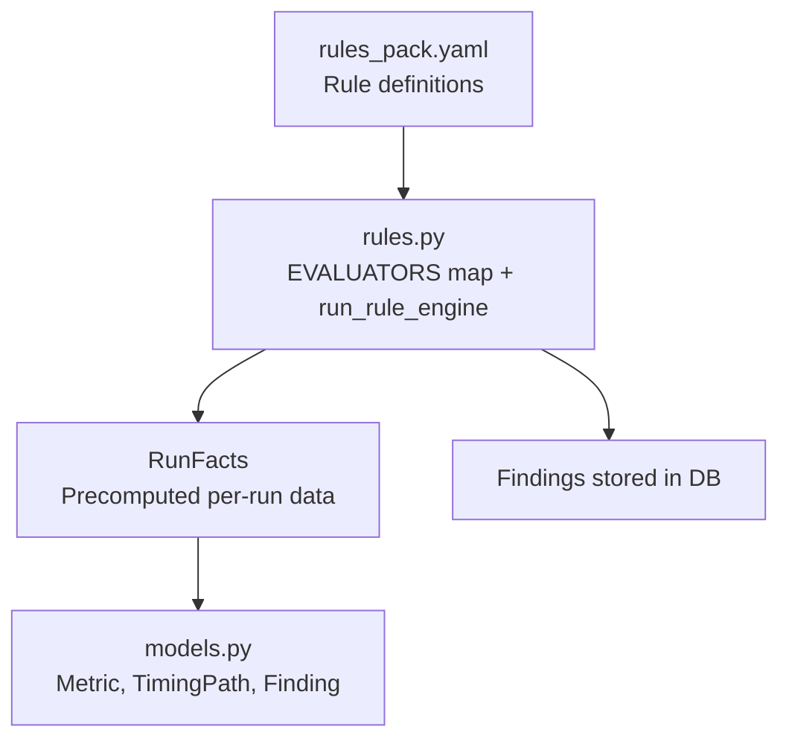
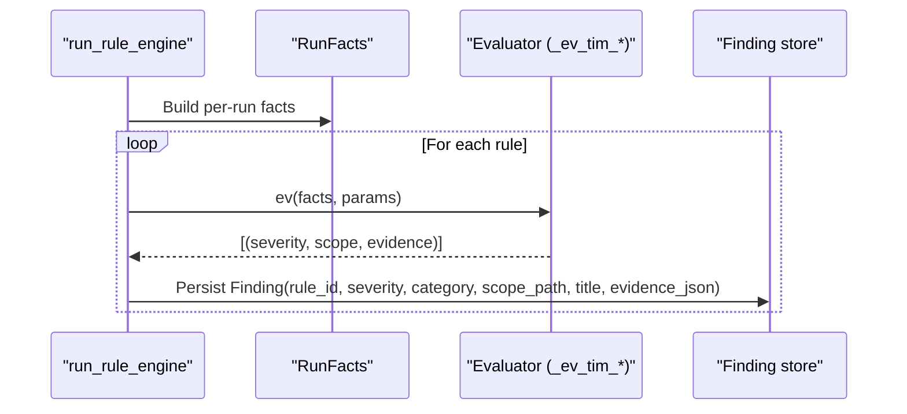
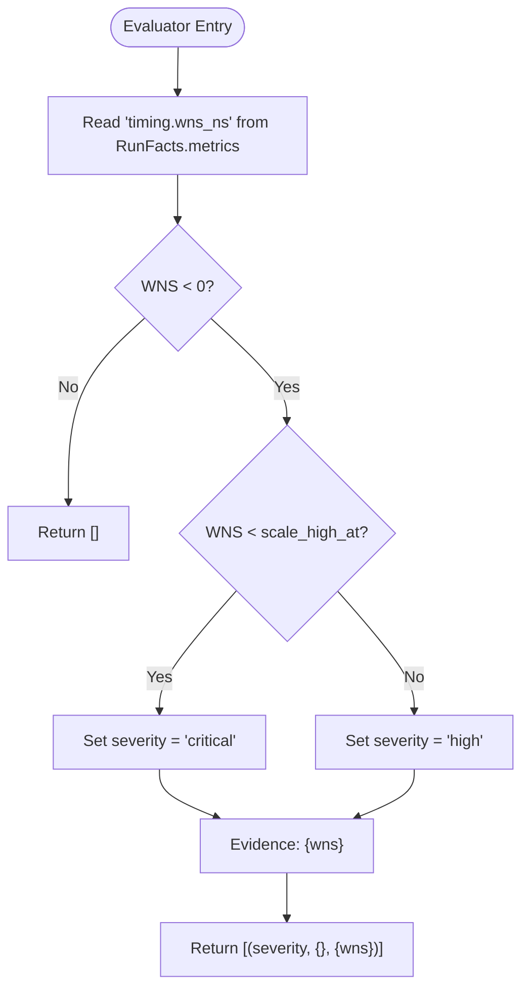
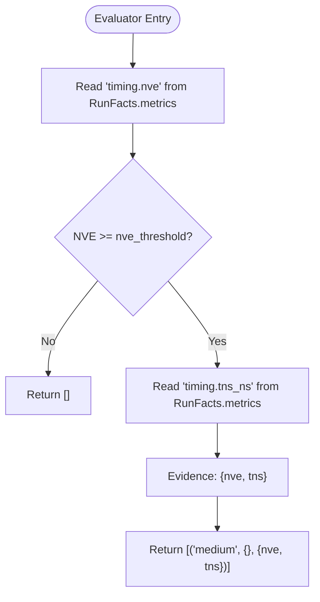
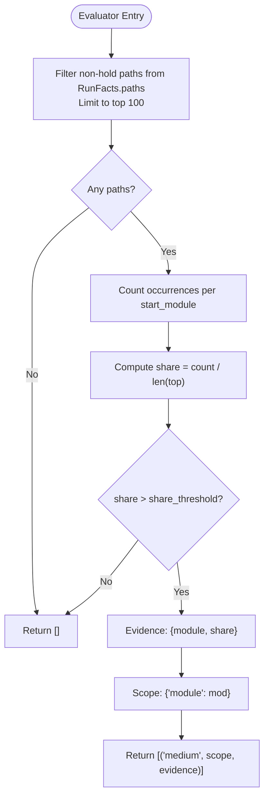
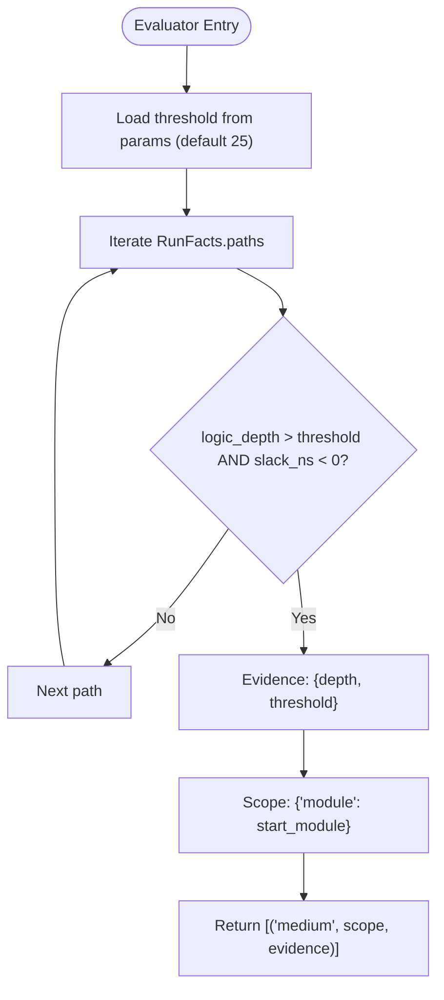
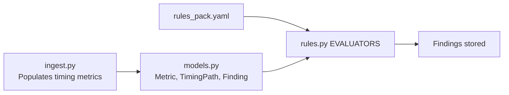

# Timing Rule Evaluators

<cite>
**Referenced Files in This Document**
- [rules.py](file://backend/ppa/rules.py)
- [rules_pack.yaml](file://backend/ppa/rules_pack.yaml)
- [models.py](file://backend/ppa/models.py)
- [ingest.py](file://backend/ppa/ingest.py)
- [analysis.py](file://backend/ppa/analysis.py)
- [metrics.py](file://backend/ppa/metrics.py)
</cite>

## Table of Contents
1. [Introduction](#introduction)
2. [Project Structure](#project-structure)
3. [Core Components](#core-components)
4. [Architecture Overview](#architecture-overview)
5. [Detailed Component Analysis](#detailed-component-analysis)
6. [Dependency Analysis](#dependency-analysis)
7. [Performance Considerations](#performance-considerations)
8. [Troubleshooting Guide](#troubleshooting-guide)
9. [Conclusion](#conclusion)

## Introduction
This document explains the timing-related rule evaluators that detect timing violations and optimization opportunities. It focuses on four rules:
- TIM_WNS_NEG: detects negative worst-case negative slack (WNS) with severity scaling based on how far below zero it is.
- TIM_NVE_HIGH: identifies runs with a high number of violating endpoints (NVE), surfacing total negative slack (TNS).
- TIM_MOD_DOMINATES: finds modules that dominate the top timing paths by share.
- TIM_DEEP_LOGIC: flags critical paths whose logic depth exceeds a threshold, indicating deep combinational logic.

For each evaluator, this document covers detection criteria, threshold parameters, severity determination, evidence collection, and how they access timing metrics from RunFacts to return findings with appropriate severity and scope.

## Project Structure
The timing rule system is implemented as a small, deterministic engine:
- Rules are declared in a YAML pack with id, category, severity, title, and params.
- Evaluators are pure Python functions that read precomputed facts from a RunFacts object and return findings.
- Findings are persisted into the database with severity, category, scope_path, title, and evidence_json.

**Diagram sources**
- [rules_pack.yaml:6-29](file://backend/ppa/rules_pack.yaml#L6-L29)
- [rules.py:290-352](file://backend/ppa/rules.py#L290-L352)
- [models.py:83-135](file://backend/ppa/models.py#L83-L135)

**Section sources**
- [rules_pack.yaml:6-29](file://backend/ppa/rules_pack.yaml#L6-L29)
- [rules.py:290-352](file://backend/ppa/rules.py#L290-L352)
- [models.py:83-135](file://backend/ppa/models.py#L83-L135)

## Core Components
- RunFacts: Aggregates all metrics, area/power/perf rows, timing paths, reports, project/config context, and baseline data for a single run. Evaluators consume only what they need from this object.
- TimingPath model: Represents individual timing paths with fields such as slack_ns, start_module, end_module, logic_depth, and is_hold.
- Metric key convention: Timing metrics are stored under keys like "timing.wns_ns", "timing.tns_ns", "timing.nve", and "timing.fmax_mhz". These are populated during ingestion.

Key responsibilities:
- Ingestion writes timing metrics into the Metric table using standardized keys.
- The rule engine loads rules from YAML, instantiates RunFacts per run, calls the corresponding evaluator, and persists findings.

**Section sources**
- [rules.py:24-79](file://backend/ppa/rules.py#L24-L79)
- [models.py:120-135](file://backend/ppa/models.py#L120-L135)
- [ingest.py:189-214](file://backend/ppa/ingest.py#L189-L214)

## Architecture Overview
The evaluation flow for timing rules:
1. For each run in a project, build RunFacts.
2. For each rule in the pack, call its evaluator with RunFacts and rule params.
3. Evaluators read timing metrics and path data, apply thresholds, and return tuples of (severity, scope, evidence).
4. The engine renders titles using evidence values and stores findings with category and scope_path.

**Diagram sources**
- [rules.py:313-352](file://backend/ppa/rules.py#L313-L352)
- [rules.py:84-122](file://backend/ppa/rules.py#L84-L122)
- [models.py:168-180](file://backend/ppa/models.py#L168-L180)

## Detailed Component Analysis

### TIM_WNS_NEG: Negative WNS Detection with Severity Scaling
Detection criteria:
- Reads timing.wns_ns from RunFacts.metrics.
- If WNS is negative, a finding is produced.

Severity determination:
- Uses parameter scale_high_at (default -0.10 ns).
- If WNS < scale_high_at, severity is "critical"; otherwise "high".

Evidence collected:
- wns: the measured WNS value.

How it accesses metrics:
- Directly reads f.metrics.get("timing.wns_ns", 0.0).

Example usage pattern (conceptual):
- Retrieve WNS from RunFacts.metrics.
- Compare against threshold from rule params.
- Return a tuple with severity, empty scope, and evidence containing wns.

**Diagram sources**
- [rules.py:84-89](file://backend/ppa/rules.py#L84-L89)
- [rules_pack.yaml:7-11](file://backend/ppa/rules_pack.yaml#L7-L11)

**Section sources**
- [rules.py:84-89](file://backend/ppa/rules.py#L84-L89)
- [rules_pack.yaml:7-11](file://backend/ppa/rules_pack.yaml#L7-L11)
- [ingest.py:189-195](file://backend/ppa/ingest.py#L189-L195)

### TIM_NVE_HIGH: Non-Viable Endpoints Identification
Detection criteria:
- Reads timing.nve from RunFacts.metrics.
- Triggers when NVE >= nve_threshold (default 50).

Severity determination:
- Always "medium" for this rule.

Evidence collected:
- nve: number of violating endpoints.
- tns: total negative slack from timing.tns_ns.

How it accesses metrics:
- Reads f.metrics.get("timing.nve", 0) and f.metrics.get("timing.tns_ns", 0.0).

Example usage pattern (conceptual):
- Get NVE and TNS from RunFacts.metrics.
- Compare NVE against threshold from rule params.
- Return a tuple with severity, empty scope, and evidence containing nve and tns.

**Diagram sources**
- [rules.py:92-96](file://backend/ppa/rules.py#L92-L96)
- [rules_pack.yaml:13-17](file://backend/ppa/rules_pack.yaml#L13-L17)
- [ingest.py:189-195](file://backend/ppa/ingest.py#L189-L195)

**Section sources**
- [rules.py:92-96](file://backend/ppa/rules.py#L92-L96)
- [rules_pack.yaml:13-17](file://backend/ppa/rules_pack.yaml#L13-L17)
- [ingest.py:189-195](file://backend/ppa/ingest.py#L189-L195)

### TIM_MOD_DOMINATES: Dominant Module Analysis for Timing Paths
Detection criteria:
- Considers setup paths only (ignores hold paths).
- Analyzes up to the top 100 non-hold paths from RunFacts.paths.
- Counts occurrences per start_module.
- Computes share = count / total_paths_in_top_set.
- Triggers when share > share_threshold (default 0.30).

Severity determination:
- Always "medium" for this rule.

Evidence collected:
- module: the dominant module name.
- share: fraction of top paths owned by that module.

Scope information:
- scope_path set to the dominant module via scope dict {"module": mod}.

How it accesses timing paths:
- Iterates f.paths, filters out hold paths, counts start_module occurrences, and compares share to threshold.

**Diagram sources**
- [rules.py:99-111](file://backend/ppa/rules.py#L99-L111)
- [rules_pack.yaml:19-23](file://backend/ppa/rules_pack.yaml#L19-L23)
- [models.py:120-135](file://backend/ppa/models.py#L120-L135)

**Section sources**
- [rules.py:99-111](file://backend/ppa/rules.py#L99-L111)
- [rules_pack.yaml:19-23](file://backend/ppa/rules_pack.yaml#L19-L23)
- [models.py:120-135](file://backend/ppa/models.py#L120-L135)

### TIM_DEEP_LOGIC: Deep Logic Path Detection
Detection criteria:
- Scans all timing paths from RunFacts.paths.
- Looks for any path where logic_depth > threshold (default 25) AND slack_ns < 0.
- On first match, returns a finding and stops further scanning.

Severity determination:
- Always "medium" for this rule.

Evidence collected:
- depth: the path’s logic_depth.
- threshold: the configured threshold.

Scope information:
- scope_path set to the path’s start_module via scope dict {"module": t.start_module}.

How it accesses timing paths:
- Iterates f.paths and checks both logic_depth and slack_ns.

**Diagram sources**
- [rules.py:114-122](file://backend/ppa/rules.py#L114-L122)
- [rules_pack.yaml:25-29](file://backend/ppa/rules_pack.yaml#L25-L29)
- [models.py:120-135](file://backend/ppa/models.py#L120-L135)

**Section sources**
- [rules.py:114-122](file://backend/ppa/rules.py#L114-L122)
- [rules_pack.yaml:25-29](file://backend/ppa/rules_pack.yaml#L25-L29)
- [models.py:120-135](file://backend/ppa/models.py#L120-L135)

## Dependency Analysis
Timing evaluators depend on:
- RunFacts.metrics for aggregate timing numbers (WNS, TNS, NVE).
- RunFacts.paths for per-path details (slack, logic_depth, start_module, is_hold).
- Rule parameters from rules_pack.yaml for thresholds and default severities.
- The rule engine to persist findings with correct category and scope.

**Diagram sources**
- [rules_pack.yaml:6-29](file://backend/ppa/rules_pack.yaml#L6-L29)
- [rules.py:290-352](file://backend/ppa/rules.py#L290-L352)
- [models.py:83-135](file://backend/ppa/models.py#L83-L135)
- [ingest.py:189-214](file://backend/ppa/ingest.py#L189-L214)

**Section sources**
- [rules.py:290-352](file://backend/ppa/rules.py#L290-L352)
- [models.py:83-135](file://backend/ppa/models.py#L83-L135)
- [ingest.py:189-214](file://backend/ppa/ingest.py#L189-L214)

## Performance Considerations
- TIM_MOD_DOMINATES limits analysis to the top 100 non-hold paths to avoid expensive full-path scans.
- TIM_DEEP_LOGIC short-circuits after the first deep critical path is found, minimizing unnecessary iterations.
- All evaluators are pure functions over RunFacts; no side effects until findings are persisted by the engine.

[No sources needed since this section provides general guidance]

## Troubleshooting Guide
Common issues and diagnostics:
- Missing timing metrics: Ensure ingestion populates timing.wns_ns, timing.tns_ns, timing.nve, and timing.fmax_mhz. Without these, TIM_WNS_NEG and TIM_NVE_HIGH cannot trigger.
- Empty or missing paths: TIM_MOD_DOMINATES and TIM_DEEP_LOGIC rely on RunFacts.paths. If paths are not parsed or loaded, these rules will not find issues.
- Threshold tuning: Adjust scale_high_at, nve_threshold, share_threshold, and threshold in rules_pack.yaml to align with design goals.
- Severity overrides: The engine applies rule-level severity if evaluators do not override it; confirm expected severity in rule definitions.

**Section sources**
- [ingest.py:189-214](file://backend/ppa/ingest.py#L189-L214)
- [rules.py:313-352](file://backend/ppa/rules.py#L313-L352)
- [rules_pack.yaml:6-29](file://backend/ppa/rules_pack.yaml#L6-L29)

## Conclusion
These four timing rule evaluators provide targeted, configurable detection of common timing problems:
- TIM_WNS_NEG scales severity with the magnitude of WNS violation.
- TIM_NVE_HIGH highlights designs with many violating endpoints and surfaces TNS.
- TIM_MOD_DOMINATES pinpoints modules that own a disproportionate share of critical paths.
- TIM_DEEP_LOGIC flags overly deep logic on critical paths.

They operate deterministically on RunFacts, use clear thresholds from the rule pack, and produce structured findings with evidence and scope for downstream analysis and visualization.

[No sources needed since this section summarizes without analyzing specific files]