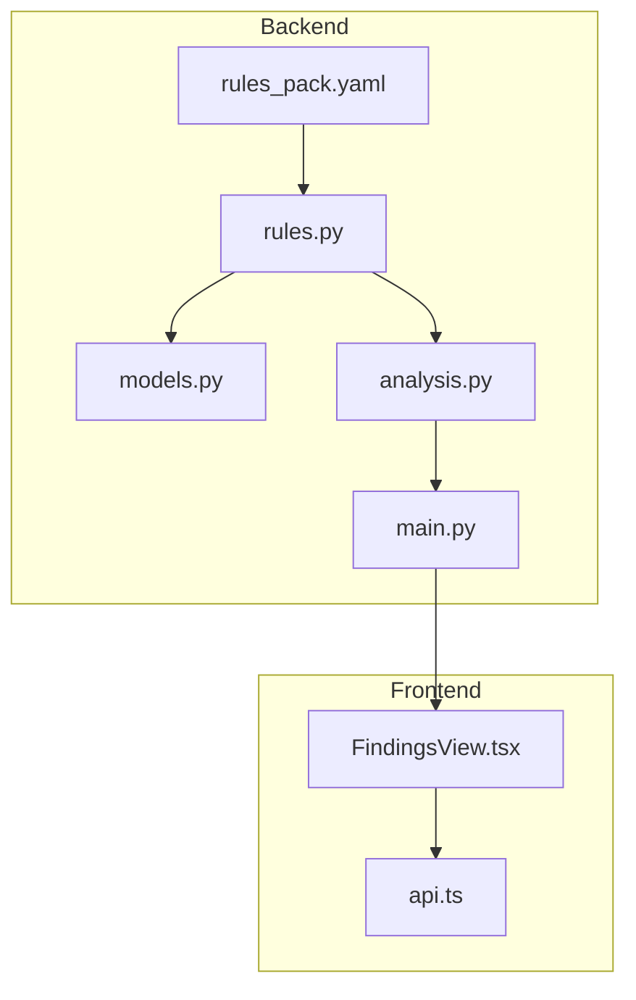
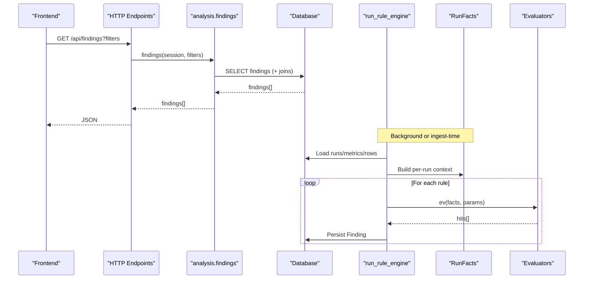
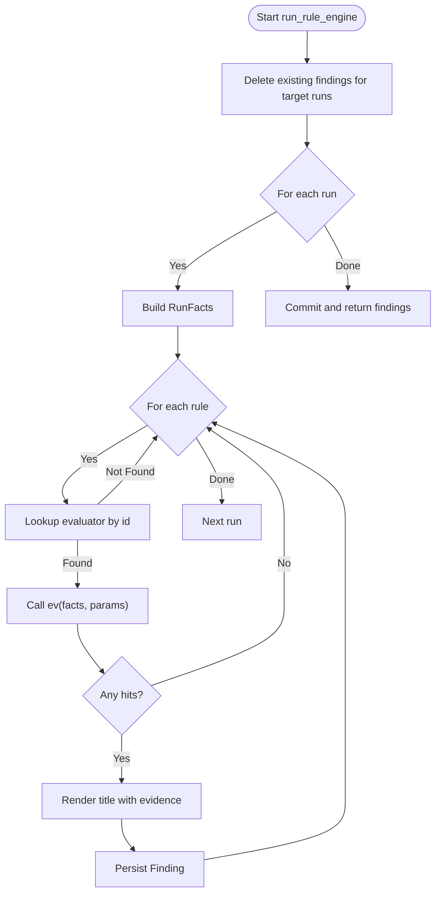
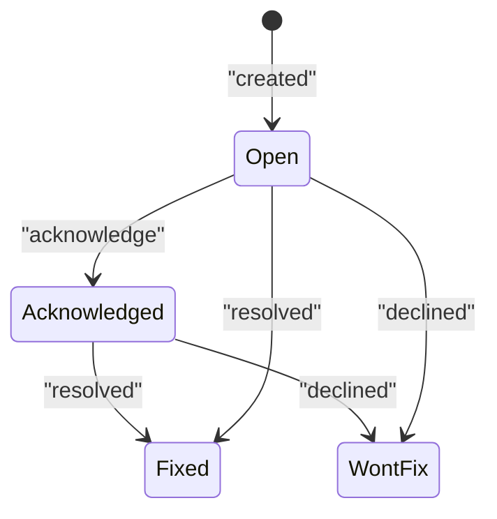
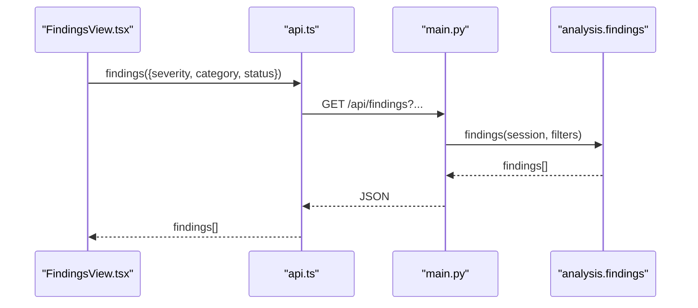
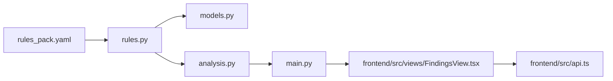

# Rule-Based Diagnostic Engine

<cite>
**Referenced Files in This Document**
- [rules.py](file://backend/ppa/rules.py)
- [rules_pack.yaml](file://backend/ppa/rules_pack.yaml)
- [models.py](file://backend/ppa/models.py)
- [analysis.py](file://backend/ppa/analysis.py)
- [main.py](file://backend/ppa/main.py)
- [test_backend.py](file://backend/tests/test_backend.py)
- [FindingsView.tsx](file://frontend/src/views/FindingsView.tsx)
- [api.ts](file://frontend/src/api.ts)
</cite>

## Table of Contents
1. [Introduction](#introduction)
2. [Project Structure](#project-structure)
3. [Core Components](#core-components)
4. [Architecture Overview](#architecture-overview)
5. [Detailed Component Analysis](#detailed-component-analysis)
6. [Dependency Analysis](#dependency-analysis)
7. [Performance Considerations](#performance-considerations)
8. [Troubleshooting Guide](#troubleshooting-guide)
9. [Conclusion](#conclusion)
10. [Appendices](#appendices)

## Introduction
This document explains the rule-based diagnostic engine that automatically detects issues across area, power, timing, and performance domains. It focuses on:
- The RunFacts class that provides contextual information about runs for rule evaluation
- The YAML-based rule definition format including severity levels, categories, and matching conditions
- The rule execution pipeline, finding classification system, and status management
- Examples of custom rule creation, rule composition patterns, and integration with the findings API
- Rule versioning, testing approaches, and debugging techniques for complex diagnostic scenarios

The engine is deterministic: rules are defined declaratively in a YAML pack, evaluated by pure Python functions, and persisted as structured findings. An LLM layer narrates findings but does not create them.

## Project Structure
At a high level:
- Rules are declared in a YAML file and loaded at runtime
- A Python module implements evaluators and the execution pipeline
- Models define the database schema, including the Finding entity
- An analysis layer exposes query APIs used by the frontend and AI tools
- HTTP endpoints expose findings, rule packs, and ingestion status

**Diagram sources**
- [rules.py:19-21](file://backend/ppa/rules.py#L19-L21)
- [rules.py:313-352](file://backend/ppa/rules.py#L313-L352)
- [models.py:168-181](file://backend/ppa/models.py#L168-L181)
- [analysis.py:403-423](file://backend/ppa/analysis.py#L403-L423)
- [main.py:99-162](file://backend/ppa/main.py#L99-L162)
- [FindingsView.tsx:155-180](file://frontend/src/views/FindingsView.tsx#L155-L180)
- [api.ts:33-40](file://frontend/src/api.ts#L33-L40)

**Section sources**
- [rules.py:19-21](file://backend/ppa/rules.py#L19-L21)
- [rules.py:313-352](file://backend/ppa/rules.py#L313-L352)
- [models.py:168-181](file://backend/ppa/models.py#L168-L181)
- [analysis.py:403-423](file://backend/ppa/analysis.py#L403-L423)
- [main.py:99-162](file://backend/ppa/main.py#L99-L162)
- [FindingsView.tsx:155-180](file://frontend/src/views/FindingsView.tsx#L155-L180)
- [api.ts:33-40](file://frontend/src/api.ts#L33-L40)

## Core Components
- RunFacts: Precomputed context per run (metrics, area/power/perf rows, timing paths, reports, project/config/baseline). Evaluators read from this object to avoid repeated DB queries.
- Rule Pack: YAML file enumerating rules with id, category, severity, title template, and params.
- Evaluators: Pure Python functions mapping RunFacts + params to hits (severity override, scope, evidence dict).
- Pipeline: Loads rules, iterates runs, invokes evaluator, renders titles, persists findings.
- Findings Model: Stores rule_id, severity, category, scope_path, title, evidence_json, status, timestamps.
- Analysis Layer: Query functions to list/filter findings and other views; exposed via HTTP endpoints.

Key responsibilities:
- Deterministic detection without LLM involvement
- Designer-tunable thresholds via YAML
- Stable, filterable findings with status workflow

**Section sources**
- [rules.py:24-79](file://backend/ppa/rules.py#L24-L79)
- [rules.py:84-288](file://backend/ppa/rules.py#L84-L288)
- [rules.py:290-310](file://backend/ppa/rules.py#L290-L310)
- [rules.py:313-360](file://backend/ppa/rules.py#L313-L360)
- [models.py:168-181](file://backend/ppa/models.py#L168-L181)
- [analysis.py:403-423](file://backend/ppa/analysis.py#L403-L423)

## Architecture Overview
The diagnostic engine follows a clear separation between data, rules, and presentation:

**Diagram sources**
- [main.py:99-162](file://backend/ppa/main.py#L99-L162)
- [analysis.py:403-423](file://backend/ppa/analysis.py#L403-L423)
- [rules.py:313-352](file://backend/ppa/rules.py#L313-L352)
- [rules.py:24-79](file://backend/ppa/rules.py#L24-L79)

## Detailed Component Analysis

### RunFacts: Contextual Data for Rule Evaluation
RunFacts encapsulates all data a rule may need for a given run:
- Metrics map keyed by metric key
- Area, Power, Perf rows for the run
- Timing paths
- Raw reports (for data quality checks)
- Project and Config info (budgets, parameters)
- Baseline metrics, area, perf if available

It also provides helpers like area_at_depth and power_by_path to simplify common queries.

Complexity considerations:
- Construction performs multiple DB queries once per run; subsequent rule evaluations reuse the cached structures
- Baseline loading is conditional and only when a baseline exists for the project

**Section sources**
- [rules.py:24-79](file://backend/ppa/rules.py#L24-L79)

### YAML Rule Definition Format
Each rule entry includes:
- id: Unique identifier mapped to an evaluator function
- category: Domain grouping (timing, area, power, performance, cross_domain, data_quality)
- severity: Default severity (critical, high, medium, low, info); can be overridden per hit
- title: Template string using placeholders filled by evidence dict
- params: Thresholds and tunables consumed by the evaluator

Examples present in the pack include timing violations, area budget breaches, power density hotspots, performance regressions, cross-domain ROI checks, and data quality warnings.

**Section sources**
- [rules_pack.yaml:1-119](file://backend/ppa/rules_pack.yaml#L1-L119)

### Evaluators and Rule Execution Pipeline
- load_rules reads the YAML pack into a list of rule dicts
- run_rule_engine:
  - Clears old findings for affected runs
  - Iterates runs and rules
  - Invokes the corresponding evaluator by id
  - Renders titles using evidence values
  - Persists findings with computed severity/category/scope/evidence
- Evaluators return tuples of (severity_override, scope_dict, evidence_dict) or empty lists when no issue is detected
- Error isolation: exceptions in evaluators are caught so one broken rule cannot stop the entire pipeline

**Diagram sources**
- [rules.py:313-352](file://backend/ppa/rules.py#L313-L352)
- [rules.py:355-360](file://backend/ppa/rules.py#L355-L360)

**Section sources**
- [rules.py:19-21](file://backend/ppa/rules.py#L19-L21)
- [rules.py:290-310](file://backend/ppa/rules.py#L290-L310)
- [rules.py:313-360](file://backend/ppa/rules.py#L313-L360)

### Finding Classification and Status Management
- Classification:
  - category comes from the rule definition
  - severity defaults from the rule but can be overridden per hit
  - scope_path captures module-level context when applicable
  - evidence_json stores numeric/string evidence for display and filtering
- Status workflow:
  - New findings start as open
  - Frontend allows updating status to acknowledged, fixed, wont_fix
  - Analysis layer supports filtering by severity, category, and status

**Diagram sources**
- [models.py:168-181](file://backend/ppa/models.py#L168-L181)
- [main.py:114-131](file://backend/ppa/main.py#L114-L131)
- [FindingsView.tsx:155-180](file://frontend/src/views/FindingsView.tsx#L155-L180)

**Section sources**
- [models.py:168-181](file://backend/ppa/models.py#L168-L181)
- [main.py:114-131](file://backend/ppa/main.py#L114-L131)
- [analysis.py:403-423](file://backend/ppa/analysis.py#L403-L423)
- [FindingsView.tsx:155-180](file://frontend/src/views/FindingsView.tsx#L155-L180)

### Integration with Findings API
- HTTP endpoints expose:
  - GET /api/findings with optional filters (run_id, severity, category, status)
  - PATCH /api/findings/{id} to update status or AI fields
  - POST /api/findings/{id}/feedback for rule feedback
- Frontend calls these via api.ts and renders filtered results in FindingsView

**Diagram sources**
- [api.ts:33-40](file://frontend/src/api.ts#L33-L40)
- [main.py:99-131](file://backend/ppa/main.py#L99-L131)
- [analysis.py:403-423](file://backend/ppa/analysis.py#L403-L423)
- [FindingsView.tsx:155-180](file://frontend/src/views/FindingsView.tsx#L155-L180)

**Section sources**
- [main.py:99-162](file://backend/ppa/main.py#L99-L162)
- [api.ts:33-40](file://frontend/src/api.ts#L33-L40)
- [analysis.py:403-423](file://backend/ppa/analysis.py#L403-L423)
- [FindingsView.tsx:155-180](file://frontend/src/views/FindingsView.tsx#L155-L180)

### Custom Rule Creation Patterns
To add a new rule:
- Define a new evaluator function that accepts RunFacts and params and returns hits
- Add an entry to the EVALUATORS map with a unique id
- Add a rule entry in rules_pack.yaml with id, category, severity, title template, and params
- Ensure the evaluator uses only safe accessors from RunFacts to avoid errors

Rule composition patterns:
- Combine multiple metrics within a single evaluator to detect cross-domain issues (e.g., comparing IPC vs SPEC score)
- Use baseline comparisons via RunFacts.baseline_* to detect regressions or growth
- Scope findings to modules by setting scope_path and including module identifiers in evidence

Example references:
- Cross-domain ROI check pattern
- Performance regression with outlier detection
- Data quality checks for missing or warning-laden reports

**Section sources**
- [rules.py:247-266](file://backend/ppa/rules.py#L247-L266)
- [rules.py:200-224](file://backend/ppa/rules.py#L200-L224)
- [rules.py:269-287](file://backend/ppa/rules.py#L269-L287)
- [rules_pack.yaml:79-119](file://backend/ppa/rules_pack.yaml#L79-L119)

## Dependency Analysis
The rule engine depends on:
- models.py for database entities (Run, Metric, AreaRow, PowerRow, PerfRow, TimingPath, RawReport, Project, Config, Baseline, Finding)
- analysis.py for querying and exposing findings
- main.py for HTTP endpoints
- rules_pack.yaml for rule definitions
- Frontend components for viewing and managing findings

**Diagram sources**
- [rules.py:11-14](file://backend/ppa/rules.py#L11-L14)
- [rules.py:313-352](file://backend/ppa/rules.py#L313-L352)
- [analysis.py:403-423](file://backend/ppa/analysis.py#L403-L423)
- [main.py:99-162](file://backend/ppa/main.py#L99-L162)
- [FindingsView.tsx:155-180](file://frontend/src/views/FindingsView.tsx#L155-L180)
- [api.ts:33-40](file://frontend/src/api.ts#L33-L40)

**Section sources**
- [rules.py:11-14](file://backend/ppa/rules.py#L11-L14)
- [rules.py:313-352](file://backend/ppa/rules.py#L313-L352)
- [analysis.py:403-423](file://backend/ppa/analysis.py#L403-L423)
- [main.py:99-162](file://backend/ppa/main.py#L99-L162)
- [FindingsView.tsx:155-180](file://frontend/src/views/FindingsView.tsx#L155-L180)
- [api.ts:33-40](file://frontend/src/api.ts#L33-L40)

## Performance Considerations
- RunFacts construction batches DB reads per run to minimize round-trips
- Evaluators operate on in-memory structures derived from RunFacts
- The pipeline isolates evaluator exceptions to prevent cascading failures
- Filtering in analysis.findings reduces payload size for large datasets
- Title rendering uses simple string formatting; keep templates concise

[No sources needed since this section provides general guidance]

## Troubleshooting Guide
Common issues and how to address them:
- Missing reports: DQ_MISSING_REPORT flags absent report kinds; ensure ingestion completes successfully
- Parse warnings/errors: DQ_PARSE_WARNINGS surfaces parser issues; inspect parse_log via ingest-status
- Broken evaluator: Exceptions are caught; verify evaluator logic and params; re-run ingestion
- No findings despite expected issues: Confirm baseline setup and thresholds; validate RunFacts content via debug prints or logs
- Status updates failing: Validate allowed statuses; check endpoint responses

Useful endpoints and tests:
- GET /api/findings with filters to inspect current findings
- GET /api/ingest-status to review parsing outcomes
- Backend tests assert expected anomalies are captured

**Section sources**
- [rules.py:269-287](file://backend/ppa/rules.py#L269-L287)
- [analysis.py:428-438](file://backend/ppa/analysis.py#L428-L438)
- [main.py:154-162](file://backend/ppa/main.py#L154-L162)
- [test_backend.py:97-115](file://backend/tests/test_backend.py#L97-L115)

## Conclusion
The rule-based diagnostic engine provides a deterministic, designer-friendly approach to detecting PPA issues. By separating rule definitions (YAML), evaluation logic (Python), and presentation (API/Frontend), it enables rapid iteration on thresholds and categories while maintaining stable, filterable findings. RunFacts centralizes context, the pipeline ensures robustness, and the findings API integrates seamlessly with the UI and AI tools.

[No sources needed since this section summarizes without analyzing specific files]

## Appendices

### Example: Creating a New Rule
Steps:
- Implement an evaluator function returning hits with severity, scope, and evidence
- Register the evaluator in the EVALUATORS map
- Add a rule entry in rules_pack.yaml with id, category, severity, title, and params
- Re-ingest to regenerate findings

References:
- Evaluator pattern and registration
- Rule pack structure and examples

**Section sources**
- [rules.py:290-310](file://backend/ppa/rules.py#L290-L310)
- [rules_pack.yaml:1-119](file://backend/ppa/rules_pack.yaml#L1-L119)

### Example: Testing Rules
Approach:
- Use backend tests to assert that known anomalies trigger expected rules
- Inspect findings via /api/findings and ingest-status
- Adjust thresholds in rules_pack.yaml and re-run

References:
- Test assertions for specific rule ids

**Section sources**
- [test_backend.py:97-115](file://backend/tests/test_backend.py#L97-L115)

### Example: Debugging Complex Scenarios
Techniques:
- Filter findings by severity/category/status to isolate issues
- Review evidence_json for precise metrics and thresholds
- Check baseline relationships via RunFacts to understand deltas
- Use ingest-status to diagnose parsing problems

References:
- Findings filtering and display
- Ingest status reporting

**Section sources**
- [analysis.py:403-423](file://backend/ppa/analysis.py#L403-L423)
- [analysis.py:428-438](file://backend/ppa/analysis.py#L428-L438)
- [FindingsView.tsx:155-180](file://frontend/src/views/FindingsView.tsx#L155-L180)