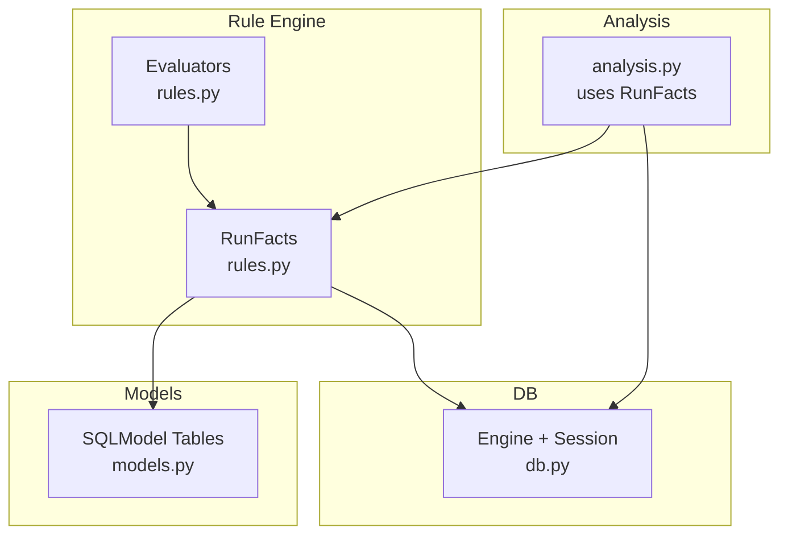
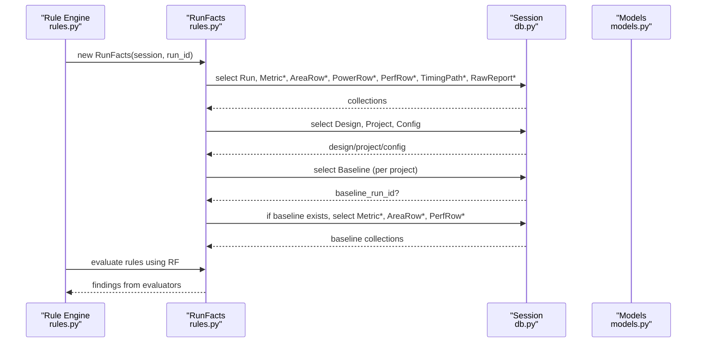
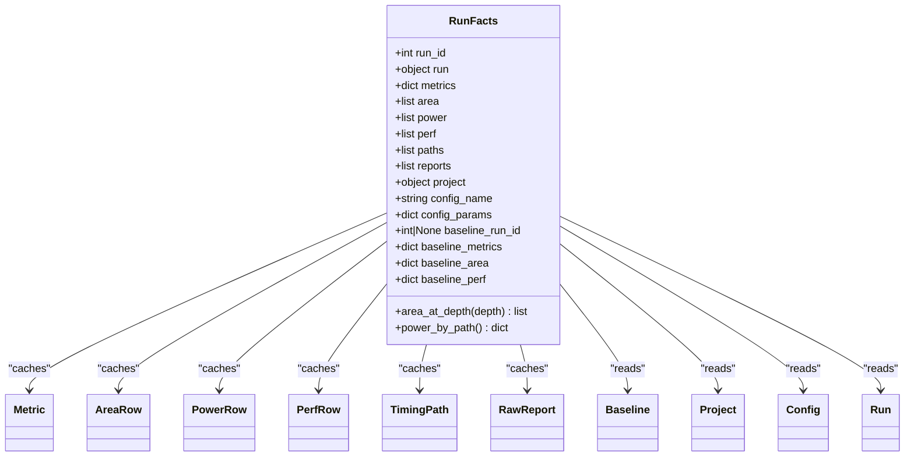
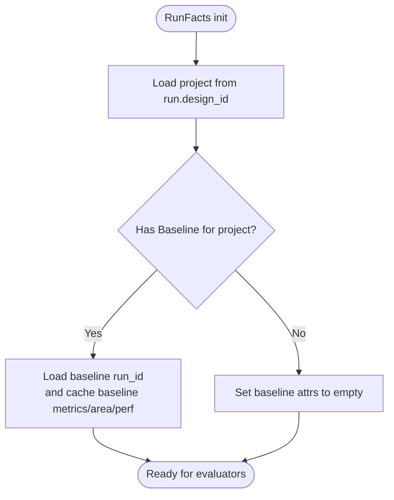
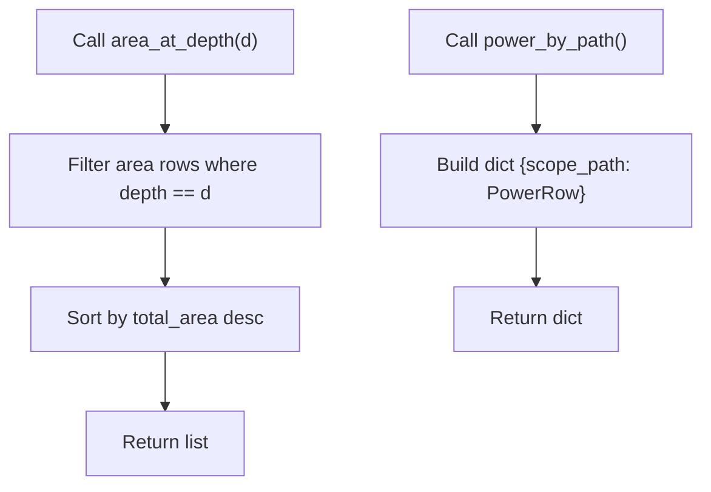
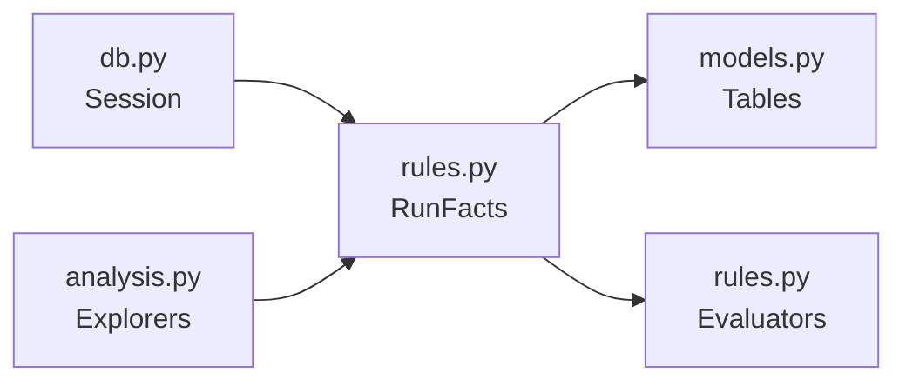

# Run Facts & Context Management

<cite>
**Referenced Files in This Document**
- [rules.py](file://backend/ppa/rules.py)
- [models.py](file://backend/ppa/models.py)
- [analysis.py](file://backend/ppa/analysis.py)
- [db.py](file://backend/ppa/db.py)
- [rules_pack.yaml](file://backend/ppa/rules_pack.yaml)
</cite>

## Table of Contents
1. [Introduction](#introduction)
2. [Project Structure](#project-structure)
3. [Core Components](#core-components)
4. [Architecture Overview](#architecture-overview)
5. [Detailed Component Analysis](#detailed-component-analysis)
6. [Dependency Analysis](#dependency-analysis)
7. [Performance Considerations](#performance-considerations)
8. [Troubleshooting Guide](#troubleshooting-guide)
9. [Conclusion](#conclusion)

## Introduction
This document explains the RunFacts class and its role as a centralized, precomputed context for rule evaluators. It details how RunFacts loads all data required by rules for a single run (metrics, area rows, power rows, performance rows, timing paths, raw reports), how baseline context is identified and cached for comparisons, and how helper methods provide efficient access to subsets of data. It also documents the relationship between RunFacts and the database session, usage patterns for rule evaluators, and performance considerations around caching and query strategies.

## Project Structure
The RunFacts implementation lives in the rule engine module and interacts with domain models and analysis utilities:
- Rule engine and evaluator definitions: backend/ppa/rules.py
- Data models (tables): backend/ppa/models.py
- Analysis layer that uses RunFacts and provides higher-level views: backend/ppa/analysis.py
- Database engine/session management: backend/ppa/db.py
- Rule pack configuration: backend/ppa/rules_pack.yaml

**Diagram sources**
- [rules.py:24-79](file://backend/ppa/rules.py#L24-L79)
- [models.py:55-166](file://backend/ppa/models.py#L55-L166)
- [analysis.py:279-326](file://backend/ppa/analysis.py#L279-L326)
- [db.py:13-49](file://backend/ppa/db.py#L13-L49)

**Section sources**
- [rules.py:24-79](file://backend/ppa/rules.py#L24-L79)
- [models.py:55-166](file://backend/ppa/models.py#L55-L166)
- [analysis.py:279-326](file://backend/ppa/analysis.py#L279-L326)
- [db.py:13-49](file://backend/ppa/db.py#L13-L49)

## Core Components
- RunFacts: Precomputes and caches all data needed by rule evaluators for a given run, including metrics, area/power/perf/timing/report rows, project/config info, and baseline context.
- Evaluators: Pure-Python functions that consume RunFacts and return findings based on thresholds defined in the rule pack.
- Baseline context: Identified via the Baseline table per project; RunFacts caches baseline metrics, area, and performance for fast comparison.
- Helper methods: area_at_depth() and power_by_path() provide efficient, reusable access patterns used across evaluators.

Key responsibilities:
- Load run metadata and related entities once per run.
- Build lookup structures for fast evaluation (e.g., dicts keyed by scope_path or benchmark).
- Provide sorted, filtered views (e.g., area at a specific depth).
- Expose baseline data when available for comparative rules.

**Section sources**
- [rules.py:24-79](file://backend/ppa/rules.py#L24-L79)
- [rules.py:74-79](file://backend/ppa/rules.py#L74-L79)
- [rules.py:125-266](file://backend/ppa/rules.py#L125-L266)
- [models.py:55-166](file://backend/ppa/models.py#L55-L166)

## Architecture Overview
RunFacts acts as an in-memory snapshot of all data relevant to a run. The rule engine constructs one instance per run and passes it to each evaluator. This avoids repeated queries and ensures consistent data during a single evaluation pass.

**Diagram sources**
- [rules.py:24-79](file://backend/ppa/rules.py#L24-L79)
- [db.py:47-49](file://backend/ppa/db.py#L47-L49)
- [models.py:55-166](file://backend/ppa/models.py#L55-L166)

## Detailed Component Analysis

### RunFats Class: Data Loading and Caching
RunFacts constructor performs a single-pass load of all data needed by evaluators:
- Loads the Run object and derives project/config context.
- Builds a metrics dictionary keyed by metric key for O(1) lookups.
- Loads lists of area, power, perf, timing path, and report rows.
- Identifies baseline run for the project and caches baseline metrics, area, and performance as dictionaries keyed by scope_path or benchmark for fast comparisons.

Helper methods:
- area_at_depth(depth): returns area rows at a given depth, sorted by total_area descending. Used to quickly identify top modules at a chosen hierarchy level.
- power_by_path(): returns a dict mapping scope_path to PowerRow for O(1) power lookups by module.

These helpers are used extensively by evaluators to avoid repeated filtering and sorting.

**Diagram sources**
- [rules.py:24-79](file://backend/ppa/rules.py#L24-L79)
- [models.py:55-166](file://backend/ppa/models.py#L55-L166)

**Section sources**
- [rules.py:24-79](file://backend/ppa/rules.py#L24-L79)
- [rules.py:74-79](file://backend/ppa/rules.py#L74-L79)

### Baseline Context Management
Baseline identification:
- If a project has a Baseline entry pointing to another run, RunFacts sets baseline_run_id and preloads baseline metrics, area, and performance into dedicated attributes.
- If no baseline exists or the baseline equals the current run, baseline attributes are empty dicts.

Comparison usage:
- Many evaluators compare current metrics against baseline values (e.g., area growth, performance regressions, ROI checks).
- Using preloaded baseline dicts avoids repeated queries and ensures consistent comparisons within a run’s evaluation pass.

**Diagram sources**
- [rules.py:40-72](file://backend/ppa/rules.py#L40-L72)

**Section sources**
- [rules.py:40-72](file://backend/ppa/rules.py#L40-L72)

### Helper Methods: Efficient Data Access
- area_at_depth(depth): Filters area rows by depth and sorts by total_area descending. Useful for identifying top modules at a specific hierarchy level without recomputing filters.
- power_by_path(): Builds a dict mapping scope_path to PowerRow for O(1) power lookups by module.

Usage examples in evaluators:
- Power density calculation iterates area rows at depth 2 and looks up corresponding power rows via power_by_path().
- Area growth checks iterate top modules at depth 2 and compare with baseline_area by scope_path.

**Diagram sources**
- [rules.py:74-79](file://backend/ppa/rules.py#L74-L79)

**Section sources**
- [rules.py:74-79](file://backend/ppa/rules.py#L74-L79)

### Relationship Between RunFacts and Database Session
- RunFacts receives a SQLModel Session and executes multiple SELECT statements to populate its caches.
- All reads are scoped to the provided session; changes made outside the session are not visible unless the session is refreshed.
- The rule engine creates one RunFacts per run and reuses it across all evaluators, minimizing session round-trips.

Best practices:
- Keep the session open for the duration of the evaluation pass.
- Avoid long-lived RunFacts instances beyond a single evaluation to prevent stale data.

**Section sources**
- [rules.py:24-79](file://backend/ppa/rules.py#L24-L79)
- [db.py:47-49](file://backend/ppa/db.py#L47-L49)

### Example Usage Patterns in Rule Evaluators
Below are representative patterns showing how evaluators access different data types through RunFacts. These illustrate common idioms rather than exact code.

- Accessing metrics:
  - Retrieve a metric by key from f.metrics (e.g., timing.wns_ns, power.total_mw).
  - Use defaults when keys may be missing.

- Accessing area and power by module:
  - Iterate f.area_at_depth(2) to get top modules at a specific depth.
  - Use f.power_by_path()[scope_path] to fetch corresponding power row.

- Comparing against baseline:
  - Compare f.metrics[key] vs f.baseline_metrics[key].
  - Compare f.area entries vs f.baseline_area[scope_path].
  - Compare perf rows by benchmark using f.perf and f.baseline_perf[benchmark].

- Inspecting raw reports:
  - Iterate f.reports to check kinds present or parse statuses.

These patterns appear throughout the evaluator implementations and demonstrate efficient, readable access to precomputed data.

**Section sources**
- [rules.py:84-287](file://backend/ppa/rules.py#L84-L287)

## Dependency Analysis
RunFacts depends on:
- Models: Run, Metric, AreaRow, PowerRow, PerfRow, TimingPath, RawReport, Baseline, Project, Config.
- Session: Provided by db.get_session() or passed explicitly.

Other components depend on RunFacts:
- Evaluators in rules.py use RunFacts to compute findings.
- analysis.py uses RunFacts in several explorers (timing_explorer, hotspot) to build summaries and leaderboards.

**Diagram sources**
- [db.py:47-49](file://backend/ppa/db.py#L47-L49)
- [rules.py:24-79](file://backend/ppa/rules.py#L24-L79)
- [analysis.py:279-326](file://backend/ppa/analysis.py#L279-L326)

**Section sources**
- [rules.py:24-79](file://backend/ppa/rules.py#L24-L79)
- [analysis.py:279-326](file://backend/ppa/analysis.py#L279-L326)

## Performance Considerations
- Single-pass loading: RunFacts loads all necessary tables once per run, reducing repeated queries.
- Dictionary caches: Metrics, baseline metrics, baseline area, and baseline perf are stored as dicts for O(1) lookups.
- Sorted views: area_at_depth() returns pre-sorted lists to avoid repeated sorting in evaluators.
- Minimal overhead: The cost is proportional to the size of the run’s data; suitable for tens of runs as noted in the DB module.
- Session reuse: Reusing a single session per evaluation pass reduces connection overhead and ensures consistency.

Optimization opportunities:
- For very large runs, consider lazy-loading heavy datasets (e.g., timing paths) only when needed by specific evaluators.
- Cache derived aggregates (e.g., top modules by area/power) if many evaluators repeatedly compute them.

[No sources needed since this section provides general guidance]

## Troubleshooting Guide
Common issues and diagnostics:
- Missing baseline:
  - If baseline_run_id is None or baseline_* dicts are empty, comparative rules will skip or produce no findings. Verify Baseline table entries for the project.
- Empty or incomplete data:
  - If metrics or rows are missing, ensure ingestion completed successfully and that reports were parsed without errors.
- Stale data:
  - Ensure the session remains valid during evaluation and that RunFacts is constructed after any updates to the database.

Where to look:
- Baseline setup and retrieval: [rules.py:40-72](file://backend/ppa/rules.py#L40-L72)
- Report parsing status: [models.py:69-79](file://backend/ppa/models.py#L69-L79)
- Session lifecycle: [db.py:47-49](file://backend/ppa/db.py#L47-L49)

**Section sources**
- [rules.py:40-72](file://backend/ppa/rules.py#L40-L72)
- [models.py:69-79](file://backend/ppa/models.py#L69-L79)
- [db.py:47-49](file://backend/ppa/db.py#L47-L49)

## Conclusion
RunFacts centralizes and precomputes all data required by rule evaluators for a run, enabling fast, deterministic diagnosis. Its baseline context management supports meaningful comparisons across runs, while helper methods provide efficient access patterns. By coupling with a shared database session and leveraging in-memory caches, the system balances performance and correctness for typical workloads.

[No sources needed since this section summarizes without analyzing specific files]