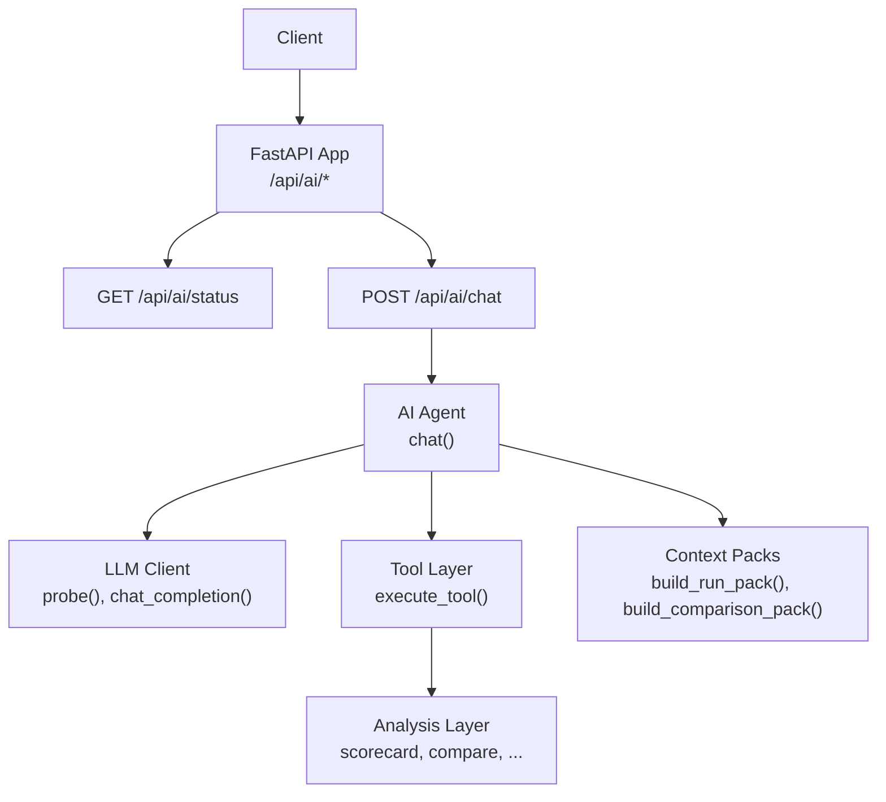
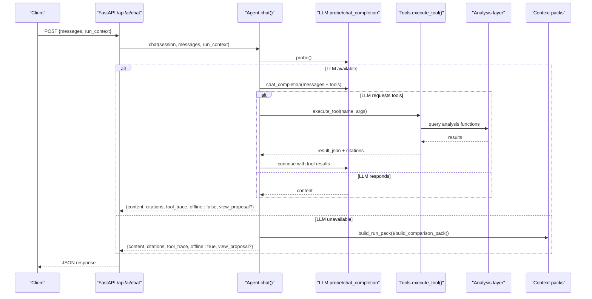
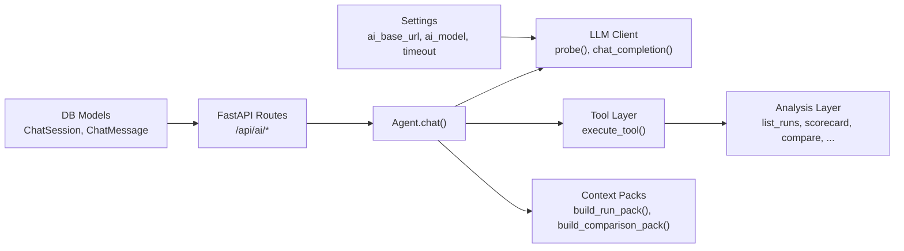

# AI Chat API

<cite>
**Referenced Files in This Document**
- [main.py](file://backend/ppa/main.py)
- [agent.py](file://backend/ppa/ai/agent.py)
- [llm.py](file://backend/ppa/ai/llm.py)
- [tools.py](file://backend/ppa/ai/tools.py)
- [context_pack.py](file://backend/ppa/ai/context_pack.py)
- [analysis.py](file://backend/ppa/analysis.py)
- [config.py](file://backend/ppa/config.py)
- [models.py](file://backend/ppa/models.py)
</cite>

## Table of Contents
1. [Introduction](#introduction)
2. [Project Structure](#project-structure)
3. [Core Components](#core-components)
4. [Architecture Overview](#architecture-overview)
5. [Detailed Component Analysis](#detailed-component-analysis)
6. [Dependency Analysis](#dependency-analysis)
7. [Performance Considerations](#performance-considerations)
8. [Troubleshooting Guide](#troubleshooting-guide)
9. [Conclusion](#conclusion)
10. [Appendices](#appendices)

## Introduction
This document provides detailed API documentation for the AI chat endpoints that power natural language queries over PPA (Power, Performance, Area) analysis data. It covers:
- GET /api/ai/status to check LLM availability and configuration
- POST /api/ai/chat for conversational analysis with message history, run context, tool execution traces, and citations
It also explains how message history is handled, how run context integrates into responses, how tools are executed deterministically, and how citations and view proposals help interpret AI answers.

## Project Structure
The AI chat functionality is implemented as a FastAPI application with two primary endpoints under /api/ai. The backend orchestrates an agent that can call typed tools against deterministic analysis functions, optionally backed by an on-prem LLM endpoint (e.g., Ollama or vLLM). If the LLM is unavailable, a deterministic offline analyst returns structured answers from precomputed context packs.

**Diagram sources**
- [main.py:167-194](file://backend/ppa/main.py#L167-L194)
- [agent.py:51-123](file://backend/ppa/ai/agent.py#L51-L123)
- [llm.py:15-67](file://backend/ppa/ai/llm.py#L15-L67)
- [tools.py:171-265](file://backend/ppa/ai/tools.py#L171-L265)
- [context_pack.py:11-82](file://backend/ppa/ai/context_pack.py#L11-L82)
- [analysis.py:46-200](file://backend/ppa/analysis.py#L46-L200)

**Section sources**
- [main.py:167-194](file://backend/ppa/main.py#L167-L194)
- [config.py:12-27](file://backend/ppa/config.py#L12-L27)

## Core Components
- AI status endpoint: Returns LLM availability, configured model, discovered models, and any error details.
- AI chat endpoint: Accepts messages and optional run_context; returns content, citations, tool_trace, offline flag, and optional view_proposal.
- Agent: Manages conversation rounds, tool selection, and fallback to offline mode when LLM is unavailable.
- Tool layer: Typed, read-only functions over analysis with strict schemas and result clipping for safety.
- Context packs: Compact, deterministic summaries of runs and comparisons used by both tools and offline analyst.
- LLM client: Thin OpenAI-compatible HTTP wrapper for local endpoints like Ollama or vLLM.

**Section sources**
- [main.py:167-194](file://backend/ppa/main.py#L167-L194)
- [agent.py:51-123](file://backend/ppa/ai/agent.py#L51-L123)
- [tools.py:17-163](file://backend/ppa/ai/tools.py#L17-L163)
- [context_pack.py:11-82](file://backend/ppa/ai/context_pack.py#L11-L82)
- [llm.py:15-67](file://backend/ppa/ai/llm.py#L15-L67)

## Architecture Overview
The AI chat flow supports two modes:
- Online mode: The agent calls an LLM with tool definitions; the LLM decides whether to respond directly or invoke tools. Each tool call executes deterministic analysis and returns results with citations.
- Offline mode: When the LLM is unreachable, the agent uses a deterministic offline analyst that builds answers from context packs and rule engine findings.

**Diagram sources**
- [main.py:177-194](file://backend/ppa/main.py#L177-L194)
- [agent.py:51-123](file://backend/ppa/ai/agent.py#L51-L123)
- [llm.py:15-67](file://backend/ppa/ai/llm.py#L15-L67)
- [tools.py:171-265](file://backend/ppa/ai/tools.py#L171-L265)
- [context_pack.py:11-82](file://backend/ppa/ai/context_pack.py#L11-L82)
- [analysis.py:46-200](file://backend/ppa/analysis.py#L46-L200)

## Detailed Component Analysis

### GET /api/ai/status
Checks whether the configured LLM endpoint is reachable and which models are available.

- Method: GET
- Path: /api/ai/status
- Request: None
- Response fields:
  - available: boolean indicating reachability
  - models: list of discovered model identifiers
  - target_model: resolved model name
  - model_found: whether the configured model was found
  - configured_model: the configured model string
  - error: present if probe failed

Notes:
- Uses the LLM client’s probe function to query the endpoint’s /models.
- Falls back gracefully if the configured model is missing but another model is available.

Example usage:
- Call before starting a chat session to decide whether to show “online” or “offline” indicators.

**Section sources**
- [main.py:167-169](file://backend/ppa/main.py#L167-L169)
- [llm.py:46-67](file://backend/ppa/ai/llm.py#L46-L67)
- [config.py:17-22](file://backend/ppa/config.py#L17-L22)

### POST /api/ai/chat
Handles natural language queries with optional run context and persists lightweight session logs.

- Method: POST
- Path: /api/ai/chat
- Request body:
  - messages: array of message objects with role and content; only user and assistant roles are forwarded to the LLM; non-user/assistant entries are ignored.
  - run_context: optional dict describing current UI context (e.g., selected run_id); injected as system context to guide answers.
- Response fields:
  - content: human-readable answer text
  - citations: array of citation objects linking statements to source runs or reports
  - tool_trace: array of tool invocation records (tool name, arguments, result size)
  - offline: boolean indicating whether the answer came from the offline analyst
  - view_proposal: optional object suggesting a UI navigation action (e.g., open Compare view)

Behavior:
- Builds a conversation including a system prompt and optional run_context.
- Iteratively calls the LLM up to a configured maximum number of tool rounds.
- Executes tools deterministically via the tool layer; captures citations and traces.
- If LLM is unavailable at any point, falls back to offline analyst using context packs.
- Persists the last user message and assistant reply (including tool_trace and citations) to the database.

Message history handling:
- Only messages with role "user" or "assistant" are included in the LLM conversation.
- Messages marked as offline are excluded from the LLM input to avoid duplication.

Run context integration:
- If provided, run_context is serialized and appended as a system message so the LLM knows what the user is currently viewing.

Tool execution traces:
- Each tool call is recorded with its name, arguments, and result length.
- Errors during tool execution are captured and fed back to the LLM to enable self-correction.

Citation system:
- Every tool call appends citations that reference the originating run or report.
- Citations travel with each tool result and are returned in the final response.

View proposals:
- Some tools may return a view_proposal embedded in their result; the agent extracts it and includes it in the response to enable one-click navigation in the UI.

Examples of effective prompts:
- Ask for a comparison between two runs by mentioning both labels or IDs.
- Request breakdowns of area or power for a specific run.
- Ask for worst timing paths filtered by module substring.
- Request Pareto frontier across runs for two metrics.

Context passing examples:
- Include run_context with run_id to focus answers on the current run.
- For comparisons, pass multiple run_ids in get_context_pack or compare_runs via tools.

Interpreting AI responses with tool usage details:
- Use tool_trace to see which tools were called and with what arguments.
- Use citations to verify where numbers came from (run label, source type).
- Use view_proposal to navigate to relevant views (e.g., compare, scorecard, findings).

Persistence:
- Each chat creates a ChatSession and stores the last user message and assistant reply with tool_trace and citations for auditability.

**Section sources**
- [main.py:172-194](file://backend/ppa/main.py#L172-L194)
- [agent.py:51-123](file://backend/ppa/ai/agent.py#L51-L123)
- [tools.py:171-265](file://backend/ppa/ai/tools.py#L171-L265)
- [context_pack.py:11-82](file://backend/ppa/ai/context_pack.py#L11-L82)
- [models.py:192-207](file://backend/ppa/models.py#L192-L207)

### Tool Layer Details
The tool layer exposes typed, read-only operations over the analysis layer. Each tool has a Pydantic schema defining parameters and constraints. Results are clipped to a safe byte size to prevent oversized payloads.

Available tools:
- list_runs: Lists ingested runs with headline figures of merit.
- get_context_pack: Returns a compact digest for one run or a two-run comparison.
- compare_runs: Deterministic comparison with config diff, FOM deltas, decomposition, and waterfalls.
- breakdown: Hierarchical area or power breakdown per module with shares.
- timing_paths: Worst setup timing paths, optionally filtered by module substring.
- perf_scores: Per-benchmark SPECint IPC and ratios with baseline deltas.
- pareto: Pareto frontier across runs for two chosen metrics.
- get_findings: Rule-engine findings with optional filters by severity/category/run.
- propose_view: Suggests UI navigation to a specific view with configuration.

Each tool appends citations referencing the run(s) or report(s) used.

**Section sources**
- [tools.py:17-163](file://backend/ppa/ai/tools.py#L17-L163)
- [tools.py:171-265](file://backend/ppa/ai/tools.py#L171-L265)

### Context Packs
Context packs provide deterministic, LLM-friendly digests built from analysis functions without SQL or arithmetic in the model.

- build_run_pack: Summarizes a single run with figures of merit, domain summaries, top modules, worst timing paths, per-benchmark scores, and open findings.
- build_comparison_pack: Summarizes comparisons between runs with config diffs, key deltas, and top waterfalls.

These packs power both the tool layer and the offline analyst.

**Section sources**
- [context_pack.py:11-82](file://backend/ppa/ai/context_pack.py#L11-L82)
- [analysis.py:46-200](file://backend/ppa/analysis.py#L46-L200)

### Offline Analyst
When the LLM is unavailable, the offline analyst constructs answers deterministically from context packs and rule engine findings. It recognizes common question patterns (e.g., comparisons, findings, overview) and returns concise, verifiable answers with citations and view proposals.

**Section sources**
- [agent.py:128-239](file://backend/ppa/ai/agent.py#L128-L239)
- [context_pack.py:11-82](file://backend/ppa/ai/context_pack.py#L11-L82)

## Dependency Analysis
The AI chat endpoints depend on several layers:
- FastAPI routes define /api/ai/status and /api/ai/chat.
- The agent coordinates LLM calls and tool execution.
- The tool layer validates inputs and delegates to analysis functions.
- The analysis layer reads from the database and computes metrics.
- Context packs aggregate analysis outputs into compact structures.
- Configuration controls LLM endpoint settings and timeouts.

**Diagram sources**
- [main.py:167-194](file://backend/ppa/main.py#L167-L194)
- [agent.py:51-123](file://backend/ppa/ai/agent.py#L51-L123)
- [llm.py:15-67](file://backend/ppa/ai/llm.py#L15-L67)
- [tools.py:171-265](file://backend/ppa/ai/tools.py#L171-L265)
- [context_pack.py:11-82](file://backend/ppa/ai/context_pack.py#L11-L82)
- [analysis.py:46-200](file://backend/ppa/analysis.py#L46-L200)
- [config.py:12-27](file://backend/ppa/config.py#L12-L27)
- [models.py:192-207](file://backend/ppa/models.py#L192-L207)

**Section sources**
- [main.py:167-194](file://backend/ppa/main.py#L167-L194)
- [agent.py:51-123](file://backend/ppa/ai/agent.py#L51-L123)
- [tools.py:171-265](file://backend/ppa/ai/tools.py#L171-L265)
- [context_pack.py:11-82](file://backend/ppa/ai/context_pack.py#L11-L82)
- [analysis.py:46-200](file://backend/ppa/analysis.py#L46-L200)
- [config.py:12-27](file://backend/ppa/config.py#L12-L27)
- [models.py:192-207](file://backend/ppa/models.py#L192-L207)

## Performance Considerations
- Tool result clipping: Responses are truncated to a safe byte limit to avoid large payloads.
- Maximum tool rounds: The agent limits iterative tool calls to a configurable maximum to prevent runaway loops.
- LLM timeouts: Requests use a configurable timeout to fail fast when the endpoint is slow or unresponsive.
- Deterministic analysis: All computations occur in Python via the analysis layer, ensuring reproducibility and avoiding model-induced arithmetic errors.
- Database access: Tools read from the database through the analysis layer; ensure indexes exist on frequently queried columns (e.g., run_id, scope_path).

[No sources needed since this section provides general guidance]

## Troubleshooting Guide
Common issues and resolutions:
- LLM unavailable:
  - Check the configured base URL and model name.
  - Verify the endpoint is reachable and returns a valid /models list.
  - The status endpoint will indicate availability and any error details.
- No runs ingested:
  - The offline analyst will inform you to ingest data first.
  - Ensure the ingestion process has completed successfully.
- Unexpected tool errors:
  - Inspect tool_trace for the failing tool and arguments.
  - Errors are captured and fed back to the LLM; review citations to identify problematic runs.
- Large responses:
  - Tool results are clipped; if you need more detail, refine your query or use specific tools (e.g., breakdown, timing_paths) with appropriate filters.

**Section sources**
- [llm.py:46-67](file://backend/ppa/ai/llm.py#L46-L67)
- [agent.py:128-239](file://backend/ppa/ai/agent.py#L128-L239)
- [tools.py:166-168](file://backend/ppa/ai/tools.py#L166-L168)
- [main.py:167-194](file://backend/ppa/main.py#L167-L194)

## Conclusion
The AI chat API provides a robust, deterministic interface for natural language analysis over PPA data. It combines flexible LLM-powered conversations with strict tool-based verification and citations, while offering a reliable offline mode when the LLM is unavailable. Use the status endpoint to monitor LLM health, and leverage the chat endpoint with clear prompts and run context to obtain actionable insights with traceable evidence.

[No sources needed since this section summarizes without analyzing specific files]

## Appendices

### Message Formats
- messages: Array of objects with role ("user" or "assistant") and content (string). Only these roles are forwarded to the LLM.
- run_context: Optional dictionary describing current UI context (e.g., run_id). Injected as system context to guide answers.

**Section sources**
- [main.py:172-179](file://backend/ppa/main.py#L172-L179)
- [agent.py:59-65](file://backend/ppa/ai/agent.py#L59-L65)

### Response Structures
- content: Human-readable answer text.
- citations: Array of objects with run_id, run_label, and source (e.g., "comparison", "context pack", "rule engine").
- tool_trace: Array of objects with tool name, arguments, and result_bytes.
- offline: Boolean indicating offline analyst mode.
- view_proposal: Optional object with view name and parameters (e.g., run_id, run_ids).

**Section sources**
- [agent.py:51-123](file://backend/ppa/ai/agent.py#L51-L123)
- [tools.py:171-265](file://backend/ppa/ai/tools.py#L171-L265)
- [models.py:192-207](file://backend/ppa/models.py#L192-L207)

### Effective Prompts and Context Passing
- Comparison prompts: Mention both run labels or IDs to trigger compare_runs or get_context_pack with two run_ids.
- Breakdown prompts: Specify kind ("area" or "power") and run_id for hierarchical breakdowns.
- Timing prompts: Provide run_id and optional module_contains to filter worst timing paths.
- Performance prompts: Provide run_id to retrieve per-benchmark IPC and ratios.
- Pareto prompts: Choose x and y metrics to explore trade-offs across runs.
- Findings prompts: Filter by severity or category to focus on specific issues.

**Section sources**
- [tools.py:17-163](file://backend/ppa/ai/tools.py#L17-L163)
- [context_pack.py:11-82](file://backend/ppa/ai/context_pack.py#L11-L82)

### Interpreting Tool Usage Details
- Review tool_trace to understand which tools were invoked and with what arguments.
- Use citations to trace back to the original run or report for each claim.
- Leverage view_proposal to navigate directly to relevant UI views for deeper exploration.

**Section sources**
- [agent.py:87-123](file://backend/ppa/ai/agent.py#L87-L123)
- [tools.py:171-265](file://backend/ppa/ai/tools.py#L171-L265)