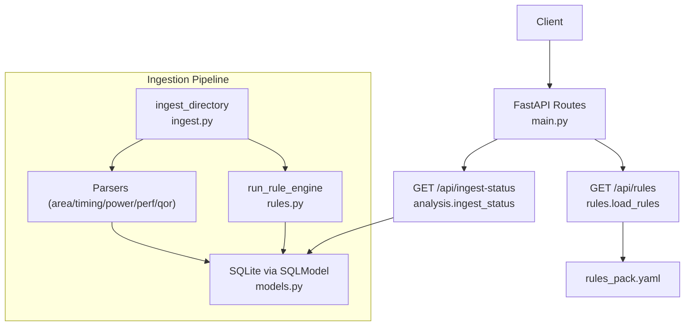
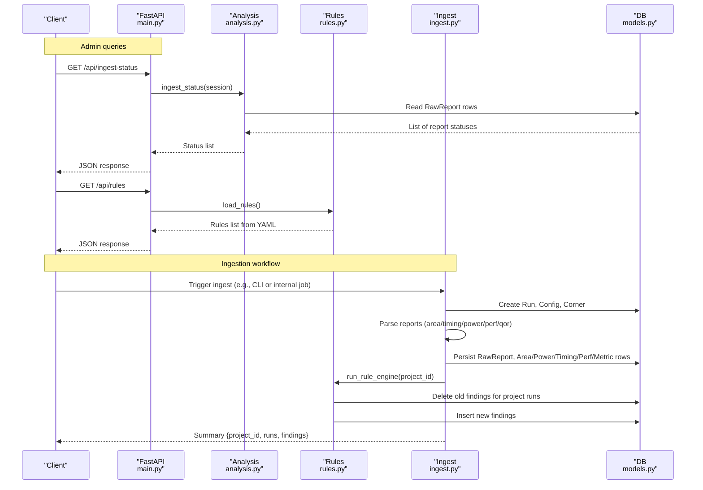
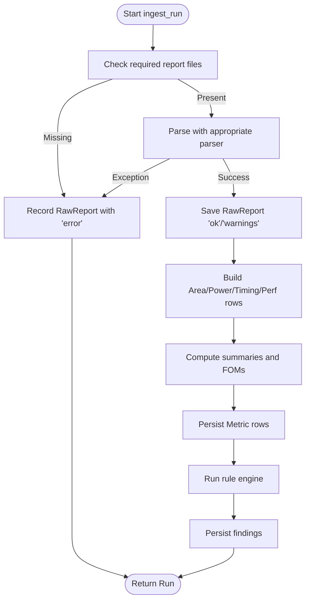
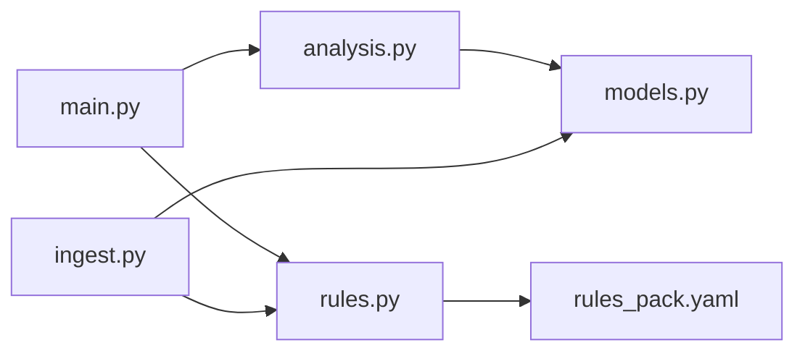

# Admin & Ingestion API

<cite>
**Referenced Files in This Document**
- [main.py](file://backend/ppa/main.py)
- [analysis.py](file://backend/ppa/analysis.py)
- [ingest.py](file://backend/ppa/ingest.py)
- [rules.py](file://backend/ppa/rules.py)
- [rules_pack.yaml](file://backend/ppa/rules_pack.yaml)
- [models.py](file://backend/ppa/models.py)
- [config.py](file://backend/ppa/config.py)
</cite>

## Table of Contents
1. [Introduction](#introduction)
2. [Project Structure](#project-structure)
3. [Core Components](#core-components)
4. [Architecture Overview](#architecture-overview)
5. [Detailed Component Analysis](#detailed-component-analysis)
6. [Dependency Analysis](#dependency-analysis)
7. [Performance Considerations](#performance-considerations)
8. [Troubleshooting Guide](#troubleshooting-guide)
9. [Conclusion](#conclusion)

## Introduction
This document provides API documentation for administrative endpoints that support ingestion monitoring and rule management:
- GET /api/ingest-status: Reports ingestion pipeline status, including per-report parse outcomes, progress indicators, and error logs.
- GET /api/rules: Returns the current rule pack used by the deterministic rule engine for generating findings.

It also explains how ingestion works end-to-end, how progress and errors are tracked, and how rules are loaded, validated, and applied to runs.

## Project Structure
The backend is a FastAPI application with:
- API routes defined in main.py
- Query/analysis logic in analysis.py
- Ingestion pipeline in ingest.py
- Rule engine and rule pack in rules.py and rules_pack.yaml
- Data models in models.py
- Application settings in config.py

**Diagram sources**
- [main.py:154-162](file://backend/ppa/main.py#L154-L162)
- [analysis.py:428-438](file://backend/ppa/analysis.py#L428-L438)
- [rules.py:19-21](file://backend/ppa/rules.py#L19-L21)
- [ingest.py:267-311](file://backend/ppa/ingest.py#L267-L311)
- [models.py:69-78](file://backend/ppa/models.py#L69-L78)

**Section sources**
- [main.py:154-162](file://backend/ppa/main.py#L154-L162)
- [analysis.py:428-438](file://backend/ppa/analysis.py#L428-L438)
- [rules.py:19-21](file://backend/ppa/rules.py#L19-L21)
- [ingest.py:267-311](file://backend/ppa/ingest.py#L267-L311)
- [models.py:69-78](file://backend/ppa/models.py#L69-L78)

## Core Components
- Ingest Status endpoint: Aggregates RawReport records to show each report’s kind, file path, parser version, parse status, and truncated log.
- Rules endpoint: Loads the YAML rule pack and returns the list of rules.
- Ingestion pipeline: Parses multiple report types per run, persists metrics and raw reports, computes derived metrics, and runs the rule engine to generate findings.

Key behaviors:
- Each parsed report is recorded with checksums, parser version, and parse status to detect tool upgrades or parsing issues.
- The rule engine evaluates configured rules against run metrics and produces findings stored in the database.

**Section sources**
- [analysis.py:428-438](file://backend/ppa/analysis.py#L428-L438)
- [rules.py:19-21](file://backend/ppa/rules.py#L19-L21)
- [ingest.py:25-31](file://backend/ppa/ingest.py#L25-L31)
- [ingest.py:93-113](file://backend/ppa/ingest.py#L93-L113)
- [ingest.py:309-311](file://backend/ppa/ingest.py#L309-L311)

## Architecture Overview
The admin APIs expose read-only views over ingestion state and rule configuration. The ingestion pipeline writes detailed observability data (RawReport) and triggers rule evaluation to produce actionable findings.

**Diagram sources**
- [main.py:154-162](file://backend/ppa/main.py#L154-L162)
- [analysis.py:428-438](file://backend/ppa/analysis.py#L428-L438)
- [rules.py:19-21](file://backend/ppa/rules.py#L19-L21)
- [ingest.py:61-240](file://backend/ppa/ingest.py#L61-L240)
- [ingest.py:267-311](file://backend/ppa/ingest.py#L267-L311)
- [rules.py:313-352](file://backend/ppa/rules.py#L313-L352)
- [models.py:55-78](file://backend/ppa/models.py#L55-L78)

## Detailed Component Analysis

### Endpoint: GET /api/ingest-status
Purpose:
- Provide an overview of ingestion results across all runs, including parse success/failure and logs.

Response fields (per record):
- run_id: integer
- run_label: string
- kind: one of rtla_area, rtla_timing, rtla_qor, primepower, specint
- file: absolute path to the report file
- sha256: first 12 characters of the file’s SHA-256
- parser_version: string indicating parser version
- status: ok | warnings | error
- log: truncated parse log (up to 500 characters)

Behavior:
- Reads all RawReport entries and joins with Run to include labels.
- Useful for detecting missing files, parser errors, and warning counts.

Error handling:
- If no reports exist, returns an empty list.
- Errors during ingestion are captured per report and surfaced here.

**Section sources**
- [main.py:154-156](file://backend/ppa/main.py#L154-L156)
- [analysis.py:428-438](file://backend/ppa/analysis.py#L428-L438)
- [models.py:69-78](file://backend/ppa/models.py#L69-L78)

### Endpoint: GET /api/rules
Purpose:
- Return the active rule pack used by the rule engine.

Response:
- Array of rule objects, each containing id, category, severity, title, and params.

Behavior:
- Loads rules_pack.yaml at request time.
- Changes to the YAML file are reflected immediately on subsequent requests.

Validation notes:
- Unknown rule ids are ignored by the engine; only known evaluators are executed.
- Titles may use placeholders filled at runtime with evidence values.

**Section sources**
- [main.py:159-162](file://backend/ppa/main.py#L159-L162)
- [rules.py:19-21](file://backend/ppa/rules.py#L19-L21)
- [rules_pack.yaml:1-119](file://backend/ppa/rules_pack.yaml#L1-L119)

### Ingestion Pipeline: Progress Tracking and Error Reporting
Progress tracking:
- For each run, the pipeline creates a Run record and processes report types listed in REPORT_SPECS.
- Each report is persisted as RawReport with parse_status and parse_log, enabling granular progress and error inspection via /api/ingest-status.

Error reporting:
- Missing files result in parse_status "error" with a descriptive log.
- Parser exceptions are caught and recorded without aborting other reports.
- Data quality checks (e.g., unmatched power vs area paths) create findings to highlight inconsistencies.

Derived metrics and findings:
- After parsing, the pipeline computes summaries and figures of merit, stores them as Metric rows, and then runs the rule engine to generate findings based on thresholds and comparisons.

**Diagram sources**
- [ingest.py:61-240](file://backend/ppa/ingest.py#L61-L240)
- [ingest.py:93-113](file://backend/ppa/ingest.py#L93-L113)
- [ingest.py:309-311](file://backend/ppa/ingest.py#L309-L311)

**Section sources**
- [ingest.py:25-31](file://backend/ppa/ingest.py#L25-L31)
- [ingest.py:93-113](file://backend/ppa/ingest.py#L93-L113)
- [ingest.py:115-228](file://backend/ppa/ingest.py#L115-L228)
- [ingest.py:267-311](file://backend/ppa/ingest.py#L267-L311)

### Rule Loading Mechanism and Dynamic Updates
Mechanism:
- Rules are loaded from rules_pack.yaml using a dedicated function.
- The rule engine maps rule ids to evaluator functions and executes them with parameters defined in the YAML.

Dynamic updates:
- Since rules are loaded on each request to /api/rules and re-evaluated during ingestion, updating the YAML file changes behavior immediately without code changes.

Rule format specification:
- Each rule includes:
  - id: unique identifier mapped to an evaluator
  - category: grouping tag (timing, area, power, performance, cross_domain, data_quality)
  - severity: critical | high | medium | low | info
  - title: template string with placeholders filled from evidence
  - params: threshold or configuration values consumed by the evaluator

Evaluators:
- Implemented in rules.py under EVALUATORS; unknown ids are skipped safely.

**Section sources**
- [rules.py:19-21](file://backend/ppa/rules.py#L19-L21)
- [rules.py:290-310](file://backend/ppa/rules.py#L290-L310)
- [rules.py:313-352](file://backend/ppa/rules.py#L313-L352)
- [rules_pack.yaml:1-119](file://backend/ppa/rules_pack.yaml#L1-L119)

### Data Model Highlights Relevant to Admin APIs
- RawReport: Tracks per-run report parsing outcomes and logs.
- Run: Represents an ingestion run with label, stage, timestamps, and workdir.
- Finding: Generated by the rule engine with severity, category, scope, and evidence.

These models enable the admin endpoints to present actionable insights into ingestion health and rule-driven diagnostics.

**Section sources**
- [models.py:55-78](file://backend/ppa/models.py#L55-L78)
- [models.py:168-181](file://backend/ppa/models.py#L168-L181)

## Dependency Analysis
- main.py exposes /api/ingest-status and /api/rules, delegating to analysis.py and rules.py respectively.
- analysis.py reads RawReport and related entities from the database to build status responses.
- rules.py loads rules_pack.yaml and provides evaluators invoked by the ingestion pipeline.
- ingest.py orchestrates parsing, metric computation, and rule execution, writing to the database.

**Diagram sources**
- [main.py:154-162](file://backend/ppa/main.py#L154-L162)
- [analysis.py:428-438](file://backend/ppa/analysis.py#L428-L438)
- [rules.py:19-21](file://backend/ppa/rules.py#L19-L21)
- [ingest.py:267-311](file://backend/ppa/ingest.py#L267-L311)
- [models.py:55-78](file://backend/ppa/models.py#L55-L78)

**Section sources**
- [main.py:154-162](file://backend/ppa/main.py#L154-L162)
- [analysis.py:428-438](file://backend/ppa/analysis.py#L428-L438)
- [rules.py:19-21](file://backend/ppa/rules.py#L19-L21)
- [ingest.py:267-311](file://backend/ppa/ingest.py#L267-L311)
- [models.py:55-78](file://backend/ppa/models.py#L55-L78)

## Performance Considerations
- /api/ingest-status performs a full scan of RawReport rows; consider pagination or filtering if datasets grow large.
- /api/rules loads YAML on each request; caching could be introduced if needed.
- Ingestion batches inserts and commits once per run; ensure database size and indexes remain manageable.

[No sources needed since this section provides general guidance]

## Troubleshooting Guide

Common ingestion failures:
- Missing report files:
  - Symptom: RawReport parse_status "error" with log indicating missing file.
  - Action: Ensure all required report files exist in the run directory before ingestion.
- Parser exceptions:
  - Symptom: parse_status "error" with exception message in parse_log.
  - Action: Inspect the offending report content and parser version; update tools or fix malformed inputs.
- Unmatched power vs area paths:
  - Symptom: A finding indicates mismatched hierarchy paths between power and area reports.
  - Action: Align module naming and hierarchy between tools to improve correlation.

Rule validation and application issues:
- Unknown rule id:
  - Behavior: Engine skips unknown ids; verify spelling and presence in EVALUATORS mapping.
- Threshold misconfiguration:
  - Symptom: Unexpected findings or lack thereof after rule changes.
  - Action: Adjust params in rules_pack.yaml and re-run ingestion to apply updated thresholds.

Operational tips:
- Use /api/ingest-status to quickly identify which reports failed and why.
- Use /api/rules to confirm the currently loaded rule set matches expectations.
- Re-run ingestion after modifying rules_pack.yaml to regenerate findings with new thresholds.

**Section sources**
- [ingest.py:93-113](file://backend/ppa/ingest.py#L93-L113)
- [ingest.py:230-239](file://backend/ppa/ingest.py#L230-L239)
- [rules.py:313-352](file://backend/ppa/rules.py#L313-L352)
- [rules_pack.yaml:1-119](file://backend/ppa/rules_pack.yaml#L1-L119)

## Conclusion
The administrative APIs provide essential visibility into ingestion health and rule configuration:
- /api/ingest-status surfaces per-report parse outcomes and logs for rapid diagnosis.
- /api/rules exposes the active rule pack, enabling dynamic tuning without code changes.
- The ingestion pipeline ensures robust error capture, comprehensive metrics, and deterministic findings driven by configurable rules.

Adopt the troubleshooting steps above to resolve ingestion failures and refine rule thresholds for accurate diagnostics.