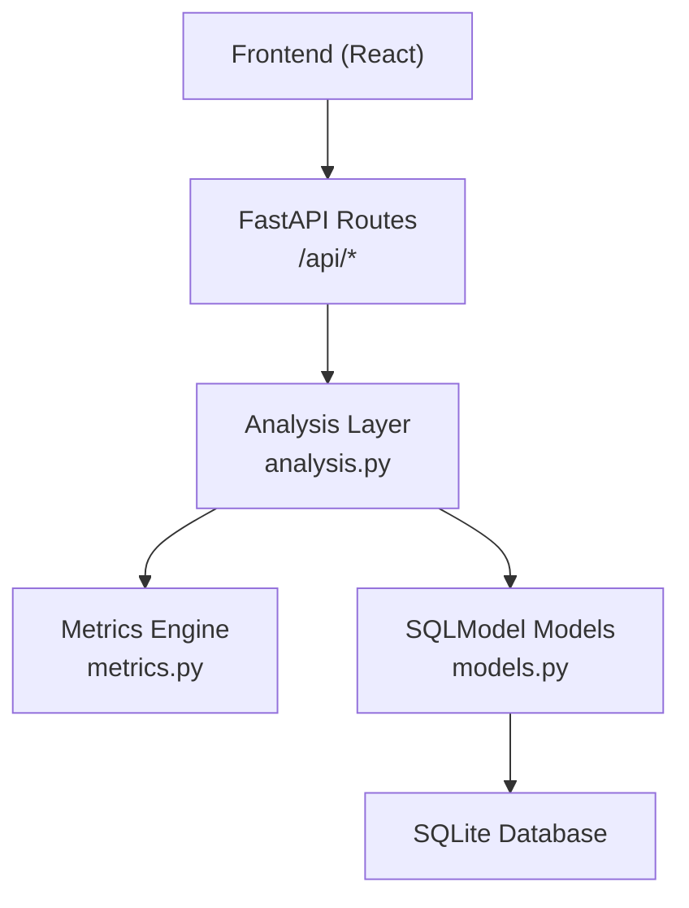
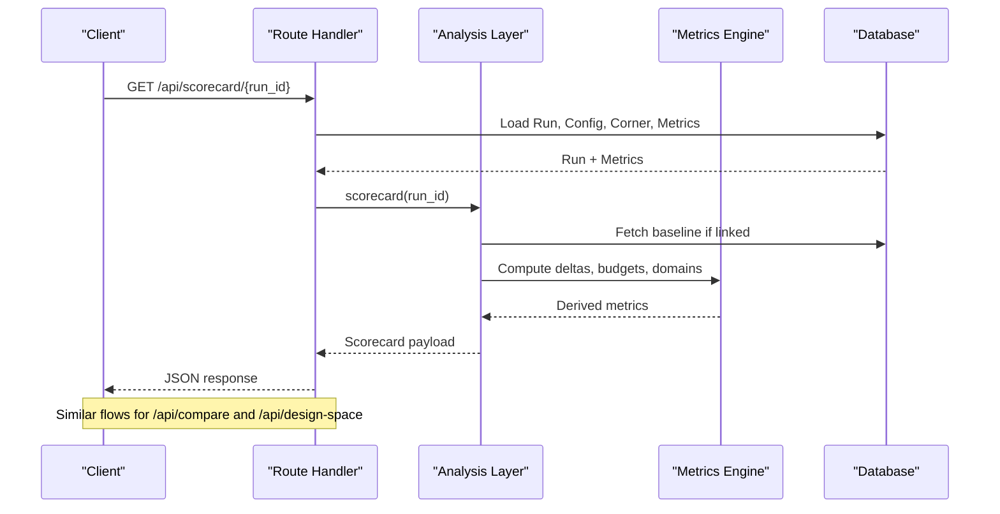
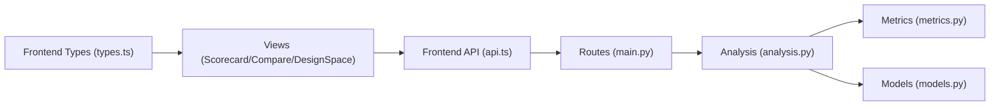

# Analysis Endpoints

<cite>
**Referenced Files in This Document**
- [main.py](file://backend/ppa/main.py)
- [analysis.py](file://backend/ppa/analysis.py)
- [metrics.py](file://backend/ppa/metrics.py)
- [models.py](file://backend/ppa/models.py)
- [api.ts](file://frontend/src/api.ts)
- [types.ts](file://frontend/src/types.ts)
- [Scorecard.tsx](file://frontend/src/views/Scorecard.tsx)
- [Compare.tsx](file://frontend/src/views/Compare.tsx)
- [DesignSpace.tsx](file://frontend/src/views/DesignSpace.tsx)
</cite>

## Table of Contents
1. [Introduction](#introduction)
2. [Project Structure](#project-structure)
3. [Core Components](#core-components)
4. [Architecture Overview](#architecture-overview)
5. [Detailed Component Analysis](#detailed-component-analysis)
6. [Dependency Analysis](#dependency-analysis)
7. [Performance Considerations](#performance-considerations)
8. [Troubleshooting Guide](#troubleshooting-guide)
9. [Conclusion](#conclusion)

## Introduction
This document provides comprehensive API documentation for the analysis endpoints:
- Scorecard: GET /api/scorecard/{run_id}
- Compare: GET /api/compare
- Design Space: GET /api/design-space

It covers parameter validation, response schemas, data aggregation patterns, and how metrics are calculated, normalized, and presented across runs. It also explains multi-run comparisons, delta calculations, and visualization data structures used by the frontend.

## Project Structure
The FastAPI application exposes REST endpoints that delegate to an analysis layer which queries a SQLite database via SQLModel and computes derived metrics using a dedicated metrics engine. The frontend consumes these endpoints through typed helpers and renders scorecards, comparisons, and design space visualizations.

**Diagram sources**
- [main.py:38-68](file://backend/ppa/main.py#L38-L68)
- [analysis.py:1-16](file://backend/ppa/analysis.py#L1-L16)
- [metrics.py:1-10](file://backend/ppa/metrics.py#L1-L10)
- [models.py:1-10](file://backend/ppa/models.py#L1-L10)

**Section sources**
- [main.py:38-68](file://backend/ppa/main.py#L38-L68)
- [analysis.py:1-16](file://backend/ppa/analysis.py#L1-L16)
- [metrics.py:1-10](file://backend/ppa/metrics.py#L1-L10)
- [models.py:1-10](file://backend/ppa/models.py#L1-L10)

## Core Components
- Route handlers: Define request parameters, perform basic validation, and call analysis functions.
- Analysis layer: Queries the database, aggregates metrics, computes deltas, waterfalls, Pareto front, and returns structured responses.
- Metrics engine: Implements deterministic calculations for figures of merit, deltas, ROI, net-score decomposition, and Pareto front computation.
- Data models: Typed tables for runs, configs, corners, metrics, area/power/timing/perf rows, findings, etc.
- Frontend integration: Typed client calls and UI components consume the APIs and render insights.

**Section sources**
- [main.py:38-68](file://backend/ppa/main.py#L38-L68)
- [analysis.py:69-219](file://backend/ppa/analysis.py#L69-L219)
- [metrics.py:88-258](file://backend/ppa/metrics.py#L88-L258)
- [models.py:55-149](file://backend/ppa/models.py#L55-L149)
- [api.ts:23-31](file://frontend/src/api.ts#L23-L31)
- [types.ts:28-63](file://frontend/src/types.ts#L28-L63)

## Architecture Overview
The three analysis endpoints share a common flow:
- Validate inputs at the route layer.
- Load run metadata and metrics from the database.
- Compute domain summaries and derived metrics.
- Return normalized, visualization-ready structures.

**Diagram sources**
- [main.py:45-68](file://backend/ppa/main.py#L45-L68)
- [analysis.py:69-219](file://backend/ppa/analysis.py#L69-L219)
- [metrics.py:142-258](file://backend/ppa/metrics.py#L142-L258)

## Detailed Component Analysis

### Endpoint: Scorecard
- Path: GET /api/scorecard/{run_id}
- Purpose: Provide a single-run summary with figures of merit, domain breakdowns, budget checks, and top findings. Includes delta vs baseline when available.

Parameters
- run_id: integer path parameter. Must exist; otherwise returns 404.

Validation
- If run not found, raises HTTP 404.

Response schema
- run: object with id, label, stage
- fom: map of figure-of-merit keys to values (e.g., specint_score, specint_per_ghz, fmax_mhz, area_mm2, total_power_mw, mean_ipc, area_eff_score_per_mm2, power_eff_score_per_w, mw_per_mhz, epi_pj, edp, ed2p)
- fom_delta_vs_baseline: per-FOM delta with current, baseline, abs, pct (only when baseline exists)
- budgets: optional project-level targets/budgets for area_mm2, power_mw, fmax_mhz
- domains: timing, area, power, performance sub-objects with relevant metrics
- findings: top findings for the run (severity-sorted)

Data aggregation and normalization
- FOMs are computed by the metrics engine using timing-derived or fixed frequency, area totals, power totals, and performance benchmarks.
- Domain summaries aggregate hierarchical area/power rows and timing groups into top-level metrics.
- Baseline linkage is resolved via project baseline_run mapping; deltas are computed deterministically.

Visualization usage
- Frontend displays KPIs, deltas, budgets, and domain tables.

Examples
- Single-run scorecard with baseline deltas and budget indicators.

Error handling
- 404 when run_id does not exist.

**Section sources**
- [main.py:45-50](file://backend/ppa/main.py#L45-L50)
- [analysis.py:69-125](file://backend/ppa/analysis.py#L69-L125)
- [metrics.py:90-137](file://backend/ppa/metrics.py#L90-L137)
- [types.ts:28-40](file://frontend/src/types.ts#L28-L40)
- [Scorecard.tsx:6-123](file://frontend/src/views/Scorecard.tsx#L6-L123)

### Endpoint: Compare
- Path: GET /api/compare?run_ids=...
- Purpose: Compare multiple runs against a base run, returning FOM deltas, net-score decomposition, configuration differences, and module-level waterfalls for area and power.

Parameters
- run_ids: comma-separated string of integers. At least two IDs required.

Validation
- If fewer than two IDs provided, returns HTTP 400 with message indicating requirement.

Response schema
- runs: list of run summaries including run_id, label, config, and FOMs
- comparisons: list of pairwise comparisons where each comparison includes:
  - base_label, label
  - fom_delta: per-FOM delta with current, baseline, abs, pct; plus area_roi and power_roi
  - decomposition: ipc_pct, freq_pct, cross_pct, net_pct, verdict
  - config_diff: differing configuration keys between base and current
  - area_waterfall: top modules contributing to area delta
  - power_waterfall: top modules contributing to power delta

Data aggregation and normalization
- Base run is the first ID; subsequent runs are compared against it.
- FOM deltas computed via metrics.compare_fom; ROI computed via metrics.roi.
- Net-score decomposition uses metrics.net_score_decomposition to attribute changes to IPC and frequency.
- Waterfalls compute per-module deltas at depth-2 granularity, sorted by absolute contribution.

Visualization usage
- Frontend renders waterfall charts, decomposition bar charts, and delta tables with ROI context.

Examples
- Multi-run comparison showing net score change, decomposition, and module-level contributions.

Error handling
- 400 when run_ids has fewer than two entries.

**Section sources**
- [main.py:55-60](file://backend/ppa/main.py#L55-L60)
- [analysis.py:139-199](file://backend/ppa/analysis.py#L139-L199)
- [metrics.py:142-187](file://backend/ppa/metrics.py#L142-L187)
- [types.ts:42-53](file://frontend/src/types.ts#L42-L53)
- [Compare.tsx:27-147](file://frontend/src/views/Compare.tsx#L27-L147)

### Endpoint: Design Space
- Path: GET /api/design-space?x={metric}&y={metric}
- Purpose: Explore trade-offs across runs by plotting points on x-y axes and identifying Pareto-optimal designs.

Parameters
- x: metric key from FOMs (default "total_power_mw")
- y: metric key from FOMs (default "specint_score")

Validation
- No explicit validation beyond metric lookup; missing metrics default to 0.0.

Response schema
- x_metric: selected x axis metric name
- y_metric: selected y axis metric name
- points: list of objects with run_id, label, x, y, pareto boolean, config, and full FOM map

Data aggregation and normalization
- For each run, extracts FOMs and maps to x/y coordinates.
- Computes Pareto front indices using metrics.pareto_front with direction defaults: minimize x, maximize y.
- Marks points as pareto=true if non-dominated.

Visualization usage
- Frontend renders scatter plot highlighting Pareto points and parallel coordinates view across all FOMs.

Examples
- Two-dimensional trade-off plot with Pareto frontier overlay; click-to-select behavior integrates with compare workflow.

**Section sources**
- [main.py:65-68](file://backend/ppa/main.py#L65-L68)
- [analysis.py:204-219](file://backend/ppa/analysis.py#L204-L219)
- [metrics.py:239-258](file://backend/ppa/metrics.py#L239-L258)
- [types.ts:55-63](file://frontend/src/types.ts#L55-L63)
- [DesignSpace.tsx:17-118](file://frontend/src/views/DesignSpace.tsx#L17-L118)

## Dependency Analysis
- Route handlers depend on analysis functions for business logic.
- Analysis depends on:
  - Database models for querying runs, configs, corners, metrics, area/power/timing/perf rows, findings.
  - Metrics engine for deterministic computations (FOMs, deltas, ROI, decomposition, Pareto).
- Frontend types define expected response shapes consumed by UI components.

**Diagram sources**
- [main.py:38-68](file://backend/ppa/main.py#L38-L68)
- [analysis.py:1-16](file://backend/ppa/analysis.py#L1-L16)
- [metrics.py:1-10](file://backend/ppa/metrics.py#L1-L10)
- [models.py:1-10](file://backend/ppa/models.py#L1-L10)
- [api.ts:23-31](file://frontend/src/api.ts#L23-L31)
- [types.ts:28-63](file://frontend/src/types.ts#L28-L63)

**Section sources**
- [main.py:38-68](file://backend/ppa/main.py#L38-L68)
- [analysis.py:1-16](file://backend/ppa/analysis.py#L1-L16)
- [metrics.py:1-10](file://backend/ppa/metrics.py#L1-L10)
- [models.py:1-10](file://backend/ppa/models.py#L1-L10)
- [api.ts:23-31](file://frontend/src/api.ts#L23-L31)
- [types.ts:28-63](file://frontend/src/types.ts#L28-L63)

## Performance Considerations
- Query efficiency: Analysis functions fetch only necessary rows and use indexed fields (run_id, scope_path, benchmark).
- Aggregation strategy: Hierarchical area/power rows are summarized at the top level to avoid double-counting; waterfalls limit to top N contributors.
- Computation locality: All derived metrics and comparisons are computed in Python within the metrics engine to ensure deterministic results and reproducibility.
- Frontend caching: React Query caches responses keyed by query parameters to reduce redundant requests.

[No sources needed since this section provides general guidance]

## Troubleshooting Guide
Common issues and resolutions:
- Scorecard 404: Ensure run_id exists in the database; check ingestion status and parse logs for errors.
- Compare 400: Provide at least two run_ids; verify comma-separated format without empty entries.
- Missing deltas: Baseline must be linked to the run; if no baseline exists, deltas will be absent.
- Empty design space: Ensure runs have FOMs populated for selected x/y metrics; missing values default to 0.0.

Operational checks:
- Use ingest-status endpoint to inspect raw report parsing status and logs.
- Use rules endpoint to review rule definitions impacting findings.

**Section sources**
- [main.py:45-60](file://backend/ppa/main.py#L45-L60)
- [main.py:154-162](file://backend/ppa/main.py#L154-L162)
- [analysis.py:139-199](file://backend/ppa/analysis.py#L139-L199)
- [analysis.py:204-219](file://backend/ppa/analysis.py#L204-L219)

## Conclusion
The analysis endpoints provide a robust, deterministic foundation for evaluating and comparing hardware designs across power, performance, and area dimensions. The scorecard offers a holistic single-run view with budget awareness; the compare endpoint enables multi-run delta analysis with attribution and ROI; the design space explorer identifies Pareto-optimal configurations and supports interactive exploration. Together, they form a cohesive analysis workflow backed by clear schemas and reliable computations.

[No sources needed since this section summarizes without analyzing specific files]