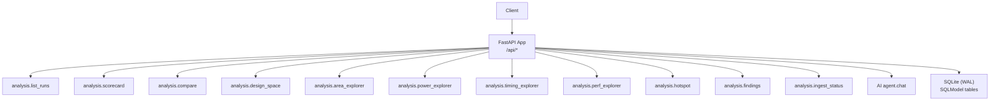
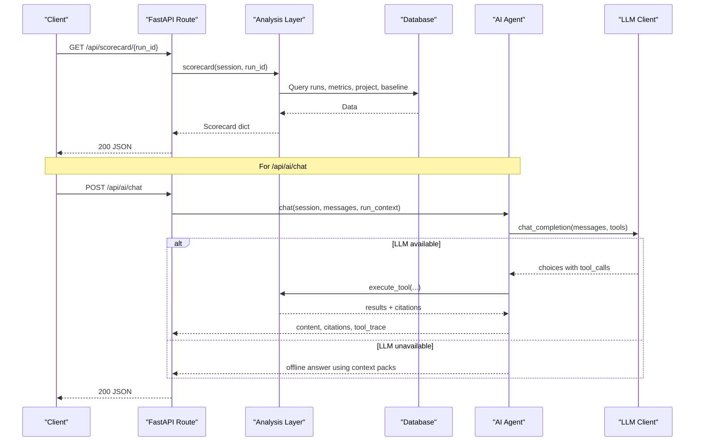
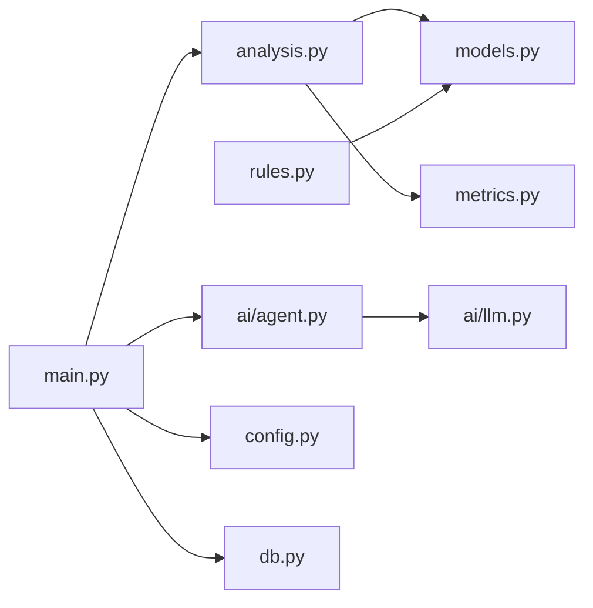

# Backend API Reference

<cite>
**Referenced Files in This Document**
- [main.py](file://backend/ppa/main.py)
- [analysis.py](file://backend/ppa/analysis.py)
- [models.py](file://backend/ppa/models.py)
- [metrics.py](file://backend/ppa/metrics.py)
- [rules.py](file://backend/ppa/rules.py)
- [llm.py](file://backend/ppa/ai/llm.py)
- [agent.py](file://backend/ppa/ai/agent.py)
- [config.py](file://backend/ppa/config.py)
- [db.py](file://backend/ppa/db.py)
- [api.ts](file://frontend/src/api.ts)
</cite>

## Table of Contents
1. [Introduction](#introduction)
2. [Project Structure](#project-structure)
3. [Core Components](#core-components)
4. [Architecture Overview](#architecture-overview)
5. [Detailed Component Analysis](#detailed-component-analysis)
6. [Dependency Analysis](#dependency-analysis)
7. [Performance Considerations](#performance-considerations)
8. [Troubleshooting Guide](#troubleshooting-guide)
9. [Conclusion](#conclusion)
10. [Appendices](#appendices)

## Introduction
This document provides a comprehensive REST API reference for PPA-Profiler’s backend, covering versioned endpoints V1–V11 plus AI and admin endpoints. It documents HTTP methods, URL patterns, request/response schemas, authentication, error handling, status codes, example payloads, client integration notes, rate limiting considerations, and debugging via Swagger UI at /docs.

PPA-Profiler is a FastAPI application that exposes:
- Run management and analysis views (V1–V11)
- Domain explorers for area, power, timing, and performance
- Hotspot analysis
- Findings management with feedback
- Ingest/admin endpoints
- AI chat endpoint with tool-augmented responses and offline fallback

The server enables CORS broadly and mounts the frontend if built; otherwise it returns a hint to use /docs.

**Section sources**
- [main.py:19-30](file://backend/ppa/main.py#L19-L30)
- [main.py:197-206](file://backend/ppa/main.py#L197-L206)

## Project Structure
At runtime, the FastAPI app registers routes under /api and serves static assets from the configured frontend distribution. The database is SQLite with WAL enabled and foreign keys enforced. Settings are loaded from environment variables prefixed with PPA_.

**Diagram sources**
- [main.py:36-163](file://backend/ppa/main.py#L36-L163)
- [db.py:13-30](file://backend/ppa/db.py#L13-L30)

**Section sources**
- [main.py:19-30](file://backend/ppa/main.py#L19-L30)
- [db.py:13-30](file://backend/ppa/db.py#L13-L30)
- [config.py:12-30](file://backend/ppa/config.py#L12-L30)

## Core Components
- FastAPI routes: define all public endpoints and parameter validation.
- Analysis layer: pure-Python query functions returning typed dictionaries used by both UI and AI tools.
- Models: SQLModel definitions for all persistent entities (runs, metrics, findings, sessions).
- Metrics engine: figures of merit, comparisons, Pareto front computation.
- Rules engine: deterministic rule evaluation producing findings.
- AI subsystem: OpenAI-compatible LLM client with tool-calling loop and offline fallback.
- Database: SQLite engine/session management with WAL and foreign keys.

Key responsibilities:
- Routes validate inputs and delegate to analysis or AI modules.
- Analysis reads from models via SQLModel queries and computes summaries.
- AI agent orchestrates tool calls over deterministic analysis functions and persists chat sessions/messages.

**Section sources**
- [main.py:36-163](file://backend/ppa/main.py#L36-L163)
- [analysis.py:1-439](file://backend/ppa/analysis.py#L1-L439)
- [models.py:15-217](file://backend/ppa/models.py#L15-L217)
- [metrics.py:88-188](file://backend/ppa/metrics.py#L88-L188)
- [rules.py:24-73](file://backend/ppa/rules.py#L24-L73)
- [agent.py:51-115](file://backend/ppa/ai/agent.py#L51-L115)
- [llm.py:15-59](file://backend/ppa/ai/llm.py#L15-L59)
- [db.py:13-50](file://backend/ppa/db.py#L13-L50)

## Architecture Overview
The API follows a layered architecture:
- Presentation: FastAPI routes handle HTTP requests and responses.
- Business logic: analysis module implements domain-specific computations and data aggregation.
- Data access: SQLModel queries against SQLite.
- AI: optional LLM integration with tool-use and deterministic offline fallback.

**Diagram sources**
- [main.py:45-50](file://backend/ppa/main.py#L45-L50)
- [analysis.py:69-125](file://backend/ppa/analysis.py#L69-L125)
- [agent.py:51-115](file://backend/ppa/ai/agent.py#L51-L115)
- [llm.py:15-59](file://backend/ppa/ai/llm.py#L15-L59)

## Detailed Component Analysis

### Run Management (V1)
- Endpoint: GET /api/runs
- Purpose: List runs with key metadata, figures of merit, timing summary, and open findings count.
- Parameters: None (query parameters not defined on route).
- Response schema: Array of run objects containing:
  - run_id, label, stage, started_at, config, corner, fom, timing, open_findings
- Errors: None explicitly raised by route; underlying DB errors propagate.

Example request:
- GET /api/runs

Example response fields:
- run_id: integer
- label: string
- stage: string
- started_at: ISO datetime
- config: object
- corner: string
- fom: object (keys prefixed by “fom.” stripped)
- timing: object {wns_ns, tns_ns, nve}
- open_findings: integer

**Section sources**
- [main.py:36-41](file://backend/ppa/main.py#L36-L41)
- [analysis.py:44-65](file://backend/ppa/analysis.py#L44-L65)

### Scorecard (V2)
- Endpoint: GET /api/scorecard/{run_id}
- Purpose: Provide a consolidated view of a run including FOMs, budgets, domain summaries, and top findings.
- Path parameters:
  - run_id: integer
- Response schema: Object with:
  - run: {id, label, stage}
  - fom: object
  - fom_delta_vs_baseline: object
  - budgets: object {area_mm2, power_mw, fmax_mhz}
  - domains: {timing, area, power, performance}
  - findings: array of finding summaries
- Errors:
  - 404 if run not found

Example request:
- GET /api/scorecard/42

Example response highlights:
- budgets.area_mm2.budget/current
- domains.power.clock_power_share
- findings[].severity/title/category

**Section sources**
- [main.py:43-50](file://backend/ppa/main.py#L43-L50)
- [analysis.py:67-135](file://backend/ppa/analysis.py#L67-L135)

### Compare (V3)
- Endpoint: GET /api/compare
- Purpose: Compare multiple runs against a base run with FOM deltas, decomposition, and waterfalls.
- Query parameters:
  - run_ids: comma-separated integers (at least two)
- Response schema:
  - runs: array of {run_id, label, config, fom}
  - comparisons: array of {base_label, label, fom_delta, decomposition, config_diff, area_waterfall, power_waterfall}
- Errors:
  - 400 if fewer than two run_ids provided

Example request:
- GET /api/compare?run_ids=1,2,3

Example response highlights:
- comparisons[0].decomposition.ipc_pct/freq_pct/net_pct
- comparisons[0].area_waterfall[].module/delta

**Section sources**
- [main.py:53-61](file://backend/ppa/main.py#L53-L61)
- [analysis.py:137-177](file://backend/ppa/analysis.py#L137-L177)

### Design Space (V4)
- Endpoint: GET /api/design-space
- Purpose: Scatter plot data across runs for two axes, marking Pareto-optimal points.
- Query parameters:
  - x: metric name (default total_power_mw)
  - y: metric name (default specint_score)
- Response schema:
  - x_metric, y_metric, points: array of {run_id, label, x, y, config, fom, pareto}

Example request:
- GET /api/design-space?x=total_power_mw&y=specint_score

**Section sources**
- [main.py:63-69](file://backend/ppa/main.py#L63-L69)
- [analysis.py:202-220](file://backend/ppa/analysis.py#L202-L220)

### Area Explorer (V5)
- Endpoint: GET /api/area/{run_id}
- Purpose: Hierarchical area breakdown per module with shares and baseline deltas.
- Path parameters:
  - run_id: integer
- Response schema:
  - run_id, total_um2, rows: array of {scope_path, parent, depth, total_area, comb, seq, macro, clock, buf_inv, inst_count, share, delta_vs_baseline_pct, seq_ratio}

Example request:
- GET /api/area/10

**Section sources**
- [main.py:71-76](file://backend/ppa/main.py#L71-L76)
- [analysis.py:222-245](file://backend/ppa/analysis.py#L222-L245)

### Power Explorer (V6)
- Endpoint: GET /api/power/{run_id}
- Purpose: Hierarchical power breakdown with shares, leakage/clock insights, and baseline deltas.
- Path parameters:
  - run_id: integer
- Response schema:
  - run_id, total_mw, rows: array of {scope_path, parent, depth, internal, switching, leakage, total, share, delta_vs_baseline_pct, leak_share, power_density_mw_um2}
  - Additional fields: clock_power_share, clock_gating_eff, toggle_rate

Example request:
- GET /api/power/10

**Section sources**
- [main.py:78-81](file://backend/ppa/main.py#L78-L81)
- [analysis.py:247-275](file://backend/ppa/analysis.py#L247-L275)

### Timing Explorer (V7)
- Endpoint: GET /api/timing/{run_id}
- Purpose: Timing groups, slack histogram, critical paths, and leaderboard by module.
- Path parameters:
  - run_id: integer
- Response schema:
  - run_id, wns_ns, tns_ns, nve, fmax_mhz
  - groups: array of {name, wns_ns, tns_ns, nve, paths}
  - histogram: array of {lo, hi, count}
  - paths: array of {path_id, startpoint, endpoint, group, slack_ns, logic_depth, module}
  - leaderboard: array of {module, top_paths, share}

Example request:
- GET /api/timing/10

**Section sources**
- [main.py:83-86](file://backend/ppa/main.py#L83-L86)
- [analysis.py:277-327](file://backend/ppa/analysis.py#L277-L327)

### Performance Explorer (V8)
- Endpoint: GET /api/perf/{run_id}
- Purpose: Per-benchmark performance metrics with IPC and ratios, optionally vs baseline.
- Path parameters:
  - run_id: integer
- Query parameters:
  - baseline_id: integer (optional; defaults to project baseline)
- Response schema:
  - run_id, baseline_id, geomean_ratio_1ghz, geomean_delta_pct, rows: array of {benchmark, ipc, ratio_1ghz, l1d_mpki, l2_mpki, br_mispred_pct, ipc_delta_pct}

Example request:
- GET /api/perf/10?baseline_id=5

**Section sources**
- [main.py:88-92](file://backend/ppa/main.py#L88-L92)
- [analysis.py:329-357](file://backend/ppa/analysis.py#L329-L357)

### Hotspot Analysis (V9)
- Endpoint: GET /api/hotspot/{run_id}
- Purpose: Identify hotspots combining area, power, and criticality signals.
- Path parameters:
  - run_id: integer
- Response schema:
  - run_id, rows: array of {module, area_um2, area_share, power_mw, power_share, power_density, criticality, area_delta_pct, power_delta_pct}

Example request:
- GET /api/hotspot/10

**Section sources**
- [main.py:94-97](file://backend/ppa/main.py#L94-L97)
- [analysis.py:359-399](file://backend/ppa/analysis.py#L359-L399)

### Findings Management (V10)
- Endpoints:
  - GET /api/findings
  - PATCH /api/findings/{finding_id}
  - POST /api/findings/{finding_id}/feedback
- Purpose: Query, update, and provide feedback on findings generated by the rules engine.
- Query parameters (GET):
  - run_id: integer (optional)
  - severity: string (optional)
  - category: string (optional)
  - status: string (optional)
- Request bodies:
  - PATCH FindingPatch: {status?, ai_explanation?, ai_proposal?}
  - POST FeedbackIn: {verdict, comment?, author?}
- Responses:
  - GET: array of findings enriched with run_label
  - PATCH: {id, status}
  - POST: {ok: true}
- Errors:
  - 404 if finding not found
  - 400 for invalid status or verdict values

Example requests:
- GET /api/findings?run_id=10&severity=critical
- PATCH /api/findings/123 with {"status": "acknowledged"}
- POST /api/findings/123/feedback with {"verdict": "up", "comment": "Confirmed"}

**Section sources**
- [main.py:99-150](file://backend/ppa/main.py#L99-L150)
- [analysis.py:401-424](file://backend/ppa/analysis.py#L401-L424)
- [models.py:168-217](file://backend/ppa/models.py#L168-L217)

### Ingest/Admin (V11)
- Endpoints:
  - GET /api/ingest-status
  - GET /api/rules
- Purpose: Inspect ingestion status and retrieve rule definitions.
- Responses:
  - ingest-status: array of {run_id, run_label, kind, file, sha256, parser_version, status, log}
  - rules: array of rule objects (id, category, severity, title, params)

Example requests:
- GET /api/ingest-status
- GET /api/rules

**Section sources**
- [main.py:152-163](file://backend/ppa/main.py#L152-L163)
- [analysis.py:426-439](file://backend/ppa/analysis.py#L426-L439)
- [rules.py:19-22](file://backend/ppa/rules.py#L19-L22)

### AI Chat (/api/ai/chat)
- Endpoint: POST /api/ai/chat
- Purpose: Conversational assistant with tool-augmented analysis and offline fallback.
- Request body:
  - messages: array of {role, content}
  - run_context: object (optional), e.g., {run_id, ...}
- Response:
  - content: string
  - citations: array of {run_id, run_label, source}
  - tool_trace: array of {tool, args, result_bytes}
  - offline: boolean
  - view_proposal: object (optional) indicating suggested UI navigation
- Behavior:
  - If LLM is reachable, uses tool-calling loop up to configured rounds; otherwise returns deterministic offline answers based on context packs.
  - Persists session and messages for auditability.

Example request:
- POST /api/ai/chat
- Body:
  - messages: [{"role":"user","content":"Compare runs 1 and 2"}]
  - run_context: {"run_id":1}

Example response:
- {content, citations, tool_trace, offline, view_proposal}

**Section sources**
- [main.py:165-195](file://backend/ppa/main.py#L165-L195)
- [agent.py:51-115](file://backend/ppa/ai/agent.py#L51-L115)
- [agent.py:120-231](file://backend/ppa/ai/agent.py#L120-L231)
- [llm.py:15-59](file://backend/ppa/ai/llm.py#L15-L59)

### AI Status (/api/ai/status)
- Endpoint: GET /api/ai/status
- Purpose: Probe local LLM availability and model list.
- Response:
  - available: boolean
  - models: array of strings
  - target_model: string
  - error: string (if unavailable)

Example request:
- GET /api/ai/status

**Section sources**
- [main.py:167-170](file://backend/ppa/main.py#L167-L170)
- [llm.py:46-59](file://backend/ppa/ai/llm.py#L46-L59)

## Dependency Analysis
High-level dependencies between components:
- Routes depend on analysis and AI modules.
- Analysis depends on models and metrics.
- AI agent depends on LLM client and analysis tools.
- Rules engine depends on models and YAML rule pack.
- Database layer provides sessions and engine configuration.

**Diagram sources**
- [main.py:12-17](file://backend/ppa/main.py#L12-L17)
- [analysis.py:6-14](file://backend/ppa/analysis.py#L6-L14)
- [agent.py:17-20](file://backend/ppa/ai/agent.py#L17-L20)
- [rules.py:11-14](file://backend/ppa/rules.py#L11-L14)
- [db.py:6-10](file://backend/ppa/db.py#L6-L10)

**Section sources**
- [main.py:12-17](file://backend/ppa/main.py#L12-L17)
- [analysis.py:6-14](file://backend/ppa/analysis.py#L6-L14)
- [agent.py:17-20](file://backend/ppa/ai/agent.py#L17-L20)
- [rules.py:11-14](file://backend/ppa/rules.py#L11-L14)
- [db.py:6-10](file://backend/ppa/db.py#L6-L10)

## Performance Considerations
- Database: SQLite with WAL mode improves concurrency and durability; foreign keys enforced.
- Queries: Analysis functions perform targeted SELECTs and in-memory aggregations; avoid excessive pagination by design.
- AI: Tool-calling loop bounded by ai_max_tool_rounds; timeouts configurable via ai_timeout_s.
- Frontend proxy: Development proxy forwards /api to backend port 8000.

Recommendations:
- Keep run_ids lists small for compare to limit payload size.
- Use filtering on /api/findings to reduce response size.
- Monitor LLM availability and fall back gracefully.

**Section sources**
- [db.py:13-30](file://backend/ppa/db.py#L13-L30)
- [config.py:17-22](file://backend/ppa/config.py#L17-L22)
- [agent.py:70-115](file://backend/ppa/ai/agent.py#L70-L115)
- [api.ts:6-12](file://frontend/src/api.ts#L6-L12)

## Troubleshooting Guide
Common issues and resolutions:
- 404 Not Found:
  - /api/scorecard/{run_id}: Ensure run exists.
  - /api/findings/{finding_id}: Ensure finding exists before patching.
- 400 Bad Request:
  - /api/compare: Must provide at least two run_ids.
  - /api/findings/{finding_id}: Invalid status or verdict values.
- LLM Unavailable:
  - /api/ai/chat falls back to offline mode; check ai_base_url and model availability via /api/ai/status.
- CORS:
  - All origins allowed; ensure browser does not block due to other policies.
- Debugging:
  - Use Swagger UI at /docs to inspect schemas and test endpoints.
  - Check parse logs via /api/ingest-status for ingestion errors.

Error response examples:
- 404: {"detail": "run 42 not found"}
- 400: {"detail": "run_ids must list at least two runs"}

**Section sources**
- [main.py:45-61](file://backend/ppa/main.py#L45-L61)
- [main.py:114-149](file://backend/ppa/main.py#L114-L149)
- [llm.py:46-59](file://backend/ppa/ai/llm.py#L46-L59)
- [analysis.py:426-439](file://backend/ppa/analysis.py#L426-L439)

## Conclusion
PPA-Profiler’s backend provides a robust set of REST endpoints for run management, multi-domain analysis, hotspot identification, findings lifecycle, and AI-assisted exploration. The architecture cleanly separates presentation, business logic, and data access, while offering an optional AI layer with deterministic fallback. Clients can integrate using standard HTTP and leverage Swagger UI for discovery and testing.

## Appendices

### Authentication and Security
- No explicit authentication middleware is applied to routes.
- CORS allows all origins and headers.
- For production deployments, consider adding authentication and authorization layers.

**Section sources**
- [main.py:22-24](file://backend/ppa/main.py#L22-L24)

### Client Implementation Guidelines
- Base path: /api
- Methods:
  - GET for read endpoints
  - PATCH for updating findings
  - POST for feedback and AI chat
- Content-Type: application/json for POST/PATCH bodies
- Error handling:
  - Check response.ok and parse text for error details
  - Handle 400/404 appropriately

Frontend client usage pattern:
- get<T>(path) and post<T>(path, body) helpers
- Example integrations for rules, AI status, AI chat, finding feedback

**Section sources**
- [api.ts:6-48](file://frontend/src/api.ts#L6-L48)

### Rate Limiting
- No built-in rate limiting is present.
- Consider deploying behind a reverse proxy (e.g., Nginx) or using an ASGI middleware to enforce rate limits if needed.

[No sources needed since this section provides general guidance]

### Swagger UI
- Access interactive documentation at /docs
- Use it to explore schemas, test endpoints, and verify request/response formats

**Section sources**
- [main.py:197-206](file://backend/ppa/main.py#L197-L206)