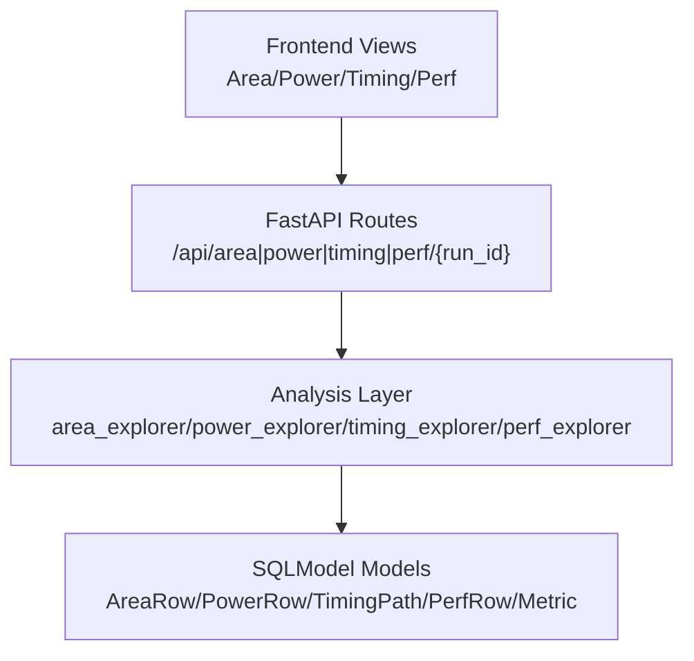
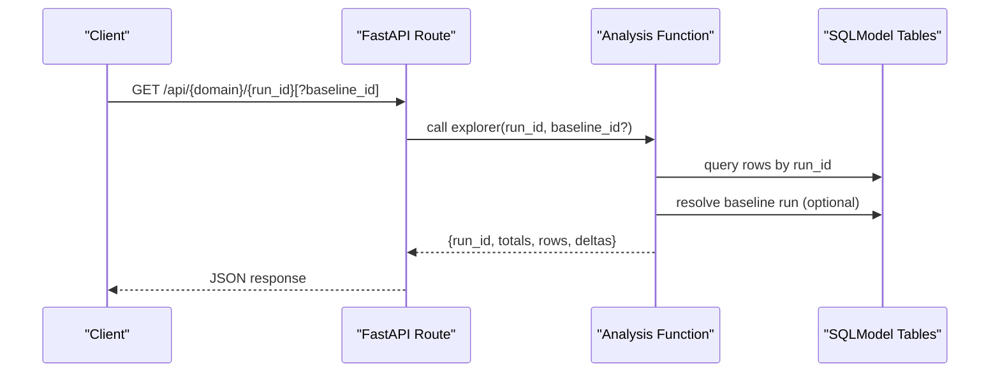
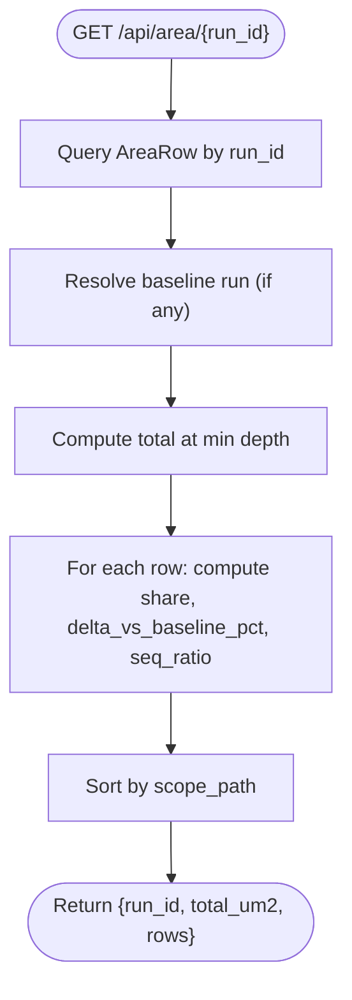
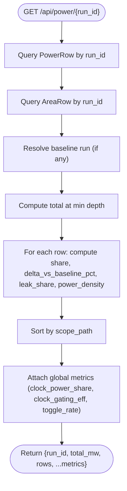
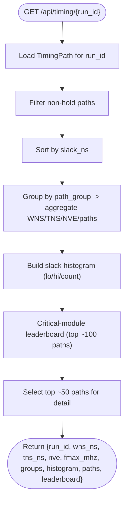
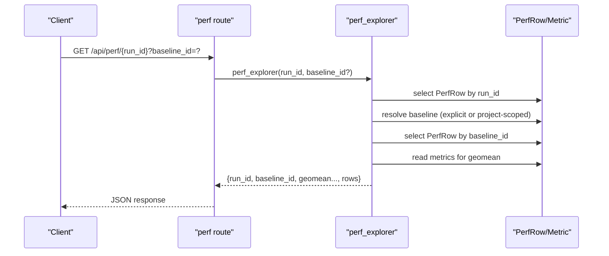
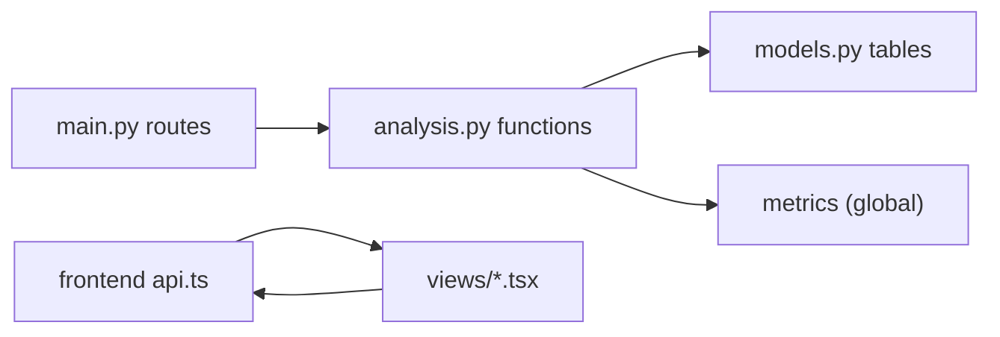

# Domain Explorer APIs

<cite>
**Referenced Files in This Document**
- [main.py](file://backend/ppa/main.py)
- [analysis.py](file://backend/ppa/analysis.py)
- [models.py](file://backend/ppa/models.py)
- [api.ts](file://frontend/src/api.ts)
- [types.ts](file://frontend/src/types.ts)
- [AreaExplorer.tsx](file://frontend/src/views/AreaExplorer.tsx)
- [PowerExplorer.tsx](file://frontend/src/views/PowerExplorer.tsx)
- [TimingExplorer.tsx](file://frontend/src/views/TimingExplorer.tsx)
</cite>

## Table of Contents
1. [Introduction](#introduction)
2. [Project Structure](#project-structure)
3. [Core Components](#core-components)
4. [Architecture Overview](#architecture-overview)
5. [Detailed Component Analysis](#detailed-component-analysis)
6. [Dependency Analysis](#dependency-analysis)
7. [Performance Considerations](#performance-considerations)
8. [Troubleshooting Guide](#troubleshooting-guide)
9. [Conclusion](#conclusion)

## Introduction
This document provides detailed API documentation for the domain-specific explorers that expose hierarchical, filtered, and aggregated data for area, power, timing, and performance analysis per run. It explains each endpoint’s request/response structure, how domain data is organized and compared to baselines, and where optimization insights are surfaced (e.g., hotspot identification patterns).

## Project Structure
The backend exposes REST endpoints under /api that delegate to an analysis layer which queries a SQLModel-backed database. The frontend consumes these endpoints via typed helpers and renders interactive views.

**Diagram sources**
- [main.py:73-91](file://backend/ppa/main.py#L73-L91)
- [analysis.py:224-356](file://backend/ppa/analysis.py#L224-L356)
- [models.py:93-149](file://backend/ppa/models.py#L93-L149)

**Section sources**
- [main.py:73-91](file://backend/ppa/main.py#L73-L91)
- [analysis.py:224-356](file://backend/ppa/analysis.py#L224-L356)
- [models.py:93-149](file://backend/ppa/models.py#L93-L149)

## Core Components
- Area explorer: hierarchical area breakdown with composition and baseline deltas.
- Power explorer: hierarchical power breakdown with leakage share, density, and baseline deltas.
- Timing explorer: setup slack histogram, path group summaries, critical-module leaderboard, and worst paths.
- Performance explorer: benchmark-level IPC and normalized metrics with optional baseline comparison and geometric mean delta.

**Section sources**
- [analysis.py:224-356](file://backend/ppa/analysis.py#L224-L356)
- [types.ts:65-111](file://frontend/src/types.ts#L65-L111)

## Architecture Overview
Each explorer endpoint follows a consistent pattern:
- Route receives run_id (and optional baseline_id for perf).
- Analysis function queries relevant tables (AreaRow, PowerRow, TimingPath, PerfRow) and aggregates results.
- Baseline resolution uses project-scoped baseline metadata when available; otherwise optional explicit baseline_id.
- Responses include hierarchical rows plus summary metrics and optional baseline deltas.

**Diagram sources**
- [main.py:73-91](file://backend/ppa/main.py#L73-L91)
- [analysis.py:224-356](file://backend/ppa/analysis.py#L224-L356)
- [models.py:93-149](file://backend/ppa/models.py#L93-L149)

## Detailed Component Analysis

### Area Explorer — GET /api/area/{run_id}
- Purpose: Hierarchical area breakdown per module with composition and baseline delta.
- Request:
  - Path parameter: run_id (integer)
- Response fields:
  - run_id: integer
  - total_um2: number (total area at minimum depth)
  - rows: array of AreaRowX entries
    - scope_path: string (module path)
    - parent: string
    - depth: number
    - total_area: number (µm²)
    - comb: number
    - seq: number
    - macro: number
    - clock: number
    - buf_inv: number
    - inst_count: number
    - share: number (fraction of total)
    - delta_vs_baseline_pct: number|null (percentage change vs baseline)
    - seq_ratio: number (seq_area / total_area)
- Data organization:
  - Rows are grouped by hierarchy (scope_path, parent, depth).
  - Aggregation computes share relative to total at the shallowest depth.
  - Baseline comparison uses project-scoped baseline run if present; otherwise null.
- Optimization insights:
  - High seq_ratio indicates flop-heavy modules; useful for targeting clock gating and sequencing changes.
  - Large positive delta_vs_baseline_pct highlights area growth areas.
- Frontend usage:
  - Builds a treemap from rows and shows top level-2 modules sorted by area or instance count.

**Diagram sources**
- [analysis.py:224-244](file://backend/ppa/analysis.py#L224-L244)
- [models.py:93-106](file://backend/ppa/models.py#L93-L106)

**Section sources**
- [main.py:73-76](file://backend/ppa/main.py#L73-L76)
- [analysis.py:224-244](file://backend/ppa/analysis.py#L224-L244)
- [types.ts:65-82](file://frontend/src/types.ts#L65-L82)
- [AreaExplorer.tsx:9-139](file://frontend/src/views/AreaExplorer.tsx#L9-L139)

### Power Explorer — GET /api/power/{run_id}
- Purpose: Hierarchical power breakdown with leakage share, density, and baseline delta.
- Request:
  - Path parameter: run_id (integer)
- Response fields:
  - run_id: integer
  - total_mw: number (total power at minimum depth)
  - rows: array of PowerRowX entries
    - scope_path: string
    - parent: string
    - depth: number
    - internal: number (mW)
    - switching: number (mW)
    - leakage: number (mW)
    - total: number (mW)
    - share: number (fraction of total)
    - delta_vs_baseline_pct: number|null
    - leak_share: number (leakage / total)
    - power_density_mw_um2: number|null (total / area)
  - clock_power_share: number|null
  - clock_gating_eff: number|null
  - toggle_rate: number|null
- Data organization:
  - Rows are hierarchical; aggregation computes share relative to total at the shallowest depth.
  - Joins with area rows to compute power density per module.
  - Baseline comparison uses project-scoped baseline run if present.
- Optimization insights:
  - High leakage share suggests VT mix or sizing issues.
  - High power density flags IR-drop/thermal risk.
  - Clock power share > 30% and low clock gating efficiency indicate opportunities for gating/CTS improvements.
- Frontend usage:
  - Stacked bar chart of internal/switching/leakage per module; table includes density and deltas.

**Diagram sources**
- [analysis.py:247-274](file://backend/ppa/analysis.py#L247-L274)
- [models.py:93-118](file://backend/ppa/models.py#L93-L118)

**Section sources**
- [main.py:78-81](file://backend/ppa/main.py#L78-L81)
- [analysis.py:247-274](file://backend/ppa/analysis.py#L247-L274)
- [types.ts:65-91](file://frontend/src/types.ts#L65-L91)
- [PowerExplorer.tsx:7-101](file://frontend/src/views/PowerExplorer.tsx#L7-L101)

### Timing Explorer — GET /api/timing/{run_id}
- Purpose: Setup timing analysis including slack histograms, path groups, critical-module leaderboard, and worst paths.
- Request:
  - Path parameter: run_id (integer)
- Response fields:
  - run_id: integer
  - wns_ns: number|null
  - tns_ns: number|null
  - nve: number|null
  - fmax_mhz: number|null
  - groups: array of { name, wns_ns, tns_ns, nve, paths }
  - histogram: array of { lo, hi, count }
  - paths: array of { path_id, startpoint, endpoint, group, slack_ns, logic_depth, module } (top ~50)
  - leaderboard: array of { module, top_paths, share }
- Data organization:
  - Filters out hold paths; sorts by slack.
  - Groups by path_group and aggregates WNS/TNS/NVE counts.
  - Computes coarse slack histogram across paths.
  - Identifies critical modules by counting occurrences among top paths.
- Optimization insights:
  - Single deep negative spike in histogram often indicates one broken path; broad distribution suggests systemic wall.
  - Modules dominating the leaderboard are structural candidates for microarch changes.
  - High logic_depth on worst paths points to long combinational chains.

**Diagram sources**
- [analysis.py:279-326](file://backend/ppa/analysis.py#L279-L326)
- [models.py:120-135](file://backend/ppa/models.py#L120-L135)

**Section sources**
- [main.py:83-86](file://backend/ppa/main.py#L83-L86)
- [analysis.py:279-326](file://backend/ppa/analysis.py#L279-L326)
- [types.ts:93-103](file://frontend/src/types.ts#L93-L103)
- [TimingExplorer.tsx:7-106](file://frontend/src/views/TimingExplorer.tsx#L7-L106)

### Performance Explorer — GET /api/perf/{run_id}?baseline_id={id}
- Purpose: Benchmark-level performance metrics with optional baseline comparison and geometric mean delta.
- Request:
  - Path parameter: run_id (integer)
  - Query parameter: baseline_id (optional integer)
- Response fields:
  - run_id: integer
  - baseline_id: integer|null
  - geomean_ratio_1ghz: number|null
  - geomean_delta_pct: number|null (percentage change vs baseline)
  - rows: array of { benchmark, ipc, ratio_1ghz, l1d_mpki, l2_mpki, br_mispred_pct, ipc_delta_pct }
- Data organization:
  - Loads PerfRow per benchmark for current run.
  - If baseline provided (or resolved), loads corresponding PerfRow entries and computes IPC percentage deltas.
  - Computes geometric mean ratio and its percentage delta vs baseline using global metrics.
- Baseline comparison capabilities:
  - Explicit baseline_id overrides automatic baseline resolution.
  - Per-benchmark IPC delta helps identify regressions/improvements.
  - Geometric mean delta summarizes overall performance trend.
- Hotspot identification patterns:
  - Combine high l1d_mpki/l2_mpki with low IPC to target memory bottlenecks.
  - High br_mispred_pct correlates with IPC loss; branch predictor tuning may help.
  - Use ipc_delta_pct to rank benchmarks most affected by changes.

**Diagram sources**
- [main.py:88-91](file://backend/ppa/main.py#L88-L91)
- [analysis.py:331-356](file://backend/ppa/analysis.py#L331-L356)
- [models.py:137-149](file://backend/ppa/models.py#L137-L149)

**Section sources**
- [main.py:88-91](file://backend/ppa/main.py#L88-L91)
- [analysis.py:331-356](file://backend/ppa/analysis.py#L331-L356)
- [types.ts:105-111](file://frontend/src/types.ts#L105-L111)

### Hotspot Identification Patterns
- Cross-domain hotspot view combines area, power, and timing criticality to prioritize modules for optimization.
- Key signals:
  - High area_share + high power_share + high criticality (from timing paths) indicate prime targets.
  - Significant area/power deltas vs baseline highlight recent regressions.
  - Power density spikes suggest physical design constraints (IR-drop/thermal).
- Implementation note:
  - The hotspot endpoint aggregates area, power, and timing path counts to score modules; it complements the domain explorers above.

**Section sources**
- [analysis.py:361-398](file://backend/ppa/analysis.py#L361-L398)
- [types.ts:113-123](file://frontend/src/types.ts#L113-L123)

## Dependency Analysis
- Routing: FastAPI routes in main.py map URL paths to analysis functions.
- Analysis layer: Centralized functions in analysis.py perform queries and aggregations, ensuring deterministic outputs for AI tools.
- Data models: SQLModel classes define schema for AreaRow, PowerRow, TimingPath, PerfRow, Metric, etc.
- Frontend types: TypeScript interfaces mirror backend responses to ensure type safety.

**Diagram sources**
- [main.py:73-91](file://backend/ppa/main.py#L73-L91)
- [analysis.py:224-356](file://backend/ppa/analysis.py#L224-L356)
- [models.py:93-149](file://backend/ppa/models.py#L93-L149)
- [api.ts:23-32](file://frontend/src/api.ts#L23-L32)

**Section sources**
- [main.py:73-91](file://backend/ppa/main.py#L73-L91)
- [analysis.py:224-356](file://backend/ppa/analysis.py#L224-L356)
- [models.py:93-149](file://backend/ppa/models.py#L93-L149)
- [api.ts:23-32](file://frontend/src/api.ts#L23-L32)

## Performance Considerations
- Hierarchical aggregation:
  - Area and power computations determine total at the minimum depth and compute shares accordingly; this avoids redundant recalculations per node.
- Baseline resolution:
  - Automatic baseline lookup uses project-scoped metadata; explicit baseline_id can be used for perf comparisons to avoid ambiguity.
- Filtering:
  - Timing explorer filters hold paths and limits top paths to reduce payload size while preserving insight.
- Indexing:
  - Queries rely on indexed columns (e.g., run_id, scope_path, path_group) for efficient retrieval.

[No sources needed since this section provides general guidance]

## Troubleshooting Guide
- Run not found:
  - Some endpoints return 404 when the run does not exist (e.g., scorecard). Ensure run_id exists before calling explorers.
- Missing baseline:
  - If no baseline is configured or provided, delta fields will be null; verify project baseline configuration or pass baseline_id explicitly for perf.
- Empty datasets:
  - If rows are empty, check ingestion status and parser logs to confirm reports were parsed successfully.
- Timing anomalies:
  - Negative WNS/TNS indicates violations; use histogram shape and leaderboard to diagnose single-path vs systemic issues.

**Section sources**
- [main.py:45-50](file://backend/ppa/main.py#L45-L50)
- [analysis.py:331-356](file://backend/ppa/analysis.py#L331-L356)

## Conclusion
The domain explorers provide structured, hierarchical, and baseline-aware views into area, power, timing, and performance. They enable targeted optimization by surfacing composition, deltas, and criticality signals. Use the perf endpoint’s baseline comparison to quantify changes and combine with hotspot patterns to prioritize interventions.