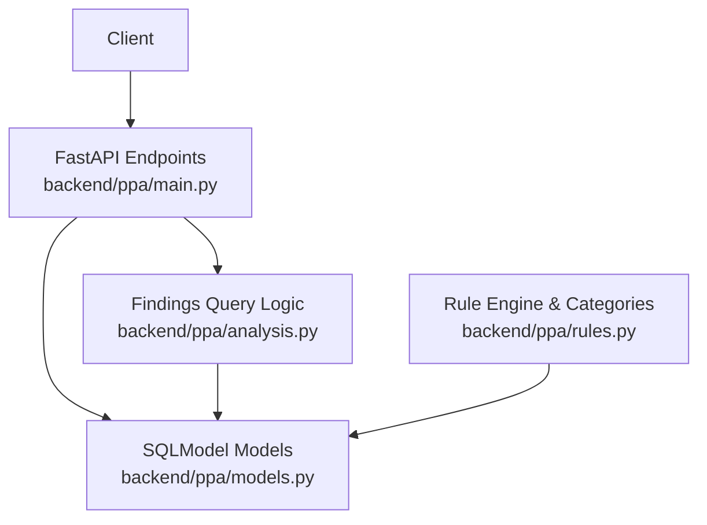
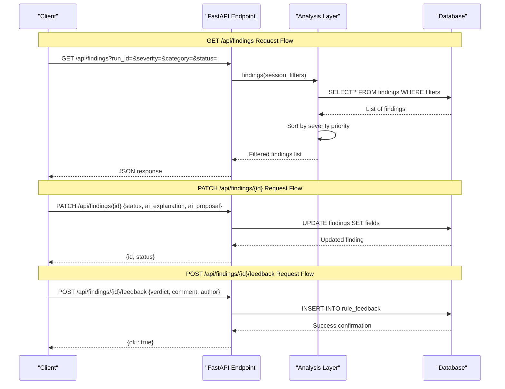
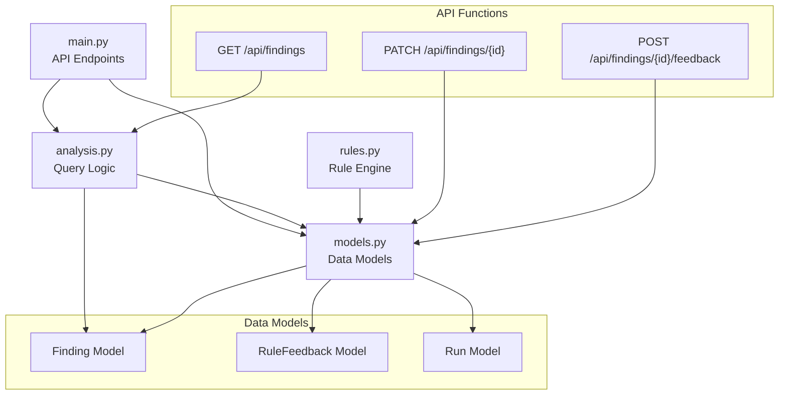

# Findings Management API

<cite>
**Referenced Files in This Document**
- [main.py](file://backend/ppa/main.py)
- [analysis.py](file://backend/ppa/analysis.py)
- [models.py](file://backend/ppa/models.py)
- [rules.py](file://backend/ppa/rules.py)
</cite>

## Table of Contents
1. [Introduction](#introduction)
2. [Project Structure](#project-structure)
3. [Core Components](#core-components)
4. [Architecture Overview](#architecture-overview)
5. [Detailed Component Analysis](#detailed-component-analysis)
6. [Dependency Analysis](#dependency-analysis)
7. [Performance Considerations](#performance-considerations)
8. [Troubleshooting Guide](#troubleshooting-guide)
9. [Conclusion](#conclusion)

## Introduction
This document provides comprehensive API documentation for findings management endpoints in the PPA-Profiler backend. It covers:
- GET /api/findings with filtering by run_id, severity, category, and status
- PATCH /api/findings/{finding_id} to update finding status and AI-generated content
- POST /api/findings/{finding_id}/feedback to collect rule feedback
It also explains the finding lifecycle, status transitions, and feedback workflow, along with request/response schemas and validation rules.

## Project Structure
The findings management functionality is implemented in the FastAPI application under backend/ppa. The key files are:
- main.py: Defines HTTP endpoints for findings (GET, PATCH, POST)
- analysis.py: Implements query logic for listing and filtering findings
- models.py: Defines data models including Finding and RuleFeedback
- rules.py: Defines how findings are generated and their categories/severities



**Diagram sources**
- [main.py:101-149](file://backend/ppa/main.py#L101-L149)
- [analysis.py:403-423](file://backend/ppa/analysis.py#L403-L423)
- [models.py:168-217](file://backend/ppa/models.py#L168-L217)
- [rules.py:290-310](file://backend/ppa/rules.py#L290-L310)

**Section sources**
- [main.py:101-149](file://backend/ppa/main.py#L101-L149)
- [analysis.py:403-423](file://backend/ppa/analysis.py#L403-L423)
- [models.py:168-217](file://backend/ppa/models.py#L168-L217)
- [rules.py:290-310](file://backend/ppa/rules.py#L290-L310)

## Core Components
The findings management system consists of three main components:

### Data Models
- **Finding**: Represents a detected issue with properties like id, run_id, rule_id, severity, category, scope_path, title, evidence_json, status, ai_explanation, ai_proposal, created_at
- **RuleFeedback**: Captures user feedback on findings with verdict (up/down), comment, author, and timestamp

### API Endpoints
- **GET /api/findings**: Lists findings with optional filtering parameters
- **PATCH /api/findings/{finding_id}**: Updates finding status and AI-generated content
- **POST /api/findings/{finding_id}/feedback**: Submits feedback for a specific finding

### Business Logic
- **Filtering Logic**: Supports filtering by run_id, severity, category, and status
- **Validation**: Enforces valid status values and feedback verdicts
- **Sorting**: Results are sorted by severity priority and category

**Section sources**
- [models.py:168-217](file://backend/ppa/models.py#L168-L217)
- [main.py:101-149](file://backend/ppa/main.py#L101-L149)
- [analysis.py:403-423](file://backend/ppa/analysis.py#L403-L423)

## Architecture Overview
The findings management architecture follows a layered approach:



**Diagram sources**
- [main.py:101-149](file://backend/ppa/main.py#L101-L149)
- [analysis.py:403-423](file://backend/ppa/analysis.py#L403-L423)
- [models.py:168-217](file://backend/ppa/models.py#L168-L217)

## Detailed Component Analysis

### GET /api/findings Endpoint
Retrieves findings with optional filtering capabilities.

#### Request Parameters
- `run_id` (integer, optional): Filter by specific run ID
- `severity` (string, optional): Filter by severity level (critical, high, medium, low, info)
- `category` (string, optional): Filter by category (timing, area, power, performance, cross_domain, data_quality)
- `status` (string, optional): Filter by status (open, acknowledged, fixed, wont_fix)

#### Response Schema
Returns an array of finding objects with the following structure:
```json
{
  "id": integer,
  "run_id": integer,
  "rule_id": string,
  "severity": string,
  "category": string,
  "scope_path": string | null,
  "title": string,
  "evidence": object,
  "status": string,
  "ai_explanation": string | null,
  "ai_proposal": string | null,
  "run_label": string
}
```

#### Validation Rules
- All filter parameters are optional
- Severity must be one of: critical, high, medium, low, info
- Category must be one of: timing, area, power, performance, cross_domain, data_quality
- Status must be one of: open, acknowledged, fixed, wont_fix

#### Sorting Behavior
Results are sorted by:
1. Severity priority (critical > high > medium > low > info)
2. Category name alphabetically

**Section sources**
- [main.py:101-105](file://backend/ppa/main.py#L101-L105)
- [analysis.py:403-423](file://backend/ppa/analysis.py#L403-L423)
- [models.py:168-181](file://backend/ppa/models.py#L168-L181)

### PATCH /api/findings/{finding_id} Endpoint
Updates finding status and AI-generated content.

#### Path Parameters
- `finding_id` (integer): The unique identifier of the finding to update

#### Request Body Schema
```json
{
  "status": "open|acknowledged|fixed|wont_fix",
  "ai_explanation": "string",
  "ai_proposal": "string"
}
```

#### Validation Rules
- `status`: Must be one of: open, acknowledged, fixed, wont_fix
- `ai_explanation`: Optional string field for AI-generated explanation
- `ai_proposal`: Optional string field for AI-generated proposal
- At least one field must be provided in the request body

#### Response Schema
```json
{
  "id": integer,
  "status": string
}
```

#### Error Responses
- 404 Not Found: If the finding_id does not exist
- 400 Bad Request: If status value is invalid

**Section sources**
- [main.py:108-131](file://backend/ppa/main.py#L108-L131)
- [models.py:168-181](file://backend/ppa/models.py#L168-L181)

### POST /api/findings/{finding_id}/feedback Endpoint
Collects user feedback for rule findings.

#### Path Parameters
- `finding_id` (integer): The unique identifier of the finding to provide feedback for

#### Request Body Schema
```json
{
  "verdict": "up|down",
  "comment": "string",
  "author": "string"
}
```

#### Validation Rules
- `verdict`: Required field, must be either "up" or "down"
- `comment`: Optional string field for detailed feedback
- `author`: Optional string field identifying the feedback author (defaults to "anonymous")

#### Response Schema
```json
{
  "ok": boolean
}
```

#### Error Responses
- 400 Bad Request: If verdict is not "up" or "down"

**Section sources**
- [main.py:134-149](file://backend/ppa/main.py#L134-L149)
- [models.py:210-217](file://backend/ppa/models.py#L210-L217)

## Dependency Analysis
The findings management system has clear dependency relationships:



**Diagram sources**
- [main.py:101-149](file://backend/ppa/main.py#L101-L149)
- [analysis.py:403-423](file://backend/ppa/analysis.py#L403-L423)
- [models.py:168-217](file://backend/ppa/models.py#L168-L217)
- [rules.py:290-310](file://backend/ppa/rules.py#L290-L310)

**Section sources**
- [main.py:101-149](file://backend/ppa/main.py#L101-L149)
- [analysis.py:403-423](file://backend/ppa/analysis.py#L403-L423)
- [models.py:168-217](file://backend/ppa/models.py#L168-L217)

## Performance Considerations
- **Database Queries**: The GET /api/findings endpoint uses efficient SQL queries with proper indexing on run_id, severity, category, and status fields
- **Result Sorting**: Results are sorted server-side using Python's built-in sorting with custom key functions for optimal performance
- **Memory Usage**: Large result sets may consume significant memory; consider implementing pagination for production use
- **Connection Pooling**: Database connections are managed through SQLAlchemy sessions with proper connection pooling

[No sources needed since this section provides general guidance]

## Troubleshooting Guide

### Common Issues and Solutions

#### Invalid Status Values
- **Issue**: Receiving 400 error when updating finding status
- **Cause**: Status value not in allowed set (open, acknowledged, fixed, wont_fix)
- **Solution**: Ensure status parameter matches one of the four allowed values

#### Invalid Verdict Values
- **Issue**: Receiving 400 error when submitting feedback
- **Cause**: Verdict not "up" or "down"
- **Solution**: Use only "up" or "down" for the verdict field

#### Finding Not Found
- **Issue**: Receiving 404 error when updating findings
- **Cause**: Invalid finding_id or deleted finding
- **Solution**: Verify the finding_id exists before making updates

#### Empty Results
- **Issue**: GET /api/findings returns empty array
- **Cause**: No findings match the specified filters
- **Solution**: Check filter parameters and ensure data exists in the database

**Section sources**
- [main.py:114-131](file://backend/ppa/main.py#L114-L131)
- [main.py:140-149](file://backend/ppa/main.py#L140-L149)

## Conclusion
The findings management API provides a comprehensive solution for managing design analysis findings in the PPA-Profiler system. The API supports:
- Flexible querying with multiple filter options
- Status management throughout the finding lifecycle
- AI-powered content generation and updates
- User feedback collection for continuous improvement

The system follows best practices for API design with proper validation, error handling, and data integrity constraints. The modular architecture allows for easy extension and maintenance while providing a clean interface for frontend applications.

[No sources needed since this section summarizes without analyzing specific files]