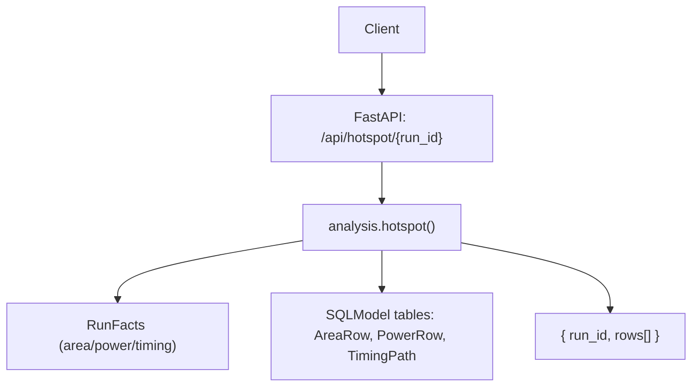
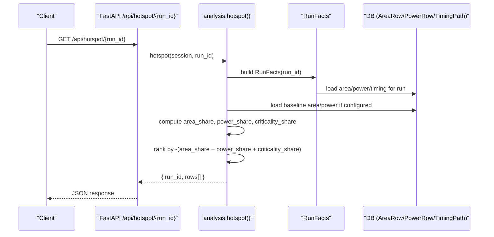
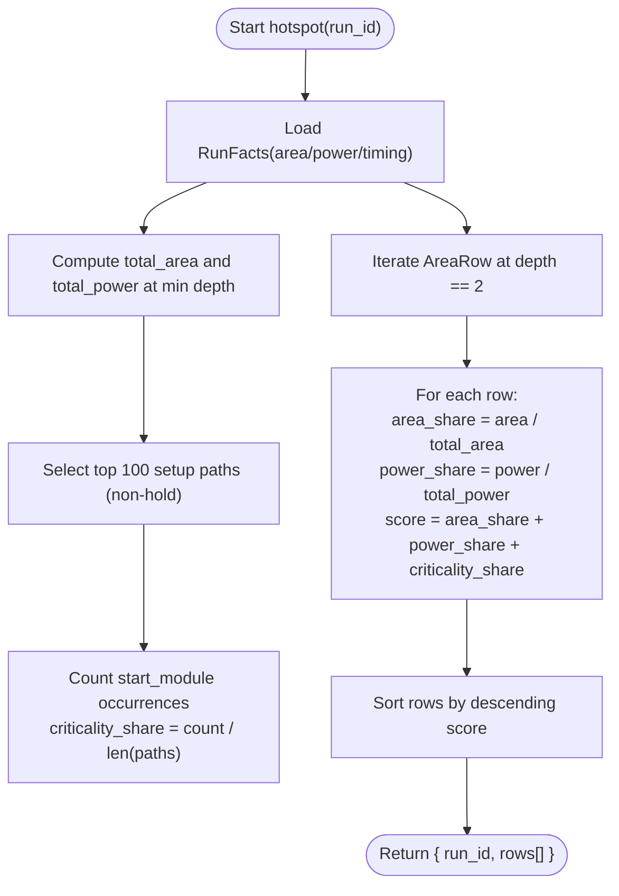
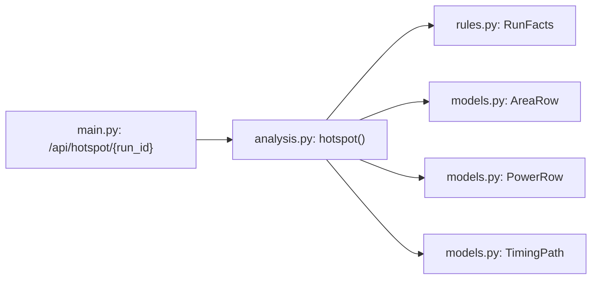

# Hotspot Analysis API

<cite>
**Referenced Files in This Document**
- [main.py](file://backend/ppa/main.py)
- [analysis.py](file://backend/ppa/analysis.py)
- [metrics.py](file://backend/ppa/metrics.py)
- [models.py](file://backend/ppa/models.py)
- [rules.py](file://backend/ppa/rules.py)
- [api.ts](file://frontend/src/api.ts)
- [types.ts](file://frontend/src/types.ts)
</cite>

## Table of Contents
1. [Introduction](#introduction)
2. [Project Structure](#project-structure)
3. [Core Components](#core-components)
4. [Architecture Overview](#architecture-overview)
5. [Detailed Component Analysis](#detailed-component-analysis)
6. [Dependency Analysis](#dependency-analysis)
7. [Performance Considerations](#performance-considerations)
8. [Troubleshooting Guide](#troubleshooting-guide)
9. [Conclusion](#conclusion)
10. [Appendices](#appendices)

## Introduction
This document describes the hotspot analysis endpoint /api/hotspot/{run_id}. It explains how hotspots are identified using a combined scoring approach across area, power, and timing criticality metrics; how results are ranked; and what the response schema looks like. It also provides guidance on interpreting hotspots and integrating them with other analysis tools in the system.

## Project Structure
The hotspot endpoint is implemented as a FastAPI route that delegates to an analysis function. The analysis function aggregates area, power, and timing data for a given run and computes a composite score per module to identify hotspots.

**Diagram sources**
- [main.py:94-96](file://backend/ppa/main.py#L94-L96)
- [analysis.py:361-398](file://backend/ppa/analysis.py#L361-L398)
- [rules.py:24-79](file://backend/ppa/rules.py#L24-L79)
- [models.py:93-135](file://backend/ppa/models.py#L93-L135)

**Section sources**
- [main.py:94-96](file://backend/ppa/main.py#L94-L96)

## Core Components
- Endpoint handler: /api/hotspot/{run_id} returns hotspot rows for a run.
- Analysis logic: Computes per-module scores from area share, power share, and timing criticality share, then ranks modules by a combined metric.
- Data sources: AreaRow, PowerRow, TimingPath, plus baseline context when available.
- Frontend integration: Typed client call returning HotspotRow arrays.

Key responsibilities:
- Normalize area and power contributions relative to totals.
- Derive timing criticality contribution from top setup paths.
- Rank modules by a simple additive combination of normalized signals.

**Section sources**
- [analysis.py:361-398](file://backend/ppa/analysis.py#L361-L398)
- [types.ts:113-123](file://frontend/src/types.ts#L113-L123)
- [api.ts:32](file://frontend/src/api.ts#L32)

## Architecture Overview
The hotspot pipeline reads hierarchical area and power breakdowns and timing path information for a run, optionally compares against a baseline, and produces a ranked list of modules that are likely to be most impactful to optimize.

**Diagram sources**
- [main.py:94-96](file://backend/ppa/main.py#L94-L96)
- [analysis.py:361-398](file://backend/ppa/analysis.py#L361-L398)
- [rules.py:24-79](file://backend/ppa/rules.py#L24-L79)
- [models.py:93-135](file://backend/ppa/models.py#L93-L135)

## Detailed Component Analysis

### Hotspot Scoring Methodology
- Inputs per module at depth 2:
  - Area share = module.total_area / total_area_at_min_depth
  - Power share = module.power / total_power_at_min_depth
  - Criticality share = count of top setup paths starting in this module / number of top paths considered
- Combined score used for ranking:
  - score = area_share + power_share + criticality_share
- Ranking:
  - Modules are sorted by descending combined score to surface the most impactful candidates first.

Notes:
- Only modules at depth 2 are included to ensure consistent granularity.
- Top setup paths are limited to the first 100 non-hold paths to derive criticality.
- Baseline deltas (area_delta_pct, power_delta_pct) are computed when a baseline run exists.

**Diagram sources**
- [analysis.py:361-398](file://backend/ppa/analysis.py#L361-L398)
- [rules.py:24-79](file://backend/ppa/rules.py#L24-L79)
- [models.py:93-135](file://backend/ppa/models.py#L93-L135)

**Section sources**
- [analysis.py:361-398](file://backend/ppa/analysis.py#L361-L398)

### Threshold Configurations
- Timing criticality window:
  - Uses the top 100 setup paths (non-hold) to estimate module criticality.
- Depth filter:
  - Only modules at depth 2 are scored to maintain consistent granularity.
- Baseline comparison:
  - If a baseline run is configured for the project, area and power deltas are reported as percentages.

These behaviors are deterministic and do not rely on external thresholds beyond the fixed counts and depths used in the algorithm.

**Section sources**
- [analysis.py:361-398](file://backend/ppa/analysis.py#L361-L398)
- [rules.py:24-79](file://backend/ppa/rules.py#L24-L79)

### Result Ranking
- Ranking key: negative sum of area_share, power_share, and criticality_share.
- Higher combined score indicates a more significant hotspot candidate.
- The returned rows are ordered from highest to lowest combined score.

**Section sources**
- [analysis.py:397-398](file://backend/ppa/analysis.py#L397-L398)

### Response Schema
The endpoint returns:
- run_id: integer identifier of the analyzed run.
- rows: array of hotspot objects (HotspotRow), each containing:
  - module: string scope_path identifying the module.
  - area_um2: module area in um^2.
  - area_share: fraction of total area contributed by the module.
  - power_mw: module power in mW.
  - power_share: fraction of total power contributed by the module.
  - power_density: power divided by area (mW/um^2).
  - criticality: fraction of top setup paths originating from this module.
  - area_delta_pct: percentage change vs baseline area (null if no baseline).
  - power_delta_pct: percentage change vs baseline power (null if no baseline).

Frontend type reference:
- HotspotRow fields are defined in the frontend types.

**Section sources**
- [analysis.py:387-398](file://backend/ppa/analysis.py#L387-L398)
- [types.ts:113-123](file://frontend/src/types.ts#L113-L123)

### Example Interpretation
- High area_share + high power_share: large, power-hungry module; consider sizing or architectural changes.
- High criticality: many timing-critical paths originate here; focus on logic restructuring, pipelining, or clocking improvements.
- Positive area_delta_pct and power_delta_pct vs baseline: regression in both area and power; investigate recent changes.
- High power_density but low area_share: localized hot spot; may benefit from layout or partitioning strategies.

[No sources needed since this section provides general interpretation guidance]

### Integration with Other Analysis Tools
- Timing explorer (/api/timing/{run_id}): Use to inspect detailed paths and groups for modules flagged as hotspots.
- Power explorer (/api/power/{run_id}): Drill into component-level power breakdown for hotspot modules.
- Area explorer (/api/area/{run_id}): Inspect area composition and hierarchy for hotspot modules.
- Findings (/api/findings): Cross-reference rule-based findings to validate hotspot causes and track remediation.
- Compare (/api/compare): Evaluate impact of changes by comparing runs around hotspot fixes.

**Section sources**
- [main.py:73-96](file://backend/ppa/main.py#L73-L96)
- [api.ts:28-37](file://frontend/src/api.ts#L28-L37)

## Dependency Analysis
The hotspot endpoint depends on:
- FastAPI routing and session dependency.
- analysis.hotspot() for computation.
- RunFacts for precomputed facts about area, power, timing, and baseline context.
- SQLModel models for persistent storage of area, power, and timing data.

**Diagram sources**
- [main.py:94-96](file://backend/ppa/main.py#L94-L96)
- [analysis.py:361-398](file://backend/ppa/analysis.py#L361-L398)
- [rules.py:24-79](file://backend/ppa/rules.py#L24-L79)
- [models.py:93-135](file://backend/ppa/models.py#L93-L135)

**Section sources**
- [main.py:94-96](file://backend/ppa/main.py#L94-L96)
- [analysis.py:361-398](file://backend/ppa/analysis.py#L361-L398)
- [rules.py:24-79](file://backend/ppa/rules.py#L24-L79)
- [models.py:93-135](file://backend/ppa/models.py#L93-L135)

## Performance Considerations
- Path selection limit: Using the top 100 setup paths bounds the criticality computation cost.
- Depth filtering: Restricting to depth 2 reduces the number of modules evaluated.
- Aggregation: Totals are derived once per run; per-module computations are linear in the number of area rows.
- Baseline lookup: Optional baseline comparisons add minimal overhead via dictionary lookups.

[No sources needed since this section provides general performance guidance]

## Troubleshooting Guide
Common issues and checks:
- Empty rows: Ensure the run has area/power data at depth 2 and timing paths present.
- Null deltas: If no baseline is configured, area_delta_pct and power_delta_pct will be null.
- Unexpected rankings: Verify that timing paths are setup (non-hold) and that the top 100 set is representative.

Error handling:
- The endpoint relies on database queries; missing data results in zero or null values rather than exceptions.
- For robustness, confirm that ingestion completed successfully before querying hotspots.

**Section sources**
- [analysis.py:361-398](file://backend/ppa/analysis.py#L361-L398)

## Conclusion
The /api/hotspot/{run_id} endpoint provides a fast, deterministic way to identify modules that are most likely to benefit from optimization by combining area, power, and timing criticality signals. Use the ranked rows to prioritize investigation and pair with timing, power, and area explorers for deeper diagnosis. Integrate with findings and compare endpoints to track progress and validate improvements.

[No sources needed since this section summarizes without analyzing specific files]

## Appendices

### API Reference
- Endpoint: GET /api/hotspot/{run_id}
- Path parameter:
  - run_id: integer ID of the run to analyze.
- Response:
  - run_id: integer
  - rows: array of HotspotRow objects with fields described above.

**Section sources**
- [main.py:94-96](file://backend/ppa/main.py#L94-L96)
- [types.ts:113-123](file://frontend/src/types.ts#L113-L123)

### Recommended Optimization Actions
- Timing-dominant hotspots:
  - Pipeline or retiming logic, reduce logic depth, improve clocking strategy.
- Power-dominant hotspots:
  - Investigate leakage, switching activity, and clock gating; consider power-aware synthesis options.
- Area-dominant hotspots:
  - Reuse macros, optimize resource sharing, reduce redundancy.
- Cross-domain hotspots:
  - Balance trade-offs; use compare and design-space endpoints to evaluate alternatives.

[No sources needed since this section provides general guidance]